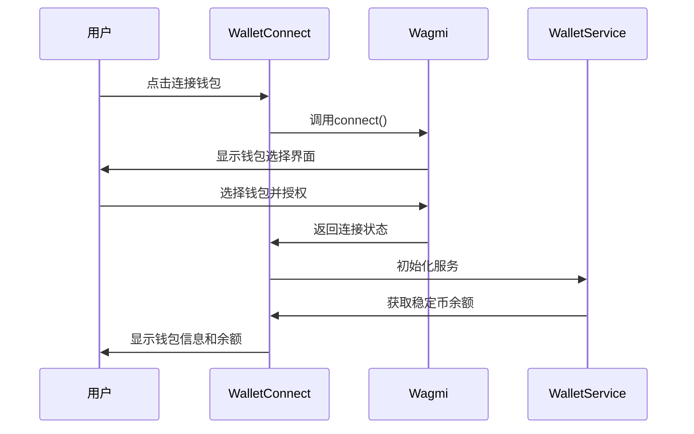
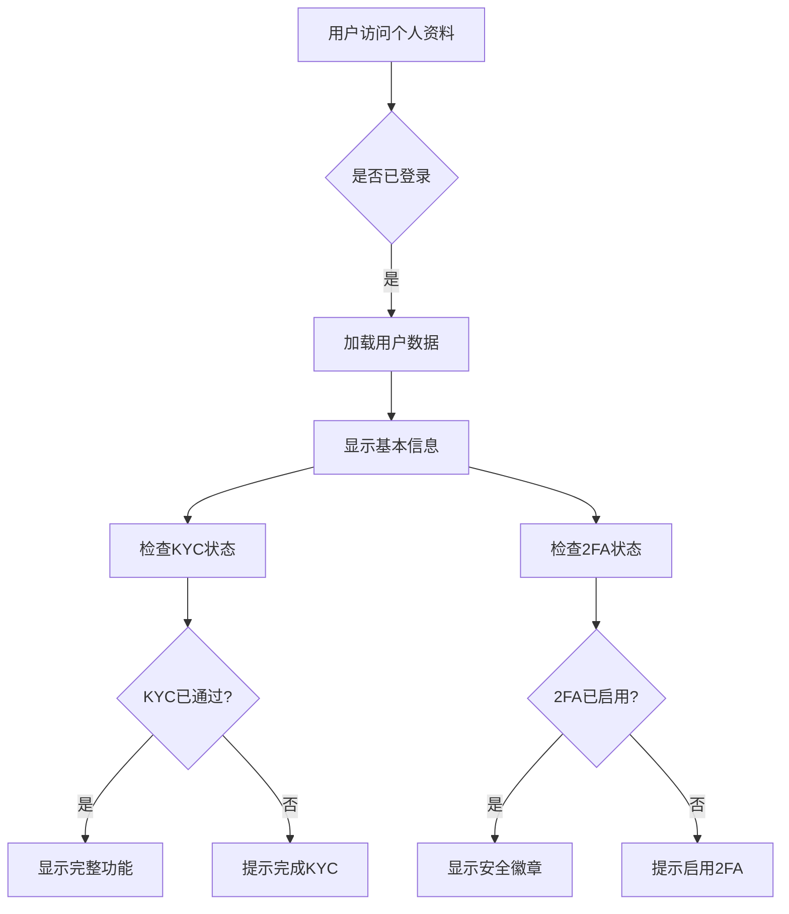
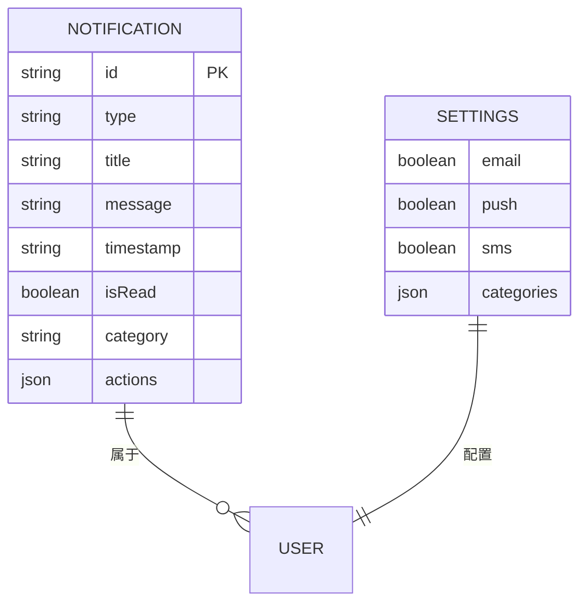
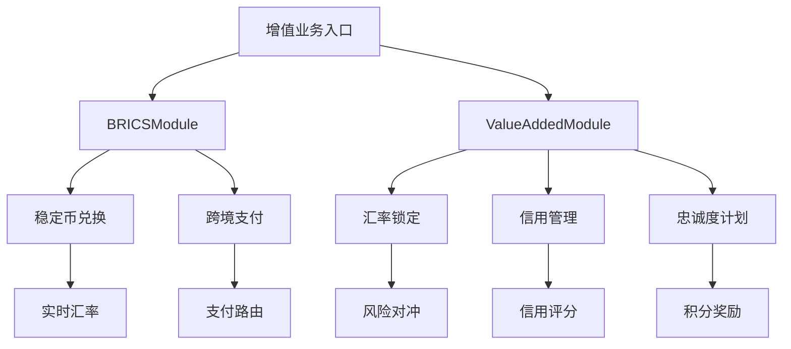

# 用户与资产管理组件

<cite>
**本文档引用文件**   
- [WalletConnect.tsx](file://src/components/Wallet/WalletConnect.tsx)
- [WalletManagement.tsx](file://src/components/Wallet/WalletManagement.tsx)
- [ProfilePreview.tsx](file://src/components/Profile/ProfilePreview.tsx)
- [UserProfile.tsx](file://src/components/Profile/UserProfile.tsx)
- [NotificationCenter.tsx](file://src/components/Notifications/NotificationCenter.tsx)
- [BRICSModule.tsx](file://src/components/BRICSModule.tsx)
- [ValueAddedModule.tsx](file://src/components/ValueAddedModule.tsx)
- [wagmi.tsx](file://src/config/wagmi.tsx)
- [walletService.ts](file://src/services/walletService.ts)
</cite>

## 目录
1. [钱包连接管理](#钱包连接管理)
2. [多钱包资产管理](#多钱包资产管理)
3. [用户资料与安全设置](#用户资料与安全设置)
4. [实时通知中心](#实时通知中心)
5. [增值业务模块](#增值业务模块)
6. [常见问题诊断](#常见问题诊断)
7. [移动端兼容性建议](#移动端兼容性建议)

## 钱包连接管理

`WalletConnect`组件通过Wagmi框架实现多钱包集成，支持MetaMask、Trust Wallet等主流钱包。该组件利用`useAccount`、`useConnect`和`useDisconnect`等Wagmi钩子函数管理钱包连接状态生命周期。当用户连接钱包后，组件会自动加载当前网络和钱包地址信息，并通过`WalletService`服务获取稳定币余额。

会话持久化通过Wagmi的持久化配置实现，用户刷新页面后仍保持连接状态。断线重连机制在检测到网络变化或钱包断开时自动触发，通过`useEffect`监听连接状态变化并重新建立连接。组件还提供了网络切换、地址复制和区块浏览器跳转等辅助功能。



**组件来源**
- [WalletConnect.tsx](file://src/components/Wallet/WalletConnect.tsx#L1-L241)
- [wagmi.tsx](file://src/config/wagmi.tsx#L1-L80)
- [walletService.ts](file://src/services/walletService.ts#L63-L265)

## 多钱包资产管理

`WalletManagement`组件提供多链钱包地址管理功能，支持同时连接多个钱包并进行统一管理。组件通过模拟数据展示已连接的钱包列表，包括MetaMask主钱包和Ledger硬件钱包等不同类型。每个钱包显示其名称、类型、地址、余额和连接状态等关键信息。

资产余额轮询通过定时刷新机制实现，用户可手动点击刷新按钮获取最新余额数据。代币添加功能通过钱包提供商的API接口实现，允许用户将DAI、USDC等稳定币添加到钱包中。组件还支持设置默认钱包、断开连接和地址可见性切换等操作。

```mermaid
classDiagram
class WalletInfo {
+id : string
+name : string
+type : 'metamask'|'trust'|'ledger'|'coinbase'
+address : string
+balance : {usdt : number, usdc : number, eth : number}
+status : 'connected'|'disconnected'|'pending'
+lastUsed : string
+isDefault : boolean
}
class WalletManagement {
-wallets : WalletInfo[]
-isConnecting : boolean
-showAddresses : {[key : string] : boolean}
+connectWallet(type) : void
+disconnectWallet(walletId) : void
+setDefaultWallet(walletId) : void
+refreshBalance(walletId) : void
+toggleAddressVisibility(walletId) : void
}
WalletManagement --> WalletInfo : "管理"
```

**组件来源**
- [WalletManagement.tsx](file://src/components/Wallet/WalletManagement.tsx#L36-L351)

## 用户资料与安全设置

`ProfilePreview`和`UserProfile`组件共同实现个人信息编辑和安全设置功能。`ProfilePreview`提供简洁的个人信息预览，显示用户头像、姓名、邮箱和验证状态等基本信息。`UserProfile`则提供完整的资料展示，包括详细信息、账户状态和最近活动记录。

安全设置方面，系统实现了双因素认证（2FA），用户可在设置页面启用或禁用该功能。数据加密存储方案采用客户端加密技术，敏感信息在传输和存储过程中均经过加密处理。KYC认证状态通过`kycStatus`字段管理，支持"待审核"、"已认证"和"未通过"三种状态。



**组件来源**
- [ProfilePreview.tsx](file://src/components/Profile/ProfilePreview.tsx#L17-L123)
- [UserProfile.tsx](file://src/components/Profile/UserProfile.tsx#L39-L294)

## 实时通知中心

`NotificationCenter`组件基于WebSocket实现实时通知推送架构，提供交易完成、安全提醒、系统维护等各类消息。通知系统支持多种消息分类，包括交易、安全、系统和营销资讯，用户可根据需求进行过滤查看。

消息分类过滤逻辑通过前端状态管理实现，使用`activeTab`变量控制当前显示的通知类别。用户可标记已读、删除通知或清空全部通知。通知设置允许用户自定义邮件、推送和短信等通知渠道，以及各类通知的接收偏好。



**组件来源**
- [NotificationCenter.tsx](file://src/components/Notifications/NotificationCenter.tsx#L53-L537)

## 增值业务模块

`BRICSModule`和`ValueAddedModule`作为增值业务入口，提供动态加载与权限控制策略。`BRICSModule`专注于金砖国家稳定币生态系统，支持BCNY、BRUB、BINR等数字稳定币的兑换和跨境支付。模块通过标签页实现功能分区，包括概览、稳定币、兑换和支付路由等。

`ValueAddedModule`提供汇率锁定、信用管理和忠诚度计划等增值服务。权限控制通过用户角色和信用等级实现，不同等级用户享受不同的服务权限和费率优惠。动态加载策略采用按需加载模式，仅在用户访问特定功能时加载相关数据和组件。



**组件来源**
- [BRICSModule.tsx](file://src/components/BRICSModule.tsx#L28-L421)
- [ValueAddedModule.tsx](file://src/components/ValueAddedModule.tsx#L17-L501)

## 常见问题诊断

### 钱包连接失败
当用户遇到钱包连接失败问题时，应按以下流程进行诊断：
1. 检查浏览器是否安装了钱包扩展（如MetaMask）
2. 确认钱包应用是否已解锁并处于活跃状态
3. 验证网络连接是否正常
4. 检查DApp连接权限是否已授予
5. 尝试刷新页面或重启钱包应用

### 通知延迟
通知延迟问题的诊断流程：
1. 检查WebSocket连接状态
2. 验证用户通知设置是否正确
3. 确认服务器推送服务是否正常运行
4. 检查网络延迟情况
5. 查看浏览器通知权限是否开启

**组件来源**
- [WalletConnect.tsx](file://src/components/Wallet/WalletConnect.tsx#L1-L241)
- [NotificationCenter.tsx](file://src/components/Notifications/NotificationCenter.tsx#L53-L537)

## 移动端兼容性建议

为确保移动端浏览器兼容性，建议采取以下措施：
1. 优先支持主流移动钱包应用（如MetaMask Mobile、Trust Wallet）
2. 优化触摸交互体验，增大点击区域
3. 适配不同屏幕尺寸，采用响应式布局
4. 减少页面加载资源，提升性能表现
5. 提供清晰的错误提示和操作引导

特别注意iOS Safari浏览器的特殊限制，包括：
- Web3 API支持有限，需依赖钱包应用跳转
- 通知权限管理更为严格
- 内存限制可能导致复杂页面加载缓慢

**组件来源**
- [WalletConnect.tsx](file://src/components/Wallet/WalletConnect.tsx#L1-L241)
- [wagmi.tsx](file://src/config/wagmi.tsx#L1-L80)