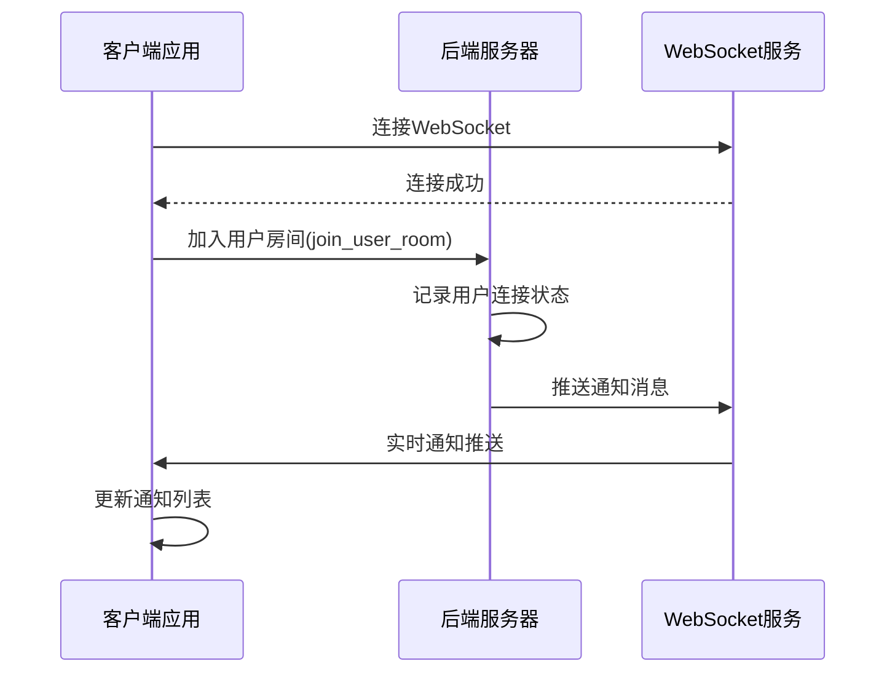
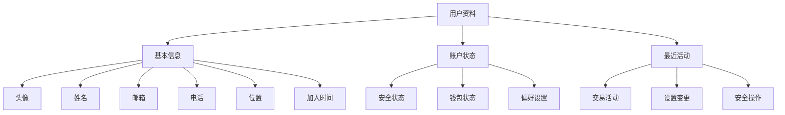
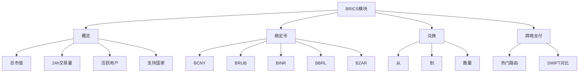
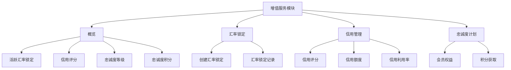

# 用户中心与通知

<cite>
**本文档引用文件**   
- [NotificationCenter.tsx](file://src/components/Notifications/NotificationCenter.tsx)
- [UserProfile.tsx](file://src/components/Profile/UserProfile.tsx)
- [BRICSModule.tsx](file://src/components/BRICSModule.tsx)
- [ValueAddedModule.tsx](file://src/components/ValueAddedModule.tsx)
- [index.ts](file://backend/src/index.ts)
- [bricsStablecoinService.ts](file://backend/src/services/bricsStablecoinService.ts)
- [valueAddedService.ts](file://backend/src/services/valueAddedService.ts)
</cite>

## 目录
1. [引言](#引言)
2. [通知中心架构](#通知中心架构)
3. [用户资料展示](#用户资料展示)
4. [增值业务模块](#增值业务模块)
5. [问题解决方案](#问题解决方案)
6. [结论](#结论)

## 引言
本文档全面阐述了用户中心与通知系统的架构与功能，重点描述了`NotificationCenter`基于WebSocket的实时通知推送机制、`UserProfile`组件的账户状态展示逻辑，以及`BRICSModule`和`ValueAddedModule`作为增值业务入口的动态加载与权限控制策略。文档还提供了通知延迟、消息丢失等常见问题的解决方案，并说明了如何通过设置自定义通知偏好来优化用户体验。

## 通知中心架构

`NotificationCenter`组件实现了基于WebSocket的实时通知推送系统，支持交易、安全、系统等不同类型通知的分类过滤与处理。该系统通过WebSocket连接实现服务器与客户端的双向通信，确保通知的实时性与可靠性。

**图表来源**
- [index.ts](file://backend/src/index.ts#L165-L209)
- [NotificationCenter.tsx](file://src/components/Notifications/NotificationCenter.tsx#L53-L537)

**通知分类与过滤机制**
- **交易通知**：包括交易完成、转账成功等与资金流动相关的通知
- **安全通知**：涵盖登录提醒、KYC状态变更等账户安全相关通知
- **系统通知**：涉及系统维护、新功能上线等平台级通知
- **营销通知**：包含产品推广、优惠活动等营销信息

用户可通过标签页在"全部"、"未读"、"交易"、"安全"、"系统"和"营销"之间切换，系统根据`activeTab`状态变量动态过滤通知列表。

**通知处理机制**
- **标记已读/未读**：用户可对单条通知进行已读/未读状态切换
- **批量操作**：支持"全部标记为已读"和"清空全部通知"功能
- **通知统计**：显示未读通知数、总通知数和今日通知数
- **交互操作**：部分通知包含"查看详情"、"确认是我"等可操作按钮

**节来源**
- [NotificationCenter.tsx](file://src/components/Notifications/NotificationCenter.tsx#L53-L537)

## 用户资料展示

`UserProfile`组件展示了用户的账户状态、快捷操作及最近活动信息，为用户提供全面的账户概览。

**图表来源**
- [UserProfile.tsx](file://src/components/Profile/UserProfile.tsx#L39-L294)

**账户状态展示**
- **安全状态**：显示双重认证、KYC认证和邮箱验证状态
- **钱包状态**：展示钱包连接情况和支持的网络类型
- **偏好设置**：列出用户的语言、货币和时区偏好

**快捷操作**
- **安全设置**：提供快速访问安全设置页面的入口
- **钱包管理**：提供快速访问钱包管理页面的入口
- **偏好设置**：提供快速访问偏好设置页面的入口

**最近活动**
- **交易活动**：如"成功完成USDC转账"
- **设置变更**：如"更新了个人资料"
- **安全操作**：如"连接了新钱包"

**节来源**
- [UserProfile.tsx](file://src/components/Profile/UserProfile.tsx#L39-L294)

## 增值业务模块

`BRICSModule`和`ValueAddedModule`作为增值业务入口，提供了动态加载与权限控制策略，为用户提供丰富的增值服务。

### BRICS模块

`BRICSModule`提供了BRICS稳定币生态系统的全面管理功能，包括稳定币概览、兑换和跨境支付等。

**图表来源**
- [BRICSModule.tsx](file://src/components/BRICSModule.tsx#L28-L421)
- [bricsStablecoinService.ts](file://backend/src/services/bricsStablecoinService.ts#L53-L84)

### 增值服务模块

`ValueAddedModule`提供了汇率锁定、信用管理和忠诚度计划等增值服务。

**图表来源**
- [ValueAddedModule.tsx](file://src/components/ValueAddedModule.tsx#L17-L501)
- [valueAddedService.ts](file://backend/src/services/valueAddedService.ts#L457-L488)

**动态加载与权限控制**
- **动态加载**：模块内容根据用户权限和状态动态加载
- **权限控制**：不同用户等级可访问不同的服务和功能
- **个性化展示**：根据用户信用评分和忠诚度等级提供个性化服务

**节来源**
- [BRICSModule.tsx](file://src/components/BRICSModule.tsx#L28-L421)
- [ValueAddedModule.tsx](file://src/components/ValueAddedModule.tsx#L17-L501)

## 问题解决方案

### 通知延迟与消息丢失

**问题描述**
- 通知推送延迟
- 消息丢失或重复

**解决方案**
- **WebSocket心跳机制**：定期发送心跳包保持连接
- **消息确认机制**：客户端收到消息后发送确认
- **离线消息存储**：服务器存储离线期间的消息
- **消息去重**：通过消息ID避免重复推送

**节来源**
- [index.ts](file://backend/src/index.ts#L165-L209)

### 自定义通知偏好

用户可通过通知设置面板自定义通知偏好，包括通知渠道和类别。

**设置选项**
- **通知渠道**：
  - 邮件通知
  - 推送通知
  - 短信通知
- **通知类别**：
  - 交易通知
  - 安全通知
  - 系统通知
  - 营销通知

**节来源**
- [NotificationCenter.tsx](file://src/components/Notifications/NotificationCenter.tsx#L53-L537)

## 结论
本文档详细阐述了用户中心与通知系统的架构与功能，包括基于WebSocket的实时通知推送机制、用户资料展示逻辑以及增值业务模块的动态加载与权限控制策略。通过合理的架构设计和功能实现，系统能够为用户提供高效、安全和个性化的服务体验。针对通知延迟、消息丢失等常见问题，文档提供了相应的解决方案，确保系统的稳定性和可靠性。