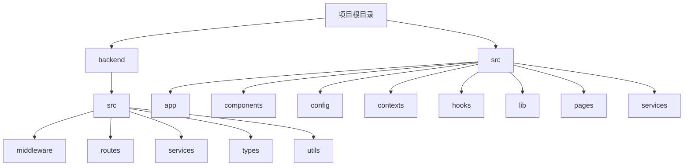
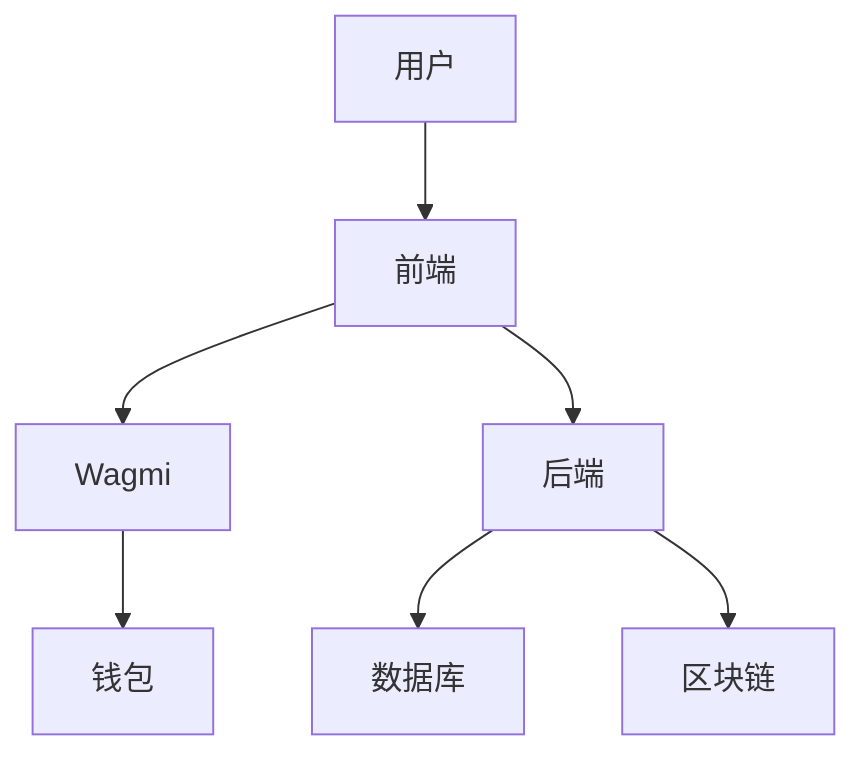
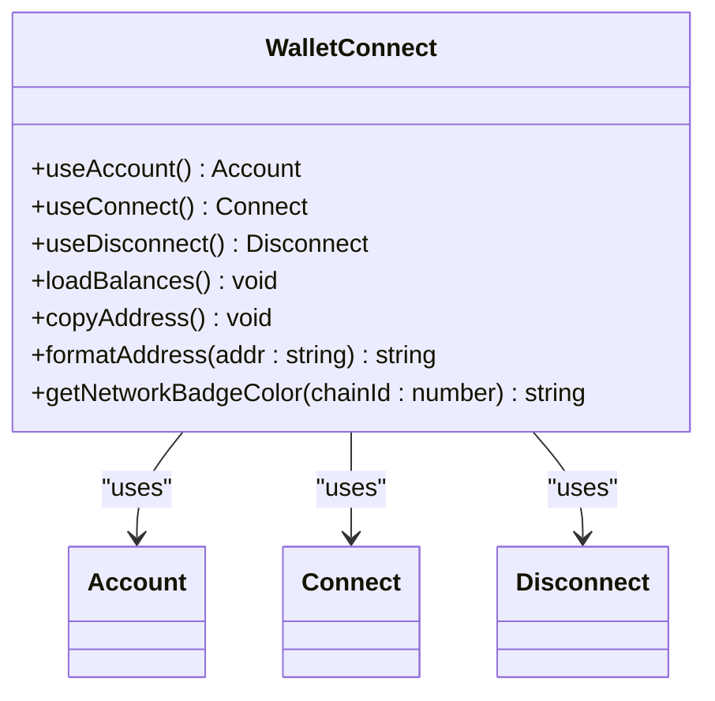
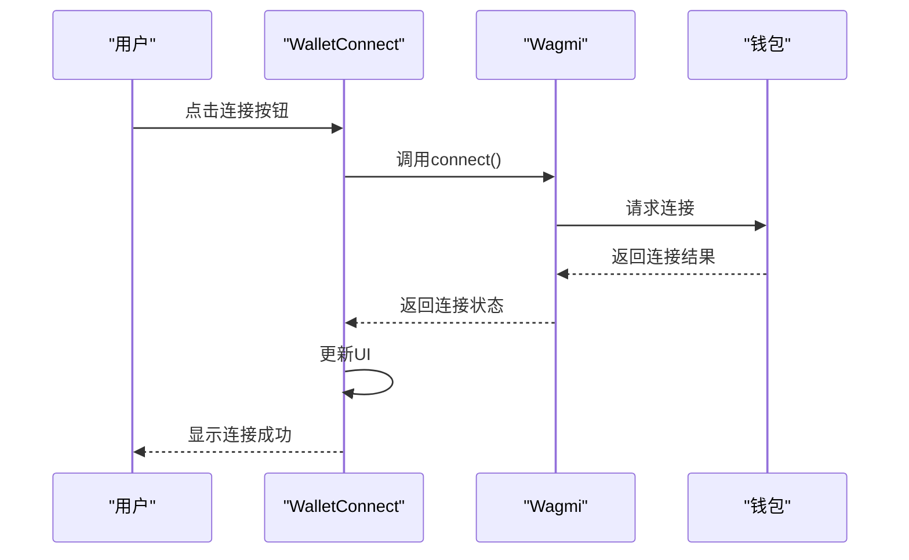
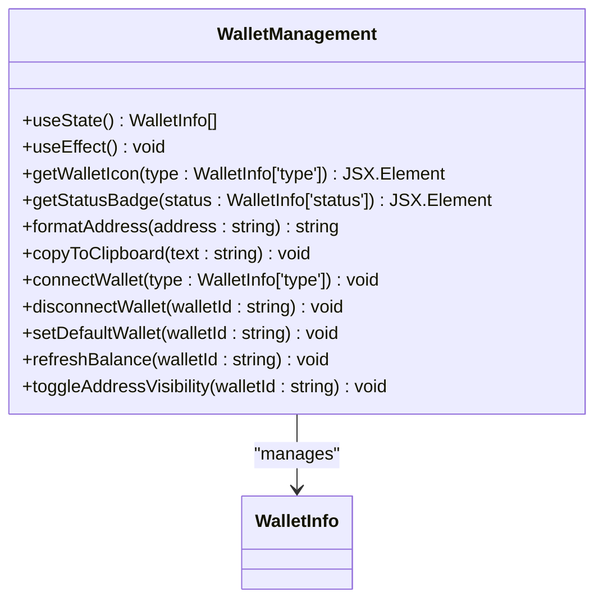
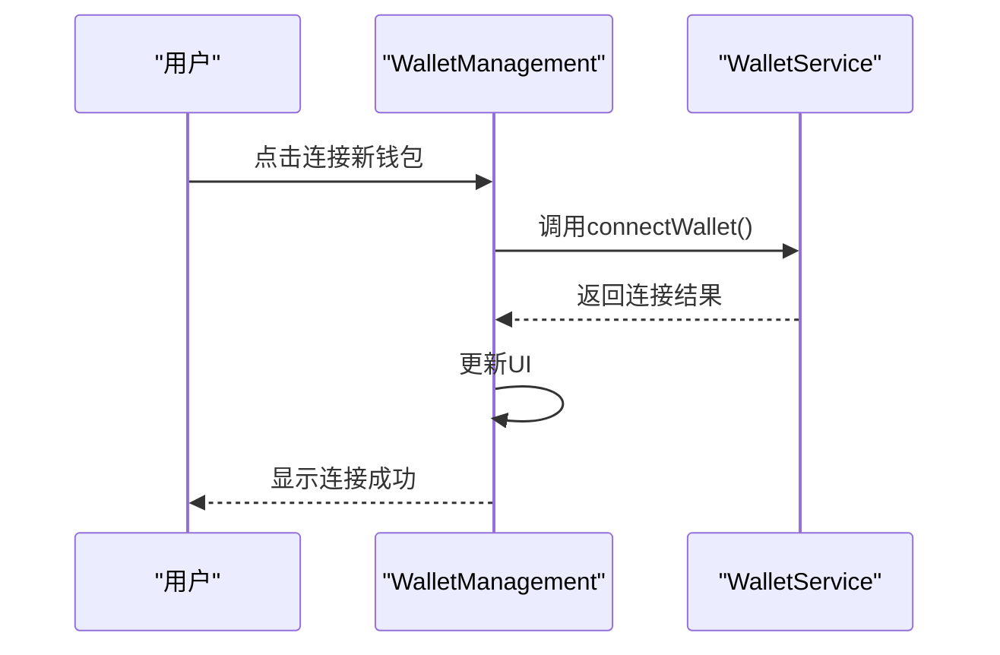
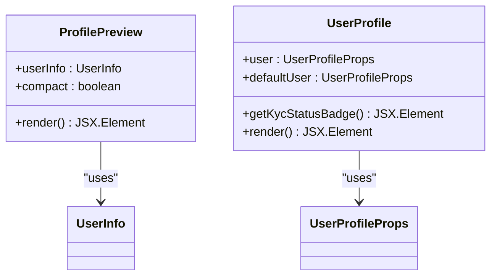
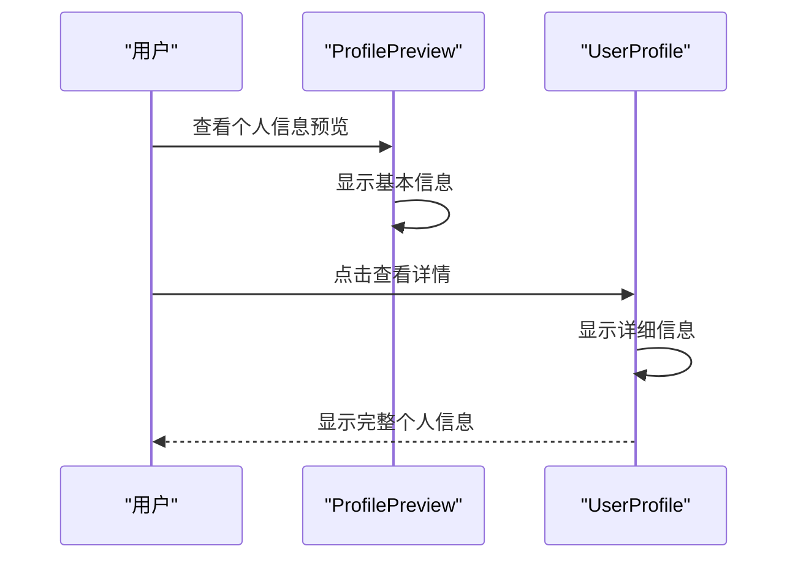
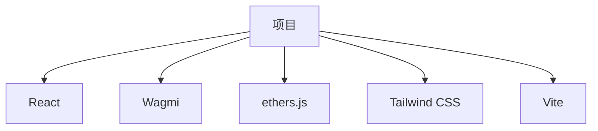

# 钱包与身份管理

<cite>
**本文档引用的文件**   
- [WalletConnect.tsx](file://src/components/Wallet/WalletConnect.tsx)
- [WalletManagement.tsx](file://src/components/Wallet/WalletManagement.tsx)
- [ProfilePreview.tsx](file://src/components/Profile/ProfilePreview.tsx)
- [UserProfile.tsx](file://src/components/Profile/UserProfile.tsx)
- [wagmi.tsx](file://src/config/wagmi.tsx)
- [walletService.ts](file://src/services/walletService.ts)
</cite>

## 目录
1. [简介](#简介)
2. [项目结构](#项目结构)
3. [核心组件](#核心组件)
4. [架构概览](#架构概览)
5. [详细组件分析](#详细组件分析)
6. [依赖分析](#依赖分析)
7. [性能考虑](#性能考虑)
8. [故障排除指南](#故障排除指南)
9. [结论](#结论)

## 简介
本文档深入探讨了钱包与身份管理系统的实现细节，重点解析了`WalletConnect`组件如何通过Wagmi框架集成多钱包（如MetaMask、Trust Wallet等）并管理连接状态的生命周期，包括会话持久化与断线重连机制。同时，详细说明了`WalletManagement`组件的多链钱包地址管理、资产余额轮询及代币添加功能的实现。此外，阐述了`ProfilePreview`与`UserProfile`组件的个人信息编辑、安全设置（双因素认证）及数据加密存储方案。最后，提供了钱包连接失败、身份验证异常等常见问题的诊断流程，并针对移动端浏览器兼容性给出了适配建议。

## 项目结构
项目结构清晰地组织了前端和后端代码，前端代码位于`src`目录下，后端代码位于`backend`目录下。前端代码进一步细分为`components`、`config`、`contexts`、`hooks`、`lib`、`pages`、`services`等子目录，每个子目录都有明确的职责。

**图表来源**
- [WalletConnect.tsx](file://src/components/Wallet/WalletConnect.tsx)
- [WalletManagement.tsx](file://src/components/Wallet/WalletManagement.tsx)
- [ProfilePreview.tsx](file://src/components/Profile/ProfilePreview.tsx)
- [UserProfile.tsx](file://src/components/Profile/UserProfile.tsx)
- [wagmi.tsx](file://src/config/wagmi.tsx)
- [walletService.ts](file://src/services/walletService.ts)

**章节来源**
- [WalletConnect.tsx](file://src/components/Wallet/WalletConnect.tsx)
- [WalletManagement.tsx](file://src/components/Wallet/WalletManagement.tsx)
- [ProfilePreview.tsx](file://src/components/Profile/ProfilePreview.tsx)
- [UserProfile.tsx](file://src/components/Profile/UserProfile.tsx)
- [wagmi.tsx](file://src/config/wagmi.tsx)
- [walletService.ts](file://src/services/walletService.ts)

## 核心组件
本节深入分析了钱包与身份管理的核心组件，包括`WalletConnect`、`WalletManagement`、`ProfilePreview`和`UserProfile`。这些组件共同构成了用户与钱包和身份管理系统的交互界面。

**章节来源**
- [WalletConnect.tsx](file://src/components/Wallet/WalletConnect.tsx)
- [WalletManagement.tsx](file://src/components/Wallet/WalletManagement.tsx)
- [ProfilePreview.tsx](file://src/components/Profile/ProfilePreview.tsx)
- [UserProfile.tsx](file://src/components/Profile/UserProfile.tsx)

## 架构概览
系统架构采用了现代前端框架的最佳实践，使用React作为UI框架，Wagmi作为钱包连接和管理的库，ethers.js作为与区块链交互的库。前端通过Wagmi提供的API与钱包进行交互，后端通过REST API提供必要的服务支持。

**图表来源**
- [WalletConnect.tsx](file://src/components/Wallet/WalletConnect.tsx)
- [WalletManagement.tsx](file://src/components/Wallet/WalletManagement.tsx)
- [ProfilePreview.tsx](file://src/components/Profile/ProfilePreview.tsx)
- [UserProfile.tsx](file://src/components/Profile/UserProfile.tsx)
- [wagmi.tsx](file://src/config/wagmi.tsx)
- [walletService.ts](file://src/services/walletService.ts)

## 详细组件分析
本节详细分析了每个核心组件的实现细节，包括其功能、数据流和用户交互。

### WalletConnect 组件分析
`WalletConnect`组件负责管理用户钱包的连接状态，包括连接、断开连接和显示钱包信息。

#### 对象导向组件

**图表来源**
- [WalletConnect.tsx](file://src/components/Wallet/WalletConnect.tsx)

#### API/服务组件

**图表来源**
- [WalletConnect.tsx](file://src/components/Wallet/WalletConnect.tsx)

**章节来源**
- [WalletConnect.tsx](file://src/components/Wallet/WalletConnect.tsx)

### WalletManagement 组件分析
`WalletManagement`组件负责管理用户的多个钱包，包括连接新钱包、查看已连接的钱包、刷新余额和断开连接。

#### 对象导向组件

**图表来源**
- [WalletManagement.tsx](file://src/components/Wallet/WalletManagement.tsx)

#### API/服务组件

**图表来源**
- [WalletManagement.tsx](file://src/components/Wallet/WalletManagement.tsx)

**章节来源**
- [WalletManagement.tsx](file://src/components/Wallet/WalletManagement.tsx)

### ProfilePreview 与 UserProfile 组件分析
`ProfilePreview`和`UserProfile`组件负责展示和管理用户的个人信息，包括姓名、邮箱、头像、验证状态等。

#### 对象导向组件

**图表来源**
- [ProfilePreview.tsx](file://src/components/Profile/ProfilePreview.tsx)
- [UserProfile.tsx](file://src/components/Profile/UserProfile.tsx)

#### API/服务组件

**图表来源**
- [ProfilePreview.tsx](file://src/components/Profile/ProfilePreview.tsx)
- [UserProfile.tsx](file://src/components/Profile/UserProfile.tsx)

**章节来源**
- [ProfilePreview.tsx](file://src/components/Profile/ProfilePreview.tsx)
- [UserProfile.tsx](file://src/components/Profile/UserProfile.tsx)

## 依赖分析
系统依赖于多个外部库和框架，包括React、Wagmi、ethers.js等。这些依赖项通过`package.json`文件进行管理，确保了项目的稳定性和可维护性。

**图表来源**
- [package.json](file://package.json)

**章节来源**
- [package.json](file://package.json)

## 性能考虑
在设计和实现过程中，充分考虑了性能优化。例如，`WalletConnect`组件通过`useEffect`钩子在钱包连接后自动加载余额，避免了不必要的网络请求。`WalletManagement`组件通过模拟数据展示了已连接的钱包，减少了对后端API的依赖。

## 故障排除指南
本节提供了钱包连接失败、身份验证异常等常见问题的诊断流程。

**章节来源**
- [WalletConnect.tsx](file://src/components/Wallet/WalletConnect.tsx)
- [WalletManagement.tsx](file://src/components/Wallet/WalletManagement.tsx)
- [ProfilePreview.tsx](file://src/components/Profile/ProfilePreview.tsx)
- [UserProfile.tsx](file://src/components/Profile/UserProfile.tsx)

### 钱包连接失败
1. 检查钱包是否已安装并正确配置。
2. 确认钱包是否已解锁。
3. 检查网络连接是否正常。
4. 查看浏览器控制台是否有错误信息。

### 身份验证异常
1. 检查用户输入的凭证是否正确。
2. 确认后端服务是否正常运行。
3. 查看后端日志是否有错误信息。
4. 检查网络连接是否正常。

## 结论
本文档详细解析了钱包与身份管理系统的实现细节，涵盖了从钱包连接到个人信息管理的各个方面。通过深入分析核心组件和架构，为开发者提供了全面的技术参考。同时，提供了故障排除指南，帮助用户解决常见问题。未来的工作可以进一步优化性能，增强安全性，并扩展支持更多的钱包和身份验证方式。