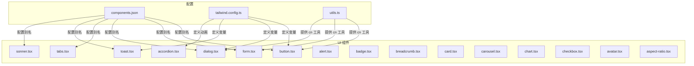
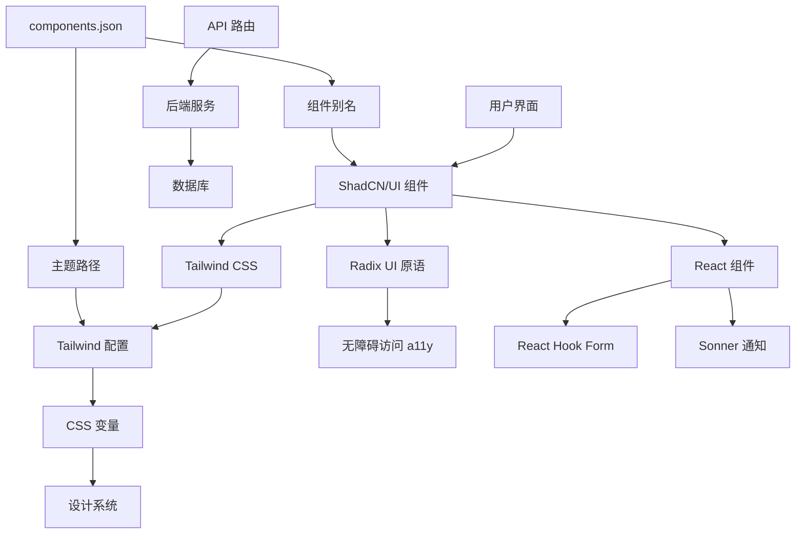
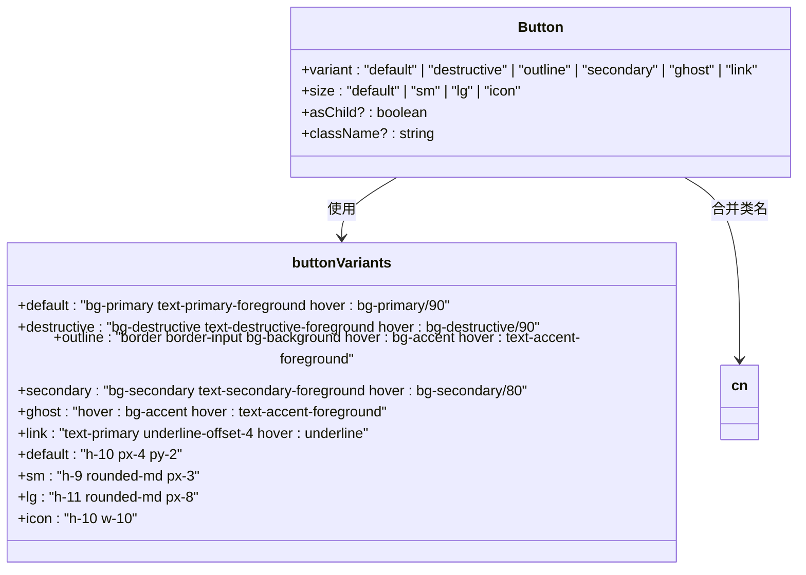
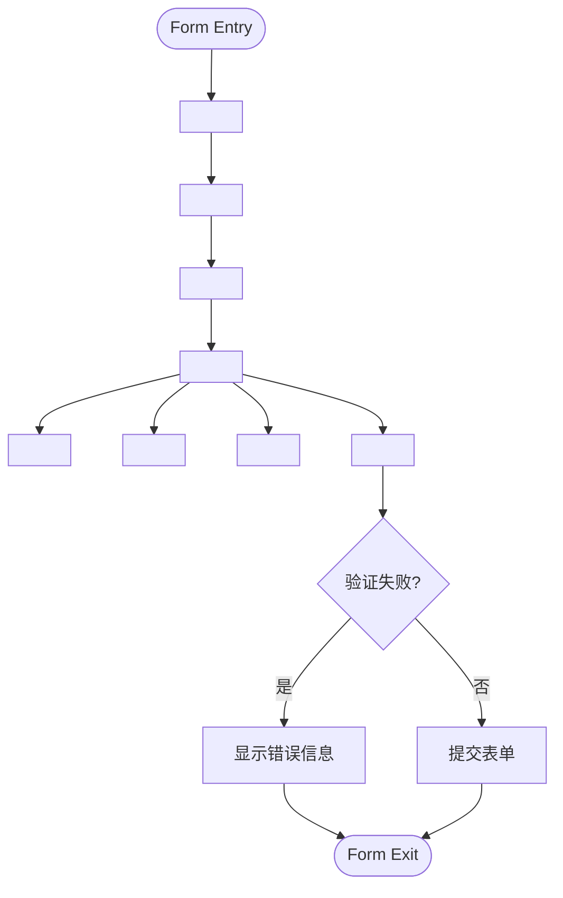
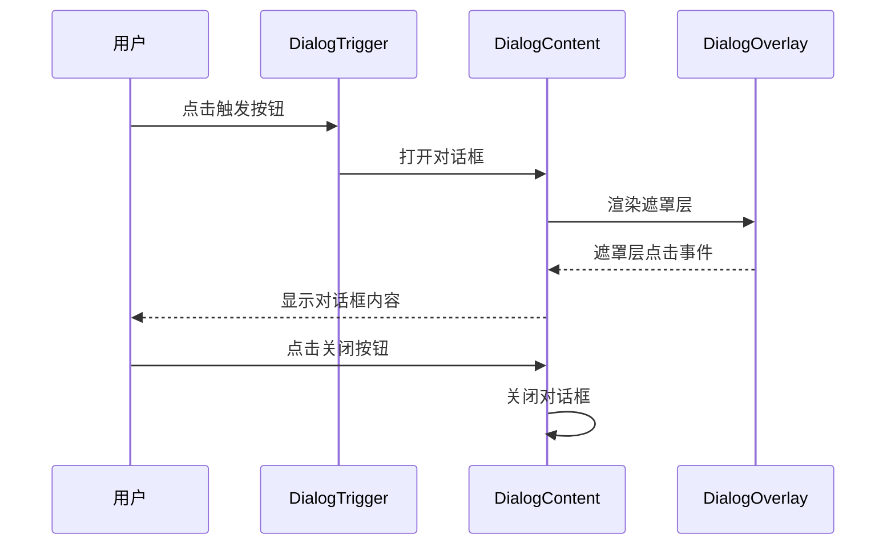
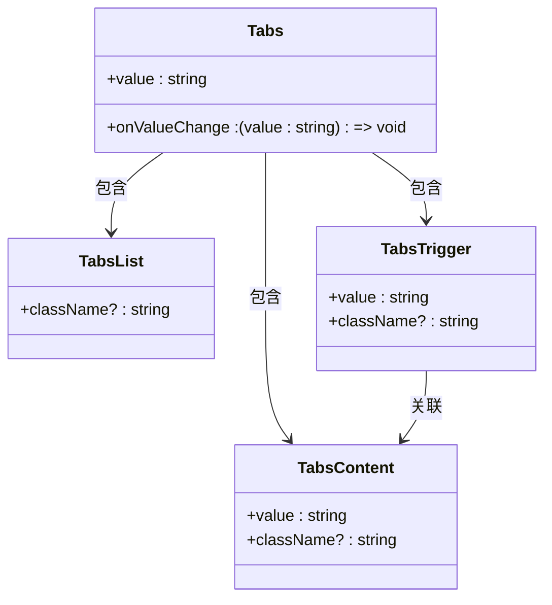

# 基础UI组件

<cite>
**本文档中引用的文件**  
- [components.json](file://components.json)
- [tailwind.config.ts](file://tailwind.config.ts)
- [button.tsx](file://src/components/ui/button.tsx)
- [form.tsx](file://src/components/ui/form.tsx)
- [dialog.tsx](file://src/components/ui/dialog.tsx)
- [tabs.tsx](file://src/components/ui/tabs.tsx)
- [toast.tsx](file://src/components/ui/toast.tsx)
- [sonner.tsx](file://src/components/ui/sonner.tsx)
- [utils.ts](file://src/lib/utils.ts)
- [accordion.tsx](file://src/components/ui/accordion.tsx)
- [alert.tsx](file://src/components/ui/alert.tsx)
- [badge.tsx](file://src/components/ui/badge.tsx)
- [breadcrumb.tsx](file://src/components/ui/breadcrumb.tsx)
- [card.tsx](file://src/components/ui/card.tsx)
- [carousel.tsx](file://src/components/ui/carousel.tsx)
- [chart.tsx](file://src/components/ui/chart.tsx)
- [checkbox.tsx](file://src/components/ui/checkbox.tsx)
- [avatar.tsx](file://src/components/ui/avatar.tsx)
- [aspect-ratio.tsx](file://src/components/ui/aspect-ratio.tsx)
</cite>

## 目录
1. [项目结构](#项目结构)  
2. [核心组件](#核心组件)  
3. [架构概览](#架构概览)  
4. [详细组件分析](#详细组件分析)  
5. [依赖分析](#依赖分析)  
6. [性能考量](#性能考量)  
7. [故障排除指南](#故障排除指南)  
8. [结论](#结论)

## 项目结构

本项目采用模块化结构，将UI组件集中于`src/components/ui`目录下，遵循ShadCN/UI的设计规范。核心UI原子组件包括按钮、表单、对话框、标签页、通知系统等，均通过`@/components/ui`别名进行引用。配置文件`components.json`定义了组件路径别名和Tailwind集成方式，`tailwind.config.ts`扩展了设计系统变量，支持动态主题与CSS变量。



**图示来源**  
- [components.json](file://components.json#L1-L21)
- [tailwind.config.ts](file://tailwind.config.ts#L1-L121)
- [button.tsx](file://src/components/ui/button.tsx#L1-L48)
- [form.tsx](file://src/components/ui/form.tsx#L1-L130)
- [dialog.tsx](file://src/components/ui/dialog.tsx#L1-L96)
- [tabs.tsx](file://src/components/ui/tabs.tsx#L1-L54)
- [toast.tsx](file://src/components/ui/toast.tsx#L1-L112)
- [sonner.tsx](file://src/components/ui/sonner.tsx#L1-L28)
- [utils.ts](file://src/lib/utils.ts#L1-L7)

**本节来源**  
- [components.json](file://components.json#L1-L21)
- [tailwind.config.ts](file://tailwind.config.ts#L1-L121)
- [src/components/ui](file://src/components/ui)

## 核心组件

本项目集成了ShadCN/UI的原子化UI组件，通过`components.json`进行标准化配置，实现组件路径别名管理与主题集成。所有UI组件均基于Radix UI构建，确保无障碍访问（a11y）与SSR兼容性。通过`cn`工具函数（基于`clsx`与`tailwind-merge`）实现Tailwind类名的智能合并，避免样式冲突。

关键组件包括：
- `<Button>`：支持多种变体（默认、危险、轮廓、次要等）与尺寸（小、中、大、图标）
- `<Form>`：基于`react-hook-form`的表单封装，支持字段验证与错误提示
- `<Dialog>`：模态对话框，支持标题、内容、页脚结构化布局
- `<Tabs>`：标签页组件，支持水平切换
- `<Toast>` 与 `<Sonner>`：全局通知系统，支持成功、错误等状态
- `<Accordion>`：手风琴折叠面板，支持动画展开/收起
- `<Alert>`：警示框，用于展示重要信息或错误
- `<Badge>`：徽章，用于标记状态或分类
- `<Breadcrumb>`：面包屑导航
- `<Card>`：卡片容器，用于内容分组
- `<Carousel>`：轮播图组件
- `<Chart>`：基于Recharts的图表容器
- `<Checkbox>`：复选框控件
- `<Avatar>`：头像展示
- `<AspectRatio>`：保持宽高比的容器

这些组件均通过`@/components/ui`别名导入，确保路径一致性与可维护性。

**本节来源**  
- [components.json](file://components.json#L1-L21)
- [src/components/ui/button.tsx](file://src/components/ui/button.tsx#L1-L48)
- [src/components/ui/form.tsx](file://src/components/ui/form.tsx#L1-L130)
- [src/components/ui/dialog.tsx](file://src/components/ui/dialog.tsx#L1-L96)
- [src/components/ui/tabs.tsx](file://src/components/ui/tabs.tsx#L1-L54)
- [src/components/ui/toast.tsx](file://src/components/ui/toast.tsx#L1-L112)
- [src/components/ui/sonner.tsx](file://src/components/ui/sonner.tsx#L1-L28)

## 架构概览

系统采用分层架构，前端UI层基于React + ShadCN/UI + Tailwind CSS构建，后端服务通过API路由提供数据支持。UI组件库通过`components.json`进行集中配置，实现组件路径别名管理与主题集成。Tailwind配置通过CSS变量实现设计系统一致性，支持动态主题切换。



**图示来源**  
- [components.json](file://components.json#L1-L21)
- [tailwind.config.ts](file://tailwind.config.ts#L1-L121)
- [src/components/ui](file://src/components/ui)
- [src/app/api](file://src/app/api)

## 详细组件分析

### 按钮组件分析

`<Button>`组件通过`class-variance-authority`（cva）定义多态样式，支持`variant`（变体）和`size`（尺寸）两种属性。默认变体为`default`，尺寸为`default`。组件支持`asChild`属性，允许将样式应用于子元素（如链接或图标按钮）。



**图示来源**  
- [button.tsx](file://src/components/ui/button.tsx#L6-L30)
- [button.tsx](file://src/components/ui/button.tsx#L32-L36)
- [utils.ts](file://src/lib/utils.ts#L3-L5)

**本节来源**  
- [src/components/ui/button.tsx](file://src/components/ui/button.tsx#L1-L48)

### 表单组件分析

`<Form>`组件基于`react-hook-form`构建，提供`<FormField>`、`<FormItem>`、`<FormLabel>`、`<FormControl>`、`<FormDescription>`、`<FormMessage>`等子组件，实现结构化表单布局与验证。通过`Controller`集成受控组件，支持自定义输入控件。



**图示来源**  
- [form.tsx](file://src/components/ui/form.tsx#L1-L130)

**本节来源**  
- [src/components/ui/form.tsx](file://src/components/ui/form.tsx#L1-L130)

### 对话框组件分析

`<Dialog>`组件基于Radix UI的`@radix-ui/react-dialog`构建，提供模态对话框功能。支持`<DialogTrigger>`触发、`<DialogContent>`内容、`<DialogHeader>`、`<DialogFooter>`、`<DialogTitle>`、`<DialogDescription>`等结构化布局。通过Portal渲染到body，确保层级正确。



**图示来源**  
- [dialog.tsx](file://src/components/ui/dialog.tsx#L1-L96)

**本节来源**  
- [src/components/ui/dialog.tsx](file://src/components/ui/dialog.tsx#L1-L96)

### 标签页组件分析

`<Tabs>`组件提供标签页切换功能，包含`<TabsList>`、`<TabsTrigger>`、`<TabsContent>`三个子组件。通过`data-state="active"`控制激活状态，支持平滑过渡动画。



**图示来源**  
- [tabs.tsx](file://src/components/ui/tabs.tsx#L1-L54)

**本节来源**  
- [src/components/ui/tabs.tsx](file://src/components/ui/tabs.tsx#L1-L54)

### 通知系统分析

项目采用双通知系统：`<Toast>`基于Radix UI构建，`<Sonner>`提供更高级的API。`<Toaster>`组件通过`useTheme`集成主题系统，支持亮色/暗色模式自动切换。通知样式通过`group`选择器与CSS变量实现一致性。

```mermaid
flowchart TD
A[触发通知] --> B{选择系统}
B --> |简单场景| C[toast()]
B --> |复杂场景| D[<Toast>]
C --> E[Sonner Toaster]
D --> F[Radix ToastProvider]
E --> G[应用主题]
F --> G
G --> H[显示通知]
H --> I[支持关闭/操作]
```

**图示来源**  
- [toast.tsx](file://src/components/ui/toast.tsx#L1-L112)
- [sonner.tsx](file://src/components/ui/sonner.tsx#L1-L28)

**本节来源**  
- [src/components/ui/toast.tsx](file://src/components/ui/toast.tsx#L1-L112)
- [src/components/ui/sonner.tsx](file://src/components/ui/sonner.tsx#L1-L28)

## 依赖分析

项目UI层依赖关系清晰，核心依赖包括：
- `@radix-ui/react-*`：提供无障碍访问的UI原语
- `class-variance-authority`：实现组件变体管理
- `tailwind-merge` 与 `clsx`：类名合并工具
- `react-hook-form`：表单状态管理
- `sonner`：通知系统
- `embla-carousel-react`：轮播图
- `recharts`：图表

```mermaid
graph TD
A[UI Components] --> B[@radix-ui/react-primitives]
A --> C[class-variance-authority]
A --> D[tailwind-merge]
A --> E[clsx]
A --> F[react-hook-form]
A --> G[sonner]
A --> H[embla-carousel-react]
A --> I[recharts]
B --> J[无障碍访问]
D --> K[类名合并]
F --> L[表单验证]
G --> M[全局通知]
```

**图示来源**  
- [package.json](file://package.json)
- [button.tsx](file://src/components/ui/button.tsx#L1-L48)
- [form.tsx](file://src/components/ui/form.tsx#L1-L130)
- [toast.tsx](file://src/components/ui/toast.tsx#L1-L112)
- [carousel.tsx](file://src/components/ui/carousel.tsx#L1-L225)
- [chart.tsx](file://src/components/ui/chart.tsx#L1-L304)

**本节来源**  
- [package.json](file://package.json)
- [src/components/ui](file://src/components/ui)

## 性能考量

- **按需加载**：所有UI组件均支持Tree Shaking，仅打包实际使用的组件
- **类名优化**：通过`cn`函数合并Tailwind类名，减少重复样式
- **动画性能**：使用CSS动画（如`accordion-down/up`）而非JavaScript，提升渲染性能
- **SSR友好**：组件均在客户端激活，避免水合不匹配
- **事件委托**：Radix UI内部优化事件处理，减少监听器数量

## 故障排除指南

### 样式覆盖冲突
- **问题**：自定义样式未生效
- **解决方案**：使用`!important`或提升选择器优先级；确保`tailwind.config.ts`中`prefix`为空；检查`cn`函数调用顺序

### 动态主题切换失败
- **问题**：主题切换后UI未更新
- **解决方案**：确保`<Toaster>`使用`useTheme`；检查`tailwind.config.ts`中`darkMode: ["class"]`配置；确认`<html>`标签有`class="dark"`切换

### 组件别名不生效
- **问题**：`@/components/ui`导入报错
- **解决方案**：检查`components.json`中`aliases`配置；确认`tsconfig.json`有路径映射；运行`npx shadcn-ui@latest add`重新初始化

### 通知系统不显示
- **问题**：调用`toast()`无反应
- **解决方案**：确保在根组件渲染`<Toaster>`；检查是否在服务端调用；确认`sonner`版本兼容

**本节来源**  
- [components.json](file://components.json#L1-L21)
- [tailwind.config.ts](file://tailwind.config.ts#L1-L121)
- [sonner.tsx](file://src/components/ui/sonner.tsx#L1-L28)
- [tsconfig.json](file://tsconfig.json)

## 结论

本项目成功集成ShadCN/UI组件库，通过`components.json`实现组件路径标准化与主题集成。Tailwind配置利用CSS变量（如`--radius`、`--shadow-*`、`--primary`等）确保设计系统一致性。核心原子组件（按钮、表单、对话框、标签页、通知）均具备高可访问性、响应式设计与SSR兼容性。通过`cn`工具函数优化类名合并，避免样式冲突。建议持续遵循ShadCN/UI最佳实践，确保组件库的可维护性与扩展性。