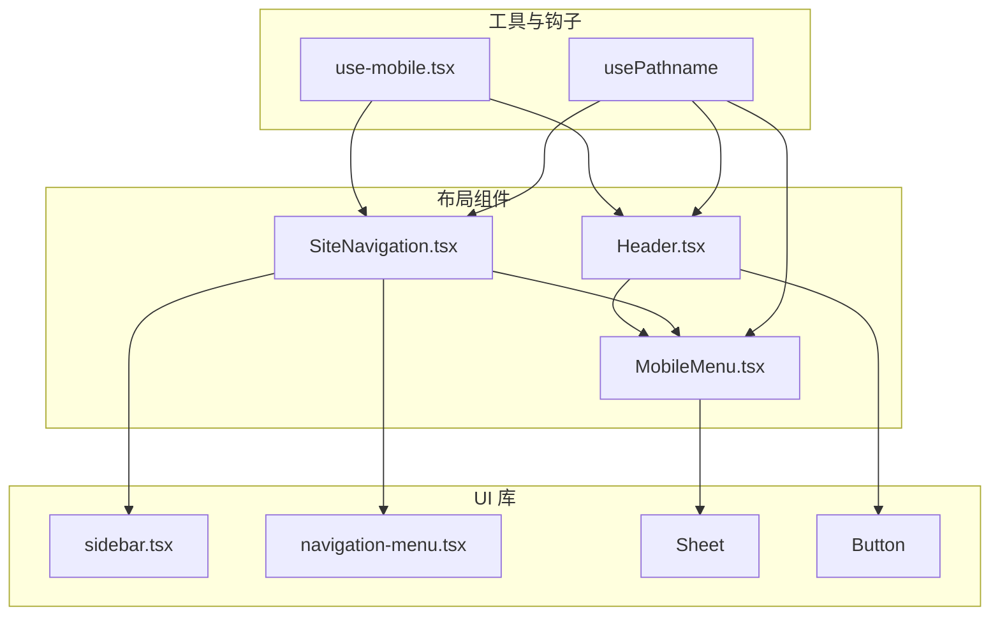
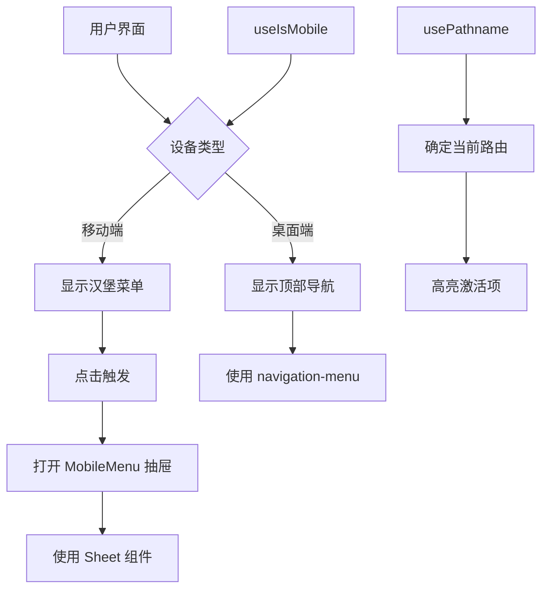
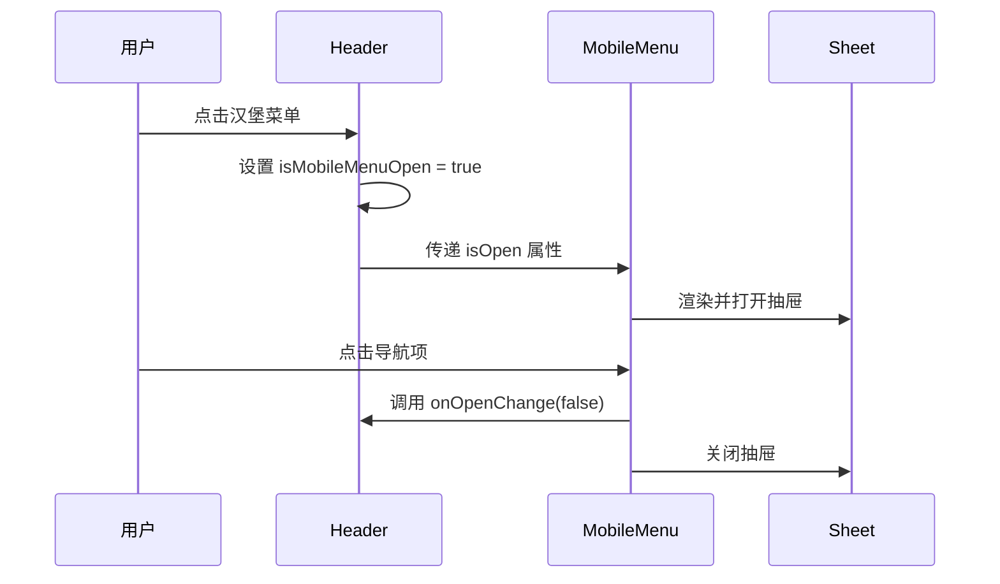
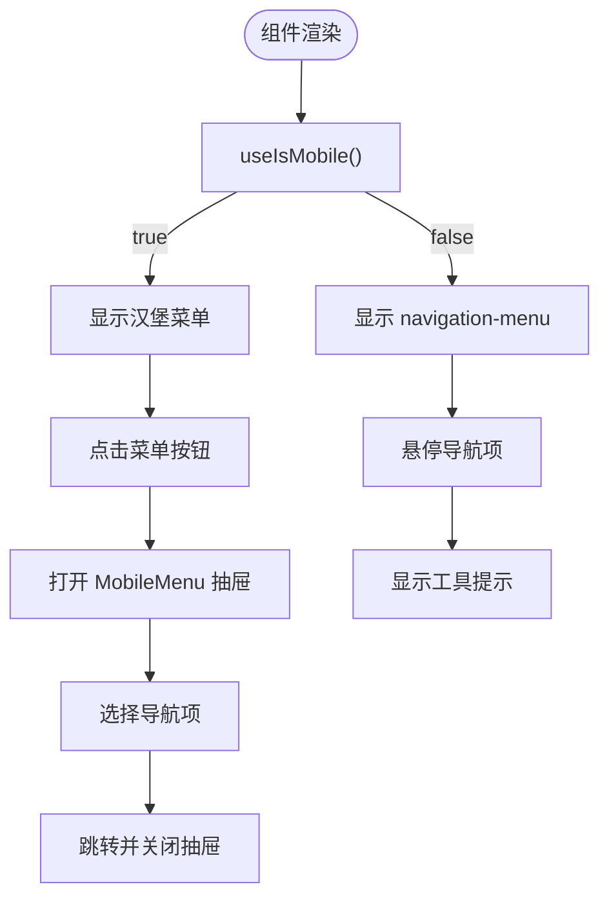
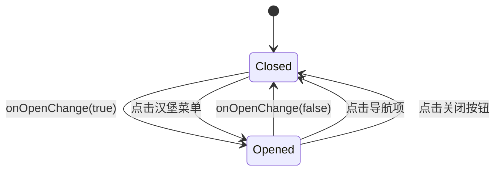
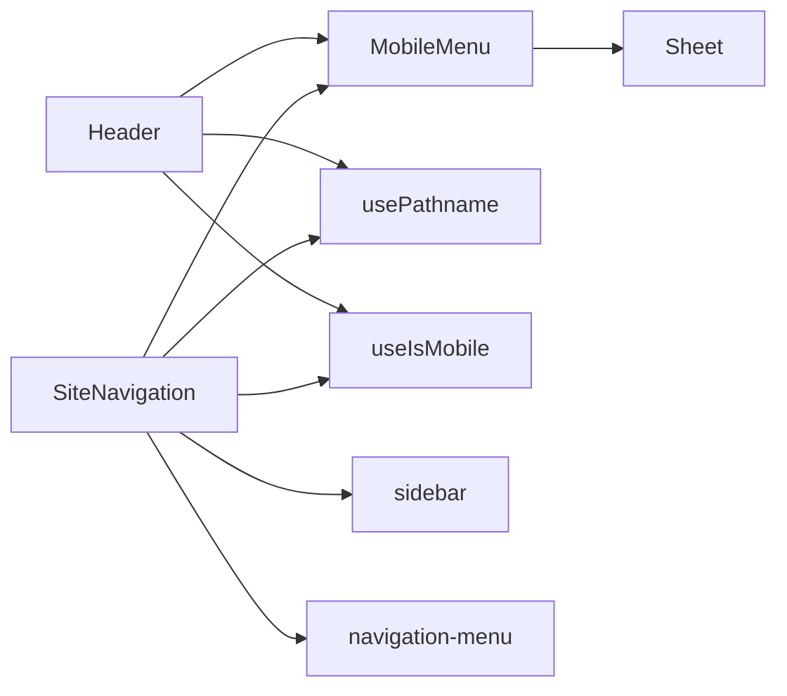

# 布局组件

<cite>
**本文档中引用的文件**  
- [Header.tsx](file://src/components/Layout/Header.tsx)
- [MobileMenu.tsx](file://src/components/Layout/MobileMenu.tsx)
- [SiteNavigation.tsx](file://src/components/Layout/SiteNavigation.tsx)
- [sidebar.tsx](file://src/components/ui/sidebar.tsx)
- [navigation-menu.tsx](file://src/components/ui/navigation-menu.tsx)
- [use-mobile.tsx](file://src/hooks/use-mobile.tsx)
</cite>

## 目录
1. [简介](#简介)
2. [项目结构](#项目结构)
3. [核心组件](#核心组件)
4. [架构概览](#架构概览)
5. [详细组件分析](#详细组件分析)
6. [依赖分析](#依赖分析)
7. [性能考虑](#性能考虑)
8. [故障排除指南](#故障排除指南)
9. [结论](#结论)

## 简介
本文件详细说明了 TriBridge 项目中全局布局组件的设计与实现，涵盖 `Header`、`MobileMenu` 和 `SiteNavigation` 等关键元素。这些组件共同构建了一致的导航结构，并在多页面应用中实现了状态同步机制。文档还深入分析了响应式行为在桌面端与移动端的适配策略，包括汉堡菜单切换和侧边栏展开/收起逻辑。此外，本文档解释了与 shadcn/ui 的 `sidebar` 和 `navigation-menu` 组件的集成方式，涵盖主题切换、路由高亮和用户会话状态显示等功能的实现细节，同时提供最佳实践示例和常见问题的调试方法。

## 项目结构
布局组件位于 `src/components/Layout` 目录下，包括 `Header.tsx`、`MobileMenu.tsx` 和 `SiteNavigation.tsx`。这些组件依赖于 `shadcn/ui` 提供的 UI 原语，如 `Sheet`、`Button` 和 `navigation-menu`，并利用 Next.js 的 `usePathname` 钩子实现路由感知功能。响应式逻辑通过自定义的 `useIsMobile` 钩子管理，该钩子基于 768px 的断点判断设备类型。

**Diagram sources**
- [Header.tsx](file://src/components/Layout/Header.tsx#L1-L51)
- [MobileMenu.tsx](file://src/components/Layout/MobileMenu.tsx#L1-L79)
- [SiteNavigation.tsx](file://src/components/Layout/SiteNavigation.tsx#L1-L92)
- [sidebar.tsx](file://src/components/ui/sidebar.tsx#L1-L638)
- [navigation-menu.tsx](file://src/components/ui/navigation-menu.tsx#L1-L121)
- [use-mobile.tsx](file://src/hooks/use-mobile.tsx#L1-L20)

**Section sources**
- [Header.tsx](file://src/components/Layout/Header.tsx#L1-L51)
- [MobileMenu.tsx](file://src/components/Layout/MobileMenu.tsx#L1-L79)
- [SiteNavigation.tsx](file://src/components/Layout/SiteNavigation.tsx#L1-L92)

## 核心组件
`Header` 和 `SiteNavigation` 是应用的顶层布局容器，负责渲染品牌标识、桌面端导航菜单和移动端菜单触发按钮。`MobileMenu` 是一个可复用的抽屉式组件，用于在移动设备上展示导航选项。这些组件通过共享的 `isActive` 函数实现路由高亮，并通过状态管理控制菜单的展开与收起。

**Section sources**
- [Header.tsx](file://src/components/Layout/Header.tsx#L1-L51)
- [MobileMenu.tsx](file://src/components/Layout/MobileMenu.tsx#L1-L79)
- [SiteNavigation.tsx](file://src/components/Layout/SiteNavigation.tsx#L1-L92)

## 架构概览
整体布局架构采用响应式设计模式，桌面端使用固定的顶部导航栏，移动端则通过汉堡菜单触发侧边抽屉。`SidebarProvider` 提供全局状态管理，支持侧边栏的展开/收起和持久化状态。`useIsMobile` 钩子作为响应式逻辑的核心，确保组件能根据屏幕尺寸动态调整行为。

**Diagram sources**
- [Header.tsx](file://src/components/Layout/Header.tsx#L1-L51)
- [MobileMenu.tsx](file://src/components/Layout/MobileMenu.tsx#L1-L79)
- [SiteNavigation.tsx](file://src/components/Layout/SiteNavigation.tsx#L1-L92)
- [use-mobile.tsx](file://src/hooks/use-mobile.tsx#L1-L20)

## 详细组件分析
### Header 分析
`Header` 组件实现了一个轻量级的顶部导航栏，包含品牌标识和移动端菜单触发器。它通过 `usePathname` 监听路由变化，并将 `isMobileMenuOpen` 状态传递给 `MobileMenu` 组件。

#### 组件交互流程

**Diagram sources**
- [Header.tsx](file://src/components/Layout/Header.tsx#L1-L51)
- [MobileMenu.tsx](file://src/components/Layout/MobileMenu.tsx#L1-L79)

**Section sources**
- [Header.tsx](file://src/components/Layout/Header.tsx#L1-L51)

### SiteNavigation 分析
`SiteNavigation` 是一个功能更完整的布局组件，集成了桌面端的 `navigation-menu` 和移动端的 `MobileMenu`。它使用 `shadcn/ui` 的 `sidebar` 组件提供更丰富的导航体验。

#### 响应式行为流程图

**Diagram sources**
- [SiteNavigation.tsx](file://src/components/Layout/SiteNavigation.tsx#L1-L92)
- [sidebar.tsx](file://src/components/ui/sidebar.tsx#L1-L638)
- [navigation-menu.tsx](file://src/components/ui/navigation-menu.tsx#L1-L121)

**Section sources**
- [SiteNavigation.tsx](file://src/components/Layout/SiteNavigation.tsx#L1-L92)

### MobileMenu 分析
`MobileMenu` 是一个独立的抽屉组件，使用 `Sheet` 实现滑动动画。它接收 `isOpen` 和 `onOpenChange` 属性，实现受控组件模式。

#### 状态管理流程

**Diagram sources**
- [MobileMenu.tsx](file://src/components/Layout/MobileMenu.tsx#L1-L79)

**Section sources**
- [MobileMenu.tsx](file://src/components/Layout/MobileMenu.tsx#L1-L79)

## 依赖分析
布局组件依赖于多个核心模块，形成清晰的依赖链。`Header` 和 `SiteNavigation` 直接依赖 `MobileMenu`，而 `MobileMenu` 又依赖 `shadcn/ui` 的 `Sheet` 组件。所有组件共享 `usePathname` 和 `useIsMobile` 钩子。

**Diagram sources**
- [Header.tsx](file://src/components/Layout/Header.tsx#L1-L51)
- [MobileMenu.tsx](file://src/components/Layout/MobileMenu.tsx#L1-L79)
- [SiteNavigation.tsx](file://src/components/Layout/SiteNavigation.tsx#L1-L92)
- [sidebar.tsx](file://src/components/ui/sidebar.tsx#L1-L638)
- [navigation-menu.tsx](file://src/components/ui/navigation-menu.tsx#L1-L121)
- [use-mobile.tsx](file://src/hooks/use-mobile.tsx#L1-L20)

**Section sources**
- [Header.tsx](file://src/components/Layout/Header.tsx#L1-L51)
- [MobileMenu.tsx](file://src/components/Layout/MobileMenu.tsx#L1-L79)
- [SiteNavigation.tsx](file://src/components/Layout/SiteNavigation.tsx#L1-L92)

## 性能考虑
布局组件的性能优化主要体现在以下几个方面：使用 `useMemo` 缓存计算结果（在 `sidebar.tsx` 中）、避免不必要的重渲染（通过 `React.useCallback`）、以及利用 CSS 变量实现高效的样式切换。`useIsMobile` 钩子通过事件监听器高效管理响应式状态，避免频繁的窗口尺寸检查。

## 故障排除指南
### 常见问题及解决方案
1. **菜单无法打开**：检查 `isMobileMenuOpen` 状态是否正确传递，确保 `onOpenChange` 回调函数被正确调用。
2. **路由高亮失效**：确认 `usePathname` 返回的路径与导航项的 `href` 完全匹配，注意路径大小写和尾部斜杠。
3. **移动端样式错位**：检查 Tailwind CSS 的 `md:` 断点是否与 `useIsMobile` 的 768px 断点一致。
4. **状态不同步**：确保所有共享状态通过 props 正确传递，避免在多个组件中维护相同的状态副本。

**Section sources**
- [Header.tsx](file://src/components/Layout/Header.tsx#L1-L51)
- [MobileMenu.tsx](file://src/components/Layout/MobileMenu.tsx#L1-L79)
- [SiteNavigation.tsx](file://src/components/Layout/SiteNavigation.tsx#L1-L92)
- [use-mobile.tsx](file://src/hooks/use-mobile.tsx#L1-L20)

## 结论
TriBridge 的布局组件通过模块化设计和响应式架构，实现了跨设备的一致用户体验。`Header`、`MobileMenu` 和 `SiteNavigation` 组件的协同工作，结合 `shadcn/ui` 的强大 UI 原语，构建了一个灵活、可维护的导航系统。通过遵循本文档中的最佳实践，开发者可以有效利用这些组件，同时快速诊断和解决常见的布局问题。