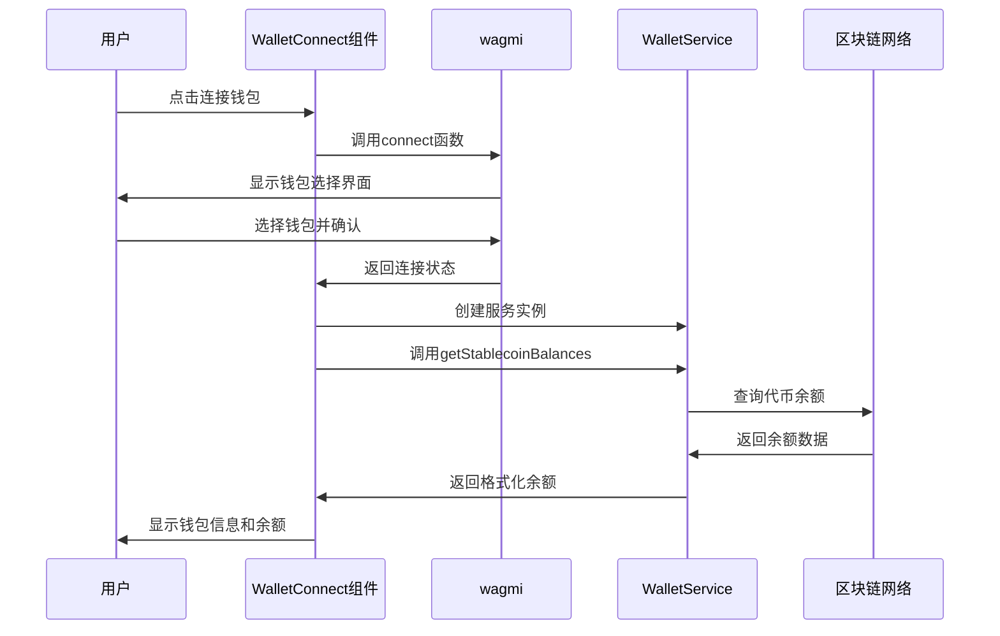
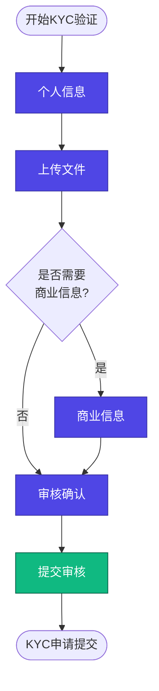
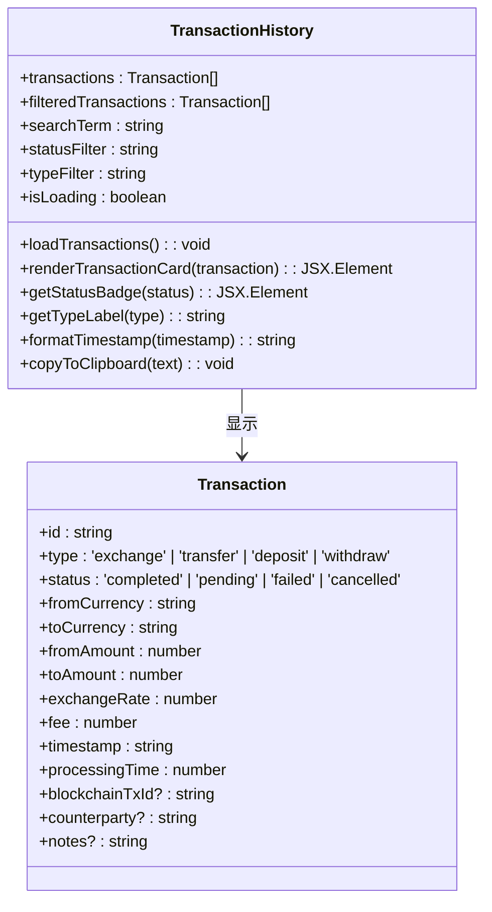
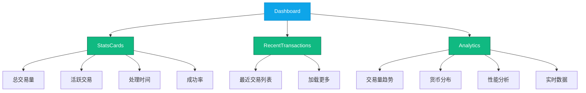

# 业务功能组件

<cite>
**本文档引用的文件**  
- [WalletConnect.tsx](file://src/components/Wallet/WalletConnect.tsx)
- [walletService.ts](file://src/services/walletService.ts)
- [wagmi.tsx](file://src/config/wagmi.tsx)
- [KYCVerification.tsx](file://src/components/Compliance/KYCVerification.tsx)
- [TransactionHistory.tsx](file://src/components/Transactions/TransactionHistory.tsx)
- [transactionService.ts](file://src/services/transactionService.ts)
- [StatsCards.tsx](file://src/components/Dashboard/StatsCards.tsx)
- [Analytics.tsx](file://src/components/Analytics/Analytics.tsx)
</cite>

## 目录
1. [钱包连接组件](#钱包连接组件)
2. [KYC验证组件](#kyc验证组件)
3. [交易历史组件](#交易历史组件)
4. [仪表盘组件](#仪表盘组件)

## 钱包连接组件

WalletConnect组件通过wagmi库集成Web3钱包，实现钱包连接状态管理、地址复制和余额查询功能。该组件使用useAccount、useConnect和useDisconnect等wagmi钩子来管理钱包连接状态，当用户连接钱包后，自动加载其稳定币余额。

组件通过WalletService服务类与区块链网络交互，获取用户在指定网络上的DAI和USDC余额。地址格式化功能将完整地址显示为前6位和后4位加省略号的形式，同时提供复制功能，复制成功后显示临时成功提示。

网络标识功能根据链ID显示不同颜色的徽章，支持Sepolia测试网和主网等。余额加载时显示加载动画，加载完成后以卡片形式展示各稳定币的余额信息，包括代币图标、名称和余额数量。

**组件交互流程图**
- [WalletConnect.tsx](file://src/components/Wallet/WalletConnect.tsx#L16-L241)
- [walletService.ts](file://src/services/walletService.ts#L62-L264)

**Section sources**
- [WalletConnect.tsx](file://src/components/Wallet/WalletConnect.tsx#L16-L241)
- [walletService.ts](file://src/services/walletService.ts#L62-L264)
- [wagmi.tsx](file://src/config/wagmi.tsx#L1-L79)

## KYC验证组件

KYCVerification组件实现多步骤表单流程，包括个人信息、身份验证文件、商业信息和审核确认四个步骤。组件使用状态管理跟踪当前步骤和KYC状态，通过进度条显示完成进度。

个人信息步骤收集用户的基本身份信息，包括姓名、出生日期、国籍、电话号码和居住地址。文件上传步骤支持上传身份证明、地址证明和自拍照片，文件类型限制为图片或PDF，大小不超过5MB。商业信息步骤为可选步骤，用于收集公司名称、业务类型、注册号和公司地址。

组件提供文件上传处理功能，上传成功后显示已上传状态。数据验证在前端进行基本验证，如必填字段检查，后端服务会进行更严格的身份验证。审核确认步骤汇总所有信息供用户最后确认，提交后状态变为"审核中"。

**KYC验证流程图**
- [KYCVerification.tsx](file://src/components/Compliance/KYCVerification.tsx#L21-L517)

**Section sources**
- [KYCVerification.tsx](file://src/components/Compliance/KYCVerification.tsx#L21-L517)

## 交易历史组件

TransactionHistory组件实现数据过滤、搜索和分页功能。组件初始化时加载交易历史数据，支持按交易ID、货币类型或交易对手进行搜索，以及按状态和类型进行过滤。

数据过滤逻辑在useEffect中实现，当搜索条件或过滤条件变化时，重新计算过滤后的交易列表。状态过滤包括全部、已完成、处理中、失败和已取消，类型过滤包括全部、兑换、转账、存入和提取。

分页功能通过虚拟滚动实现，初始显示部分交易，用户可点击"加载更多"按钮加载更多交易记录。组件显示交易统计信息，包括总交易数、成功交易数、处理中交易数和总交易量。

交易列表以卡片形式展示，每张卡片显示交易ID、类型、时间、发送金额、接收金额、汇率和手续费等信息。支持复制交易ID和区块链交易ID，点击外部链接图标可跳转到区块链浏览器查看交易详情。

**交易历史组件类图**
- [TransactionHistory.tsx](file://src/components/Transactions/TransactionHistory.tsx#L39-L495)
- [transactionService.ts](file://src/services/transactionService.ts#L52-L388)

**Section sources**
- [TransactionHistory.tsx](file://src/components/Transactions/TransactionHistory.tsx#L39-L495)
- [transactionService.ts](file://src/services/transactionService.ts#L52-L388)

## 仪表盘组件

Dashboard组件通过StatsCards和Analytics等子组件实现数据可视化，展示关键业务指标和分析报表。StatsCards组件显示总交易量、活跃交易数、平均处理时间和成功率等核心指标，使用渐变背景和趋势图标增强视觉效果。

数据可视化策略采用多种图表类型：折线图展示交易量趋势，柱状图显示交易笔数趋势，饼图呈现货币分布，性能指标使用进度条可视化。所有图表支持响应式设计，适配不同屏幕尺寸。

性能优化技巧包括数据懒加载、虚拟滚动和防抖处理。组件在挂载时才加载数据，减少初始加载时间。对于大量交易数据，采用分页加载方式，避免一次性渲染过多DOM节点。搜索和过滤操作使用防抖技术，避免频繁重新渲染。

**仪表盘组件结构图**
- [StatsCards.tsx](file://src/components/Dashboard/StatsCards.tsx#L3-L69)
- [Analytics.tsx](file://src/components/Analytics/Analytics.tsx#L47-L402)

**Section sources**
- [StatsCards.tsx](file://src/components/Dashboard/StatsCards.tsx#L3-L69)
- [Analytics.tsx](file://src/components/Analytics/Analytics.tsx#L47-L402)
- [RecentTransactions.tsx](file://src/components/Dashboard/RecentTransactions.tsx#L1-L201)