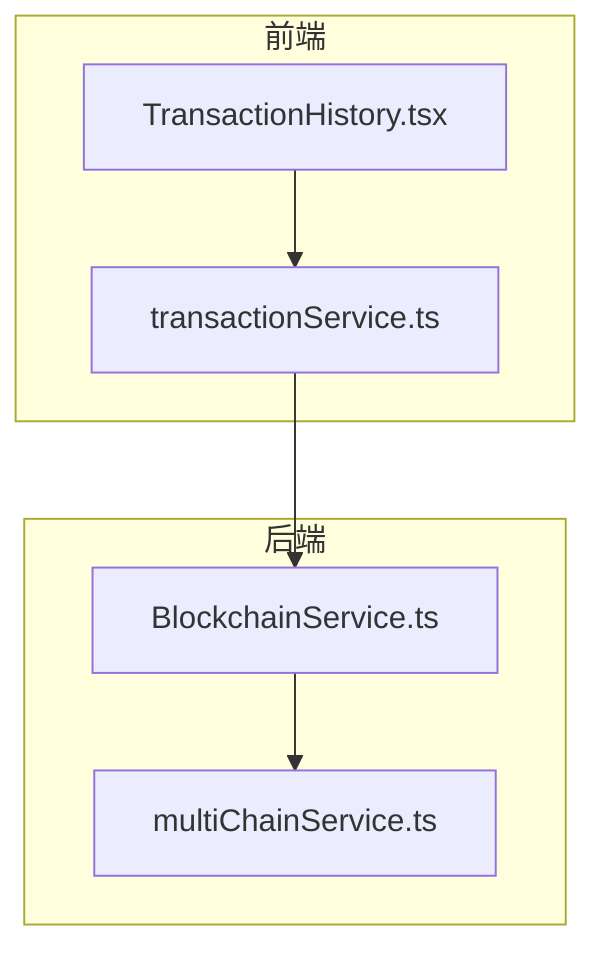
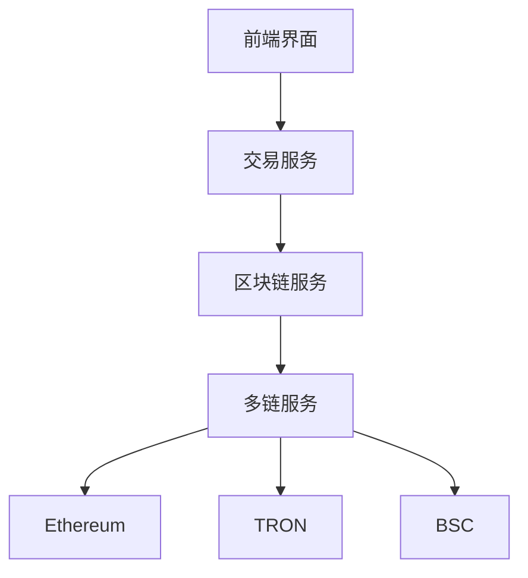
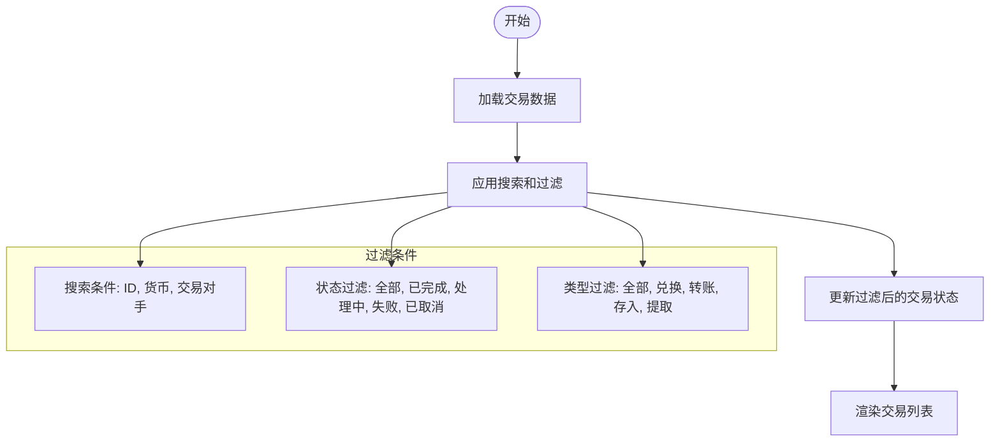
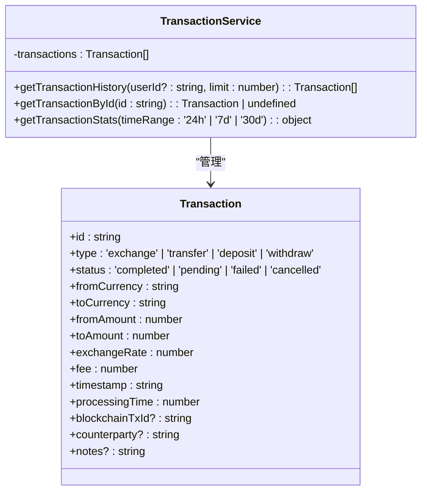
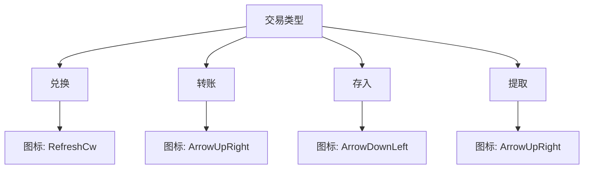
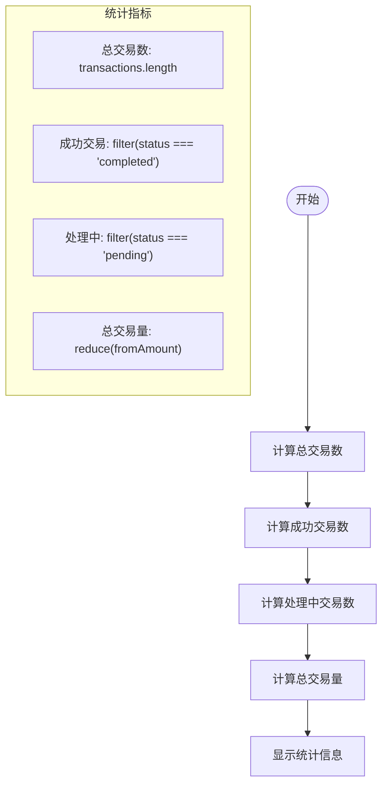
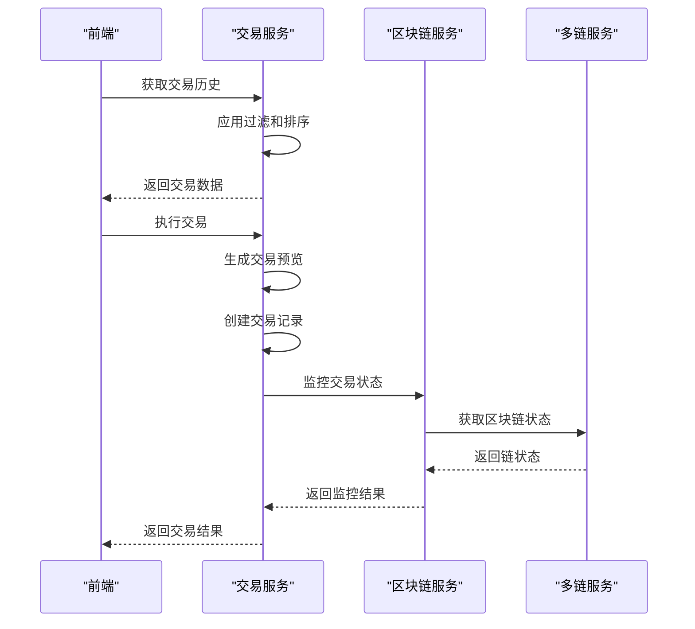
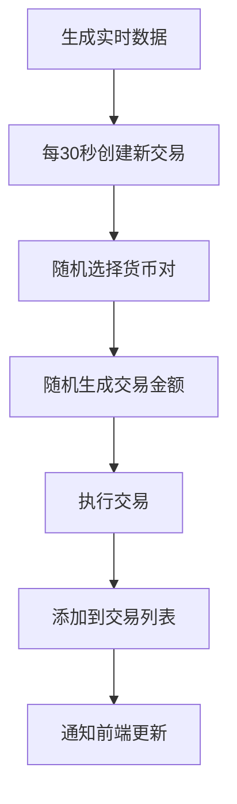
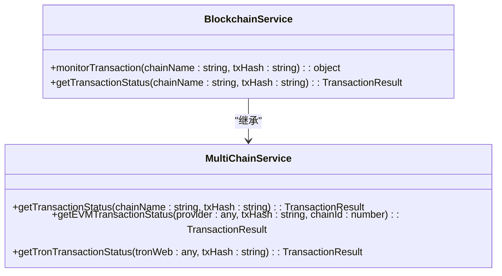
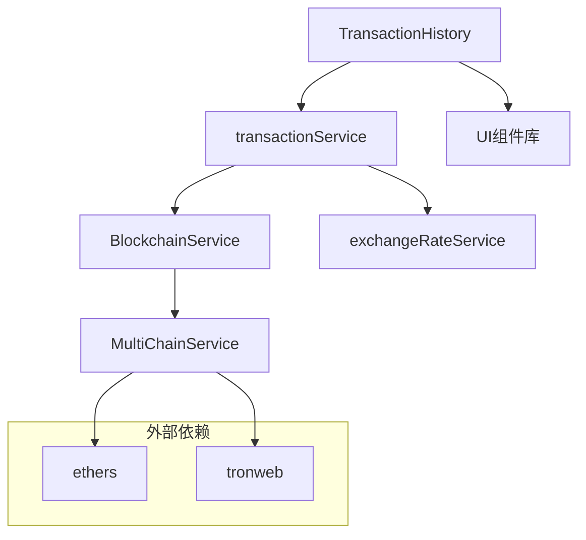

# 交易组件

<cite>
**本文档引用文件**   
- [TransactionHistory.tsx](file://src/components/Transactions/TransactionHistory.tsx)
- [transactionService.ts](file://src/services/transactionService.ts)
- [BlockchainService.ts](file://backend/src/services/BlockchainService.ts)
- [multiChainService.ts](file://backend/src/services/multiChainService.ts)
</cite>

## 目录
1. [简介](#简介)
2. [项目结构](#项目结构)
3. [核心组件](#核心组件)
4. [架构概述](#架构概述)
5. [详细组件分析](#详细组件分析)
6. [依赖分析](#依赖分析)
7. [性能考虑](#性能考虑)
8. [故障排除指南](#故障排除指南)
9. [结论](#结论)

## 简介
TriBridge交易组件是一个完整的交易管理系统，提供交易历史记录、状态管理、类型分类、统计计算和区块链集成等功能。该系统实现了前端与后端的无缝交互，支持实时数据同步和区块链交易ID追踪。

## 项目结构
交易组件分布在前端和后端两个主要部分。前端组件位于`src/components/Transactions`目录，后端服务位于`backend/src/services`目录。

**图表来源**
- [TransactionHistory.tsx](file://src/components/Transactions/TransactionHistory.tsx)
- [transactionService.ts](file://src/services/transactionService.ts)
- [BlockchainService.ts](file://backend/src/services/BlockchainService.ts)
- [multiChainService.ts](file://backend/src/services/multiChainService.ts)

**章节来源**
- [TransactionHistory.tsx](file://src/components/Transactions/TransactionHistory.tsx)
- [transactionService.ts](file://src/services/transactionService.ts)
- [BlockchainService.ts](file://backend/src/services/BlockchainService.ts)
- [multiChainService.ts](file://backend/src/services/multiChainService.ts)

## 核心组件
交易组件的核心功能包括数据过滤、搜索、分页、状态管理、类型分类和统计计算。前端组件`TransactionHistory`负责展示交易历史，后端服务`transactionService`处理交易逻辑。

**章节来源**
- [TransactionHistory.tsx](file://src/components/Transactions/TransactionHistory.tsx#L39-L495)
- [transactionService.ts](file://src/services/transactionService.ts#L52-L388)

## 架构概述
系统采用分层架构，前端组件通过服务层与后端API交互，后端服务与区块链网络集成。

**图表来源**
- [TransactionHistory.tsx](file://src/components/Transactions/TransactionHistory.tsx)
- [transactionService.ts](file://src/services/transactionService.ts)
- [BlockchainService.ts](file://backend/src/services/BlockchainService.ts)
- [multiChainService.ts](file://backend/src/services/multiChainService.ts)

## 详细组件分析

### TransactionHistory组件分析
`TransactionHistory`组件实现了交易历史的展示、过滤、搜索和分页功能。

#### 数据过滤和搜索实现

**图表来源**
- [TransactionHistory.tsx](file://src/components/Transactions/TransactionHistory.tsx#L39-L495)

#### 交易状态管理

**图表来源**
- [TransactionHistory.tsx](file://src/components/Transactions/TransactionHistory.tsx#L39-L495)
- [transactionService.ts](file://src/services/transactionService.ts#L52-L388)

#### 交易类型分类

**图表来源**
- [TransactionHistory.tsx](file://src/components/Transactions/TransactionHistory.tsx#L39-L495)

#### 统计计算机制

**图表来源**
- [TransactionHistory.tsx](file://src/components/Transactions/TransactionHistory.tsx#L39-L495)

**章节来源**
- [TransactionHistory.tsx](file://src/components/Transactions/TransactionHistory.tsx#L39-L495)

### 后端交易服务分析
后端交易服务处理交易逻辑，与区块链网络集成。

#### 前后端交互流程

**图表来源**
- [transactionService.ts](file://src/services/transactionService.ts#L52-L388)
- [BlockchainService.ts](file://backend/src/services/BlockchainService.ts#L20-L306)
- [multiChainService.ts](file://backend/src/services/multiChainService.ts#L48-L505)

#### 实时数据同步

**图表来源**
- [transactionService.ts](file://src/services/transactionService.ts#L52-L388)

#### 区块链交易ID追踪

**图表来源**
- [BlockchainService.ts](file://backend/src/services/BlockchainService.ts#L20-L306)
- [multiChainService.ts](file://backend/src/services/multiChainService.ts#L48-L505)

**章节来源**
- [BlockchainService.ts](file://backend/src/services/BlockchainService.ts#L20-L306)
- [multiChainService.ts](file://backend/src/services/multiChainService.ts#L48-L505)

## 依赖分析
交易组件依赖于多个服务和库，形成复杂的依赖关系。

**图表来源**
- [TransactionHistory.tsx](file://src/components/Transactions/TransactionHistory.tsx)
- [transactionService.ts](file://src/services/transactionService.ts)
- [BlockchainService.ts](file://backend/src/services/BlockchainService.ts)
- [multiChainService.ts](file://backend/src/services/multiChainService.ts)

**章节来源**
- [TransactionHistory.tsx](file://src/components/Transactions/TransactionHistory.tsx)
- [transactionService.ts](file://src/services/transactionService.ts)
- [BlockchainService.ts](file://backend/src/services/BlockchainService.ts)
- [multiChainService.ts](file://backend/src/services/multiChainService.ts)

## 性能考虑
交易组件在性能方面进行了优化，包括数据加载、过滤和渲染。

- **数据加载**: 使用模拟数据加载，延迟1秒
- **过滤性能**: 在`useEffect`中处理过滤逻辑，避免重复计算
- **渲染优化**: 使用`filteredTransactions`状态管理过滤后的数据
- **内存管理**: 交易数据存储在服务实例中，避免重复创建

**章节来源**
- [TransactionHistory.tsx](file://src/components/Transactions/TransactionHistory.tsx#L39-L495)
- [transactionService.ts](file://src/services/transactionService.ts#L52-L388)

## 故障排除指南
### 常见问题及解决方案
- **交易历史加载缓慢**: 检查网络连接，确保后端服务正常运行
- **过滤功能不工作**: 确认搜索条件正确，检查状态和类型过滤器
- **区块链交易ID无法追踪**: 验证区块链网络状态，检查交易哈希格式
- **实时数据不同步**: 确认定时器正常工作，检查交易生成逻辑

### 错误处理模式
- **前端错误处理**: 使用`toast`组件显示错误信息
- **后端错误处理**: 使用`try-catch`块捕获异常，记录错误日志
- **网络错误处理**: 检查API端点，验证请求参数
- **区块链错误处理**: 验证交易状态，检查Gas费用

**章节来源**
- [TransactionHistory.tsx](file://src/components/Transactions/TransactionHistory.tsx#L39-L495)
- [transactionService.ts](file://src/services/transactionService.ts#L52-L388)
- [BlockchainService.ts](file://backend/src/services/BlockchainService.ts#L20-L306)

## 结论
TriBridge交易组件提供了一个完整的交易管理解决方案，具有强大的数据过滤、搜索、分页功能，完善的交易状态管理和类型分类机制，以及与区块链网络的深度集成。系统架构清晰，前后端交互流畅，支持实时数据同步和区块链交易ID追踪，为用户提供可靠的交易体验。