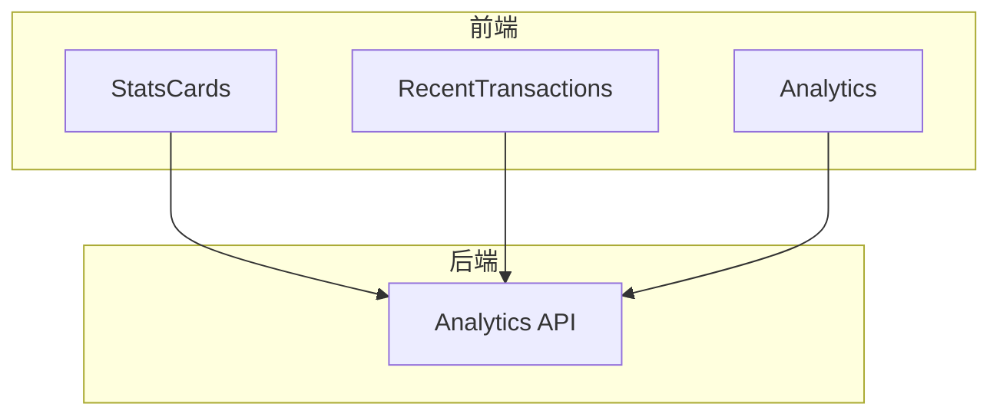
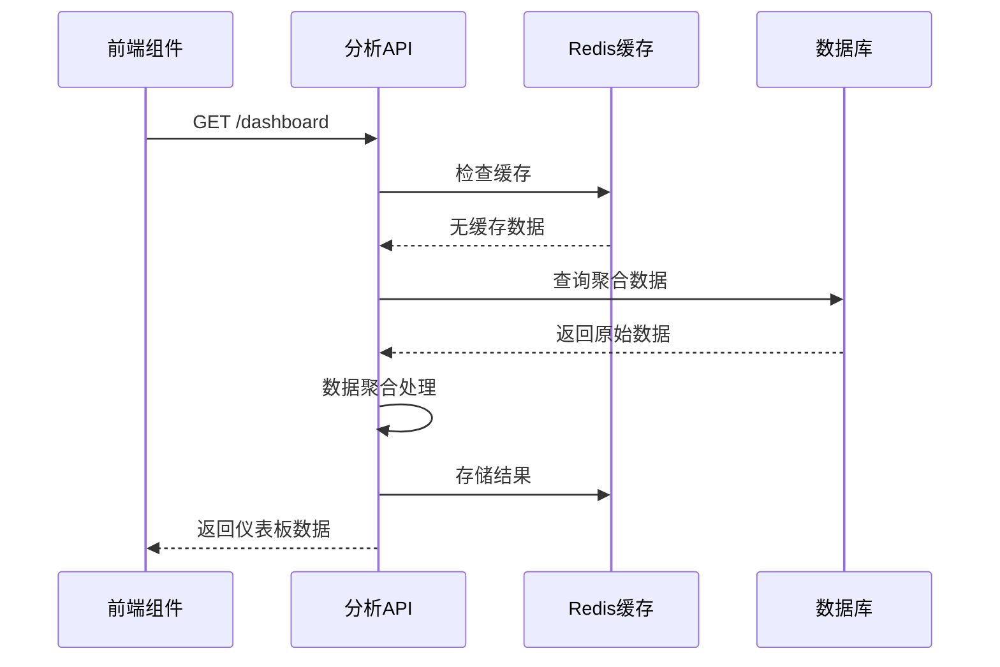
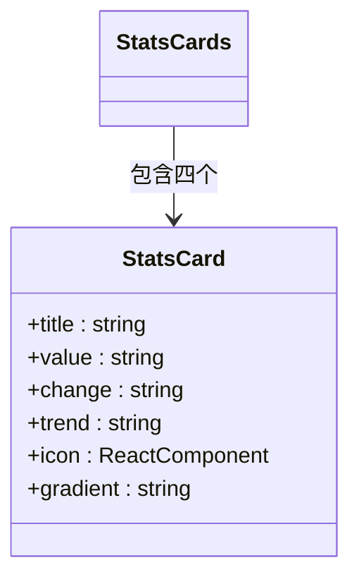
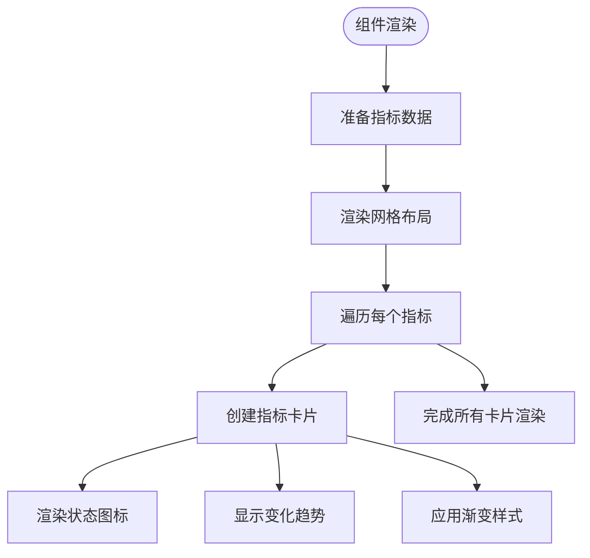
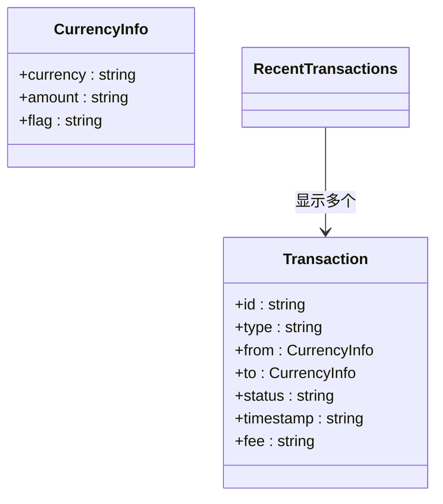
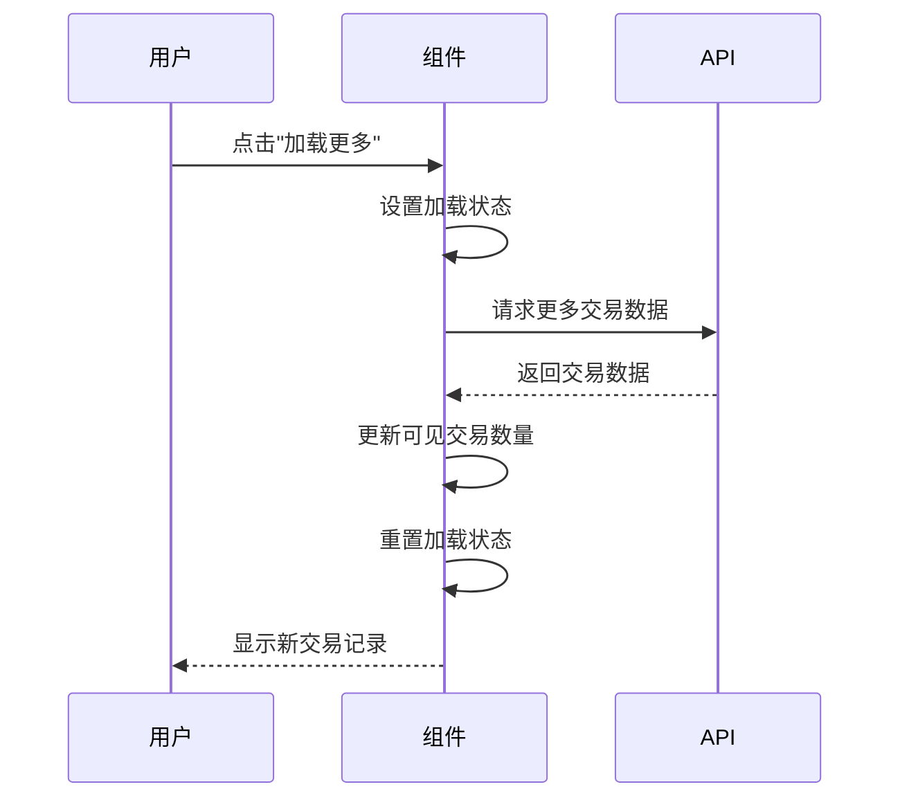
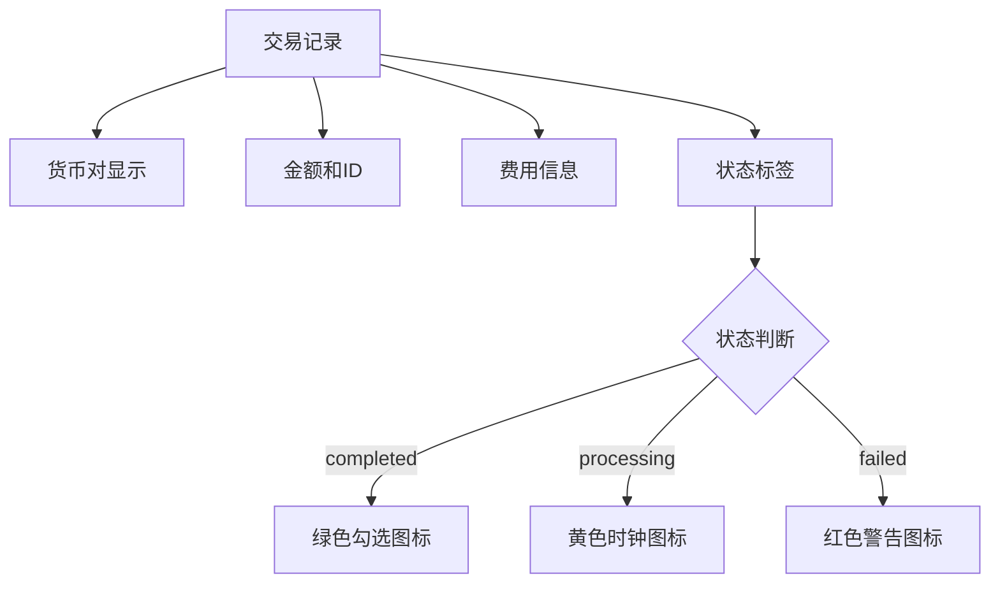
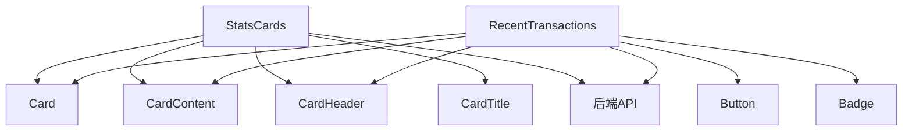
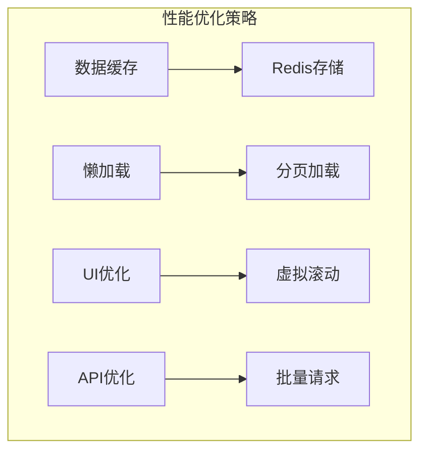

# 仪表板组件

<cite>
**本文档中引用的文件**
- [StatsCards.tsx](file://src/components/Dashboard/StatsCards.tsx)
- [RecentTransactions.tsx](file://src/components/Dashboard/RecentTransactions.tsx)
- [analytics.ts](file://backend/src/routes/analytics.ts)
- [Analytics.tsx](file://src/components/Analytics/Analytics.tsx)
</cite>

## 目录
1. [简介](#简介)
2. [项目结构](#项目结构)
3. [核心组件](#核心组件)
4. [架构概述](#架构概述)
5. [详细组件分析](#详细组件分析)
6. [依赖分析](#依赖分析)
7. [性能考虑](#性能考虑)
8. [故障排除指南](#故障排除指南)
9. [结论](#结论)

## 简介
本文档深入解析TriBridge仪表板组件的设计与实现，重点分析StatsCards和RecentTransactions两个核心组件。文档详细阐述了数据可视化策略、性能优化技巧、实时更新机制以及前后端交互流程。通过本指南，开发者可以全面了解仪表板组件的工作原理，掌握其调用方法和优化方案。

## 项目结构
TriBridge项目采用前后端分离架构，前端使用React框架构建用户界面，后端使用Node.js提供API服务。仪表板相关组件位于`src/components/Dashboard`目录下，后端分析服务位于`backend/src/routes/analytics.ts`。

**图表来源**
- [StatsCards.tsx](file://src/components/Dashboard/StatsCards.tsx)
- [RecentTransactions.tsx](file://src/components/Dashboard/RecentTransactions.tsx)
- [analytics.ts](file://backend/src/routes/analytics.ts)

**章节来源**
- [StatsCards.tsx](file://src/components/Dashboard/StatsCards.tsx)
- [RecentTransactions.tsx](file://src/components/Dashboard/RecentTransactions.tsx)

## 核心组件
仪表板包含两个核心可视化组件：StatsCards用于展示关键指标，RecentTransactions用于显示最近交易记录。这些组件通过API与后端分析服务交互，获取实时数据并进行可视化展示。

**章节来源**
- [StatsCards.tsx](file://src/components/Dashboard/StatsCards.tsx#L3-L69)
- [RecentTransactions.tsx](file://src/components/Dashboard/RecentTransactions.tsx#L6-L199)

## 架构概述
系统采用分层架构设计，前端组件通过REST API与后端服务通信。后端服务从数据库获取数据，经过聚合处理后返回给前端。缓存机制被用于提高数据访问性能，减少数据库负载。

**图表来源**
- [analytics.ts](file://backend/src/routes/analytics.ts#L0-L73)
- [StatsCards.tsx](file://src/components/Dashboard/StatsCards.tsx#L3-L69)

## 详细组件分析
对仪表板的两个核心组件进行深入分析，包括其数据可视化策略、性能优化技巧和实时更新机制。

### StatsCards组件分析
StatsCards组件采用网格布局展示四个关键指标：24小时总交易量、活跃交易数、平均处理时间和成功率。每个指标卡片都包含标题、数值、变化趋势和状态图标。

**图表来源**
- [StatsCards.tsx](file://src/components/Dashboard/StatsCards.tsx#L3-L69)

#### 数据可视化策略
StatsCards组件通过颜色编码和图标来增强数据可视化效果。上升趋势使用绿色和向上箭头，下降趋势使用灰色和向下箭头。每个卡片都有独特的渐变背景色，通过CSS类名控制。

**图表来源**
- [StatsCards.tsx](file://src/components/Dashboard/StatsCards.tsx#L3-L69)

**章节来源**
- [StatsCards.tsx](file://src/components/Dashboard/StatsCards.tsx#L3-L69)

### RecentTransactions组件分析
RecentTransactions组件展示最近的交易记录，支持分页加载更多交易。组件初始显示4条交易记录，用户可以点击"加载更多"按钮获取额外记录。

**图表来源**
- [RecentTransactions.tsx](file://src/components/Dashboard/RecentTransactions.tsx#L6-L199)

#### 实时更新机制
RecentTransactions组件通过状态管理实现交易记录的动态更新。组件使用useState钩子管理加载状态和可见交易数量，通过异步函数模拟API调用延迟。

**图表来源**
- [RecentTransactions.tsx](file://src/components/Dashboard/RecentTransactions.tsx#L6-L199)

#### 交互设计
组件采用直观的交互设计，每条交易记录显示货币标志、交易金额、费用和状态标签。状态标签根据交易状态显示不同颜色和图标，提供清晰的视觉反馈。

**图表来源**
- [RecentTransactions.tsx](file://src/components/Dashboard/RecentTransactions.tsx#L6-L199)

**章节来源**
- [RecentTransactions.tsx](file://src/components/Dashboard/RecentTransactions.tsx#L6-L199)

## 依赖分析
仪表板组件依赖于多个前端UI组件和后端API服务。前端组件依赖Card、Button、Badge等UI组件，后端依赖分析服务提供数据支持。

**图表来源**
- [StatsCards.tsx](file://src/components/Dashboard/StatsCards.tsx#L3-L69)
- [RecentTransactions.tsx](file://src/components/Dashboard/RecentTransactions.tsx#L6-L199)

**章节来源**
- [StatsCards.tsx](file://src/components/Dashboard/StatsCards.tsx#L3-L69)
- [RecentTransactions.tsx](file://src/components/Dashboard/RecentTransactions.tsx#L6-L199)

## 性能考虑
系统通过多种策略优化性能，包括数据缓存、懒加载和高效的UI渲染。后端服务使用Redis缓存频繁访问的数据，减少数据库查询次数。

## 故障排除指南
当仪表板数据不更新时，首先检查API端点是否正常工作。确认后端服务正在运行，并且数据库连接正常。对于前端问题，检查网络请求是否成功，以及状态管理是否正确更新。

**章节来源**
- [analytics.ts](file://backend/src/routes/analytics.ts#L0-L73)
- [StatsCards.tsx](file://src/components/Dashboard/StatsCards.tsx#L3-L69)

## 结论
TriBridge仪表板组件通过精心设计的数据可视化和高效的性能优化策略，为用户提供直观的交易数据分析。StatsCards和RecentTransactions组件协同工作，展示关键指标和最新交易动态，帮助用户快速了解系统状态。