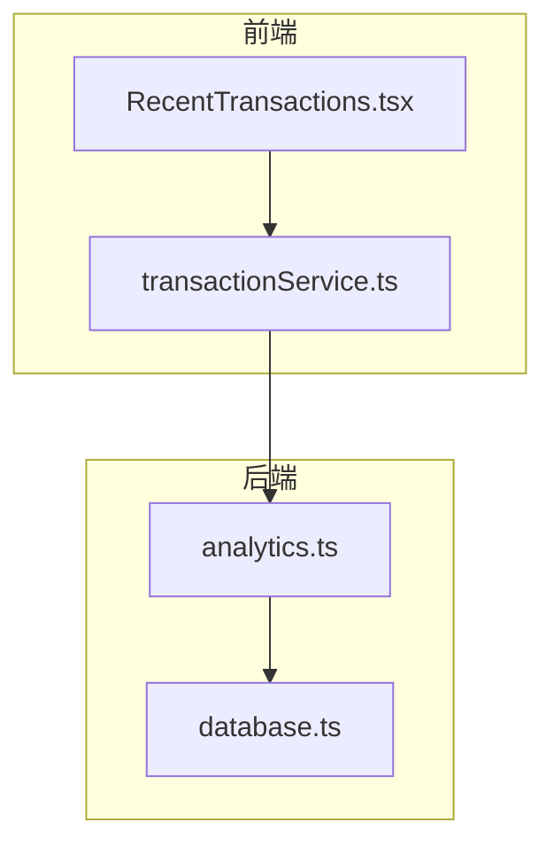
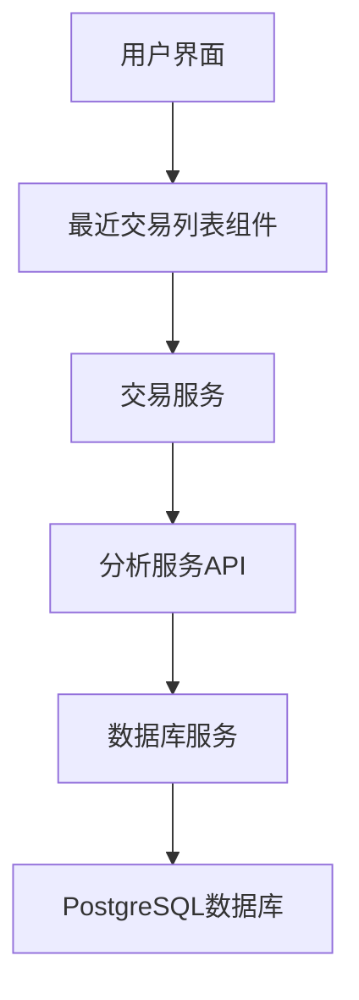
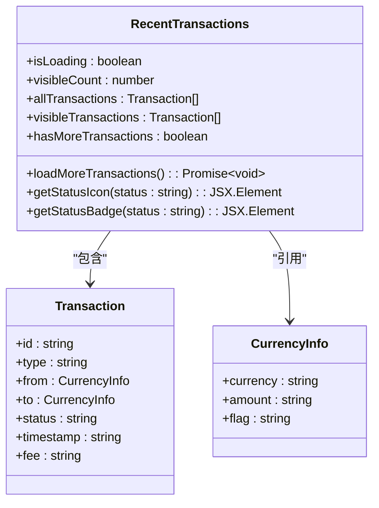
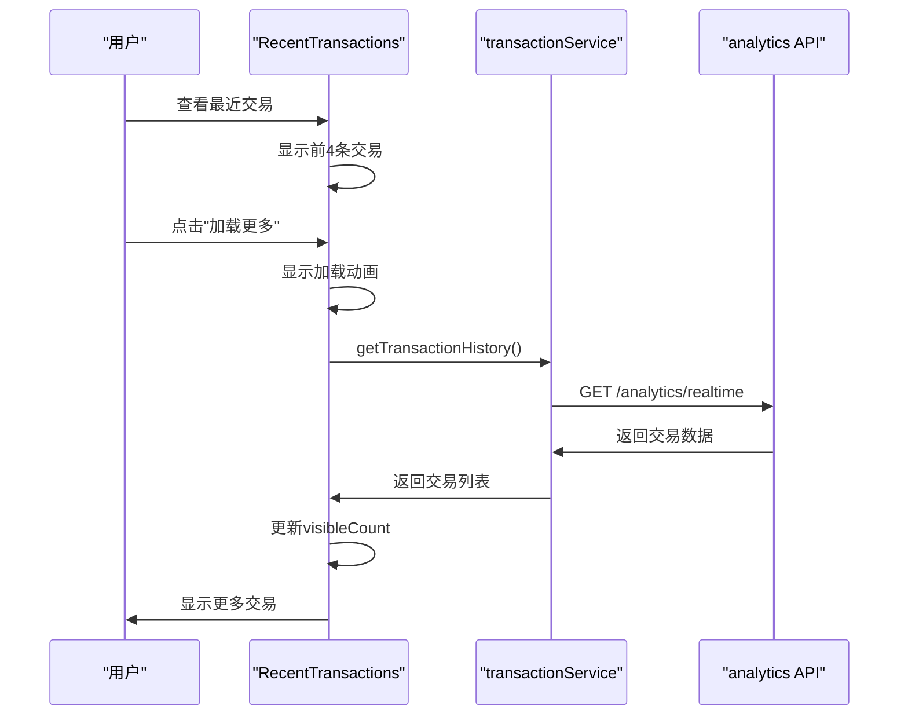
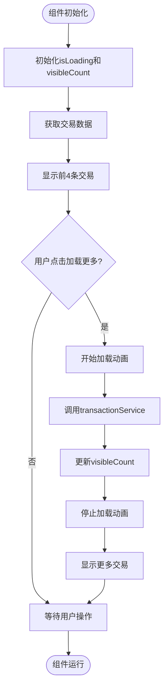
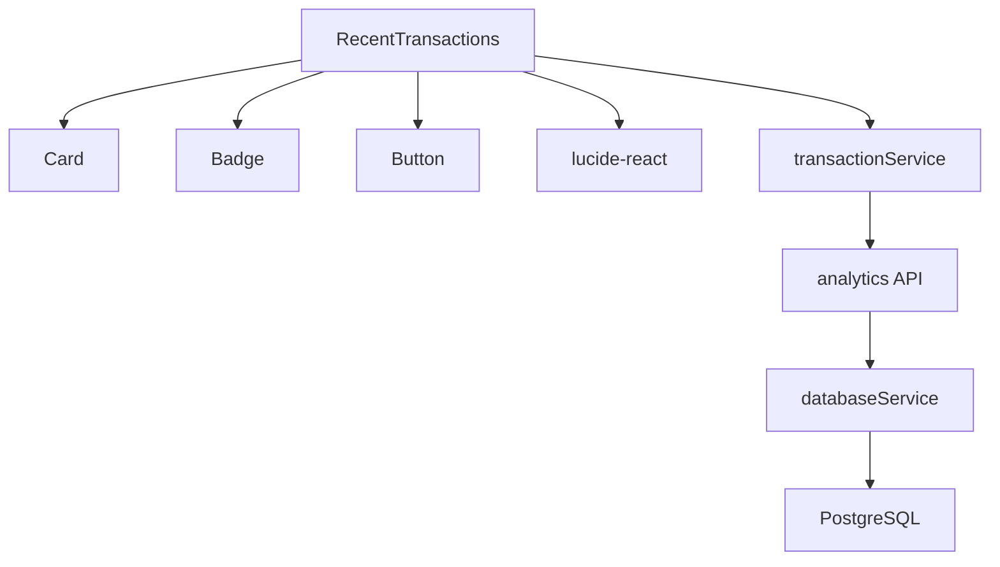

# 最近交易列表组件

<cite>
**本文档中引用的文件**   
- [RecentTransactions.tsx](file://src/components/Dashboard/RecentTransactions.tsx)
- [transactionService.ts](file://src/services/transactionService.ts)
- [analytics.ts](file://backend/src/routes/analytics.ts)
- [database.ts](file://backend/src/services/database.ts)
</cite>

## 目录
1. [简介](#简介)
2. [项目结构](#项目结构)
3. [核心组件](#核心组件)
4. [架构概述](#架构概述)
5. [详细组件分析](#详细组件分析)
6. [依赖分析](#依赖分析)
7. [性能考虑](#性能考虑)
8. [故障排除指南](#故障排除指南)
9. [结论](#结论)

## 简介
最近交易列表组件是TriBridge平台的核心功能之一，用于实时展示用户的最新交易记录。该组件通过直观的界面设计和高效的性能优化策略，为用户提供清晰的交易状态、货币对信息和费用详情。组件支持懒加载和分页显示，确保在大量交易数据下的流畅用户体验。

## 项目结构
最近交易列表组件位于`src/components/Dashboard/RecentTransactions.tsx`，是仪表板模块的一部分。该组件依赖于交易服务（transactionService）获取数据，并通过后端分析服务（analytics）进行数据交互。整体结构遵循React组件设计模式，结合TypeScript类型安全和Tailwind CSS样式框架。

**图表来源**
- [RecentTransactions.tsx](file://src/components/Dashboard/RecentTransactions.tsx#L1-L201)
- [transactionService.ts](file://src/services/transactionService.ts#L1-L392)
- [analytics.ts](file://backend/src/routes/analytics.ts#L1-L422)

**章节来源**
- [RecentTransactions.tsx](file://src/components/Dashboard/RecentTransactions.tsx#L1-L201)
- [transactionService.ts](file://src/services/transactionService.ts#L1-L392)

## 核心组件
最近交易列表组件实现了交易数据的实时展示、状态徽章渲染和懒加载功能。组件使用React Hooks管理状态，包括加载状态和可见交易数量。通过`loadMoreTransactions`方法实现分页加载，每次加载4条新交易记录。

**章节来源**
- [RecentTransactions.tsx](file://src/components/Dashboard/RecentTransactions.tsx#L6-L199)

## 架构概述
该组件采用分层架构设计，前端组件负责UI渲染和用户交互，交易服务层处理业务逻辑和数据获取，后端分析服务提供API接口，数据库服务存储和查询交易数据。这种分层设计确保了组件的可维护性和可扩展性。

**图表来源**
- [RecentTransactions.tsx](file://src/components/Dashboard/RecentTransactions.tsx#L1-L201)
- [transactionService.ts](file://src/services/transactionService.ts#L1-L392)
- [analytics.ts](file://backend/src/routes/analytics.ts#L1-L422)
- [database.ts](file://backend/src/services/database.ts#L1-L246)

## 详细组件分析

### 最近交易列表分析
该组件通过`allTransactions`数组存储交易数据，使用`visibleCount`状态控制可见交易数量。`getStatusBadge`方法根据交易状态渲染不同颜色的状态徽章，`loadMoreTransactions`方法处理分页加载逻辑。

#### 对于对象导向组件：

**图表来源**
- [RecentTransactions.tsx](file://src/components/Dashboard/RecentTransactions.tsx#L6-L199)

#### 对于API/服务组件：

**图表来源**
- [RecentTransactions.tsx](file://src/components/Dashboard/RecentTransactions.tsx#L88-L182)
- [transactionService.ts](file://src/services/transactionService.ts#L293-L303)
- [analytics.ts](file://backend/src/routes/analytics.ts#L391-L422)

#### 对于复杂逻辑组件：

**图表来源**
- [RecentTransactions.tsx](file://src/components/Dashboard/RecentTransactions.tsx#L8-L182)

**章节来源**
- [RecentTransactions.tsx](file://src/components/Dashboard/RecentTransactions.tsx#L1-L201)

## 依赖分析
最近交易列表组件依赖于多个核心服务和组件。前端依赖UI组件库（Card、Badge、Button等）和图标库（lucide-react），业务逻辑依赖交易服务（transactionService），数据获取依赖后端分析服务（analytics）。后端服务之间通过REST API进行通信，数据库服务提供数据持久化支持。

**图表来源**
- [RecentTransactions.tsx](file://src/components/Dashboard/RecentTransactions.tsx#L1-L201)
- [transactionService.ts](file://src/services/transactionService.ts#L1-L392)
- [analytics.ts](file://backend/src/routes/analytics.ts#L1-L422)
- [database.ts](file://backend/src/services/database.ts#L1-L246)

**章节来源**
- [RecentTransactions.tsx](file://src/components/Dashboard/RecentTransactions.tsx#L1-L201)
- [transactionService.ts](file://src/services/transactionService.ts#L1-L392)
- [analytics.ts](file://backend/src/routes/analytics.ts#L1-L422)
- [database.ts](file://backend/src/services/database.ts#L1-L246)

## 性能考虑
组件通过懒加载策略优化性能，初始只加载4条交易记录，用户需要时再分页加载更多数据。使用`useState`高效管理组件状态，避免不必要的重新渲染。后端服务采用数据库索引和缓存机制，确保交易数据查询的高效性。建议在生产环境中实现真正的API分页，而不是前端模拟分页。

## 故障排除指南
如果最近交易列表无法正常显示，首先检查网络连接和API端点状态。确认`transactionService`是否正确初始化，`analytics`路由是否正常工作。检查数据库连接状态和交易表是否存在。对于加载问题，验证`visibleCount`状态是否正确更新，`loadMoreTransactions`方法是否被正确调用。

**章节来源**
- [RecentTransactions.tsx](file://src/components/Dashboard/RecentTransactions.tsx#L88-L182)
- [transactionService.ts](file://src/services/transactionService.ts#L293-L303)
- [analytics.ts](file://backend/src/routes/analytics.ts#L391-L422)
- [database.ts](file://backend/src/services/database.ts#L220-L246)

## 结论
最近交易列表组件通过精心设计的架构和优化策略，为用户提供高效、直观的交易历史查看体验。组件的模块化设计使其易于维护和扩展，分层架构确保了前后端的清晰分离。未来可以进一步优化，如实现真正的后端分页、添加交易搜索功能和增强错误处理机制。