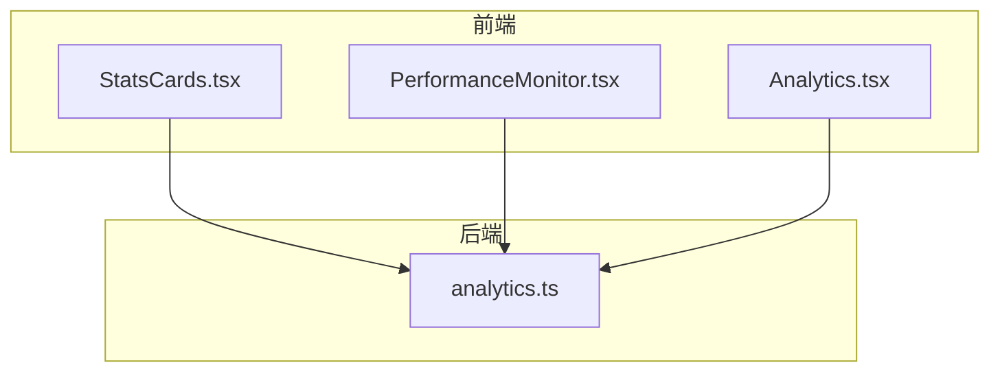
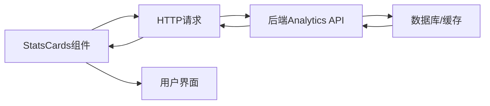
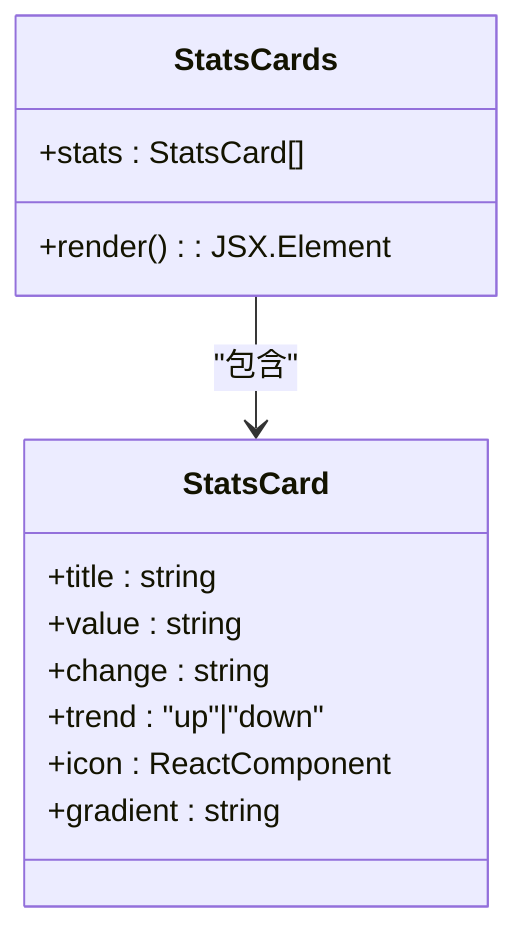
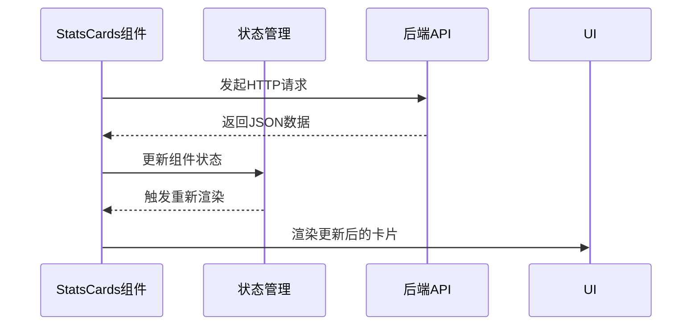
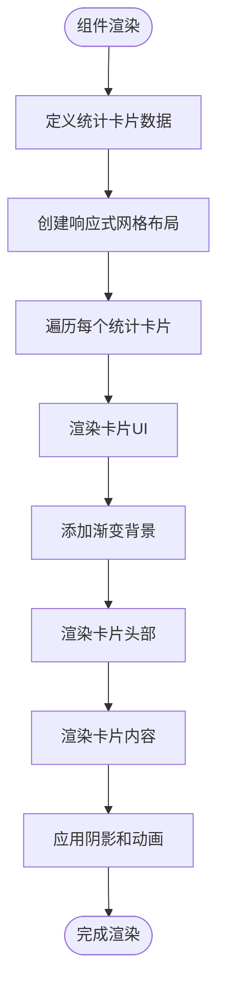
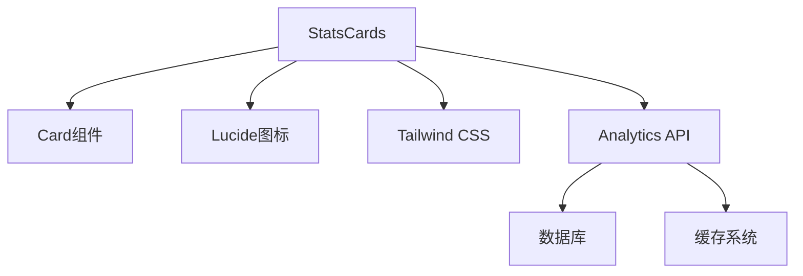

# 统计卡片组件

<cite>
**本文档中引用的文件**   
- [StatsCards.tsx](file://src/components/Dashboard/StatsCards.tsx)
- [PerformanceMonitor.tsx](file://src/components/Performance/PerformanceMonitor.tsx)
- [analytics.ts](file://backend/src/routes/analytics.ts)
- [Analytics.tsx](file://src/components/Analytics/Analytics.tsx)
</cite>

## 目录
1. [介绍](#介绍)
2. [项目结构](#项目结构)
3. [核心组件](#核心组件)
4. [架构概述](#架构概述)
5. [详细组件分析](#详细组件分析)
6. [依赖分析](#依赖分析)
7. [性能考虑](#性能考虑)
8. [故障排除指南](#故障排除指南)
9. [结论](#结论)

## 介绍
TriBridge统计卡片组件是一个用于展示关键业务指标的可视化组件，旨在为用户提供直观、实时的系统性能和业务数据概览。该组件通过精心设计的UI布局、动态数据绑定和性能优化策略，实现了高效的数据展示和交互体验。统计卡片组件不仅展示了交易量、成功率等核心指标，还与后端分析API紧密集成，确保数据的实时性和准确性。结合PerformanceMonitor中的性能监控功能，该组件能够动态反映系统健康状况，为用户决策提供有力支持。

## 项目结构
统计卡片组件位于项目的`src/components/Dashboard/`目录下，作为仪表板的核心组成部分。该组件采用React函数式组件设计，利用Tailwind CSS进行样式控制，并通过模块化的方式与其他UI组件（如Card、Badge等）进行集成。项目结构体现了清晰的分层设计，前端组件与后端API通过RESTful接口进行通信，确保了前后端的解耦和可维护性。

**图表来源**
- [StatsCards.tsx](file://src/components/Dashboard/StatsCards.tsx)
- [analytics.ts](file://backend/src/routes/analytics.ts)

**章节来源**
- [StatsCards.tsx](file://src/components/Dashboard/StatsCards.tsx#L1-L72)
- [analytics.ts](file://backend/src/routes/analytics.ts#L1-L423)

## 核心组件
StatsCards组件是TriBridge系统中的核心数据可视化组件，负责展示关键业务指标。该组件通过静态数据结构定义了四个主要统计卡片：24小时总交易量、活跃交易数、平均处理时间和成功率。每个卡片都包含了标题、数值、变化趋势、趋势图标和背景渐变等元素，通过简洁的UI设计实现了信息的高效传达。组件采用响应式网格布局，能够在不同屏幕尺寸下自动调整排列方式，确保良好的用户体验。

**章节来源**
- [StatsCards.tsx](file://src/components/Dashboard/StatsCards.tsx#L3-L69)

## 架构概述
统计卡片组件的架构设计体现了前后端分离的原则，前端组件负责数据展示和用户交互，后端API负责数据计算和提供。组件通过HTTP请求从后端`/analytics/dashboard`等接口获取实时数据，实现了数据的动态更新。整体架构采用了现代化的Web技术栈，包括React、TypeScript和Tailwind CSS，确保了代码的可维护性和可扩展性。

**图表来源**
- [StatsCards.tsx](file://src/components/Dashboard/StatsCards.tsx#L1-L72)
- [analytics.ts](file://backend/src/routes/analytics.ts#L1-L423)

## 详细组件分析
### StatsCards组件分析
StatsCards组件通过一个静态数组定义了四个统计卡片的数据结构，每个卡片对象包含了标题、数值、变化率、趋势方向、图标和背景渐变等属性。组件使用map函数遍历这些数据，动态生成对应的UI元素。通过Tailwind CSS的实用类系统，实现了精细的样式控制，包括阴影效果、悬停动画和响应式布局。

#### 组件结构

**图表来源**
- [StatsCards.tsx](file://src/components/Dashboard/StatsCards.tsx#L3-L69)

#### 数据绑定机制

**图表来源**
- [StatsCards.tsx](file://src/components/Dashboard/StatsCards.tsx#L39-L71)
- [analytics.ts](file://backend/src/routes/analytics.ts#L129-L171)

#### UI设计分析

**图表来源**
- [StatsCards.tsx](file://src/components/Dashboard/StatsCards.tsx#L39-L71)

**章节来源**
- [StatsCards.tsx](file://src/components/Dashboard/StatsCards.tsx#L1-L72)

### PerformanceMonitor组件分析
PerformanceMonitor组件作为系统性能监控的核心，与StatsCards组件形成了互补关系。该组件通过定时器每5秒更新一次性能指标，实现了数据的实时刷新。组件定义了多个性能度量标准，包括平均处理时间、交易成功率、吞吐量等，并通过颜色编码和进度条直观地展示了各项指标的状态。

**章节来源**
- [PerformanceMonitor.tsx](file://src/components/Performance/PerformanceMonitor.tsx#L28-L387)

## 依赖分析
统计卡片组件的依赖关系体现了模块化设计的思想。前端组件依赖于UI组件库（如Card、Badge等）和图标库（Lucide React），后端API依赖于数据库和缓存系统。通过清晰的依赖管理，确保了组件的可复用性和可维护性。

**图表来源**
- [StatsCards.tsx](file://src/components/Dashboard/StatsCards.tsx#L1-L72)
- [analytics.ts](file://backend/src/routes/analytics.ts#L1-L423)

**章节来源**
- [StatsCards.tsx](file://src/components/Dashboard/StatsCards.tsx#L1-L72)
- [analytics.ts](file://backend/src/routes/analytics.ts#L1-L423)

## 性能考虑
StatsCards组件在性能优化方面采取了多项措施。首先，通过使用React的函数式组件和Hooks，减少了不必要的渲染。其次，组件采用了轻量级的样式系统（Tailwind CSS），避免了传统CSS文件的加载开销。此外，后端API通过缓存机制和数据库优化，确保了数据查询的高效性。PerformanceMonitor组件中的定时更新机制也经过优化，避免了过于频繁的API调用对系统造成压力。

## 故障排除指南
当统计卡片组件出现数据不更新或显示异常时，可按照以下步骤进行排查：首先检查网络连接是否正常，确认前端能否成功访问后端API；其次查看浏览器控制台是否有JavaScript错误；然后检查后端API日志，确认数据查询是否成功；最后验证数据库连接和数据完整性。对于样式问题，可检查Tailwind CSS的配置是否正确，确保所需的CSS类已生成。

**章节来源**
- [StatsCards.tsx](file://src/components/Dashboard/StatsCards.tsx#L3-L69)
- [PerformanceMonitor.tsx](file://src/components/Performance/PerformanceMonitor.tsx#L28-L387)

## 结论
TriBridge统计卡片组件通过精心设计的UI、高效的性能优化和可靠的后端集成，为用户提供了一个直观、实时的数据可视化解决方案。组件的模块化设计和清晰的依赖关系确保了其可维护性和可扩展性，为系统的持续发展奠定了坚实基础。未来可通过引入更多交互功能和个性化设置，进一步提升用户体验。