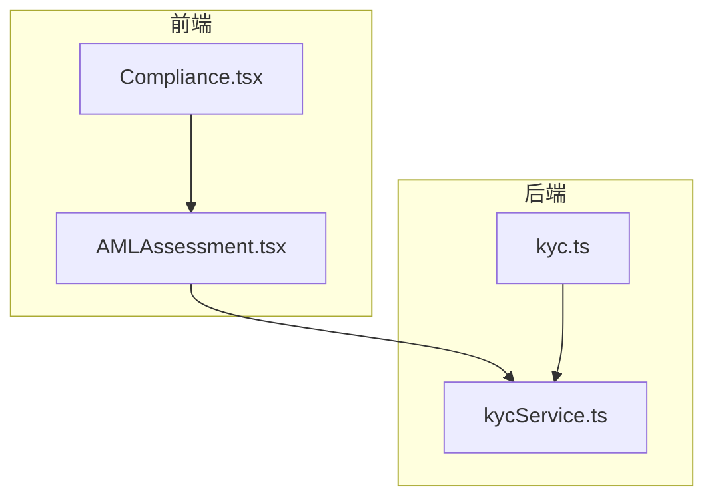
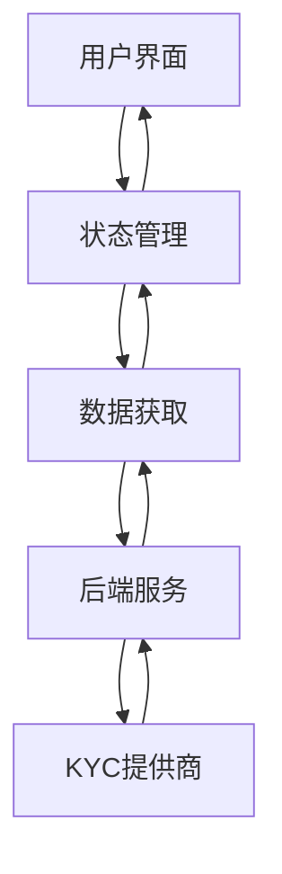
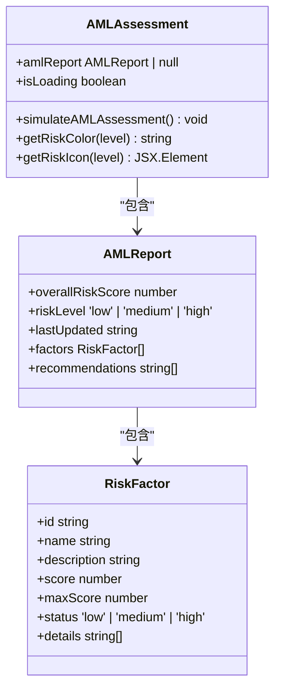
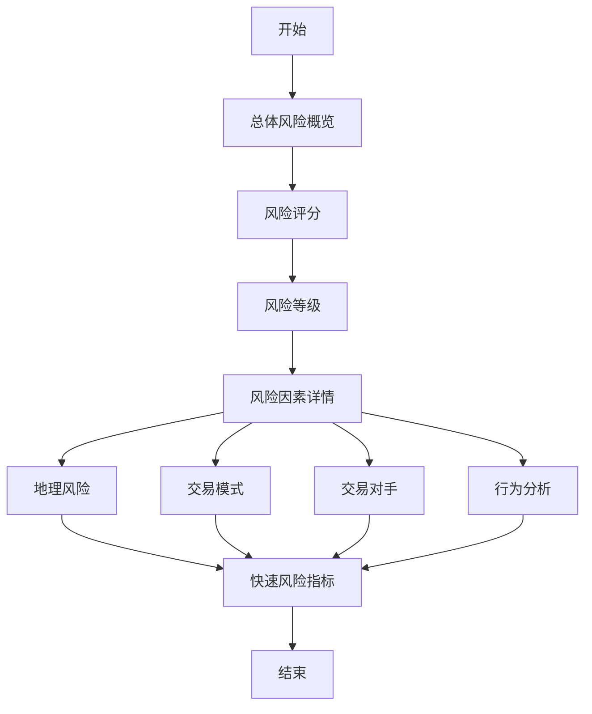
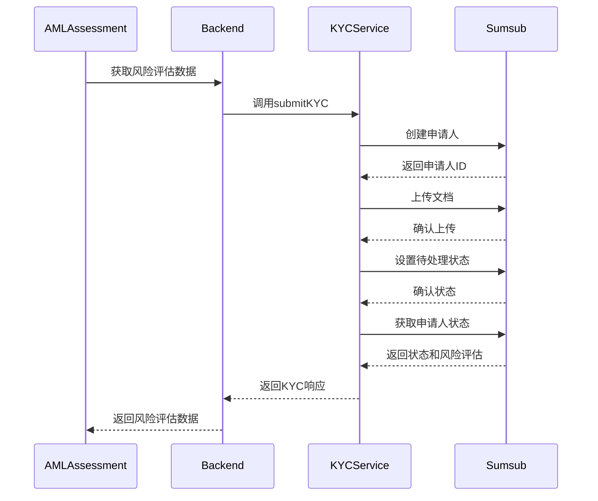
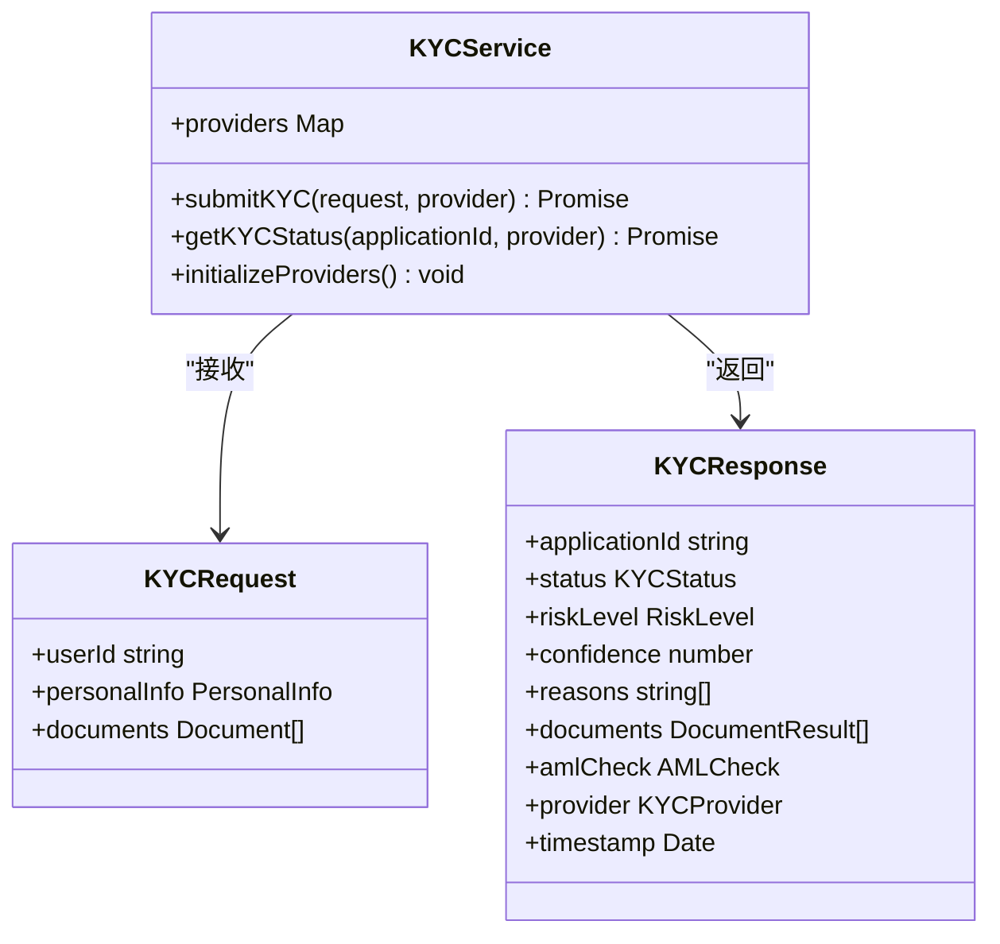
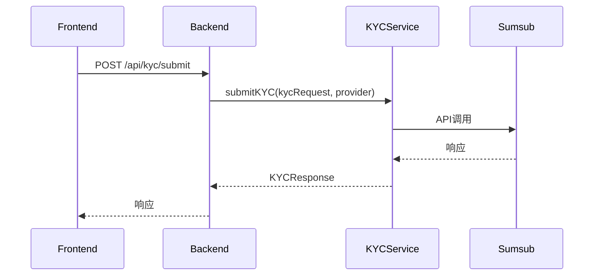
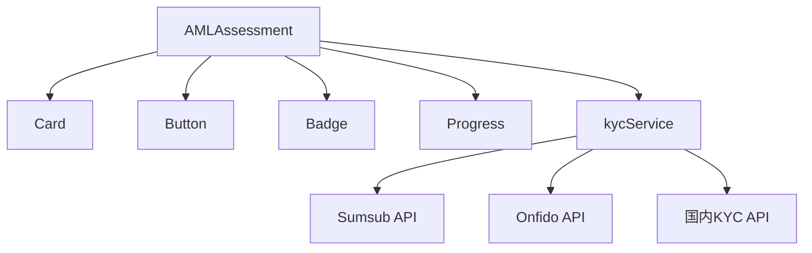

# AML风险评估组件

<cite>
**本文档引用文件**   
- [AMLAssessment.tsx](file://src/components/Compliance/AMLAssessment.tsx)
- [kycService.ts](file://backend/src/services/kycService.ts)
- [index-simple.ts](file://backend/src/index-simple.ts)
- [kyc.ts](file://backend/src/routes/kyc.ts)
</cite>

## 目录
1. [简介](#简介)
2. [项目结构](#项目结构)
3. [核心组件](#核心组件)
4. [架构概述](#架构概述)
5. [详细组件分析](#详细组件分析)
6. [依赖分析](#依赖分析)
7. [性能考虑](#性能考虑)
8. [故障排除指南](#故障排除指南)
9. [结论](#结论)
10. [附录](#附录)（如有必要）

## 简介
AML风险评估组件是合规系统中的核心模块，负责对用户交易行为进行全面的风险评估。该组件通过分析地理风险、交易模式、交易对手和行为分析四大风险因子，生成综合风险评分和风险等级。组件与后端kycService服务紧密集成，获取KYC验证结果和AML检查数据，实现全面的反洗钱风险评估。本文档深入解析该组件的风险评估算法、可视化展示机制、数据获取流程、状态管理策略和实时更新机制。

## 项目结构
AML风险评估组件位于前端src/components/Compliance目录下，作为独立的React组件实现。后端KYC服务位于backend/src/services目录下，提供KYC验证和AML检查功能。前端通过API路由与后端服务通信，实现数据交互。

**图源**
- [AMLAssessment.tsx](file://src/components/Compliance/AMLAssessment.tsx)
- [kycService.ts](file://backend/src/services/kycService.ts)
- [kyc.ts](file://backend/src/routes/kyc.ts)

**节源**
- [AMLAssessment.tsx](file://src/components/Compliance/AMLAssessment.tsx)
- [kycService.ts](file://backend/src/services/kycService.ts)

## 核心组件
AMLAssessment组件是AML风险评估的核心实现，负责展示风险评估报告、管理组件状态和处理用户交互。组件通过模拟或实际调用后端服务获取风险评估数据，展示综合风险评分、各风险因子详情和风险管理建议。

**节源**
- [AMLAssessment.tsx](file://src/components/Compliance/AMLAssessment.tsx)

## 架构概述
AML风险评估组件采用前后端分离架构，前端负责数据展示和用户交互，后端负责风险评估逻辑和数据处理。组件通过状态管理实现加载状态、错误状态和数据展示状态的切换，确保用户体验的流畅性。

**图源**
- [AMLAssessment.tsx](file://src/components/Compliance/AMLAssessment.tsx)
- [kycService.ts](file://backend/src/services/kycService.ts)

## 详细组件分析

### AMLAssessment组件分析
AMLAssessment组件实现了完整的AML风险评估功能，包括风险评估、数据展示和用户交互。组件使用React Hooks管理状态，通过useEffect钩子在组件挂载时触发风险评估。

#### 风险评估算法
组件通过模拟或调用后端服务获取风险评估数据。风险评估基于四大风险因子：地理风险、交易模式、交易对手和行为分析。每个风险因子都有独立的评分体系和风险等级。

**图源**
- [AMLAssessment.tsx](file://src/components/Compliance/AMLAssessment.tsx)

#### 可视化展示机制
组件采用多层次的可视化设计，包括总体风险概览、风险因素详情和快速风险指标。总体风险概览展示综合风险评分和风险等级，使用进度条直观显示评分。风险因素详情以卡片形式展示各风险因子的详细信息，包括评分、风险等级和具体细节。快速风险指标以简洁的卡片形式展示四大风险因子的总体状态。

**图源**
- [AMLAssessment.tsx](file://src/components/Compliance/AMLAssessment.tsx)

#### 数据获取流程
组件在useEffect钩子中调用simulateAMLAssessment函数，该函数模拟异步API调用，延迟2秒后设置风险评估数据。实际应用中，该函数应替换为真实的API调用，从后端服务获取风险评估数据。

**图源**
- [AMLAssessment.tsx](file://src/components/Compliance/AMLAssessment.tsx)
- [kycService.ts](file://backend/src/services/kycService.ts)

#### 状态管理策略
组件使用useState钩子管理两个状态：amlReport和isLoading。amlReport存储风险评估数据，初始值为null。isLoading表示数据加载状态，初始值为true。当数据获取完成后，设置amlReport为获取到的数据，并将isLoading设置为false。

#### 实时更新机制
组件提供"重新评估"按钮，用户点击后重新触发风险评估过程。组件还计划支持自动更新机制，定期获取最新的风险评估数据。

### KYC服务分析
kycService是后端KYC验证和AML检查的核心服务，支持Sumsub、Onfido和国内KYC提供商。服务通过适配器模式统一不同提供商的API接口，提供一致的KYC验证功能。

#### 风险因子评分逻辑
kycService通过调用不同KYC提供商的API，获取用户的身份验证结果和风险评估数据。服务将不同提供商的响应格式统一为标准的KYCResponse格式，便于前端组件处理。

**图源**
- [kycService.ts](file://backend/src/services/kycService.ts)

#### 综合风险等级计算方法
kycService通过整合不同KYC提供商的风险评估结果，计算综合风险等级。服务将各提供商的风险评分进行加权平均，结合AML检查结果，得出最终的风险等级。

#### 与后端kycService的数据交互细节
前端AMLAssessment组件通过API路由与后端kycService交互。后端kycService初始化时创建kycService实例，并在kyc路由中使用该实例处理KYC相关请求。

**图源**
- [kycService.ts](file://backend/src/services/kycService.ts)
- [kyc.ts](file://backend/src/routes/kyc.ts)

#### API调用、响应处理和错误恢复策略
kycService在submitKYC方法中使用try-catch块捕获异常，确保API调用的稳定性。服务对不同提供商的API调用进行封装，统一处理响应和错误。当API调用失败时，服务记录错误日志并抛出异常，由上层调用者处理。

**节源**
- [kycService.ts](file://backend/src/services/kycService.ts)
- [kyc.ts](file://backend/src/routes/kyc.ts)

## 依赖分析
AML风险评估组件依赖于多个前后端组件和服务。前端组件依赖于UI组件库和状态管理。后端服务依赖于第三方KYC提供商API和数据库服务。

**图源**
- [AMLAssessment.tsx](file://src/components/Compliance/AMLAssessment.tsx)
- [kycService.ts](file://backend/src/services/kycService.ts)

**节源**
- [AMLAssessment.tsx](file://src/components/Compliance/AMLAssessment.tsx)
- [kycService.ts](file://backend/src/services/kycService.ts)

## 性能考虑
AML风险评估组件在性能方面进行了优化。前端组件使用React的虚拟DOM和组件化设计，确保渲染性能。后端服务使用异步API调用，避免阻塞主线程。服务还实现了缓存机制，减少对第三方API的重复调用。

## 故障排除指南
当AML风险评估组件出现问题时，可按照以下步骤进行排查：
1. 检查网络连接是否正常
2. 检查后端服务是否正常运行
3. 检查KYC提供商API密钥配置是否正确
4. 检查环境变量是否正确设置
5. 查看服务日志，定位具体错误

**节源**
- [kycService.ts](file://backend/src/services/kycService.ts)
- [AMLAssessment.tsx](file://src/components/Compliance/AMLAssessment.tsx)

## 结论
AML风险评估组件通过集成多个KYC提供商的服务，实现了全面的反洗钱风险评估功能。组件采用现代化的前后端分离架构，具有良好的可扩展性和可维护性。通过详细的文档和清晰的代码结构，组件易于理解和维护，为系统的合规性提供了有力保障。