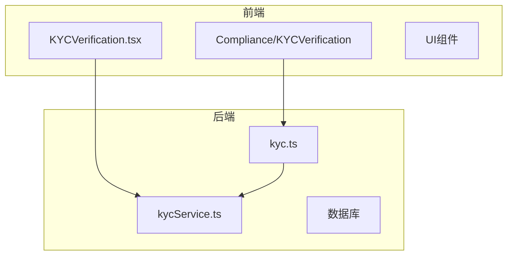
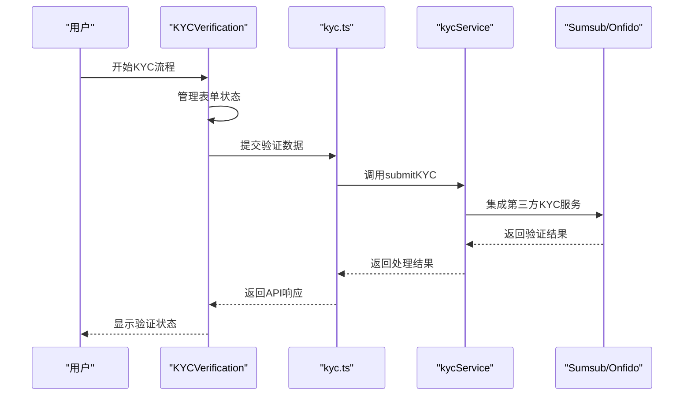
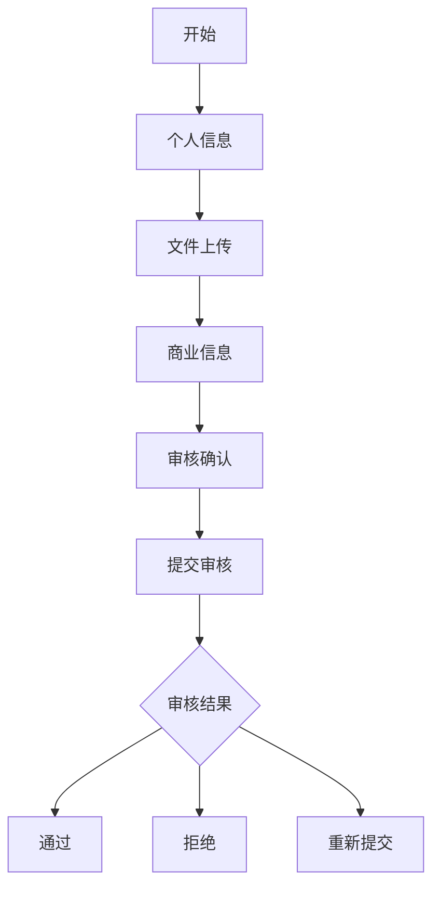
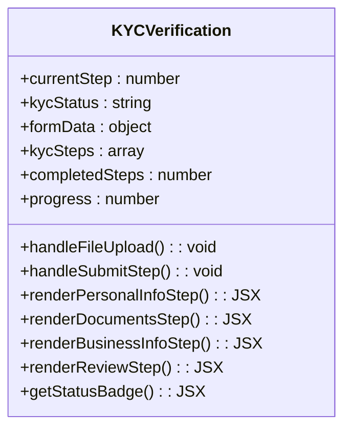
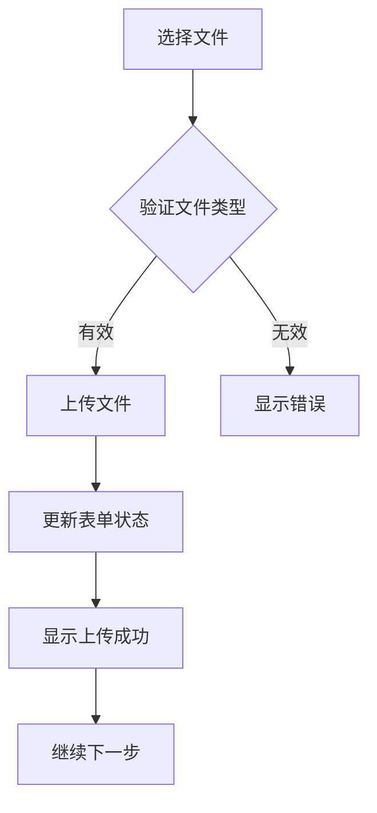
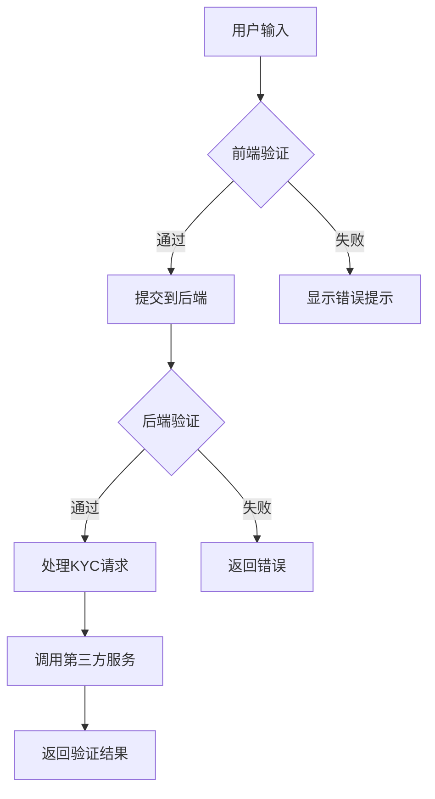
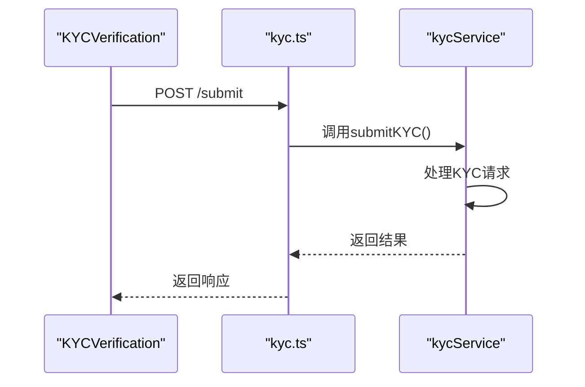
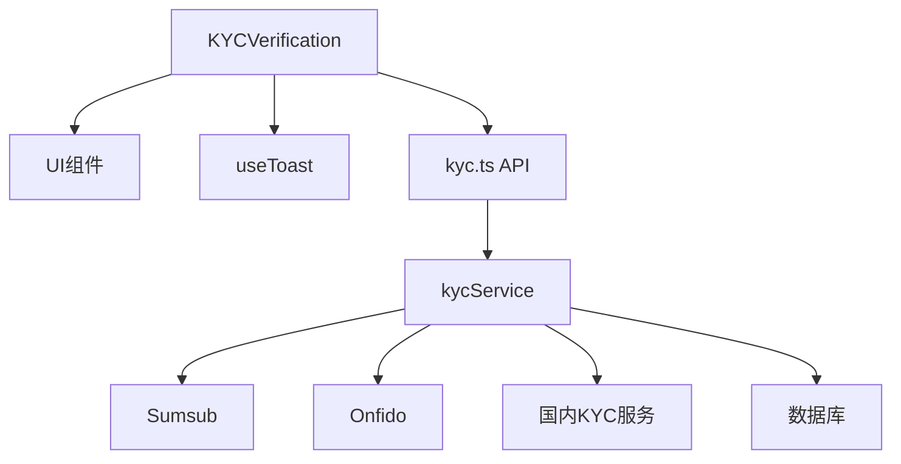

# KYC验证组件

<cite>
**本文档引用的文件**
- [KYCVerification.tsx](file://src/components/Compliance/KYCVerification.tsx)
- [kycService.ts](file://backend/src/services/kycService.ts)
- [kyc.ts](file://backend/src/routes/kyc.ts)
</cite>

## 目录
1. [简介](#简介)
2. [项目结构](#项目结构)
3. [核心组件](#核心组件)
4. [架构概述](#架构概述)
5. [详细组件分析](#详细组件分析)
6. [依赖分析](#依赖分析)
7. [性能考虑](#性能考虑)
8. [故障排除指南](#故障排除指南)
9. [结论](#结论)

## 简介
KYC验证组件是系统中用于身份验证的核心模块，实现了四步验证流程：个人信息、文件上传、商业信息和审核确认。该组件通过与后端kycService的交互，完成用户身份验证的完整流程。组件采用React函数式组件实现，结合TypeScript提供类型安全，并使用现代化的UI组件库构建用户界面。

## 项目结构
KYC验证功能分布在前端和后端两个主要部分：

**图源**
- [KYCVerification.tsx](file://src/components/Compliance/KYCVerification.tsx)
- [kycService.ts](file://backend/src/services/kycService.ts)
- [kyc.ts](file://backend/src/routes/kyc.ts)

## 核心组件
KYC验证组件实现了完整的四步验证流程，包括表单状态管理、文件上传处理、数据验证逻辑以及与后端服务的交互。组件使用useState钩子管理多步表单的状态，并通过useToast提供用户反馈。

**组件源**
- [KYCVerification.tsx](file://src/components/Compliance/KYCVerification.tsx#L21-L517)

## 架构概述
KYC验证系统采用前后端分离架构，前端组件负责用户界面和交互，后端服务处理业务逻辑和第三方KYC提供商集成。

**图源**
- [KYCVerification.tsx](file://src/components/Compliance/KYCVerification.tsx)
- [kyc.ts](file://backend/src/routes/kyc.ts)
- [kycService.ts](file://backend/src/services/kycService.ts)

## 详细组件分析
### KYC验证流程分析
KYC验证组件实现了四步验证流程，每一步都有特定的功能和验证逻辑。

#### 四步验证流程

**图源**
- [KYCVerification.tsx](file://src/components/Compliance/KYCVerification.tsx#L48-L110)

#### 表单状态管理
组件使用React的useState钩子管理复杂的表单状态，包括个人信息、文件上传和商业信息。

**图源**
- [KYCVerification.tsx](file://src/components/Compliance/KYCVerification.tsx#L21-L517)

### 文件上传处理
文件上传功能通过专门的处理函数实现，支持多种文件类型和大小限制。

#### 文件上传流程

**图源**
- [KYCVerification.tsx](file://src/components/Compliance/KYCVerification.tsx#L112-L128)

### 数据验证逻辑
数据验证在前端和后端两个层面实现，确保数据的完整性和安全性。

#### 验证逻辑流程

**图源**
- [kyc.ts](file://backend/src/routes/kyc.ts#L4-L63)
- [kycService.ts](file://backend/src/services/kycService.ts#L113-L156)

### 与kycService的交互
前端组件通过API路由与后端kycService进行交互，实现完整的KYC验证流程。

#### 服务交互流程

**图源**
- [kyc.ts](file://backend/src/routes/kyc.ts#L4-L63)
- [kycService.ts](file://backend/src/services/kycService.ts#L113-L156)

## 依赖分析
KYC验证组件依赖多个前后端模块和第三方服务。

**图源**
- [KYCVerification.tsx](file://src/components/Compliance/KYCVerification.tsx)
- [kycService.ts](file://backend/src/services/kycService.ts#L0-L46)
- [kyc.ts](file://backend/src/routes/kyc.ts)

**组件源**
- [kycService.ts](file://backend/src/services/kycService.ts#L0-L46)
- [kyc.ts](file://backend/src/routes/kyc.ts#L4-L4)

## 性能考虑
### 前端性能优化
- 使用React.memo优化组件渲染
- 懒加载大型文件上传组件
- 实现表单输入的防抖处理
- 优化图片文件的压缩和上传

### 后端性能优化
- 实现KYC状态的缓存机制
- 异步处理文件上传和验证
- 批量处理多个KYC请求
- 优化数据库查询性能

### 网络性能优化
- 实现文件分块上传
- 使用CDN加速静态资源
- 启用GZIP压缩
- 优化API响应数据结构

## 故障排除指南
### 常见问题及解决方案
- **文件上传失败**：检查文件大小和类型限制，确保网络连接稳定
- **验证超时**：检查第三方KYC服务状态，增加超时重试机制
- **状态不同步**：确保前后端状态同步，实现状态轮询机制
- **表单验证错误**：检查输入格式和必填字段，提供清晰的错误提示

### 错误处理策略
- 前端输入验证：实时验证用户输入，提供即时反馈
- 网络错误处理：实现重试机制和离线缓存
- 服务端错误处理：记录详细错误日志，提供友好的错误信息
- 第三方服务故障：实现降级策略和备用服务提供商

**组件源**
- [kyc.ts](file://backend/src/routes/kyc.ts#L6-L63)
- [kycService.ts](file://backend/src/services/kycService.ts#L158-L200)

## 结论
KYC验证组件实现了完整的四步验证流程，通过现代化的前端技术和稳健的后端服务，为用户提供安全可靠的身份验证体验。组件设计考虑了用户体验、性能优化和安全性，能够有效集成多种第三方KYC服务提供商。通过持续优化和监控，可以确保KYC验证流程的高效性和可靠性。