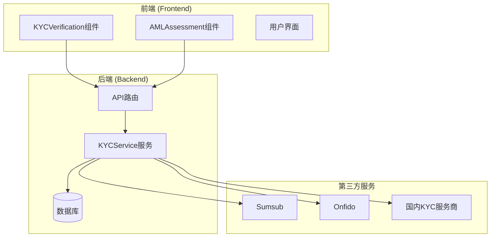
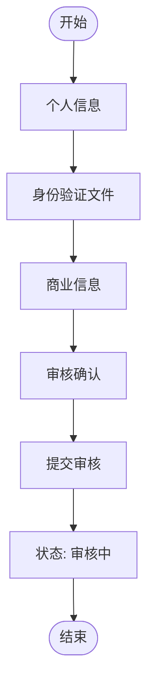
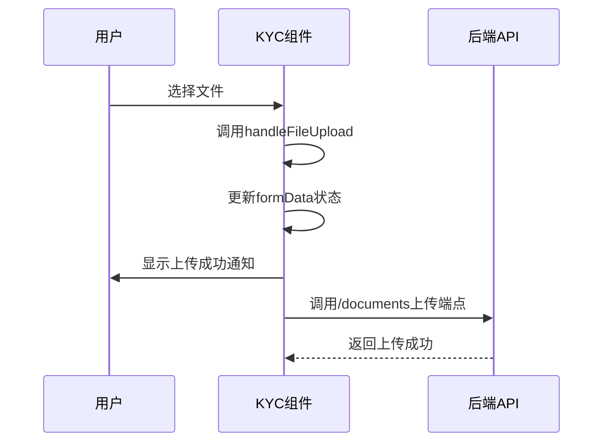
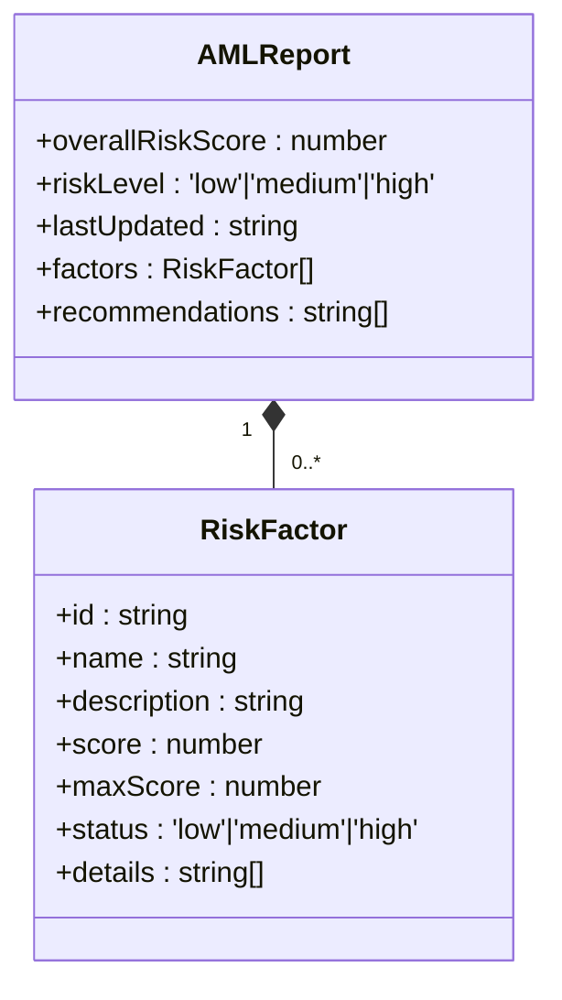
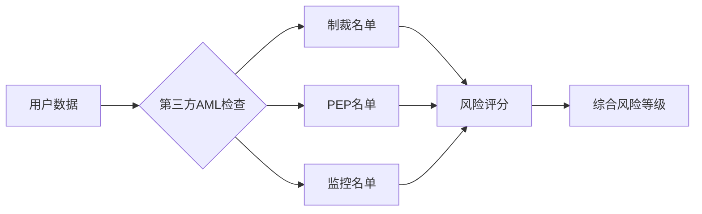
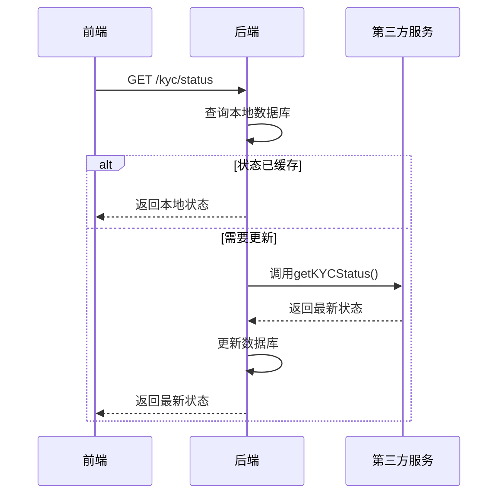
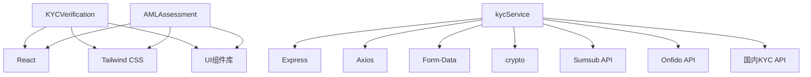

# 合规组件

<cite>
**本文档中引用的文件**  
- [KYCVerification.tsx](file://src/components/Compliance/KYCVerification.tsx)
- [AMLAssessment.tsx](file://src/components/Compliance/AMLAssessment.tsx)
- [kycService.ts](file://backend/src/services/kycService.ts)
- [kyc.ts](file://backend/src/routes/kyc.ts)
</cite>

## 目录
1. [简介](#简介)
2. [项目结构](#项目结构)
3. [核心组件](#核心组件)
4. [架构概述](#架构概述)
5. [详细组件分析](#详细组件分析)
6. [依赖分析](#依赖分析)
7. [性能考虑](#性能考虑)
8. [故障排除指南](#故障排除指南)
9. [结论](#结论)

## 简介
本文档深入解析TriBridge平台的合规组件，重点分析KYCVerification和AMLAssessment两大核心模块。文档详细阐述了KYC多步骤表单流程、文件上传处理机制、数据验证逻辑，以及AML风险评估算法和可疑交易检测机制。同时，文档还剖析了前端组件与后端KYC服务的交互流程，包括身份信息加密传输和审核状态同步机制，并提供了各组件的调用示例、状态管理方案和错误处理模式。

## 项目结构
合规功能主要分布在前端和后端两个部分。前端组件位于`src/components/Compliance/`目录下，包含`KYCVerification.tsx`和`AMLAssessment.tsx`。后端服务位于`backend/src/services/`和`backend/src/routes/`目录下，核心为`kycService.ts`和`kyc.ts`文件，负责与第三方KYC提供商（如Sumsub、Onfido）的集成和业务逻辑处理。

**Section sources**
- [KYCVerification.tsx](file://src/components/Compliance/KYCVerification.tsx)
- [AMLAssessment.tsx](file://src/components/Compliance/AMLAssessment.tsx)
- [kycService.ts](file://backend/src/services/kycService.ts)
- [kyc.ts](file://backend/src/routes/kyc.ts)

## 核心组件
本系统的核心合规组件包括KYCVerification（了解你的客户验证）和AMLAssessment（反洗钱评估）。KYCVerification组件提供了一个多步骤的表单流程，用于收集用户的身份信息、上传验证文件并提交审核。AMLAssessment组件则负责对用户进行风险评估，分析交易模式、地理风险等因素，并生成风险报告。

**Section sources**
- [KYCVerification.tsx](file://src/components/Compliance/KYCVerification.tsx#L21-L517)
- [AMLAssessment.tsx](file://src/components/Compliance/AMLAssessment.tsx#L36-L344)

## 架构概述
系统采用前后端分离的架构。前端通过React组件实现用户界面，后端使用Node.js/Express提供RESTful API。KYC和AML服务通过`kycService`类与多个第三方提供商（Sumsub, Onfido, 国内服务商）进行交互，实现了服务的可插拔性。前端组件通过API路由与后端服务通信，完成数据提交和状态查询。

**Diagram sources**
- [KYCVerification.tsx](file://src/components/Compliance/KYCVerification.tsx)
- [AMLAssessment.tsx](file://src/components/Compliance/AMLAssessment.tsx)
- [kyc.ts](file://backend/src/routes/kyc.ts)
- [kycService.ts](file://backend/src/services/kycService.ts)

## 详细组件分析

### KYCVerification组件分析
该组件实现了完整的KYC身份验证流程，包含个人信息、文件上传、商业信息和审核确认四个步骤。

#### 多步骤表单流程
组件使用`currentStep`状态变量管理当前步骤，并通过`kycSteps`数组定义了四个步骤。用户可以通过“上一步”和“下一步”按钮在步骤间导航。每个步骤的完成状态通过`completed`标志记录，并在顶部显示进度条。

**Diagram sources**
- [KYCVerification.tsx](file://src/components/Compliance/KYCVerification.tsx#L21-L517)

#### 文件上传处理
文件上传通过`handleFileUpload`方法处理，支持三种文件：身份证明、地址证明和自拍照片。文件被存储在`formData.documents`状态中。上传成功后会通过`useToast`显示通知。

**Diagram sources**
- [KYCVerification.tsx](file://src/components/Compliance/KYCVerification.tsx#L21-L517)
- [kyc.ts](file://backend/src/routes/kyc.ts#L65-L89)

#### 数据验证机制
前端在用户输入时进行基本验证（如必填项），但核心验证由后端服务完成。当用户提交申请时，`handleSubmitStep`方法会将`formData`中的数据通过`/submit` API端点发送到后端。后端的`kycService`会对数据进行深度验证，并与第三方服务交互。

**Section sources**
- [KYCVerification.tsx](file://src/components/Compliance/KYCVerification.tsx#L21-L517)
- [kyc.ts](file://backend/src/routes/kyc.ts#L4-L210)
- [kycService.ts](file://backend/src/services/kycService.ts#L133-L149)

### AMLAssessment组件分析
该组件负责展示用户的反洗钱风险评估报告。

#### 风险评估算法
风险评估由后端服务计算，前端组件通过API获取评估结果。评估报告包含多个风险因素，如地理风险、交易模式、交易对手风险和行为分析。每个因素都有独立的评分和状态。

**Diagram sources**
- [AMLAssessment.tsx](file://src/components/Compliance/AMLAssessment.tsx#L36-L344)

#### 可疑交易检测逻辑
可疑交易检测逻辑主要在后端实现。`kycService`会调用第三方提供商的API（如Sumsub的AML检查、Onfido的watchlist_aml报告）来检测用户是否在制裁名单、政治敏感人物（PEP）名单或监控名单上。

**Diagram sources**
- [kycService.ts](file://backend/src/services/kycService.ts#L95-L559)

### 前后端交互流程
前端组件与后端KYC服务通过定义的API路由进行交互。

#### 身份信息加密传输
虽然代码中未直接体现加密细节，但根据行业标准，所有通过`/submit`和`/documents`端点传输的敏感信息（如个人身份信息、文件）都应通过HTTPS进行加密传输。后端服务在处理数据时也会进行必要的安全处理。

#### 审核状态同步
审核状态的同步通过`/status` API端点实现。前端组件在加载时或用户手动刷新时，会调用此端点获取最新的KYC状态。后端服务会查询数据库或第三方提供商的API来获取最新状态。

**Diagram sources**
- [kyc.ts](file://backend/src/routes/kyc.ts#L25-L48)
- [kycService.ts](file://backend/src/services/kycService.ts#L506-L542)

## 依赖分析
系统依赖于多个外部服务和库。前端依赖于React、Tailwind CSS和UI组件库。后端依赖于Express、Axios（用于HTTP请求）、Form-Data（用于文件上传）和crypto（用于签名生成）。核心业务逻辑依赖于第三方KYC提供商（Sumsub, Onfido）的API。

**Diagram sources**
- [package.json](file://package.json)
- [kycService.ts](file://backend/src/services/kycService.ts)

## 性能考虑
- **前端性能**：KYC表单组件使用React状态管理，确保了UI的响应性。文件上传采用异步处理，避免阻塞主线程。
- **后端性能**：`kycService`对第三方API的调用是异步的，避免了阻塞。对于频繁查询的状态，应考虑使用Redis等缓存机制。
- **网络性能**：大文件上传可能影响性能，建议在前端进行文件大小和类型验证，并考虑分块上传。

## 故障排除指南
- **KYC提交失败**：检查`kycService`中的错误日志，确认第三方提供商的API密钥配置正确。
- **文件上传失败**：确认`/documents`端点的文件大小限制，并检查文件类型是否符合要求。
- **状态不同步**：检查`/webhook`端点是否正常接收第三方服务的状态更新通知。
- **AML评估无数据**：确认`getKYCStatus`方法的实现是否完整，特别是`parseSumsubResponse`等解析方法。

**Section sources**
- [kycService.ts](file://backend/src/services/kycService.ts)
- [kyc.ts](file://backend/src/routes/kyc.ts)

## 结论
TriBridge的合规组件设计合理，功能完整。通过模块化的前端组件和可扩展的后端服务，系统能够有效处理KYC验证和AML评估。与多个第三方提供商的集成确保了服务的灵活性和可靠性。未来可进一步完善错误处理和日志记录，以提升系统的可维护性。