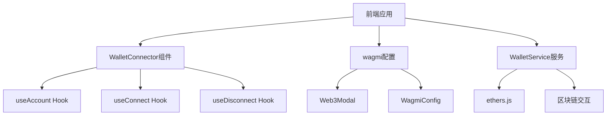
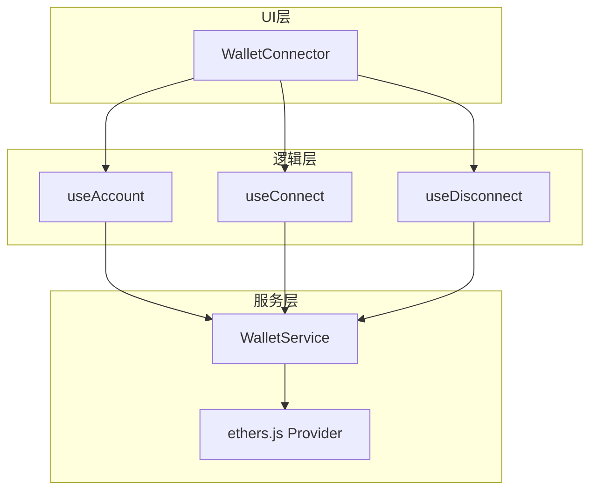
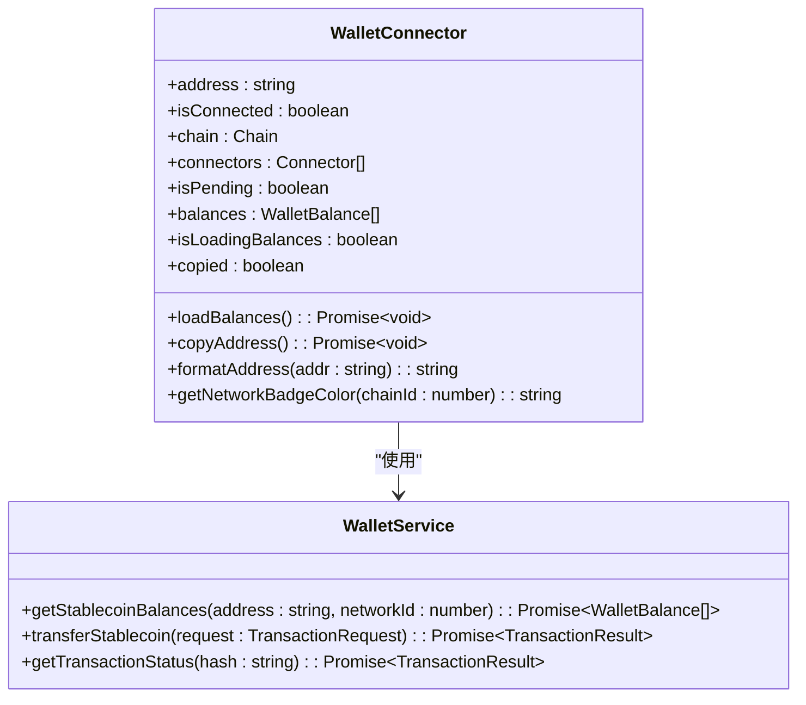
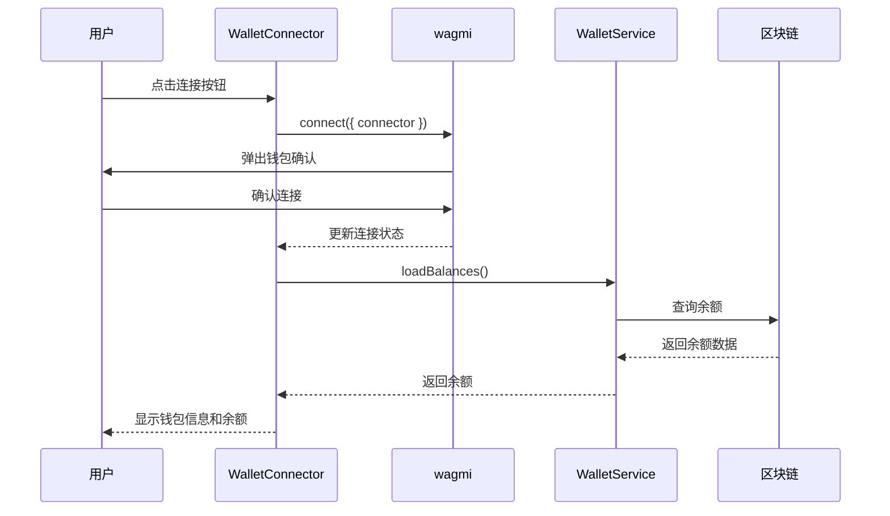
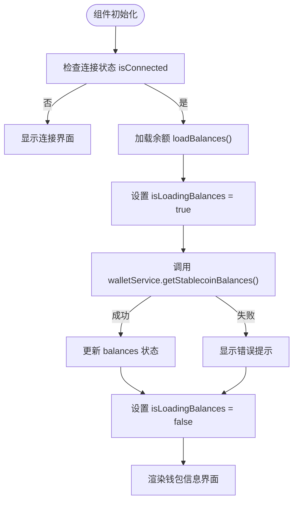
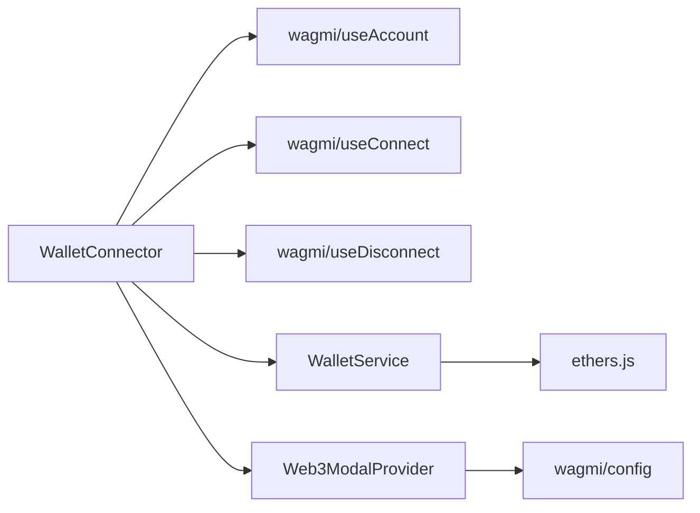

# 多钱包适配器

<cite>
**本文档引用的文件**   
- [WalletConnector.tsx](file://src/components/Wallet/WalletConnector.tsx)
- [wagmi.tsx](file://src/config/wagmi.tsx)
- [walletService.ts](file://src/services/walletService.ts)
</cite>

## 目录
1. [简介](#简介)
2. [项目结构](#项目结构)
3. [核心组件](#核心组件)
4. [架构概述](#架构概述)
5. [详细组件分析](#详细组件分析)
6. [依赖分析](#依赖分析)
7. [性能考虑](#性能考虑)
8. [故障排除指南](#故障排除指南)
9. [结论](#结论)
10. [附录](#附录)（如有必要）

## 简介
本文档深入解析了WalletConnector组件的多钱包适配机制，详细说明其如何通过wagmi的connectors API支持多种钱包（如MetaMask、Trust Wallet等）的连接。文档涵盖了连接器管理逻辑、连接状态检测、加载指示器和错误处理等关键功能。同时，解释了组件的可扩展性设计，以及如何方便地添加新的钱包类型支持。最后，提供了实际集成示例，展示如何配置不同钱包连接器，并说明连接成功后的状态同步机制。

## 项目结构
项目采用典型的React + TypeScript架构，结合Next.js框架构建。核心钱包功能位于`src/components/Wallet/`目录下，其中`WalletConnector.tsx`是主要的多钱包适配组件。钱包连接的配置通过`src/config/wagmi.tsx`文件完成，该文件利用wagmi库和Web3Modal来管理钱包连接器。钱包服务逻辑（如余额查询）则封装在`src/services/walletService.ts`中。

**图表来源**
- [WalletConnector.tsx](file://src/components/Wallet/WalletConnector.tsx#L16-L241)
- [wagmi.tsx](file://src/config/wagmi.tsx#L1-L79)
- [walletService.ts](file://src/services/walletService.ts#L1-L269)

**章节来源**
- [WalletConnector.tsx](file://src/components/Wallet/WalletConnector.tsx#L1-L241)
- [wagmi.tsx](file://src/config/wagmi.tsx#L1-L79)

## 核心组件
`WalletConnector`组件是整个多钱包适配系统的核心。它利用wagmi提供的`useAccount`、`useConnect`和`useDisconnect`等Hook来管理钱包的连接状态。当用户未连接钱包时，组件会渲染一个连接界面，列出所有可用的钱包连接器。一旦连接成功，组件会显示钱包信息（地址、网络）和稳定币余额。

**章节来源**
- [WalletConnector.tsx](file://src/components/Wallet/WalletConnector.tsx#L16-L241)

## 架构概述
整个多钱包适配系统基于wagmi库构建，采用分层架构。最上层是UI组件`WalletConnector`，负责用户交互和状态展示。中间层是wagmi提供的React Hook，作为UI与底层区块链交互的桥梁。底层是`WalletService`服务，封装了与区块链网络的具体交互逻辑，如查询余额等。

**图表来源**
- [WalletConnector.tsx](file://src/components/Wallet/WalletConnector.tsx#L16-L241)
- [walletService.ts](file://src/services/walletService.ts#L1-L269)

## 详细组件分析

### WalletConnector组件分析
`WalletConnector`组件通过`useConnect` Hook获取`connectors`列表，动态渲染所有可用的钱包选项。每个连接器按钮点击时，调用`connect`函数并传入对应的`connector`实例，触发钱包连接流程。连接过程中的加载状态由`isPending`变量控制，显示旋转动画。

#### 对象导向组件：

**图表来源**
- [WalletConnector.tsx](file://src/components/Wallet/WalletConnector.tsx#L16-L241)
- [walletService.ts](file://src/services/walletService.ts#L1-L269)

#### API/服务组件：

**图表来源**
- [WalletConnector.tsx](file://src/components/Wallet/WalletConnector.tsx#L16-L241)
- [walletService.ts](file://src/services/walletService.ts#L78-L113)

#### 复杂逻辑组件：

**图表来源**
- [WalletConnector.tsx](file://src/components/Wallet/WalletConnector.tsx#L16-L241)
- [walletService.ts](file://src/services/walletService.ts#L78-L113)

**章节来源**
- [WalletConnector.tsx](file://src/components/Wallet/WalletConnector.tsx#L16-L241)
- [walletService.ts](file://src/services/walletService.ts#L78-L113)

### 可扩展性设计
组件的可扩展性主要体现在wagmi配置层面。通过在`wagmi.tsx`中配置`createWeb3Modal`，可以轻松添加新的钱包支持。Web3Modal会自动集成WalletConnect、MetaMask等主流钱包，并提供统一的连接界面。添加新钱包通常只需在配置中注册相应的连接器，无需修改`WalletConnector`组件本身。

**章节来源**
- [wagmi.tsx](file://src/config/wagmi.tsx#L1-L79)

## 依赖分析
`WalletConnector`组件依赖于多个关键库和文件。它直接依赖wagmi库提供的React Hook来管理钱包状态，依赖`WalletService`来获取区块链数据，并通过`Web3ModalProvider`获得wagmi配置。`WalletService`则依赖ethers.js与区块链网络进行交互。

**图表来源**
- [WalletConnector.tsx](file://src/components/Wallet/WalletConnector.tsx#L16-L241)
- [wagmi.tsx](file://src/config/wagmi.tsx#L67-L79)
- [walletService.ts](file://src/services/walletService.ts#L1-L269)

**章节来源**
- [WalletConnector.tsx](file://src/components/Wallet/WalletConnector.tsx#L16-L241)
- [wagmi.tsx](file://src/config/wagmi.tsx#L1-L79)
- [walletService.ts](file://src/services/walletService.ts#L1-L269)

## 性能考虑
组件在性能方面做了合理优化。余额查询操作被封装在`loadBalances`函数中，并通过`isLoadingBalances`状态控制加载指示器，避免了不必要的重复请求。使用`useEffect`监听连接状态变化，确保只在连接成功后才加载余额数据。错误处理机制完善，捕获异常并提供用户友好的错误提示，保证了应用的稳定性。

## 故障排除指南
常见问题包括钱包连接失败、余额无法加载等。连接失败通常与用户未安装钱包插件或拒绝连接请求有关。余额加载失败可能由于网络问题或RPC节点不可用导致。建议检查钱包插件是否正常运行，确认网络连接状态，并查看浏览器控制台日志获取详细错误信息。

**章节来源**
- [WalletConnector.tsx](file://src/components/Wallet/WalletConnector.tsx#L16-L241)
- [walletService.ts](file://src/services/walletService.ts#L78-L113)

## 结论
`WalletConnector`组件通过集成wagmi和Web3Modal，实现了强大且灵活的多钱包适配功能。其清晰的分层架构和良好的可扩展性设计，使得添加新钱包支持变得简单高效。组件不仅提供了完整的连接、断开、状态检测功能，还集成了余额查询等实用功能，为用户提供了一站式的钱包管理体验。