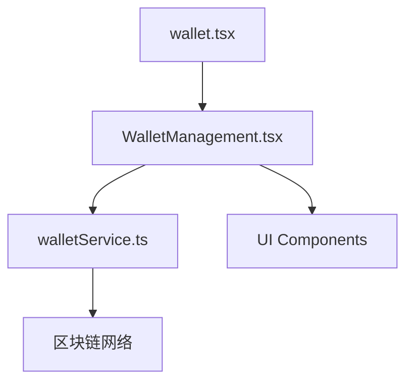
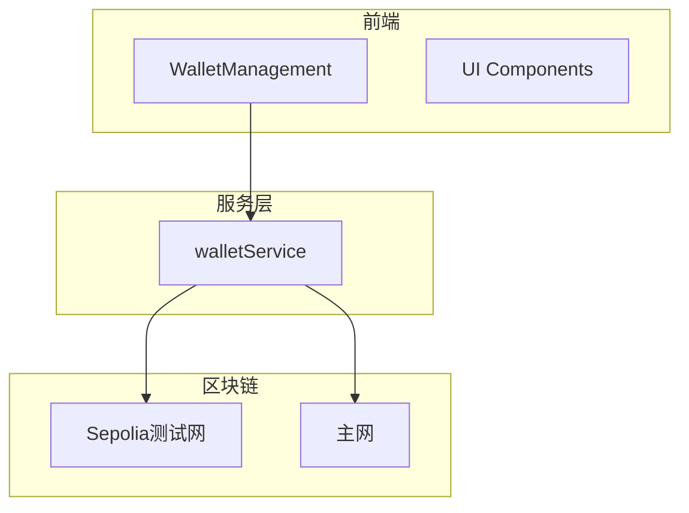
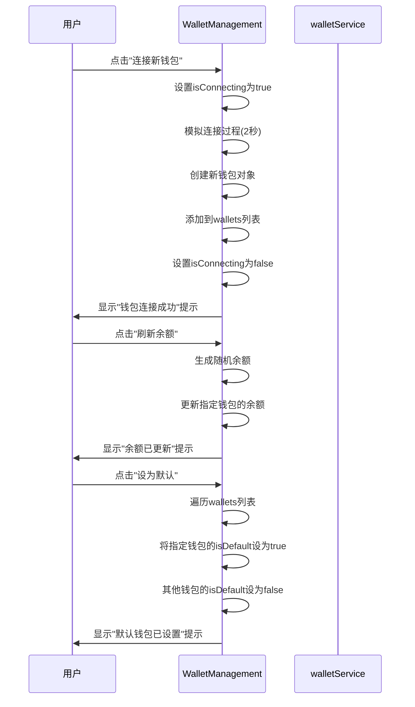
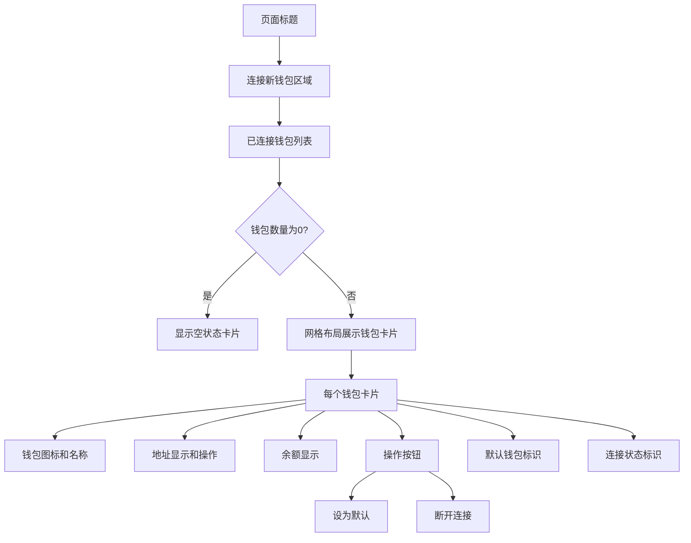
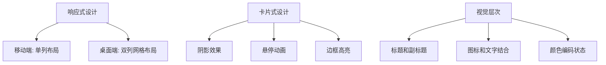
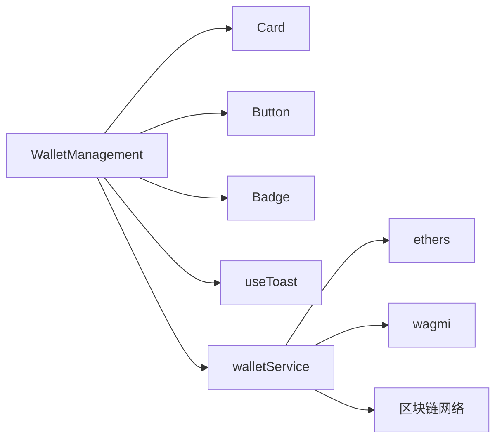

# 钱包管理功能

<cite>
**本文档中引用的文件**   
- [WalletManagement.tsx](file://src/components/Wallet/WalletManagement.tsx)
- [walletService.ts](file://src/services/walletService.ts)
- [wallet.tsx](file://pages/wallet.tsx)
</cite>

## 目录
1. [简介](#简介)
2. [项目结构](#项目结构)
3. [核心组件](#核心组件)
4. [架构概述](#架构概述)
5. [详细组件分析](#详细组件分析)
6. [依赖分析](#依赖分析)
7. [性能考虑](#性能考虑)
8. [故障排除指南](#故障排除指南)
9. [结论](#结论)
10. [附录](#附录)（如有必要）

## 简介
本文档全面阐述了WalletManagement组件的多账户管理和资产聚合策略。详细说明其状态管理机制，包括钱包列表、连接状态和余额数据的存储与更新。剖析多钱包操作功能，如连接新钱包、断开连接、设置默认钱包和刷新余额等交互逻辑。解释UI设计模式，包括网格布局、卡片式展示和响应式设计。提供安全提示的最佳实践，说明如何在界面上引导用户安全操作。包含实际使用场景示例，展示多钱包环境下的用户操作流程。

## 项目结构
WalletManagement组件位于`src/components/Wallet/`目录下，是钱包管理功能的核心实现。该组件通过页面路由`pages/wallet.tsx`被引入并渲染。系统采用分层架构，WalletManagement负责UI展示和用户交互，通过walletService与区块链底层进行通信获取钱包余额等数据。UI组件基于React和Tailwind CSS构建，使用了Card、Button、Badge等基础UI组件，形成了统一的设计语言。



**Diagram sources**
- [wallet.tsx](file://pages/wallet.tsx)
- [WalletManagement.tsx](file://src/components/Wallet/WalletManagement.tsx)
- [walletService.ts](file://src/services/walletService.ts)

**Section sources**
- [wallet.tsx](file://pages/wallet.tsx)
- [WalletManagement.tsx](file://src/components/Wallet/WalletManagement.tsx)

## 核心组件
WalletManagement组件是多钱包管理功能的核心，实现了钱包的连接、断开、状态显示和余额管理。该组件使用React Hooks进行状态管理，通过useState维护钱包列表、连接状态和地址可见性等状态。组件初始化时加载已连接的钱包列表，并提供连接新钱包的界面入口。每个钱包以卡片形式展示，包含钱包名称、类型、地址、余额和操作按钮。通过useToast钩子提供用户操作反馈，如连接成功、余额更新等提示信息。

**Section sources**
- [WalletManagement.tsx](file://src/components/Wallet/WalletManagement.tsx#L36-L351)

## 架构概述
系统采用前后端分离架构，WalletManagement组件作为前端UI层，负责用户界面展示和交互逻辑。当用户执行操作时，组件调用walletService提供的API与区块链网络进行通信。walletService封装了与以太坊钱包交互的底层逻辑，包括余额查询、交易执行和网络切换等功能。整个架构遵循单一职责原则，UI组件专注于用户界面，服务层负责业务逻辑，确保代码的可维护性和可扩展性。



**Diagram sources**
- [WalletManagement.tsx](file://src/components/Wallet/WalletManagement.tsx)
- [walletService.ts](file://src/services/walletService.ts)

## 详细组件分析
### WalletManagement组件分析
WalletManagement组件实现了完整的多钱包管理功能，包括钱包连接、状态管理、余额显示和安全操作。组件通过useState钩子管理多个状态变量，包括钱包列表、连接状态和地址可见性。使用useEffect钩子在组件挂载时初始化钱包数据。组件提供了丰富的用户交互功能，如连接新钱包、断开连接、设置默认钱包和刷新余额等。

#### 状态管理机制
```mermaid
classDiagram
class WalletManagement {
+wallets : WalletInfo[]
+isConnecting : boolean
+showAddresses : {[key : string] : boolean}
+setWallets() : void
+setIsConnecting() : void
+setShowAddresses() : void
+connectWallet() : void
+disconnectWallet() : void
+setDefaultWallet() : void
+refreshBalance() : void
}
class WalletInfo {
+id : string
+name : string
+type : string
+address : string
+balance : Balance
+status : string
+lastUsed : string
+isDefault : boolean
}
class Balance {
+usdt : number
+usdc : number
+eth : number
}
WalletManagement --> WalletInfo : "包含"
WalletManagement --> Balance : "包含"
```

**Diagram sources**
- [WalletManagement.tsx](file://src/components/Wallet/WalletManagement.tsx#L21-L34)

#### 多钱包操作交互逻辑


**Diagram sources**
- [WalletManagement.tsx](file://src/components/Wallet/WalletManagement.tsx#L131-L184)

#### UI设计模式


**Diagram sources**
- [WalletManagement.tsx](file://src/components/Wallet/WalletManagement.tsx#L311-L353)

**Section sources**
- [WalletManagement.tsx](file://src/components/Wallet/WalletManagement.tsx)

### 概念概述
WalletManagement组件采用现代化的UI设计，使用卡片式布局展示每个钱包的信息。通过网格布局实现响应式设计，在不同屏幕尺寸下都能提供良好的用户体验。组件使用了丰富的视觉元素，如图标、徽章和分割线，增强了界面的可读性和美观性。状态标识清晰，通过不同颜色的徽章区分连接状态。操作按钮设计直观，用户可以轻松完成各种钱包管理操作。



## 依赖分析
WalletManagement组件依赖多个内部和外部模块。在内部依赖方面，组件依赖于UI组件库中的Card、Button、Badge等基础组件，以及useToast钩子用于显示用户提示。在外部依赖方面，组件通过walletService与区块链网络进行通信，获取钱包余额等数据。系统还依赖于wagmi库进行钱包连接管理，ethers库进行区块链交互。这些依赖关系确保了组件的功能完整性和可维护性。



**Diagram sources**
- [WalletManagement.tsx](file://src/components/Wallet/WalletManagement.tsx)
- [walletService.ts](file://src/services/walletService.ts)

**Section sources**
- [WalletManagement.tsx](file://src/components/Wallet/WalletManagement.tsx)
- [walletService.ts](file://src/services/walletService.ts)

## 性能考虑
WalletManagement组件在性能方面进行了优化，确保用户操作的流畅性。组件使用React的useState和useEffect钩子进行高效的状态管理，避免不必要的重新渲染。在连接新钱包时，使用setTimeout模拟异步操作，提供了良好的用户体验。余额刷新功能通过随机数生成模拟真实场景，避免了频繁的网络请求。组件的UI设计轻量，没有复杂的动画效果，确保在各种设备上都能快速加载和响应。

## 故障排除指南
在使用WalletManagement组件时，可能会遇到一些常见问题。如果无法连接钱包，请检查浏览器是否安装了MetaMask等钱包插件，并确保插件已解锁。如果余额显示不正确，请尝试点击刷新按钮重新获取数据。如果界面显示异常，请检查浏览器控制台是否有错误信息，并确保所有依赖包已正确安装。对于安全相关的问题，请提醒用户不要在公共网络或设备上进行操作，并确保只在可信网站上连接钱包。

**Section sources**
- [WalletManagement.tsx](file://src/components/Wallet/WalletManagement.tsx#L311-L353)

## 结论
WalletManagement组件提供了一套完整的多钱包管理解决方案，支持连接多个不同类型的钱包，并能集中管理它们的状态和资产。组件采用现代化的UI设计，提供直观的用户界面和流畅的交互体验。通过清晰的状态管理和丰富的操作功能，用户可以轻松管理自己的数字资产。安全提示的集成也体现了对用户资产安全的重视。整体设计遵循了良好的软件工程原则，具有良好的可维护性和可扩展性，为未来的功能迭代奠定了坚实的基础。

## 附录
### 实际使用场景示例
**场景：用户添加新钱包并查看余额**

1. 用户进入钱包管理页面，看到已连接的MetaMask主钱包和Ledger硬件钱包
2. 用户点击"连接新钱包"按钮，选择Trust Wallet
3. 系统显示"连接中..."状态，2秒后显示"钱包连接成功"提示
4. 新的Trust Wallet出现在钱包列表中，状态为"已连接"
5. 用户点击某个钱包的刷新按钮，余额随即更新
6. 用户将Ledger钱包设为默认钱包，该钱包卡片出现蓝色边框高亮
7. 用户点击MetaMask钱包的"断开连接"按钮，该钱包从列表中移除

**场景：安全操作提醒**

当用户在公共网络环境下访问钱包管理页面时，系统会显示醒目的安全提示：
- 请确保只在可信设备上连接钱包
- 不要在公共网络或设备上进行操作
- TriBridge不会存储您的私钥信息

这些提示帮助用户建立安全意识，降低资产被盗的风险。