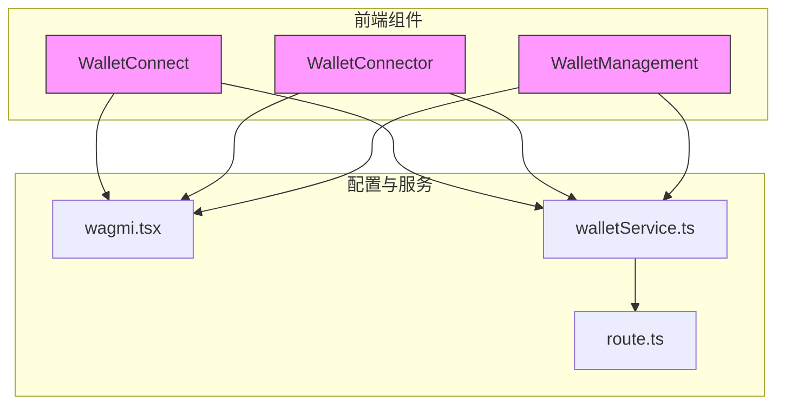
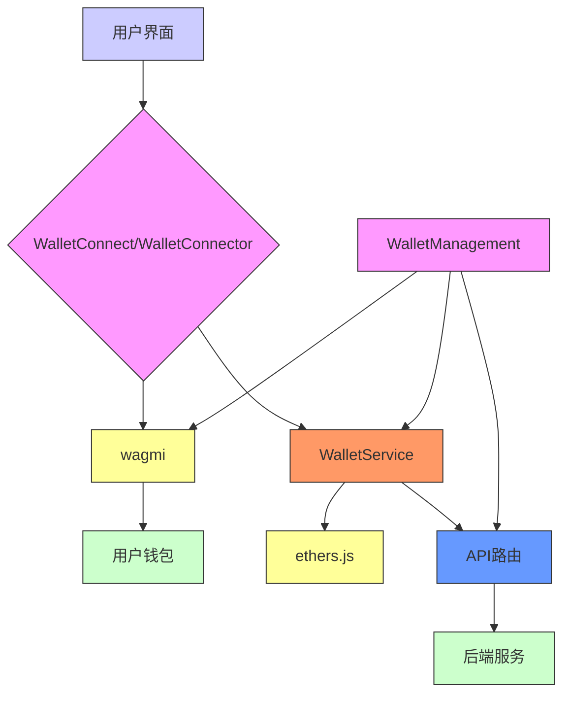
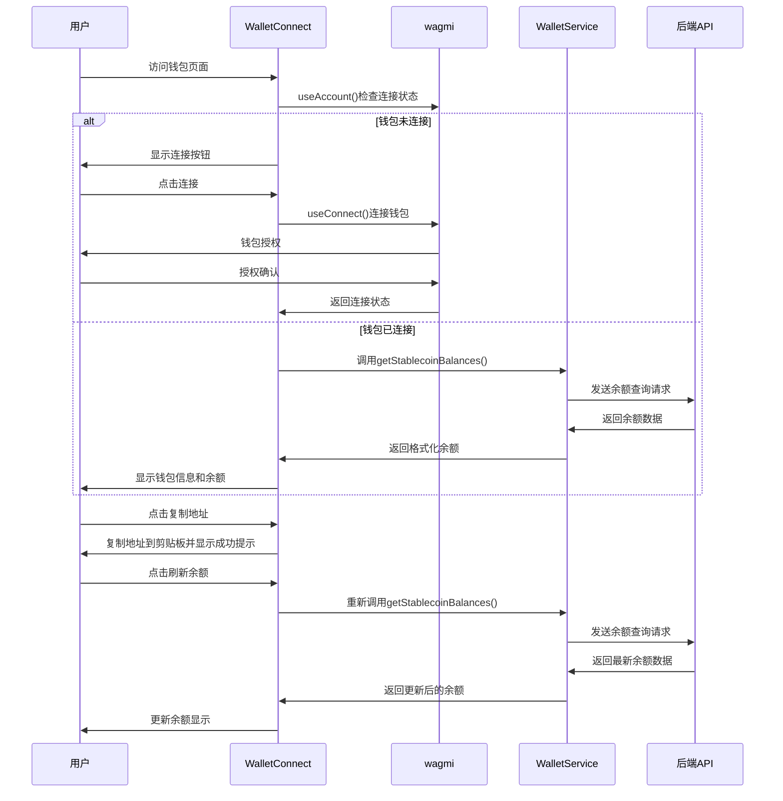
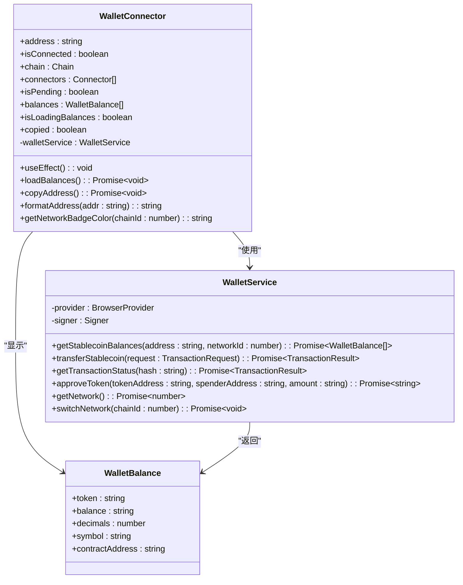
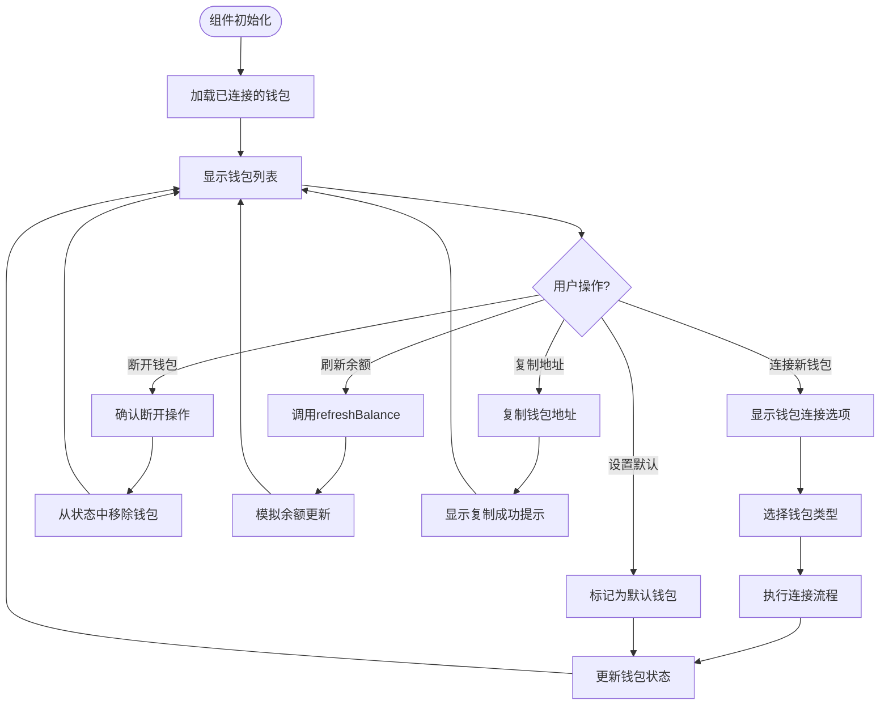
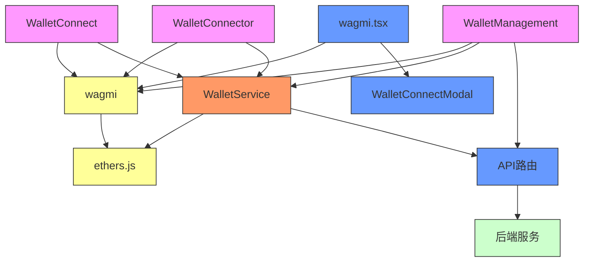

# 钱包组件

<cite>
**本文档中引用的文件**   
- [WalletConnect.tsx](file://src/components/Wallet/WalletConnect.tsx)
- [WalletConnector.tsx](file://src/components/Wallet/WalletConnector.tsx)
- [WalletManagement.tsx](file://src/components/Wallet/WalletManagement.tsx)
- [wagmi.tsx](file://src/config/wagmi.tsx)
- [walletService.ts](file://src/services/walletService.ts)
- [route.ts](file://src/app/api/wallet/balances/route.ts)
</cite>

## 目录
1. [简介](#简介)
2. [项目结构](#项目结构)
3. [核心组件](#核心组件)
4. [架构概述](#架构概述)
5. [详细组件分析](#详细组件分析)
6. [依赖分析](#依赖分析)
7. [性能考虑](#性能考虑)
8. [故障排除指南](#故障排除指南)
9. [结论](#结论)

## 简介
本文档深入解析TriBridge钱包组件的实现机制，重点阐述WalletConnect、WalletConnector和WalletManagement三大核心组件的功能与交互。文档详细说明了如何通过wagmi集成Web3钱包，实现连接状态管理、地址复制和余额查询功能。同时剖析了多钱包适配机制、连接器管理逻辑、多账户管理策略以及资产聚合方案。通过调用示例、状态管理方案和错误处理模式的说明，全面揭示各组件与后端API服务的交互细节，包括余额同步和网络切换处理。

## 项目结构
TriBridge钱包组件位于`src/components/Wallet/`目录下，包含三个主要组件：WalletConnect、WalletConnector和WalletManagement。这些组件通过wagmi库与Web3钱包集成，并利用自定义的WalletService进行余额查询和交易处理。配置文件`wagmi.tsx`定义了支持的区块链网络，而API路由`route.ts`提供了后端余额查询接口。

**图示来源**
- [WalletConnect.tsx](file://src/components/Wallet/WalletConnect.tsx)
- [WalletConnector.tsx](file://src/components/Wallet/WalletConnector.tsx)
- [WalletManagement.tsx](file://src/components/Wallet/WalletManagement.tsx)
- [wagmi.tsx](file://src/config/wagmi.tsx)
- [walletService.ts](file://src/services/walletService.ts)
- [route.ts](file://src/app/api/wallet/balances/route.ts)

**本节来源**
- [src/components/Wallet/](file://src/components/Wallet/)
- [src/config/wagmi.tsx](file://src/config/wagmi.tsx)
- [src/services/walletService.ts](file://src/services/walletService.ts)

## 核心组件
TriBridge钱包系统由三个核心组件构成：WalletConnect负责基础钱包连接和余额查询，WalletConnector提供多钱包适配功能，WalletManagement实现多账户管理和资产聚合。这些组件共同构建了一个完整的钱包管理解决方案，支持用户连接、管理多个Web3钱包，并查看跨链资产余额。

**本节来源**
- [WalletConnect.tsx](file://src/components/Wallet/WalletConnect.tsx#L16-L241)
- [WalletConnector.tsx](file://src/components/Wallet/WalletConnector.tsx#L16-L241)
- [WalletManagement.tsx](file://src/components/Wallet/WalletManagement.tsx#L36-L351)

## 架构概述
TriBridge钱包组件采用分层架构设计，前端组件通过wagmi库与用户钱包交互，利用WalletService封装底层区块链操作，并通过API路由与后端服务通信。这种架构实现了关注点分离，前端专注于用户界面和交互，WalletService处理区块链逻辑，后端API提供数据验证和安全控制。

**图示来源**
- [WalletConnect.tsx](file://src/components/Wallet/WalletConnect.tsx)
- [WalletConnector.tsx](file://src/components/Wallet/WalletConnector.tsx)
- [WalletManagement.tsx](file://src/components/Wallet/WalletManagement.tsx)
- [wagmi.tsx](file://src/config/wagmi.tsx)
- [walletService.ts](file://src/services/walletService.ts)
- [route.ts](file://src/app/api/wallet/balances/route.ts)

## 详细组件分析
本节深入分析TriBridge钱包系统的三个核心组件：WalletConnect、WalletConnector和WalletManagement。每个组件都有其特定的职责和功能，共同构建了一个完整的钱包管理解决方案。通过详细解析各组件的实现细节、状态管理方案和错误处理模式，全面揭示其工作原理和交互机制。

### WalletConnect组件分析
WalletConnect组件是TriBridge钱包系统的基础连接组件，负责处理钱包连接状态管理、地址复制和余额查询功能。该组件利用wagmi库的useAccount、useConnect和useDisconnect钩子来管理钱包连接状态，并通过WalletService获取用户稳定币余额。

**图示来源**
- [WalletConnect.tsx](file://src/components/Wallet/WalletConnect.tsx#L16-L241)
- [walletService.ts](file://src/services/walletService.ts#L78-L113)
- [route.ts](file://src/app/api/wallet/balances/route.ts)

**本节来源**
- [WalletConnect.tsx](file://src/components/Wallet/WalletConnect.tsx#L16-L241)

### WalletConnector组件分析
WalletConnector组件实现了多钱包适配机制和连接器管理逻辑，允许用户连接多种Web3钱包。该组件与WalletConnect具有相似的UI和功能，但更侧重于展示和管理多个钱包连接器，提供统一的钱包连接界面。

**图示来源**
- [WalletConnector.tsx](file://src/components/Wallet/WalletConnector.tsx#L16-L241)
- [walletService.ts](file://src/services/walletService.ts)
- [walletService.ts](file://src/services/walletService.ts#L78-L113)

**本节来源**
- [WalletConnector.tsx](file://src/components/Wallet/WalletConnector.tsx#L16-L241)

### WalletManagement组件分析
WalletManagement组件提供了高级钱包管理功能，包括多账户管理、资产聚合和默认钱包设置。该组件允许用户连接多个钱包，查看所有钱包的汇总信息，并在不同钱包之间切换。

**图示来源**
- [WalletManagement.tsx](file://src/components/Wallet/WalletManagement.tsx#L36-L351)
- [use-toast.ts](file://src/hooks/use-toast.ts)

**本节来源**
- [WalletManagement.tsx](file://src/components/Wallet/WalletManagement.tsx#L36-L351)

## 依赖分析
TriBridge钱包组件依赖于多个关键库和服务，形成了一个完整的依赖链。核心依赖包括wagmi库用于钱包连接，ethers.js用于区块链交互，以及Next.js API路由用于后端通信。这些依赖关系确保了组件能够安全、高效地与Web3钱包和区块链网络交互。

**图示来源**
- [WalletConnect.tsx](file://src/components/Wallet/WalletConnect.tsx)
- [WalletConnector.tsx](file://src/components/Wallet/WalletConnector.tsx)
- [WalletManagement.tsx](file://src/components/Wallet/WalletManagement.tsx)
- [wagmi.tsx](file://src/config/wagmi.tsx)
- [walletService.ts](file://src/services/walletService.ts)
- [route.ts](file://src/app/api/wallet/balances/route.ts)

**本节来源**
- [package.json](file://package.json)
- [WalletConnect.tsx](file://src/components/Wallet/WalletConnect.tsx)
- [WalletConnector.tsx](file://src/components/Wallet/WalletConnector.tsx)
- [WalletManagement.tsx](file://src/components/Wallet/WalletManagement.tsx)

## 性能考虑
TriBridge钱包组件在性能方面进行了多项优化，包括余额查询的防抖处理、连接状态的高效管理以及UI渲染的优化。组件使用useEffect钩子在钱包连接状态变化时自动加载余额，避免了不必要的重复查询。同时，通过状态管理减少重新渲染，确保用户界面的流畅性。

## 故障排除指南
当遇到钱包连接问题时，首先检查浏览器钱包扩展是否已安装并启用。对于余额无法加载的问题，确认当前网络是否支持，并检查API端点是否正常工作。如果遇到网络切换错误，确保钱包支持目标网络或已正确添加自定义网络配置。所有错误都通过toast通知用户，便于快速识别和解决问题。

**本节来源**
- [WalletConnect.tsx](file://src/components/Wallet/WalletConnect.tsx#L16-L241)
- [walletService.ts](file://src/services/walletService.ts)
- [route.ts](file://src/app/api/wallet/balances/route.ts)

## 结论
TriBridge钱包组件通过精心设计的架构和实现，提供了一个功能完整、用户体验良好的Web3钱包管理解决方案。WalletConnect和WalletConnector组件实现了基础的钱包连接和余额查询功能，而WalletManagement组件则提供了高级的多账户管理能力。通过wagmi库的集成，组件能够支持多种Web3钱包，同时利用WalletService封装了复杂的区块链操作，确保了代码的可维护性和可扩展性。整体方案充分考虑了安全性、性能和用户体验，为跨链稳定币支付平台提供了坚实的基础。