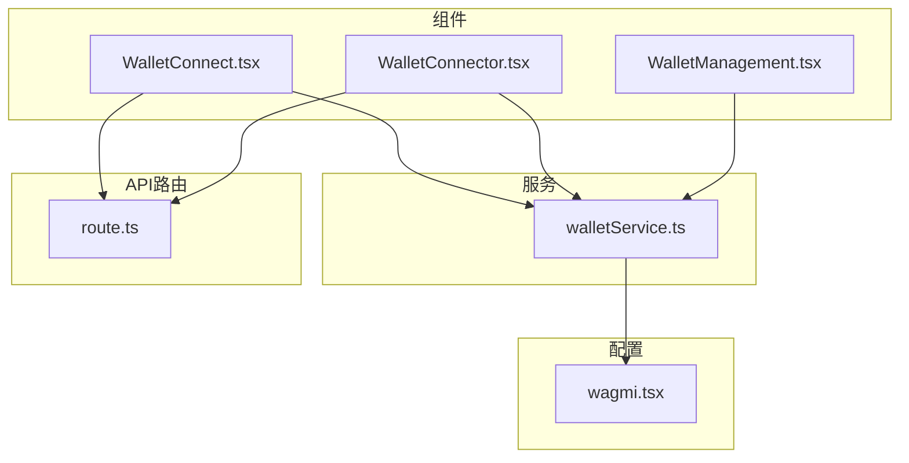
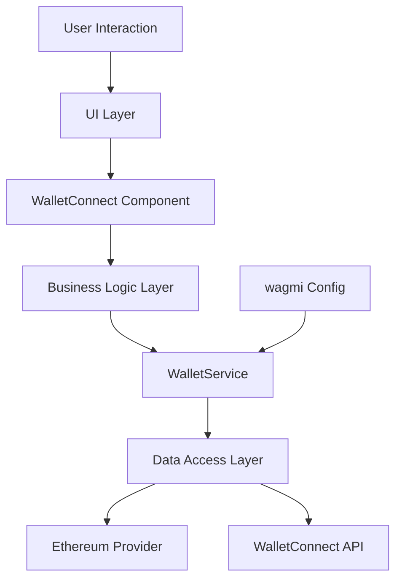
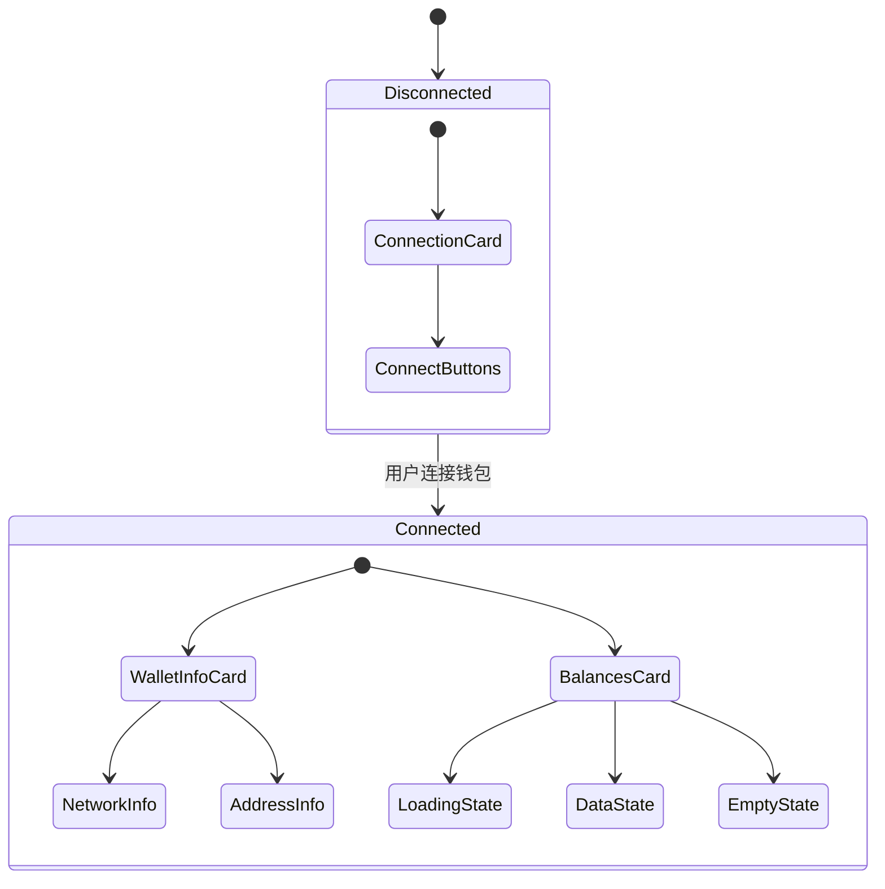
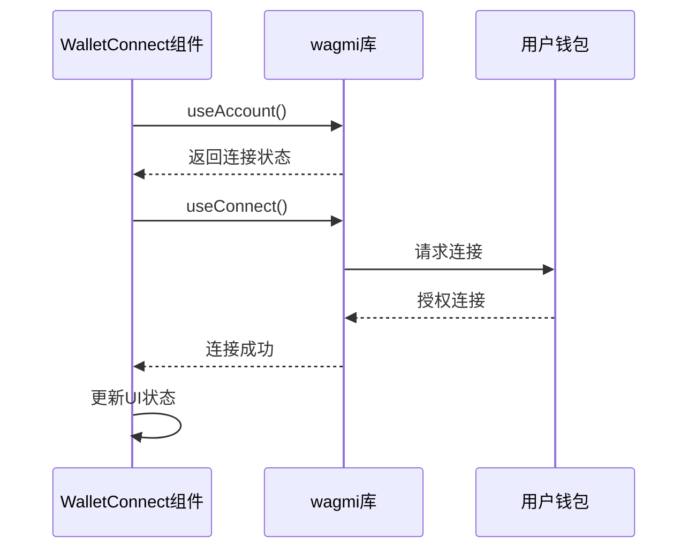
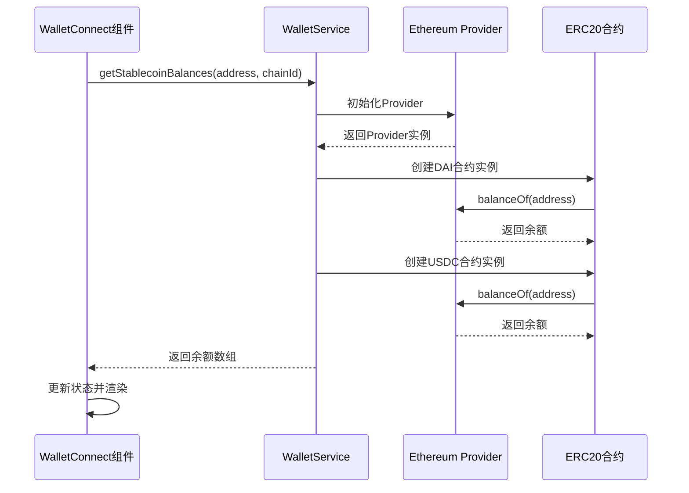
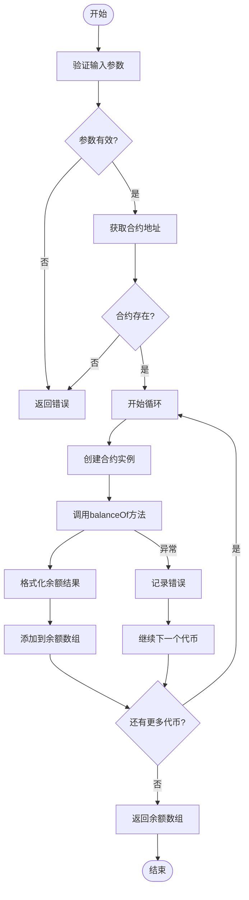
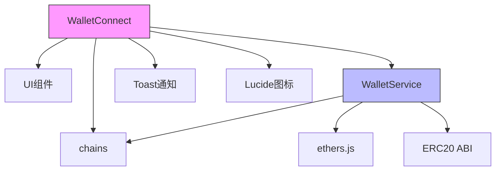
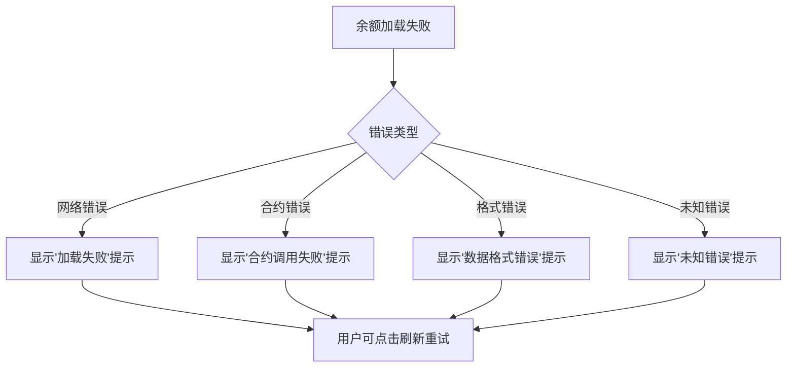

# 钱包连接组件

<cite>
**Referenced Files in This Document**   
- [WalletConnect.tsx](file://src/components/Wallet/WalletConnect.tsx)
- [walletService.ts](file://src/services/walletService.ts)
- [wagmi.tsx](file://src/config/wagmi.tsx)
- [WalletConnector.tsx](file://src/components/Wallet/WalletConnector.tsx)
- [WalletManagement.tsx](file://src/components/Wallet/WalletManagement.tsx)
- [route.ts](file://src/app/api/wallet/balances/route.ts)
</cite>

## 目录
1. [简介](#简介)
2. [项目结构](#项目结构)
3. [核心组件](#核心组件)
4. [架构概述](#架构概述)
5. [详细组件分析](#详细组件分析)
6. [依赖分析](#依赖分析)
7. [性能考虑](#性能考虑)
8. [故障排除指南](#故障排除指南)
9. [结论](#结论)

## 简介

钱包连接组件是TriBridge平台的核心功能模块，负责实现Web3钱包的集成与管理。该组件通过wagmi库与用户钱包进行交互，提供连接状态管理、地址复制和稳定币余额查询等关键功能。组件设计遵循现代Web3应用的最佳实践，确保用户能够安全、便捷地连接其数字钱包并查看资产信息。

## 项目结构

钱包连接功能分布在多个目录中，形成了清晰的架构层次。核心组件位于`src/components/Wallet/`目录下，服务逻辑在`src/services/`中实现，而Web3配置则在`src/config/`中定义。

**Diagram sources**
- [WalletConnect.tsx](file://src/components/Wallet/WalletConnect.tsx)
- [walletService.ts](file://src/services/walletService.ts)
- [wagmi.tsx](file://src/config/wagmi.tsx)
- [route.ts](file://src/app/api/wallet/balances/route.ts)

**Section sources**
- [WalletConnect.tsx](file://src/components/Wallet/WalletConnect.tsx)
- [walletService.ts](file://src/services/walletService.ts)
- [wagmi.tsx](file://src/config/wagmi.tsx)

## 核心组件

钱包连接组件实现了完整的Web3钱包集成流程，包括连接前的引导界面和连接后的信息展示。组件通过wagmi库的`useAccount`、`useConnect`和`useDisconnect`钩子管理钱包连接状态，并利用`WalletService`获取用户资产信息。

组件的主要功能包括：
- 钱包连接与断开连接
- 钱包地址复制到剪贴板
- 网络信息显示
- 稳定币余额查询与展示
- 响应式设计适配不同设备

**Section sources**
- [WalletConnect.tsx](file://src/components/Wallet/WalletConnect.tsx#L16-L241)
- [WalletConnector.tsx](file://src/components/Wallet/WalletConnector.tsx#L16-L241)

## 架构概述

钱包连接组件采用分层架构设计，将UI展示、业务逻辑和数据访问分离。这种设计模式提高了代码的可维护性和可测试性。

**Diagram sources**
- [WalletConnect.tsx](file://src/components/Wallet/WalletConnect.tsx#L16-L241)
- [walletService.ts](file://src/services/walletService.ts#L1-L270)
- [wagmi.tsx](file://src/config/wagmi.tsx#L1-L80)

## 详细组件分析

### WalletConnect组件分析

WalletConnect组件是用户与Web3钱包交互的主要界面，实现了完整的连接流程和资产展示功能。

#### UI结构设计

组件的UI设计分为两个主要状态：连接前和连接后。

**Diagram sources**
- [WalletConnect.tsx](file://src/components/Wallet/WalletConnect.tsx#L16-L241)

#### 连接状态管理

组件通过wagmi库的钩子函数管理钱包连接状态，实现了响应式的UI更新。

**Diagram sources**
- [WalletConnect.tsx](file://src/components/Wallet/WalletConnect.tsx#L16-L241)

### WalletService服务分析

WalletService服务负责与区块链网络交互，获取用户钱包的稳定币余额。

#### 与WalletService服务的交互流程

组件通过WalletService服务获取用户资产信息，实现了安全的数据访问。

**Diagram sources**
- [WalletConnect.tsx](file://src/components/Wallet/WalletConnect.tsx#L16-L241)
- [walletService.ts](file://src/services/walletService.ts#L1-L270)

#### getStablecoinBalances方法调用过程

`getStablecoinBalances`方法是获取用户稳定币余额的核心方法，通过与ERC20合约交互实现。

**Diagram sources**
- [walletService.ts](file://src/services/walletService.ts#L1-L270)

## 依赖分析

钱包连接组件依赖多个外部库和内部模块，形成了复杂的依赖关系网络。

**Diagram sources**
- [WalletConnect.tsx](file://src/components/Wallet/WalletConnect.tsx#L16-L241)
- [walletService.ts](file://src/services/walletService.ts#L1-L270)
- [wagmi.tsx](file://src/config/wagmi.tsx#L1-L80)

## 性能考虑

钱包连接组件在设计时考虑了多项性能优化措施：

1. **懒加载**: 只有在用户连接钱包后才加载余额数据
2. **状态管理**: 使用React的useState和useEffect进行高效的状态更新
3. **错误处理**: 异常捕获避免组件崩溃
4. **加载状态**: 提供骨架屏提升用户体验
5. **网络优化**: 并行查询多个代币余额

这些优化确保了组件在不同网络条件下的流畅运行。

## 故障排除指南

### 错误处理机制

组件实现了完善的错误处理机制，确保用户能够获得清晰的反馈。

**Diagram sources**
- [WalletConnect.tsx](file://src/components/Wallet/WalletConnect.tsx#L16-L241)
- [walletService.ts](file://src/services/walletService.ts#L1-L270)

### 常见问题

1. **无法连接钱包**: 检查浏览器是否安装了钱包扩展
2. **余额显示为0**: 确认钱包地址在目标网络上有相应代币
3. **网络切换失败**: 确认钱包支持目标网络或手动添加
4. **地址复制失败**: 检查浏览器剪贴板权限

## 结论

钱包连接组件成功实现了Web3钱包的集成，为用户提供了一流的数字资产管理体验。通过与wagmi库的深度集成，组件实现了稳定的钱包连接管理；通过WalletService服务，组件能够安全地获取用户资产信息。组件的响应式设计和完善的错误处理机制确保了在各种使用场景下的可靠性。未来可以考虑增加更多代币支持和跨链资产查询功能，进一步提升用户体验。