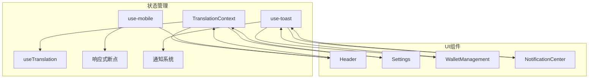
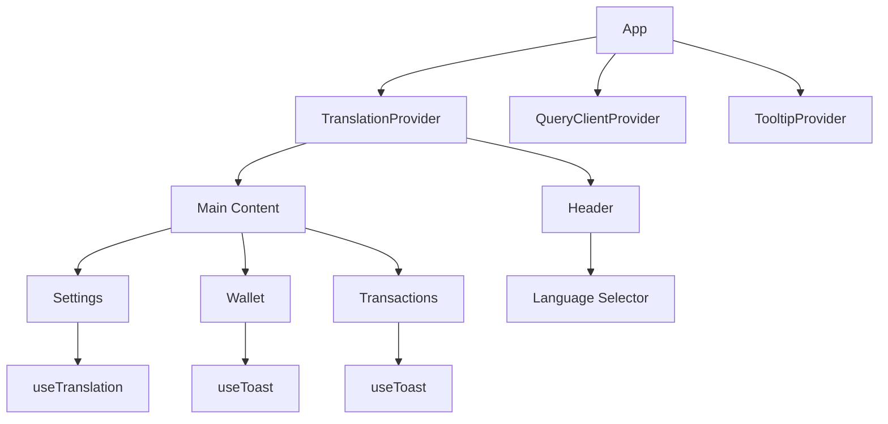
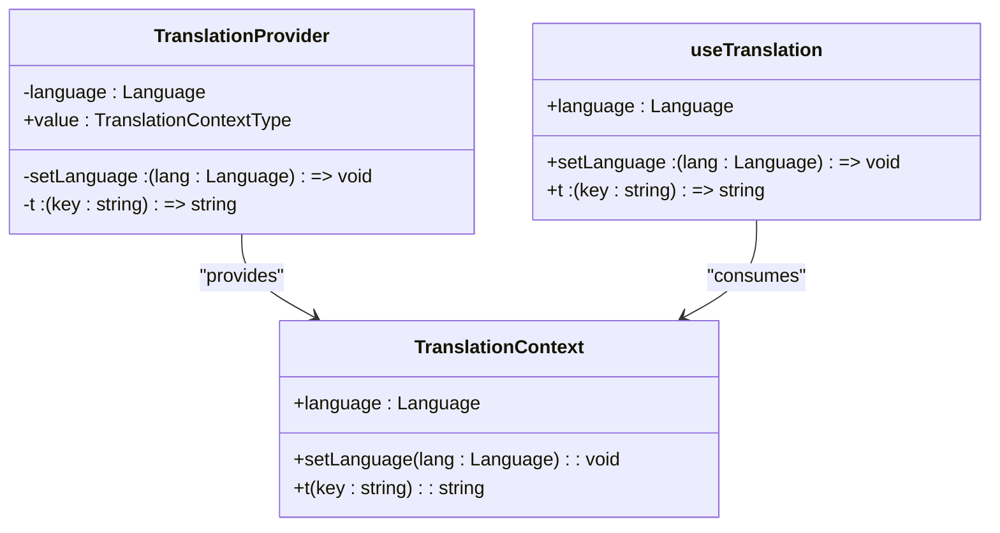
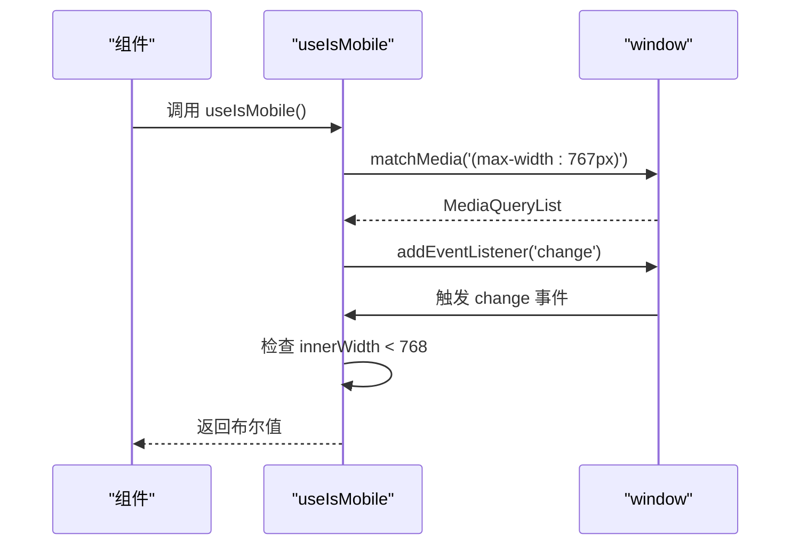
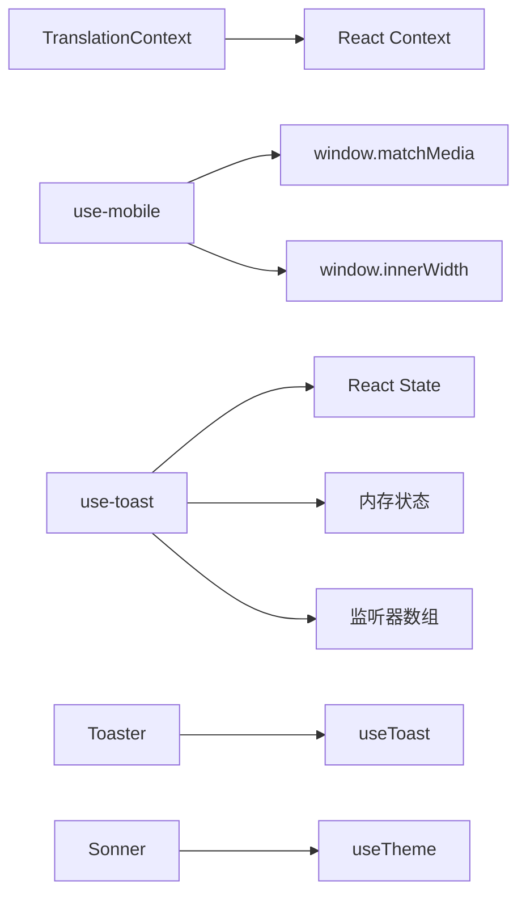

# 全局状态管理

<cite>
**本文档引用的文件**  
- [TranslationContext.tsx](file://src/contexts/TranslationContext.tsx)
- [use-mobile.tsx](file://src/hooks/use-mobile.tsx)
- [use-toast.ts](file://src/hooks/use-toast.ts)
- [_app.tsx](file://pages/_app.tsx)
- [sonner.tsx](file://src/components/ui/sonner.tsx)
- [toaster.tsx](file://src/components/ui/toaster.tsx)
</cite>

## 目录
1. [简介](#简介)
2. [项目结构](#项目结构)
3. [核心组件](#核心组件)
4. [架构概述](#架构概述)
5. [详细组件分析](#详细组件分析)
6. [依赖分析](#依赖分析)
7. [性能考虑](#性能考虑)
8. [故障排除指南](#故障排除指南)
9. [结论](#结论)

## 简介
本文档详细阐述了TriBridge支付系统中的全局状态管理机制，重点聚焦于React Context与自定义Hook的实践应用。文档深入解析了多语言支持、响应式断点检测和通知系统的实现原理，并提供状态管理的最佳实践建议。

## 项目结构
项目采用模块化设计，将状态管理相关的逻辑集中于`src/contexts`和`src/hooks`目录中。`TranslationContext.tsx`负责多语言支持，`use-mobile.tsx`和`use-toast.ts`分别处理设备响应式检测和通知系统集成。



**图表来源**  
- [TranslationContext.tsx](file://src/contexts/TranslationContext.tsx#L1-L146)
- [use-mobile.tsx](file://src/hooks/use-mobile.tsx#L1-L20)
- [use-toast.ts](file://src/hooks/use-toast.ts#L1-L186)

**章节来源**  
- [TranslationContext.tsx](file://src/contexts/TranslationContext.tsx#L1-L146)
- [use-mobile.tsx](file://src/hooks/use-mobile.tsx#L1-L20)
- [use-toast.ts](file://src/hooks/use-toast.ts#L1-L186)

## 核心组件
本节分析全局状态管理的核心组件，包括多语言上下文、移动设备检测Hook和通知系统集成。

**章节来源**  
- [TranslationContext.tsx](file://src/contexts/TranslationContext.tsx#L1-L146)
- [use-mobile.tsx](file://src/hooks/use-mobile.tsx#L1-L20)
- [use-toast.ts](file://src/hooks/use-toast.ts#L1-L186)

## 架构概述
系统采用React Context进行全局状态管理，通过Provider模式将状态注入组件树。自定义Hook封装了具体的业务逻辑，实现了关注点分离和代码复用。



**图表来源**  
- [_app.tsx](file://pages/_app.tsx#L11-L26)
- [TranslationContext.tsx](file://src/contexts/TranslationContext.tsx#L124-L136)

## 详细组件分析
本节深入分析各个状态管理组件的实现细节和应用方式。

### TranslationContext 多语言支持
TranslationContext实现了完整的多语言支持系统，包含上下文提供者、消费者模式和语言切换机制。



**图表来源**  
- [TranslationContext.tsx](file://src/contexts/TranslationContext.tsx#L118-L144)

**章节来源**  
- [TranslationContext.tsx](file://src/contexts/TranslationContext.tsx#L1-L146)

### use-mobile 响应式断点检测
use-mobile Hook实现了基于CSS媒体查询的响应式断点检测逻辑，用于判断当前设备是否为移动设备。



**图表来源**  
- [use-mobile.tsx](file://src/hooks/use-mobile.tsx#L4-L18)
- [sidebar.tsx](file://src/components/ui/sidebar.tsx#L50-L50)

**章节来源**  
- [use-mobile.tsx](file://src/hooks/use-mobile.tsx#L1-L20)

### use-toast 通知系统集成
use-toast Hook与shadcn/ui通知系统深度集成，实现了Toast通知的添加、更新、关闭和移除功能。

```mermaid
flowchart TD
Start([调用 toast()]) --> CreateId["生成唯一ID"]
CreateId --> DispatchAdd["派发 ADD_TOAST 动作"]
DispatchAdd --> UpdateState["更新内存状态"]
UpdateState --> NotifyListeners["通知所有监听器"]
NotifyListeners --> RenderToast["渲染Toast组件"]
RenderToast --> AutoDismiss["10秒后自动关闭"]
AutoDismiss --> DispatchDismiss["派发 DISMISS_TOAST 动作"]
DispatchDismiss --> ScheduleRemove["安排 REMOVE_TOAST"]
ScheduleRemove --> RemoveToast["移除Toast"]
ClickDismiss([点击关闭]) --> DispatchDismiss
```

**图表来源**  
- [use-toast.ts](file://src/hooks/use-toast.ts#L127-L132)
- [use-toast.ts](file://src/hooks/use-toast.ts#L136-L163)
- [use-toast.ts](file://src/hooks/use-toast.ts#L165-L183)

**章节来源**  
- [use-toast.ts](file://src/hooks/use-toast.ts#L1-L186)
- [sonner.tsx](file://src/components/ui/sonner.tsx#L5-L24)
- [toaster.tsx](file://src/components/ui/toaster.tsx#L3-L23)

## 依赖分析
状态管理组件之间存在明确的依赖关系，确保了系统的稳定性和可维护性。



**图表来源**  
- [TranslationContext.tsx](file://src/contexts/TranslationContext.tsx#L1-L146)
- [use-mobile.tsx](file://src/hooks/use-mobile.tsx#L4-L18)
- [use-toast.ts](file://src/hooks/use-toast.ts#L48-L50)
- [sonner.tsx](file://src/components/ui/sonner.tsx#L5-L24)

**章节来源**  
- [TranslationContext.tsx](file://src/contexts/TranslationContext.tsx#L1-L146)
- [use-mobile.tsx](file://src/hooks/use-mobile.tsx#L1-L20)
- [use-toast.ts](file://src/hooks/use-toast.ts#L1-L186)

## 性能考虑
在状态管理实现中，采取了多项性能优化措施，避免不必要的重渲染和内存泄漏。

- TranslationContext使用了TypeScript类型安全，确保编译时错误检测
- use-mobile Hook通过useEffect正确管理事件监听器，避免内存泄漏
- use-toast采用内存状态和监听器模式，避免频繁的全局状态更新
- 所有Hook都正确实现了依赖数组，确保useEffect只在必要时执行

**章节来源**  
- [TranslationContext.tsx](file://src/contexts/TranslationContext.tsx#L124-L136)
- [use-mobile.tsx](file://src/hooks/use-mobile.tsx#L4-L18)
- [use-toast.ts](file://src/hooks/use-toast.ts#L165-L183)

## 故障排除指南
本节提供状态管理相关的常见问题和解决方案。

**章节来源**  
- [TranslationContext.tsx](file://src/contexts/TranslationContext.tsx#L138-L144)
- [use-mobile.tsx](file://src/hooks/use-mobile.tsx#L4-L18)
- [use-toast.ts](file://src/hooks/use-toast.ts#L165-L183)

## 结论
本文档全面分析了TriBridge支付系统的全局状态管理架构。通过React Context和自定义Hook的组合，系统实现了高效、可维护的状态管理方案。多语言支持、响应式检测和通知系统都采用了最佳实践，确保了用户体验的一致性和系统的稳定性。