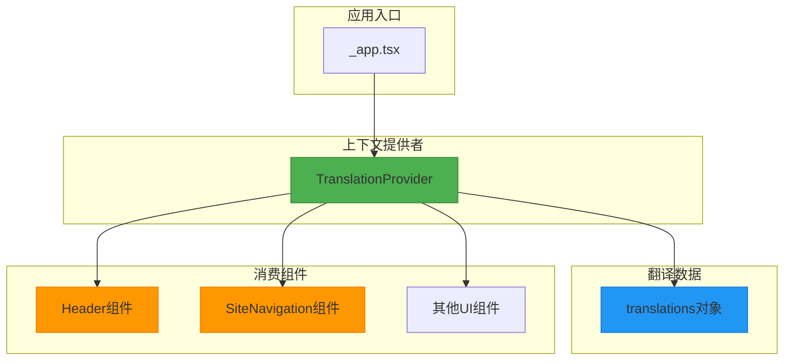
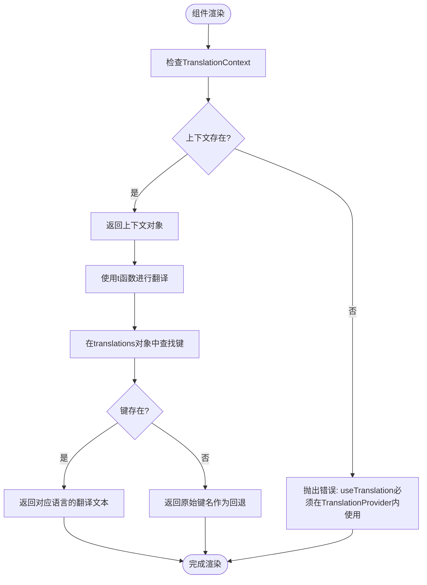
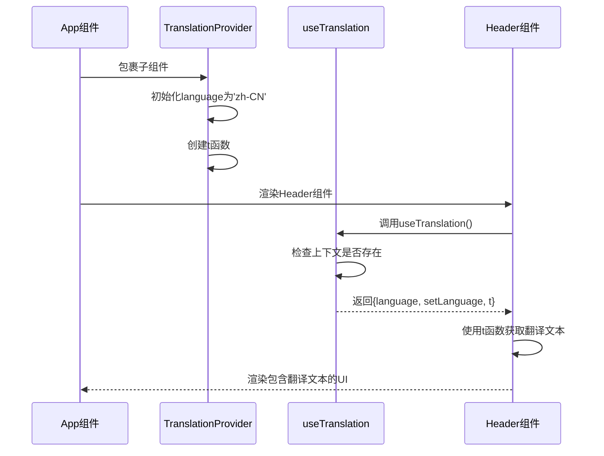
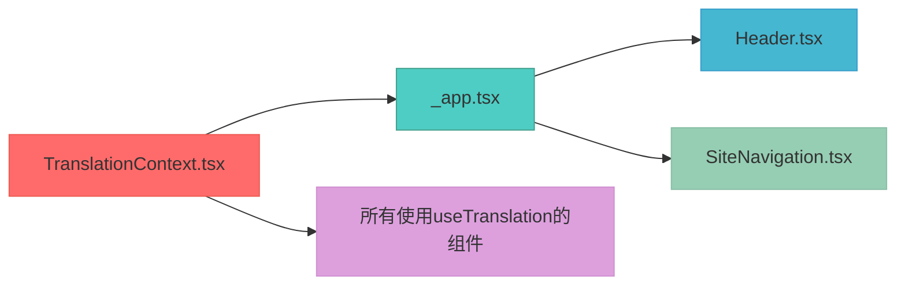

# 多语言上下文管理

<cite>
**Referenced Files in This Document**   
- [TranslationContext.tsx](file://src/contexts/TranslationContext.tsx)
- [_app.tsx](file://pages/_app.tsx)
- [Header.tsx](file://src/components/Layout/Header.tsx)
- [SiteNavigation.tsx](file://src/components/Layout/SiteNavigation.tsx)
</cite>

## 目录
1. [简介](#简介)
2. [核心组件](#核心组件)
3. [架构概述](#架构概述)
4. [详细组件分析](#详细组件分析)
5. [依赖分析](#依赖分析)
6. [性能考虑](#性能考虑)
7. [故障排除指南](#故障排除指南)
8. [结论](#结论)

## 简介
本文档详细阐述了TriBridge支付系统中的多语言上下文管理机制。系统通过React Context API实现了完整的国际化(i18n)功能，支持中文(zh-CN)、英文(en-US)和俄文(ru-RU)三种语言。文档将深入分析TranslationContext的实现原理，包括语言状态管理、翻译函数t的查找逻辑以及useTranslation自定义Hook的错误边界处理机制。

## 核心组件

[核心组件分析内容]

**Section sources**
- [TranslationContext.tsx](file://src/contexts/TranslationContext.tsx#L1-L146)

## 架构概述

[系统架构的全面可视化和解释]



**Diagram sources **
- [TranslationContext.tsx](file://src/contexts/TranslationContext.tsx#L1-L146)
- [_app.tsx](file://pages/_app.tsx#L1-L26)

## 详细组件分析

[对每个关键组件的彻底分析，包括图表、代码片段路径和解释]

### TranslationContext实现分析
[TranslationContext组件的具体分析内容]

#### 类图
```mermaid
classDiagram
class TranslationContextType {
+language : Language
+setLanguage(lang : Language) : void
+t(key : string) : string
}
class TranslationProvider {
-language : Language
-setLanguage : (lang : Language) => void
-t : (key : string) => string
+TranslationProvider({ children } : TranslationProviderProps) : JSX.Element
}
class useTranslation {
+useTranslation() : TranslationContextType
}
class Language {
<<type>>
zh-CN
en-US
ru-RU
}
TranslationProvider --> TranslationContextType : "实现"
useTranslation --> TranslationContext : "使用"
TranslationProvider --> translations : "引用"
```

**Diagram sources **
- [TranslationContext.tsx](file://src/contexts/TranslationContext.tsx#L1-L146)

#### 语言切换流程图


**Diagram sources **
- [TranslationContext.tsx](file://src/contexts/TranslationContext.tsx#L1-L146)

**Section sources**
- [TranslationContext.tsx](file://src/contexts/TranslationContext.tsx#L1-L146)

### 多语言功能使用示例
[多语言功能在组件中的使用示例]

#### Header组件中的多语言使用


**Diagram sources **
- [Header.tsx](file://src/components/Layout/Header.tsx#L1-L51)
- [TranslationContext.tsx](file://src/contexts/TranslationContext.tsx#L1-L146)

**Section sources**
- [Header.tsx](file://src/components/Layout/Header.tsx#L1-L51)

## 依赖分析

[组件间依赖关系的分析]



**Diagram sources **
- [TranslationContext.tsx](file://src/contexts/TranslationContext.tsx#L1-L146)
- [_app.tsx](file://pages/_app.tsx#L1-L26)
- [Header.tsx](file://src/components/Layout/Header.tsx#L1-L51)
- [SiteNavigation.tsx](file://src/components/Layout/SiteNavigation.tsx#L1-L92)

**Section sources**
- [TranslationContext.tsx](file://src/contexts/TranslationContext.tsx#L1-L146)
- [_app.tsx](file://pages/_app.tsx#L1-L26)

## 性能考虑

### 避免重复计算的最佳实践
在渲染过程中直接调用t函数可能导致不必要的重复计算。建议的优化策略包括：

1. **在组件外部定义静态翻译**：对于不随状态变化的文本，可以在组件外部预先翻译
2. **使用useMemo缓存翻译结果**：对于复杂的翻译逻辑，使用useMemo进行记忆化
3. **批量获取翻译文本**：避免在循环中频繁调用t函数

### 类型安全最佳实践
系统通过TypeScript实现了完整的类型安全：

1. **Language类型定义**：严格限定支持的语言种类
2. **TranslationContextType接口**：明确定义上下文结构
3. **泛型约束**：确保翻译键在translations对象中存在

**Section sources**
- [TranslationContext.tsx](file://src/contexts/TranslationContext.tsx#L1-L146)

## 故障排除指南

### 常见错误及解决方案
当开发者遇到"useTranslation must be used within a TranslationProvider"错误时，通常由以下原因导致：

1. **未正确包裹组件**：确保需要使用翻译功能的组件被TranslationProvider包裹
2. **组件层级问题**：检查组件树结构，确保useTranslation调用在Provider的子树中
3. **SSR兼容性问题**：在Next.js环境中，确保在客户端组件中正确使用

### 调试步骤
1. 检查_app.tsx中是否正确引入了TranslationProvider
2. 验证组件是否在Provider的作用范围内
3. 确认useTranslation的导入路径是否正确

**Section sources**
- [TranslationContext.tsx](file://src/contexts/TranslationContext.tsx#L138-L144)
- [_app.tsx](file://pages/_app.tsx#L1-L26)

## 结论
本文档全面分析了TriBridge支付系统的多语言上下文管理机制。通过React Context API，系统实现了高效、类型安全的国际化解决方案。TranslationProvider组件通过useState管理当前语言状态，t函数基于当前语言从预定义的translations对象中查找对应文本，而useTranslation Hook则提供了便捷的上下文访问方式，并包含完善的错误边界处理。该设计模式具有良好的可扩展性，便于未来添加新的语言支持，同时通过TypeScript确保了类型安全，为开发者提供了友好的开发体验。