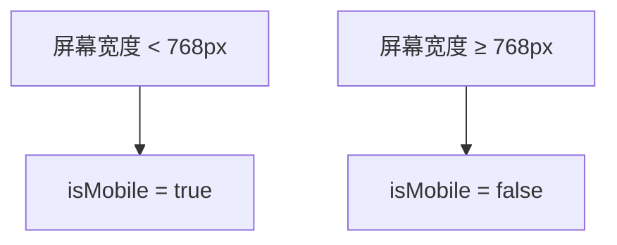
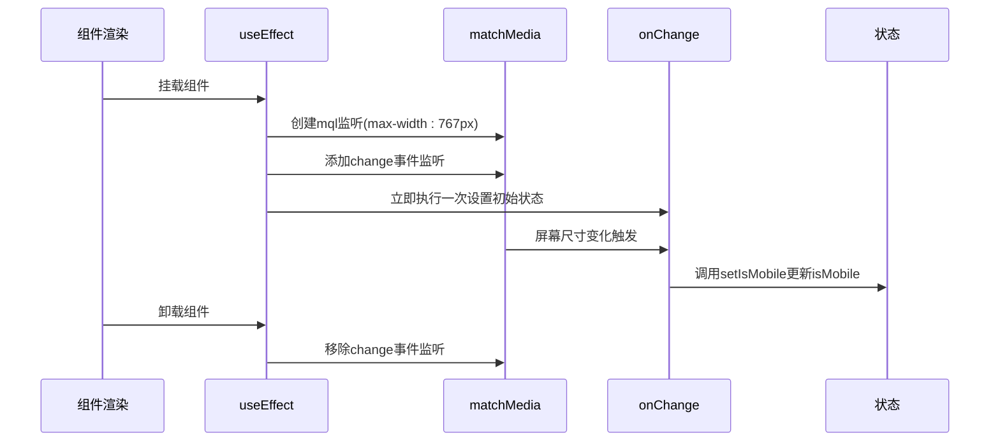
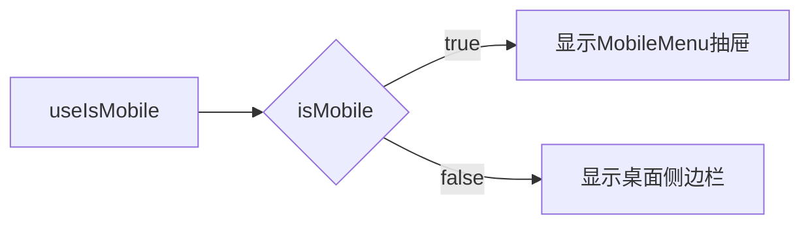
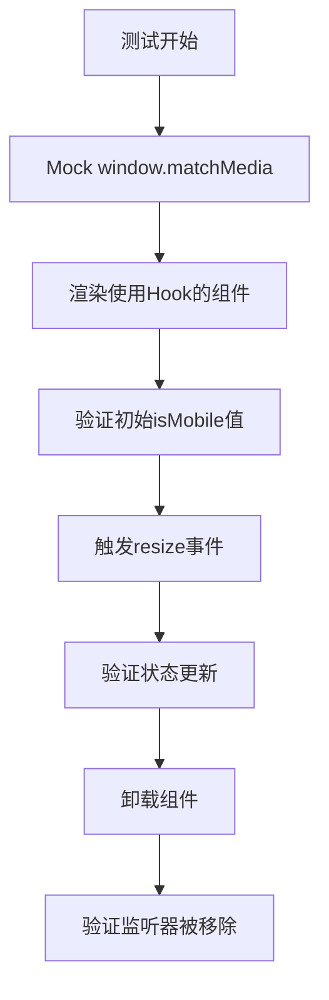

# 移动端检测Hook

<cite>
**本文档引用文件**  
- [use-mobile.tsx](file://src/hooks/use-mobile.tsx)
- [MobileMenu.tsx](file://src/components/Layout/MobileMenu.tsx)
- [sidebar.tsx](file://src/components/ui/sidebar.tsx)
- [vitest.setup.ts](file://vitest.setup.ts)
</cite>

## 目录
1. [简介](#简介)
2. [核心实现原理](#核心实现原理)
3. [MOBILE_BREAKPOINT常量解析](#mobile_breakpoint常量解析)
4. [useEffect中的事件监听机制](#useeffect中的事件监听机制)
5. [状态初始化逻辑](#状态初始化逻辑)
6. [实际组件使用示例](#实际组件使用示例)
7. [常见问题与解决方案](#常见问题与解决方案)
8. [测试策略](#测试策略)

## 简介
`useIsMobile` 是一个自定义React Hook，用于在响应式Web应用中检测当前设备是否为移动端。该Hook通过监听窗口尺寸变化，动态判断设备类型，并返回布尔值供UI组件使用。本文档将深入解析其内部实现机制、关键设计决策以及在真实组件中的应用方式。

## 核心实现原理

`useIsMobile` Hook基于现代浏览器提供的 `window.matchMedia` API 实现响应式检测。它结合React的 `useState` 和 `useEffect` 钩子，在组件挂载时注册媒体查询监听器，并在卸载时正确清理，避免内存泄漏。整个过程无需依赖第三方库，轻量且高效。

**Section sources**
- [use-mobile.tsx](file://src/hooks/use-mobile.tsx#L4-L18)

## MOBILE_BREAKPOINT常量解析

`MOBILE_BREAKPOINT` 是一个定义在Hook内部的常量，值为768像素，代表响应式设计中的断点阈值。当屏幕宽度小于768px时，系统判定为移动设备。该值广泛应用于主流UI框架（如Tailwind CSS），符合平板与手机的典型分界标准。

**Diagram sources**
- [use-mobile.tsx](file://src/hooks/use-mobile.tsx#L2)

## useEffect中的事件监听机制

`useEffect` 在组件首次渲染后执行，创建一个媒体查询对象 `mql`，监听 `(max-width: 767px)` 的条件变化。通过 `addEventListener` 注册 `change` 事件回调函数 `onChange`，当屏幕尺寸跨越断点时触发状态更新。返回的清理函数确保组件卸载时移除监听器，防止内存泄漏。

**Diagram sources**
- [use-mobile.tsx](file://src/hooks/use-mobile.tsx#L7-L15)

## 状态初始化逻辑

Hook使用 `useState<boolean | undefined>(undefined)` 初始化状态，初始值为 `undefined`，表示尚未完成设备检测。在 `useEffect` 中，立即通过 `window.innerWidth < MOBILE_BREAKPOINT` 计算当前设备类型并设置状态。最终返回值使用 `!!isMobile` 确保始终返回布尔类型，即使初始为 `undefined` 也会被转换为 `false`。

**Section sources**
- [use-mobile.tsx](file://src/hooks/use-mobile.tsx#L6-L18)

## 实际组件使用示例

`MobileMenu` 组件展示了 `useIsMobile` 的典型应用场景。虽然当前代码中未直接调用该Hook，但其设计模式与响应式导航高度相关。理想情况下，可通过 `useIsMobile` 动态控制菜单的展示逻辑，例如在移动端显示抽屉式菜单，在桌面端显示侧边栏。

**Diagram sources**
- [MobileMenu.tsx](file://src/components/Layout/MobileMenu.tsx#L18-L77)
- [use-mobile.tsx](file://src/hooks/use-mobile.tsx#L4-L18)

## 常见问题与解决方案

### 服务端渲染兼容性
由于 `window` 对象在服务端不存在，直接调用会导致错误。解决方案是在首次渲染时允许状态为 `undefined`，并在客户端再进行实际检测，React会自动处理hydration过程。

### 性能优化建议
- 避免在频繁重渲染的组件中使用，可结合 `React.memo` 或状态提升减少调用次数。
- 监听器已正确清理，无需额外优化。
- 断点值可抽离为配置项以支持多设备适配。

### 防止频繁重渲染
Hook本身仅在窗口尺寸跨越断点时更新状态，不会因微小变化频繁触发。配合React的批处理机制，确保UI更新高效稳定。

**Section sources**
- [use-mobile.tsx](file://src/hooks/use-mobile.tsx#L4-L18)

## 测试策略

在单元测试中，需模拟 `window.matchMedia` API。项目中的 `vitest.setup.ts` 已提供mock实现，确保测试环境下的 `matchMedia` 可用且可控。测试用例应覆盖初始状态判断、窗口变化响应及清理函数执行等场景。

**Diagram sources**
- [vitest.setup.ts](file://vitest.setup.ts#L0-L15)
- [use-mobile.tsx](file://src/hooks/use-mobile.tsx#L4-L18)