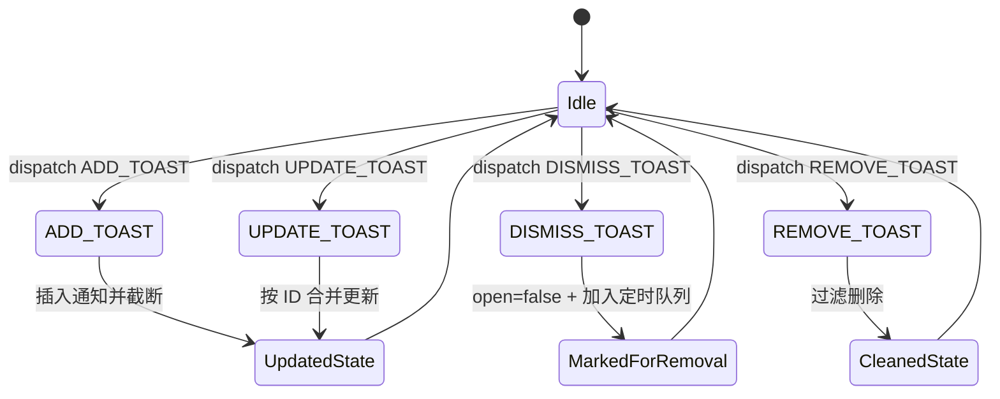
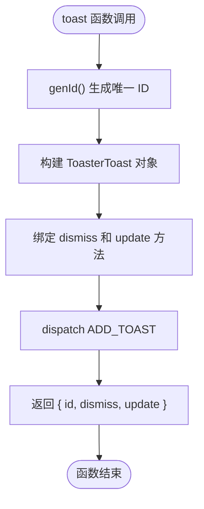
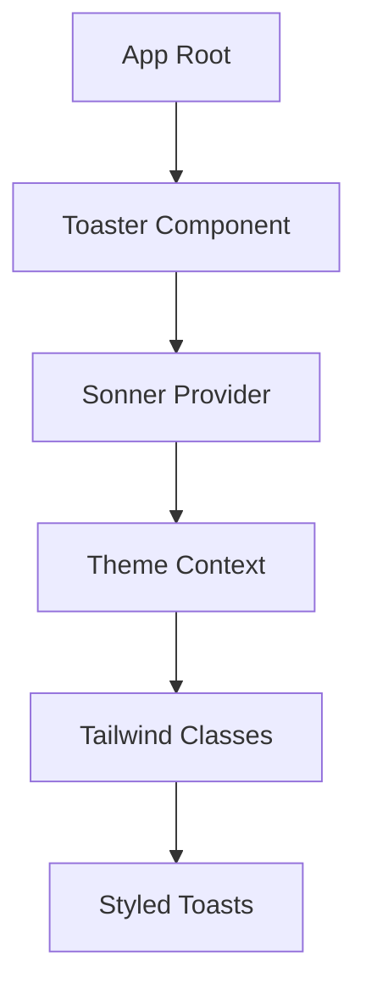

# 通知系统状态管理

<cite>
**本文档引用的文件**   
- [use-toast.ts](file://src/hooks/use-toast.ts)
- [sonner.tsx](file://src/components/ui/sonner.tsx)
- [toaster.tsx](file://src/components/ui/toaster.tsx)
- [toast.tsx](file://src/components/ui/toast.tsx)
</cite>

## 目录
1. [简介](#简介)
2. [核心组件](#核心组件)
3. [ToasterToast 类型定义](#toastertoast-类型定义)
4. [全局状态管理机制](#全局状态管理机制)
5. [自定义 reducer 实现](#自定义-reducer-实现)
6. [通知配置参数](#通知配置参数)
7. [toast 函数实现与唯一 ID 生成](#toast-函数实现与唯一-id-生成)
8. [组件中使用通知的完整示例](#组件中使用通知的完整示例)
9. [性能优化与内存泄漏防护](#性能优化与内存泄漏防护)
10. [与 shadcn/ui 组件集成最佳实践](#与-shadcnui-组件集成最佳实践)

## 简介
本系统基于 React 构建了一套轻量级、可扩展的通知管理机制，通过 useToast Hook 实现全局状态共享。系统支持添加、更新、关闭和移除通知，并通过高效的订阅机制确保 UI 实时响应状态变化。核心设计采用不可变数据流与函数式编程模式，结合定时清理策略，保障长时间运行下的内存安全。

## 核心组件

通知系统由多个关键模块构成：`useToast` 提供状态访问与操作接口；`toast` 函数用于触发通知；`Toaster` 组件负责渲染所有活动通知；底层通过自定义 reducer 统一处理状态变更。整个架构解耦清晰，便于维护和扩展。

**Section sources**
- [use-toast.ts](file://src/hooks/use-toast.ts#L1-L186)
- [toaster.tsx](file://src/components/ui/toaster.tsx#L1-L23)

## ToasterToast 类型定义

`ToasterToast` 类型扩展自 `ToastProps`，定义了通知的核心属性结构：

- `id`: 唯一标识符（字符串）
- `title`: 可选标题（React 节点）
- `description`: 可选描述内容（React 节点）
- `action`: 可选交互按钮（ToastActionElement 类型）
- 其他继承自 `ToastProps` 的属性如 `variant`、`open` 等

该类型确保通知对象具备统一的数据契约，便于跨组件传递和渲染。

**Section sources**
- [use-toast.ts](file://src/hooks/use-toast.ts#L7-L12)

## 全局状态管理机制

系统采用内存状态 + 订阅者模式实现全局通知状态管理：

- `memoryState`: 存储当前所有通知的单例状态对象
- `listeners`: 存放所有订阅该状态的 React 组件 setState 函数的数组
- `dispatch`: 触发状态更新并通知所有监听器重新渲染

当任意组件调用 `toast()` 时，`dispatch` 会执行 reducer 更新 `memoryState`，随后遍历 `listeners` 调用每个组件的 `setState`，从而实现跨组件状态同步。

```mermaid
flowchart TD
A[调用 toast()] --> B[生成唯一 ID]
B --> C[创建通知对象]
C --> D[dispatch ADD_TOAST]
D --> E[执行 reducer 更新 memoryState]
E --> F[遍历 listeners 调用 setState]
F --> G[所有订阅组件重新渲染]
```

**Diagram sources**
- [use-toast.ts](file://src/hooks/use-toast.ts#L150-L186)
- [use-toast.ts](file://src/hooks/use-toast.ts#L100-L120)

## 自定义 reducer 实现

reducer 函数根据 action 类型处理四种核心操作：

- `ADD_TOAST`: 将新通知插入队列头部，并限制总数不超过 `TOAST_LIMIT`
- `UPDATE_TOAST`: 根据 ID 查找并合并更新指定通知的字段
- `DISMISS_TOAST`: 设置通知 `open` 为 false，并加入延迟移除队列
- `REMOVE_TOAST`: 从队列中永久删除指定通知

每种操作均返回新的状态副本，遵循不可变原则，确保 React 正确触发重渲染。



**Diagram sources**
- [use-toast.ts](file://src/hooks/use-toast.ts#L50-L90)

## 通知配置参数

系统定义了两个关键常量用于控制通知行为：

- `TOAST_LIMIT = 1`: 限制同时显示的通知数量上限为 1，确保界面简洁不拥挤
- `TOAST_REMOVE_DELAY = 1000000`: 设置通知关闭后延迟 1000 秒（约 16.7 分钟）再从内存中彻底移除，防止快速重复触发导致状态混乱

这些参数可根据实际需求调整，平衡用户体验与系统性能。

**Section sources**
- [use-toast.ts](file://src/hooks/use-toast.ts#L3-L5)

## toast 函数实现与唯一 ID 生成

`toast` 函数是创建通知的主要入口：

- 调用 `genId()` 生成唯一字符串 ID
- 创建包含 `dismiss` 和 `update` 方法的返回对象
- 自动设置 `onOpenChange` 回调，在关闭时自动调用 `dismiss`
- 通过 `dispatch` 发送 `ADD_TOAST` 操作

`genId()` 使用递增计数器模最大安全整数，确保 ID 唯一且轻量。



**Diagram sources**
- [use-toast.ts](file://src/hooks/use-toast.ts#L130-L150)

## 组件中使用通知的完整示例

在任意 React 组件中可通过以下方式使用通知：

```tsx
import { useToast } from "@/hooks/use-toast";

export function ExampleComponent() {
  const { toast } = useToast();

  const showSuccess = () => {
    toast({
      title: "操作成功",
      description: "您的请求已成功处理。",
      variant: "default",
    });
  };

  const showError = () => {
    toast({
      title: "操作失败",
      description: "网络错误，请稍后重试。",
      variant: "destructive",
    });
  };

  const showWarning = () => {
    toast({
      title: "注意",
      description: "此操作不可撤销。",
      variant: "warning",
    });
  };

  return (
    <div>
      <button onClick={showSuccess}>成功通知</button>
      <button onClick={showError}>错误通知</button>
      <button onClick={showWarning}>警告通知</button>
    </div>
  );
}
```

**Section sources**
- [use-toast.ts](file://src/hooks/use-toast.ts#L130-L186)

## 性能优化与内存泄漏防护

系统通过 `toastTimeouts` Map 结构管理定时器，避免内存泄漏：

- 每次关闭通知时启动 `setTimeout` 并存储引用
- 若同一 ID 已存在定时器则跳过，防止重复注册
- 定时器执行后自动从 Map 中删除并派发 `REMOVE_TOAST`
- 组件卸载时通过 `useEffect` 清理自身监听器

此机制确保即使大量通知频繁触发，也不会积累无效定时器或监听器。

**Section sources**
- [use-toast.ts](file://src/hooks/use-toast.ts#L20-L40)
- [use-toast.ts](file://src/hooks/use-toast.ts#L100-L120)

## 与 shadcn/ui 组件集成最佳实践

系统通过 `sonner.tsx` 集成 Sonner 库并适配主题：

- 使用 `useTheme` 获取当前主题模式（light/dark/system）
- 自定义 `toastOptions.classNames` 实现与 Tailwind 样式体系无缝对接
- 支持 `group` 伪类增强视觉反馈
- `Toaster` 组件封装 `ToastProvider` 与 `ToastViewport`，简化使用

推荐在根布局中统一引入 `<Toaster />`，确保全站通知样式一致。



**Diagram sources**
- [sonner.tsx](file://src/components/ui/sonner.tsx#L1-L24)
- [toaster.tsx](file://src/components/ui/toaster.tsx#L1-L23)