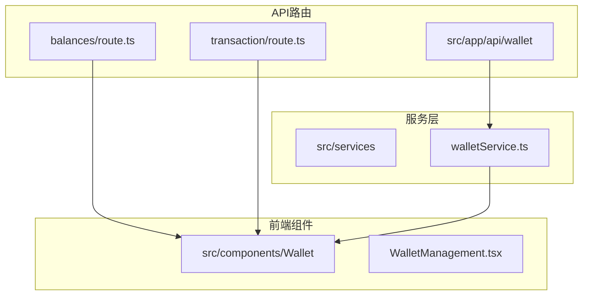
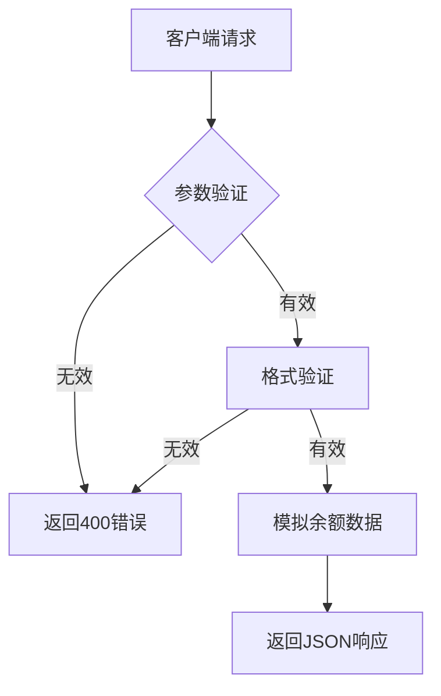
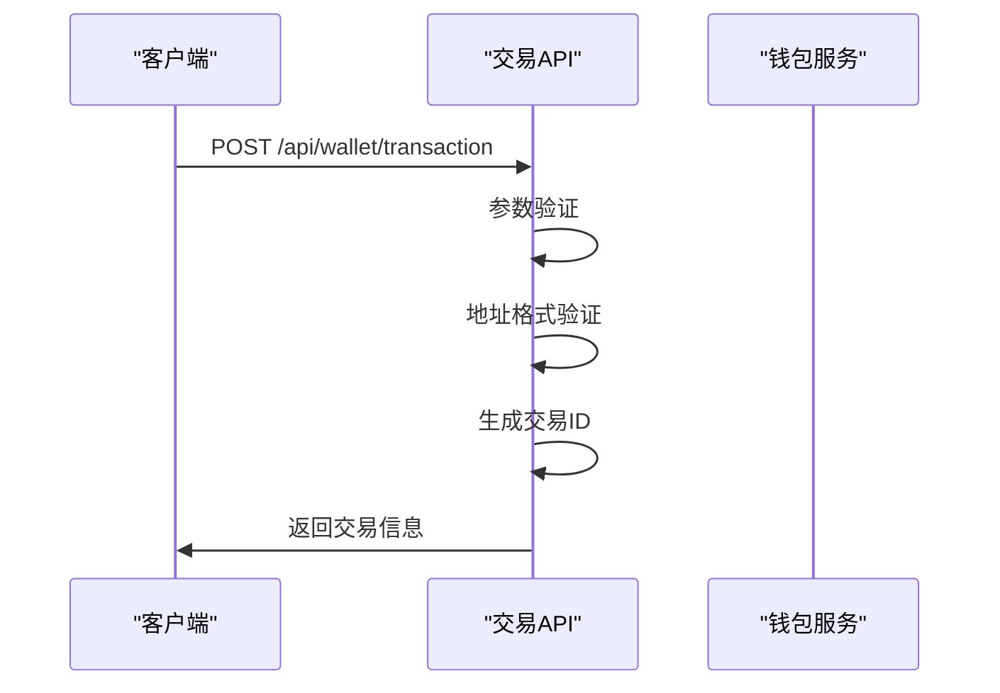
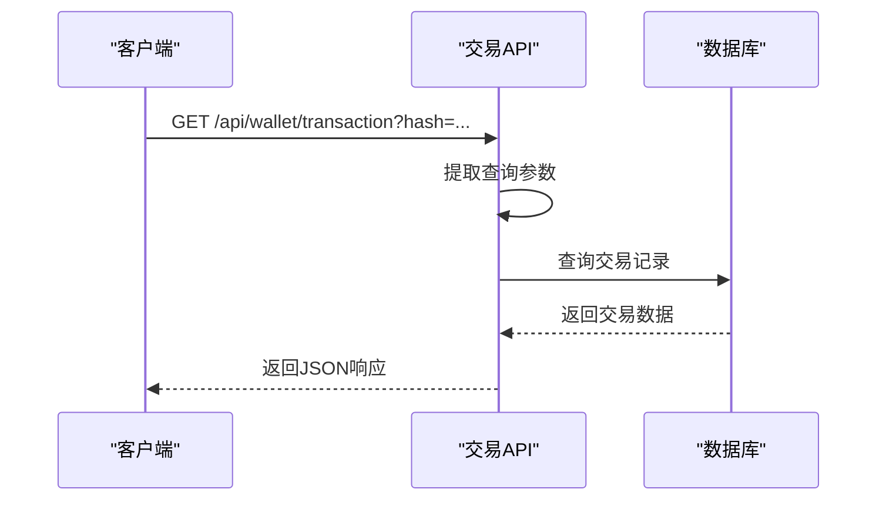
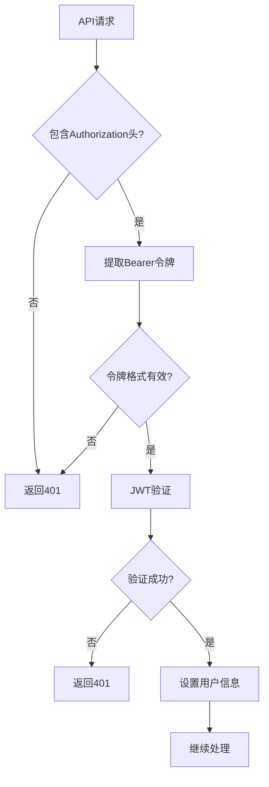
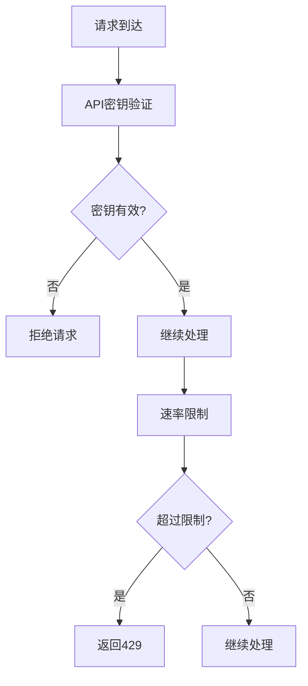
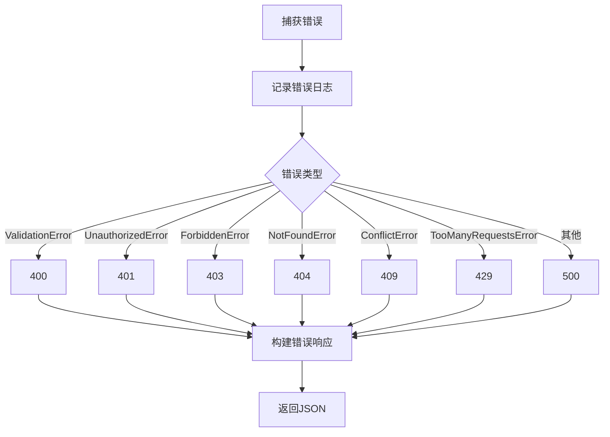
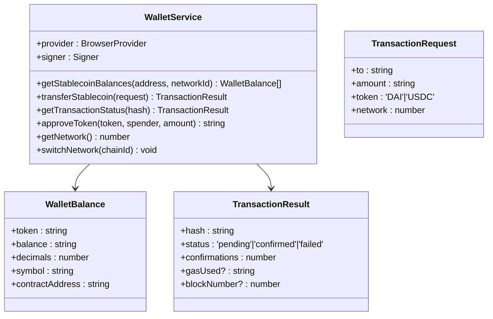
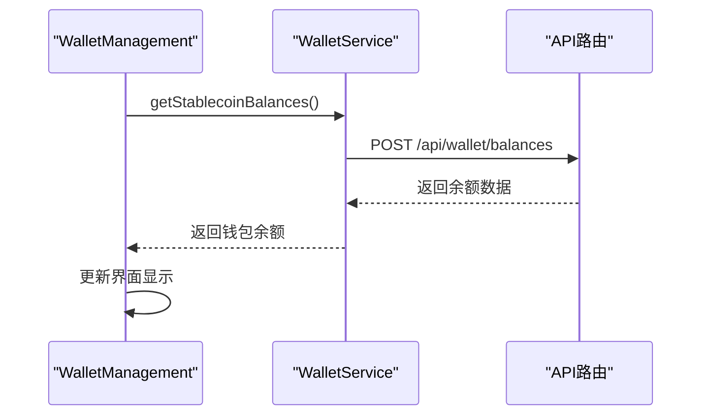
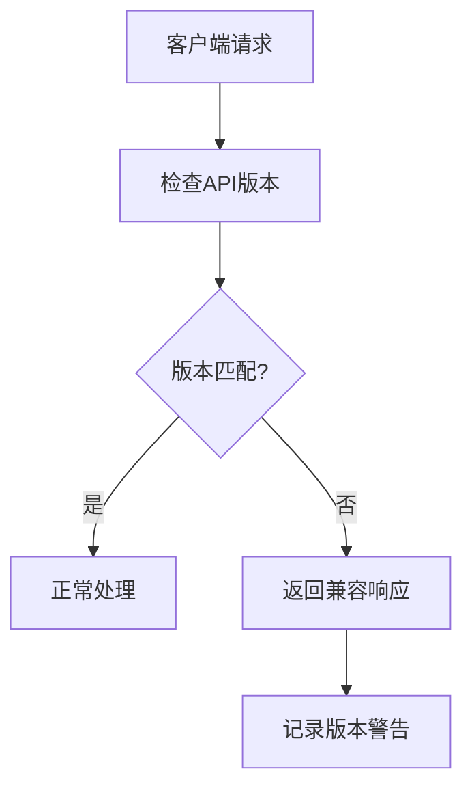

# 前端API集成

<cite>
**本文档中引用的文件**  
- [balances/route.ts](file://src/app/api/wallet/balances/route.ts)
- [transaction/route.ts](file://src/app/api/wallet/transaction/route.ts)
- [walletService.ts](file://src/services/walletService.ts)
- [auth.ts](file://backend/src/middleware/auth.ts)
- [errorHandler.ts](file://backend/src/middleware/errorHandler.ts)
- [WalletManagement.tsx](file://src/components/Wallet/WalletManagement.tsx)
</cite>

## 目录
1. [简介](#简介)
2. [项目结构](#项目结构)
3. [核心API路由实现](#核心api路由实现)
4. [身份验证与安全机制](#身份验证与安全机制)
5. [错误处理与响应规范](#错误处理与响应规范)
6. [前端数据交互模式](#前端数据交互模式)
7. [API调用示例与最佳实践](#api调用示例与最佳实践)
8. [API版本控制与调试技巧](#api版本控制与调试技巧)
9. [总结](#总结)

## 简介
本文档详细说明了基于Next.js App Router架构的钱包相关API集成方案。重点阐述了`app/api/wallet`目录下API路由的实现机制，包括请求处理流程、身份验证策略、错误响应规范以及与前端组件的数据交互模式。文档还涵盖了API中间件的应用、安全防护措施、调用示例和调试技巧，为开发者提供完整的API集成指导。

## 项目结构
项目采用Next.js App Router架构，API路由集中存放在`src/app/api`目录下。钱包相关API位于`src/app/api/wallet`子目录，采用模块化设计，每个功能对应独立的路由文件。



**图示来源**  
- [balances/route.ts](file://src/app/api/wallet/balances/route.ts)
- [transaction/route.ts](file://src/app/api/wallet/transaction/route.ts)
- [walletService.ts](file://src/services/walletService.ts)
- [WalletManagement.tsx](file://src/components/Wallet/WalletManagement.tsx)

**本节来源**  
- [src/app/api/wallet](file://src/app/api/wallet)

## 核心API路由实现
钱包API路由基于Next.js App Router实现，包含余额查询和交易处理两个核心功能模块。

### 余额查询API
`balances/route.ts`文件实现了POST方法的余额查询接口，接收钱包地址和网络ID作为输入参数，返回指定网络下的稳定币余额信息。



**图示来源**  
- [balances/route.ts](file://src/app/api/wallet/balances/route.ts#L1-L50)

**本节来源**  
- [balances/route.ts](file://src/app/api/wallet/balances/route.ts#L1-L50)

### 交易处理API
`transaction/route.ts`文件实现了交易相关的POST和GET接口，支持交易创建和交易状态查询功能。





**图示来源**  
- [transaction/route.ts](file://src/app/api/wallet/transaction/route.ts#L1-L144)

**本节来源**  
- [transaction/route.ts](file://src/app/api/wallet/transaction/route.ts#L1-L144)

## 身份验证与安全机制
系统采用多层次的安全防护机制，确保API调用的安全性。

### JWT身份验证
后端通过`auth.ts`中间件实现JWT身份验证，验证请求头中的Bearer令牌。



**图示来源**  
- [auth.ts](file://backend/src/middleware/auth.ts#L1-L167)

### API密钥验证
系统在API入口处集成API密钥验证机制，防止未授权访问。



**本节来源**  
- [auth.ts](file://backend/src/middleware/auth.ts#L1-L167)
- [backend/src/index.ts](file://backend/src/index.ts#L85-L117)

## 错误处理与响应规范
系统采用统一的错误处理机制，确保API响应的一致性和可预测性。

### 全局错误处理
`errorHandler.ts`文件定义了全局错误处理中间件，标准化错误响应格式。



**图示来源**  
- [errorHandler.ts](file://backend/src/middleware/errorHandler.ts#L1-L176)

### 错误响应结构
统一的错误响应包含以下字段：
- `success`: 布尔值，表示操作是否成功
- `error`: 错误消息
- `errorCode`: 错误代码
- `timestamp`: 时间戳
- `path`: 请求路径
- `method`: HTTP方法

**本节来源**  
- [errorHandler.ts](file://backend/src/middleware/errorHandler.ts#L1-L176)

## 前端数据交互模式
前端通过`walletService.ts`服务层与API进行数据交互，实现清晰的分层架构。

### 钱包服务类
`WalletService`类封装了钱包操作的核心逻辑，提供类型安全的API接口。



**图示来源**  
- [walletService.ts](file://src/services/walletService.ts#L78-L148)

### 组件集成
`WalletManagement`组件通过调用钱包服务实现用户界面功能。



**本节来源**  
- [walletService.ts](file://src/services/walletService.ts#L1-L270)
- [WalletManagement.tsx](file://src/components/Wallet/WalletManagement.tsx#L1-L354)

## API调用示例与最佳实践
提供API调用的最佳实践和代码示例。

### 余额查询调用
```typescript
// 前端调用示例
const response = await fetch('/api/wallet/balances', {
  method: 'POST',
  headers: {
    'Content-Type': 'application/json',
    'Authorization': `Bearer ${token}`
  },
  body: JSON.stringify({
    address: '0x...',
    networkId: 11155111
  })
});
```

### 交易创建调用
```typescript
// 交易创建示例
const response = await fetch('/api/wallet/transaction', {
  method: 'POST',
  headers: {
    'Content-Type': 'application/json',
    'Authorization': `Bearer ${token}`
  },
  body: JSON.stringify({
    from: '0x...',
    to: '0x...',
    amount: '100.0',
    token: 'DAI',
    networkId: 11155111
  })
});
```

### 错误处理最佳实践
```typescript
// 统一错误处理
try {
  const response = await fetch('/api/wallet/balances', options);
  if (!response.ok) {
    const error = await response.json();
    throw new Error(error.error);
  }
  const data = await response.json();
  // 处理成功响应
} catch (error) {
  // 统一错误处理逻辑
  console.error('API调用失败:', error);
  // 显示用户友好的错误消息
}
```

**本节来源**  
- [balances/route.ts](file://src/app/api/wallet/balances/route.ts)
- [transaction/route.ts](file://src/app/api/wallet/transaction/route.ts)
- [walletService.ts](file://src/services/walletService.ts)

## API版本控制与调试技巧
### 版本控制策略
系统通过环境变量`API_VERSION`管理API版本，确保向后兼容性。



### 调试技巧
1. **启用详细日志**: 在开发环境中启用详细错误堆栈
2. **使用Postman测试**: 直接测试API端点
3. **浏览器开发者工具**: 监控网络请求和响应
4. **服务端日志**: 查看服务器端错误日志
5. **模拟数据**: 使用模拟数据快速验证前端逻辑

**本节来源**  
- [backend/src/index.ts](file://backend/src/index.ts#L85-L117)
- [errorHandler.ts](file://backend/src/middleware/errorHandler.ts)

## 总结
本文档全面介绍了Next.js App Router架构下的钱包API集成方案。通过模块化的API路由设计、标准化的错误处理机制和清晰的前端交互模式，实现了安全可靠的API集成。建议开发者遵循文档中的最佳实践，确保API调用的稳定性和安全性。