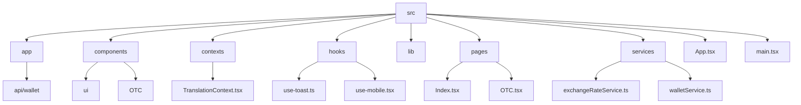
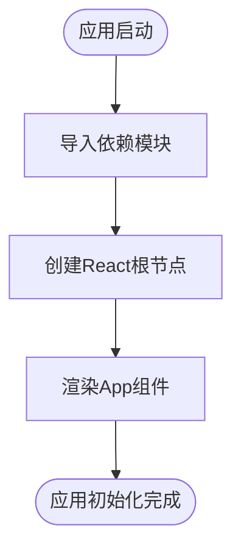
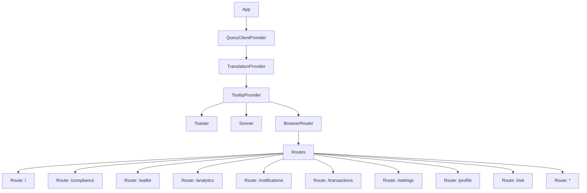
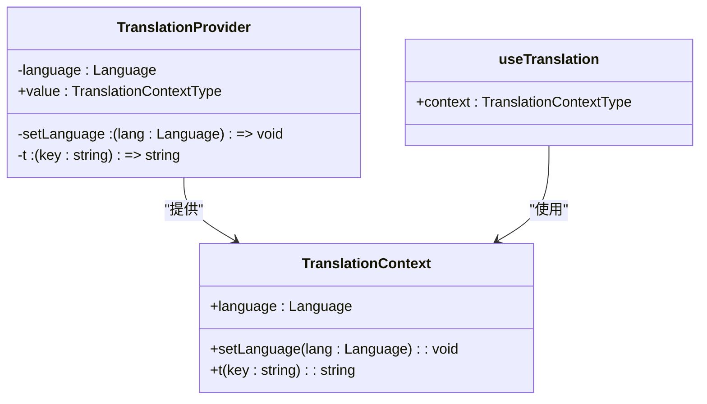
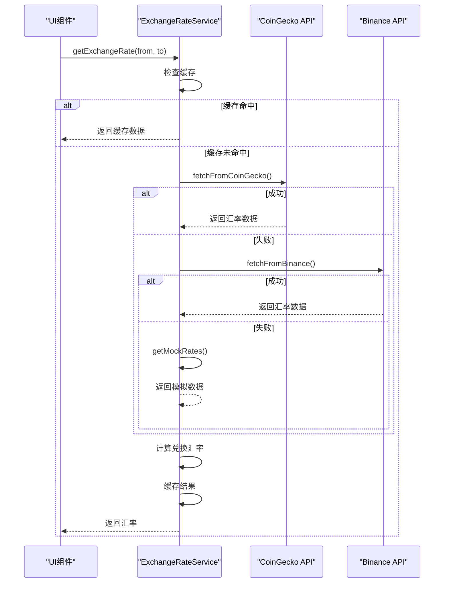
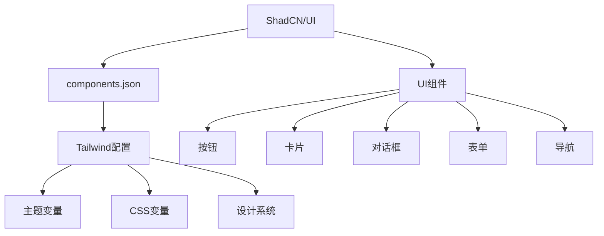
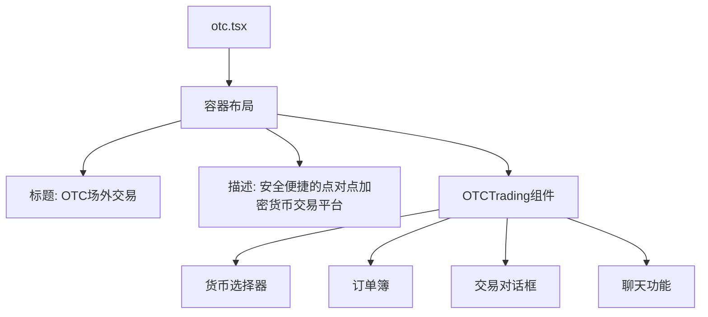
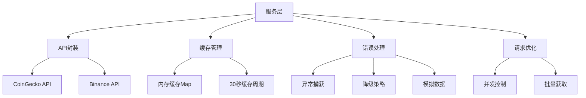
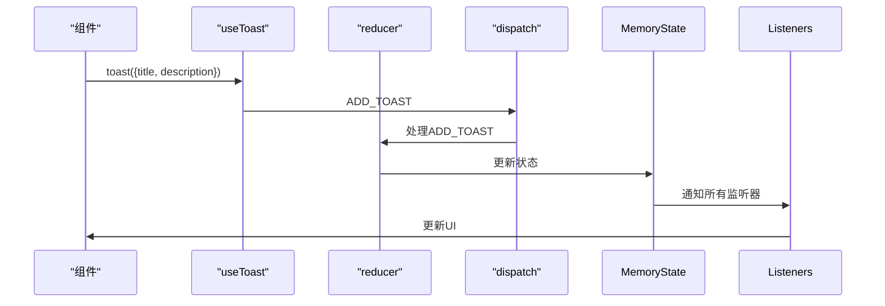
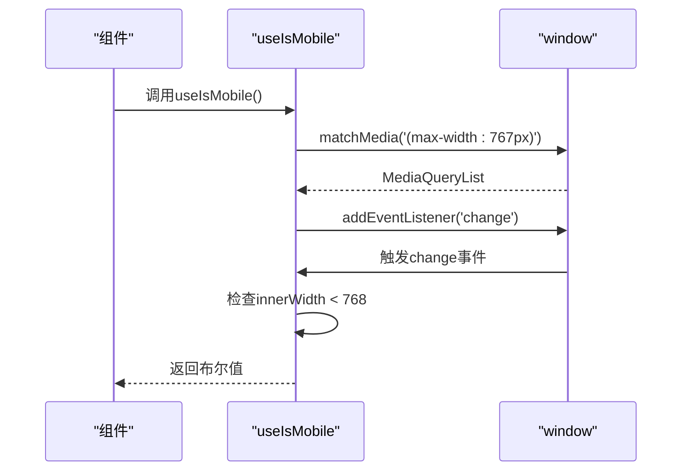

# 前端架构

<cite>
**本文档引用文件**  
- [main.tsx](file://src/main.tsx)
- [App.tsx](file://src/App.tsx)
- [TranslationContext.tsx](file://src/contexts/TranslationContext.tsx)
- [exchangeRateService.ts](file://src/services/exchangeRateService.ts)
- [use-toast.ts](file://src/hooks/use-toast.ts)
- [use-mobile.tsx](file://src/hooks/use-mobile.tsx)
- [otc.tsx](file://pages/otc.tsx)
- [OTCTrading.tsx](file://src/components/OTC/OTCTrading.tsx)
- [tailwind.config.ts](file://tailwind.config.ts)
- [components.json](file://components.json)
</cite>

## 目录
1. [项目结构](#项目结构)
2. [应用入口与初始化](#应用入口与初始化)
3. [React组件树与页面路由](#react组件树与页面路由)
4. [状态管理机制](#状态管理机制)
5. [服务调用层](#服务调用层)
6. [UI组件库集成](#ui组件库集成)
7. [页面路由与功能模块映射](#页面路由与功能模块映射)
8. [前端服务层封装](#前端服务层封装)
9. [关键模式与代码示例](#关键模式与代码示例)
10. [性能优化建议](#性能优化建议)

## 项目结构

**图表来源**  
- [src](file://src)

**章节来源**  
- [src](file://src)

## 应用入口与初始化

前端应用的入口文件为 `src/main.tsx`，负责初始化React应用并挂载到DOM节点。该文件通过 `createRoot` API创建根节点，并将 `App` 组件渲染到 `id` 为 `root` 的DOM元素中。整个应用的初始化流程简洁高效，遵循现代React应用的标准实践。

**图表来源**  
- [main.tsx](file://src/main.tsx#L1-L6)

**章节来源**  
- [main.tsx](file://src/main.tsx#L1-L6)

## React组件树与页面路由

应用采用基于React Router的页面路由系统，通过 `BrowserRouter` 和 `Routes` 组件实现声明式路由配置。`App.tsx` 文件中定义了所有页面路由，包括仪表板、合规中心、钱包管理等核心功能页面。路由系统支持动态基路径配置，适应GitHub Pages和Netlify等多种部署环境。

**图表来源**  
- [App.tsx](file://src/App.tsx#L36-L70)

**章节来源**  
- [App.tsx](file://src/App.tsx#L36-L70)

## 状态管理机制

应用采用React Context API实现全局状态管理，通过 `TranslationContext.tsx` 文件创建多语言支持上下文。该上下文提供语言切换功能和翻译函数 `t`，支持中文、英文和俄文三种语言。状态管理机制简单高效，避免了引入复杂状态管理库的开销。

**图表来源**  
- [TranslationContext.tsx](file://src/contexts/TranslationContext.tsx#L118-L136)

**章节来源**  
- [TranslationContext.tsx](file://src/contexts/TranslationContext.tsx#L1-L146)

## 服务调用层

前端服务层通过 `exchangeRateService.ts` 文件封装汇率API调用，实现多源数据获取、缓存管理和错误处理。服务采用类单例模式，提供 `getExchangeRate` 方法获取实时汇率，支持CoinGecko和Binance双API源，并在失败时自动降级到模拟数据。

**图表来源**  
- [exchangeRateService.ts](file://src/services/exchangeRateService.ts#L17-L281)

**章节来源**  
- [exchangeRateService.ts](file://src/services/exchangeRateService.ts#L1-L286)

## UI组件库集成

应用集成ShadCN/UI组件库，通过 `components.json` 配置文件定义组件别名和Tailwind CSS配置。组件库支持主题变量、CSS变量和无障碍访问，提供丰富的UI组件如按钮、卡片、对话框等。Tailwind配置中定义了颜色、边框半径、阴影等设计系统变量，确保UI一致性。

**图表来源**  
- [components.json](file://components.json#L1-L20)
- [tailwind.config.ts](file://tailwind.config.ts#L1-L120)

**章节来源**  
- [components.json](file://components.json#L1-L20)
- [tailwind.config.ts](file://tailwind.config.ts#L1-L120)

## 页面路由与功能模块映射

页面路由与功能模块之间存在清晰的映射关系。以 `otc.tsx` 页面为例，该页面通过导入 `OTCTrading` 组件实现OTC场外交易功能。页面结构包含标题、描述和核心交易组件，通过容器布局确保响应式设计。

**图表来源**  
- [otc.tsx](file://pages/otc.tsx#L3-L18)
- [OTCTrading.tsx](file://src/components/OTC/OTCTrading.tsx#L57-L434)

**章节来源**  
- [otc.tsx](file://pages/otc.tsx#L1-L20)
- [OTCTrading.tsx](file://src/components/OTC/OTCTrading.tsx#L1-L670)

## 前端服务层封装

前端服务层采用分层架构，封装API调用、请求拦截、错误处理和缓存策略。`exchangeRateService` 服务类通过私有方法实现不同API源的数据获取，公开方法提供统一的接口。服务支持并发获取所有汇率，通过 `Promise.allSettled` 处理批量请求，确保部分失败不影响整体流程。

**图表来源**  
- [exchangeRateService.ts](file://src/services/exchangeRateService.ts#L17-L281)

**章节来源**  
- [exchangeRateService.ts](file://src/services/exchangeRateService.ts#L1-L286)

## 关键模式与代码示例

### 通知系统实现

通过 `use-toast.ts` Hook实现通知系统，采用全局状态管理器模式。通知状态存储在内存中，通过发布-订阅模式通知所有监听组件。系统支持添加、更新、关闭和移除通知，提供 `toast` 和 `useToast` 两个主要API。

**图表来源**  
- [use-toast.ts](file://src/hooks/use-toast.ts#L165-L183)

**章节来源**  
- [use-toast.ts](file://src/hooks/use-toast.ts#L1-L187)

### 响应式判断实现

`use-mobile.tsx` Hook实现响应式断点检测，基于CSS媒体查询判断设备类型。Hook使用 `window.matchMedia` API监听屏幕宽度变化，在768px断点处切换移动/桌面模式。返回值为布尔类型，可直接用于条件渲染。

**图表来源**  
- [use-mobile.tsx](file://src/hooks/use-mobile.tsx#L4-L18)

**章节来源**  
- [use-mobile.tsx](file://src/hooks/use-mobile.tsx#L1-L20)

## 性能优化建议

1. **代码分割与懒加载**：对非关键路由组件采用动态导入，实现按需加载
2. **组件懒加载**：对复杂组件如 `OTCTrading` 使用 `React.lazy` 和 `Suspense`
3. **渲染优化**：使用 `React.memo` 避免不必要的组件重渲染
4. **API调用优化**：利用 `QueryClient` 的缓存和重试机制减少网络请求
5. **资源优化**：压缩图片资源，使用WebP格式替代JPEG/PNG
6. **Tree Shaking**：确保构建工具正确配置，移除未使用代码
7. **预加载关键资源**：对首屏关键资源使用 `link rel="preload"`
8. **服务端渲染**：考虑将静态页面迁移至服务端渲染提升首屏性能

**章节来源**  
- [App.tsx](file://src/App.tsx#L36-L70)
- [OTCTrading.tsx](file://src/components/OTC/OTCTrading.tsx#L57-L434)