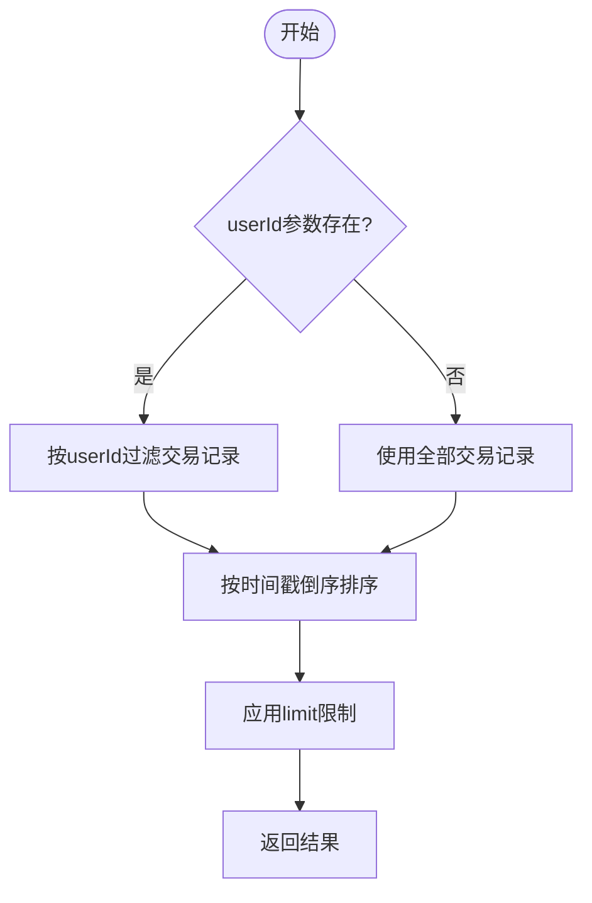
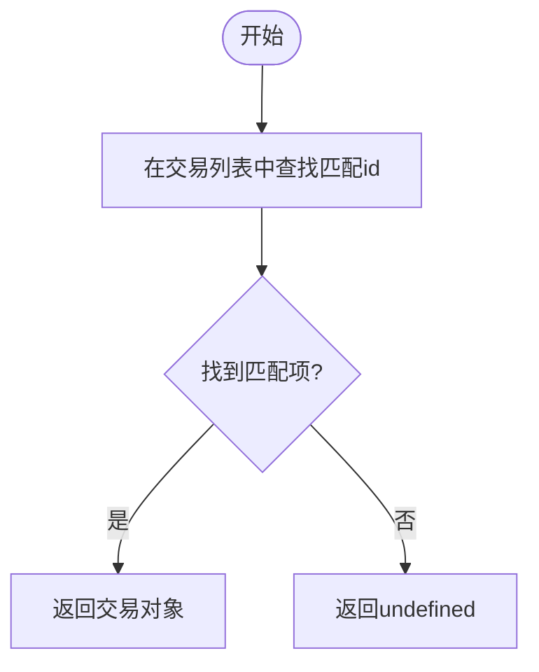
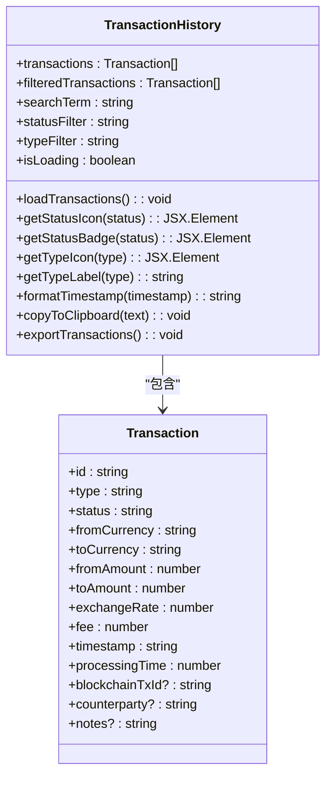
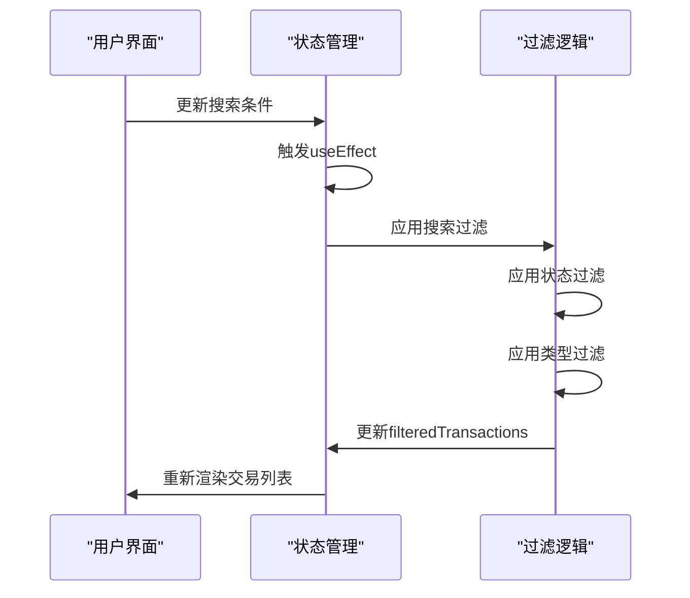
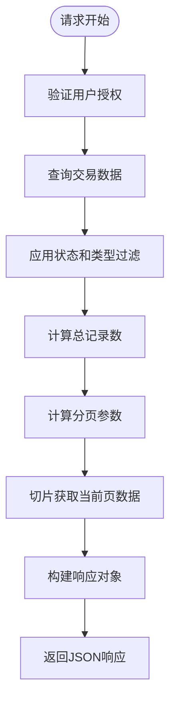
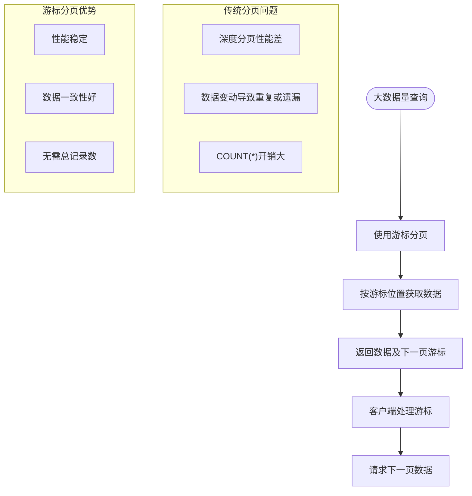
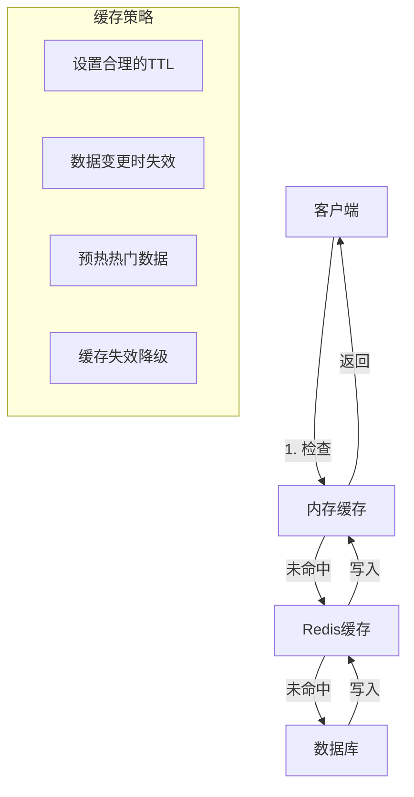
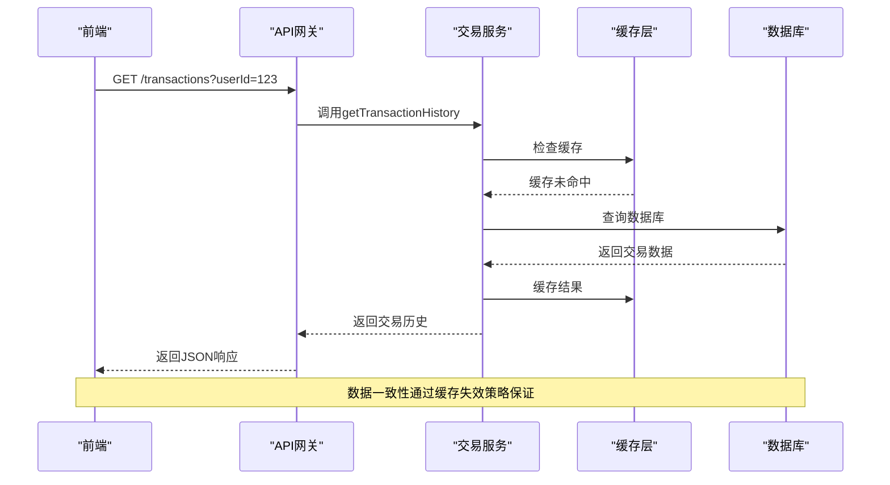
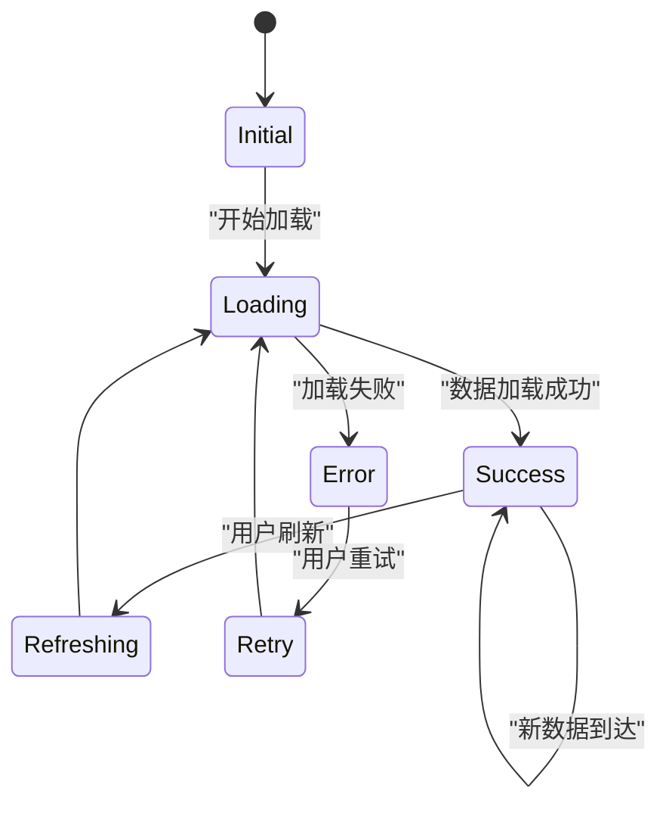

# 交易历史查询

<cite>
**本文档引用的文件**  
- [transactionService.ts](file://src/services/transactionService.ts)
- [TransactionHistory.tsx](file://src/components/Transactions/TransactionHistory.tsx)
- [transaction.ts](file://backend/src/routes/transaction.ts)
</cite>

## 目录
1. [简介](#简介)
2. [核心方法实现](#核心方法实现)
3. [前端组件实现](#前端组件实现)
4. [分页与数据切片机制](#分页与数据切片机制)
5. [性能优化建议](#性能优化建议)
6. [大数据量处理策略](#大数据量处理策略)
7. [缓存机制设想](#缓存机制设想)
8. [后端同步扩展方案](#后端同步扩展方案)
9. [错误处理与加载状态](#错误处理与加载状态)

## 简介
本文档详细说明交易历史查询功能的实现，重点分析 `getTransactionHistory` 和 `getTransactionById` 方法。文档涵盖查询过滤、排序、分页机制，以及前端组件中的实际应用。同时提供性能优化建议和可扩展架构设想。

## 核心方法实现

### getTransactionHistory 方法
该方法实现交易历史的查询功能，支持基于用户ID的过滤、时间倒序排序和分页。



**方法逻辑说明：**
- **参数过滤**：当提供 `userId` 参数时，通过 `filter` 方法筛选出该用户的所有交易记录
- **排序实现**：使用 `sort` 方法对交易记录按时间戳进行倒序排列，确保最新交易显示在前
- **分页切片**：通过 `slice(0, limit)` 获取指定数量的交易记录

**方法签名：**
```typescript
getTransactionHistory(userId?: string, limit: number = 20): Transaction[]
```

**Section sources**
- [transactionService.ts](file://src/services/transactionService.ts#L293-L303)

### getTransactionById 方法
该方法实现根据交易ID进行精确匹配查找的功能。



**方法特点：**
- 使用 `find` 方法进行线性搜索，返回第一个匹配的交易对象
- 时间复杂度为 O(n)，适合小规模数据集
- 返回类型为 `Transaction | undefined`，处理未找到的情况

**方法签名：**
```typescript
getTransactionById(id: string): Transaction | undefined
```

**Section sources**
- [transactionService.ts](file://src/services/transactionService.ts#L306-L308)

## 前端组件实现

### TransactionHistory 组件
该组件实现了交易历史的用户界面，包含搜索、过滤和展示功能。



**组件功能：**
- **状态管理**：使用 React 的 `useState` 管理交易数据、过滤条件和加载状态
- **搜索过滤**：支持按交易ID、货币类型和交易对手进行搜索
- **多维度过滤**：提供状态和类型过滤选项
- **交互功能**：包含复制、导出和刷新等操作

**Section sources**
- [TransactionHistory.tsx](file://src/components/Transactions/TransactionHistory.tsx#L0-L46)

## 分页与数据切片机制

### 前端分页实现
前端组件通过 `useEffect` 监听状态变化，实现动态过滤和分页。



**过滤逻辑：**
```typescript
useEffect(() => {
  let filtered = transactions;
  
  // 搜索过滤
  if (searchTerm) {
    filtered = filtered.filter(tx => 
      tx.id.toLowerCase().includes(searchTerm.toLowerCase()) ||
      tx.fromCurrency.toLowerCase().includes(searchTerm.toLowerCase()) ||
      tx.toCurrency.toLowerCase().includes(searchTerm.toLowerCase()) ||
      tx.counterparty?.toLowerCase().includes(searchTerm.toLowerCase())
    );
  }
  
  // 状态过滤
  if (statusFilter !== "all") {
    filtered = filtered.filter(tx => tx.status === statusFilter);
  }
  
  // 类型过滤
  if (typeFilter !== "all") {
    filtered = filtered.filter(tx => tx.type === typeFilter);
  }
  
  setFilteredTransactions(filtered);
}, [transactions, searchTerm, statusFilter, typeFilter]);
```

**Section sources**
- [TransactionHistory.tsx](file://src/components/Transactions/TransactionHistory.tsx#L134-L170)

### 后端分页实现
后端路由提供了完整的分页支持，包括总页数和当前页信息。



**分页参数：**
- `page`：当前页码，默认为1
- `limit`：每页记录数，默认为20
- `total`：总记录数
- `totalPages`：总页数

**Section sources**
- [transaction.ts](file://backend/src/routes/transaction.ts#L186-L224)

## 性能优化建议

### 索引优化思路
针对交易查询的性能瓶颈，建议实施以下索引策略：

```mermaid
erDiagram
TRANSACTION ||--o{ USER : "belongs to"
TRANSACTION {
string id PK
string userId FK
string status
string type
datetime timestamp
decimal amount
string currency
}
USER {
string id PK
string email
string name
}
INDEX "idx_user_status" on TRANSACTION(userId, status)
INDEX "idx_timestamp" on TRANSACTION(timestamp)
INDEX "idx_type" on TRANSACTION(type)
```

**推荐索引：**
- **复合索引**：在 `(userId, status)` 上创建复合索引，优化用户交易查询
- **时间索引**：在 `timestamp` 字段上创建索引，加速时间排序操作
- **类型索引**：在 `type` 字段上创建索引，提高类型过滤效率

**Section sources**
- [transactionService.ts](file://src/services/transactionService.ts#L275-L308)

## 大数据量处理策略

### 分页策略优化
对于大数据量场景，建议采用以下优化策略：



**策略建议：**
- **游标分页**：使用时间戳或ID作为游标，避免 `OFFSET` 的性能问题
- **懒加载**：滚动时动态加载更多数据，减少初始加载时间
- **预取机制**：预测用户行为，提前加载可能需要的数据

**Section sources**
- [transaction.ts](file://backend/src/routes/transaction.ts#L137-L184)

## 缓存机制设想

### 多层缓存架构
设计一个多层次的缓存系统来提升查询性能。



**缓存层级：**
- **客户端缓存**：浏览器本地存储，减少网络请求
- **内存缓存**：应用进程内缓存，访问速度最快
- **Redis缓存**：分布式缓存，支持数据共享和持久化

**缓存键设计：**
- `transactions:user:{userId}:page:{page}:limit:{limit}`
- `transaction:id:{id}`
- `transactions:stats:{timeRange}`

**Section sources**
- [transactionService.ts](file://src/services/transactionService.ts#L305-L338)

## 后端同步扩展方案

### API 同步机制
设计前后端数据同步的完整方案。



**同步策略：**
- **读写分离**：查询走缓存，写操作更新数据库并失效缓存
- **事件驱动**：使用消息队列通知缓存更新
- **版本控制**：为数据添加版本号，确保一致性

**Section sources**
- [transaction.ts](file://backend/src/routes/transaction.ts#L137-L184)

## 错误处理与加载状态

### 加载状态管理
组件实现了完整的加载状态管理，提供良好的用户体验。



**状态处理：**
- **加载中**：显示骨架屏动画，提示用户等待
- **加载完成**：渲染交易列表
- **无数据**：显示友好提示，引导用户操作
- **错误状态**：显示错误信息，提供重试选项

**Section sources**
- [TransactionHistory.tsx](file://src/components/Transactions/TransactionHistory.tsx#L87-L132)