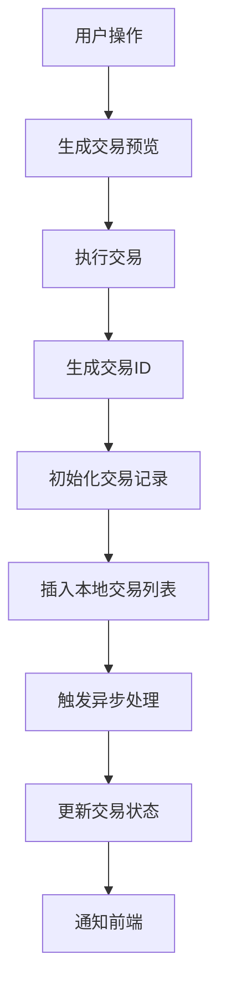
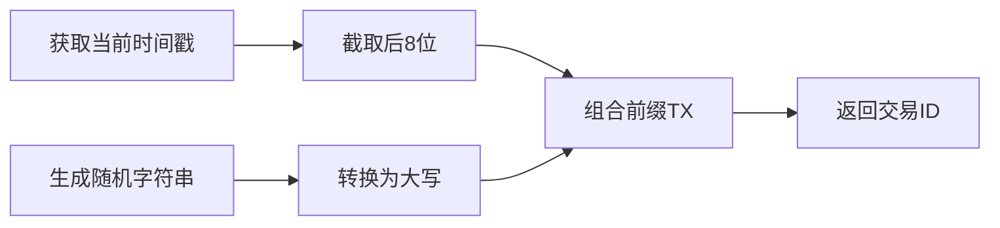
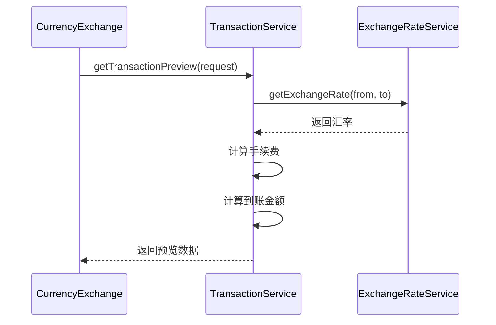
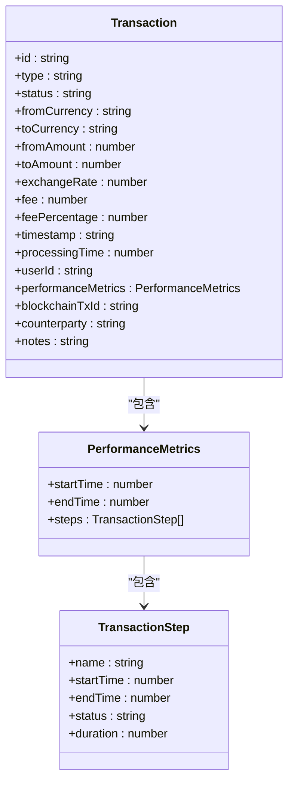
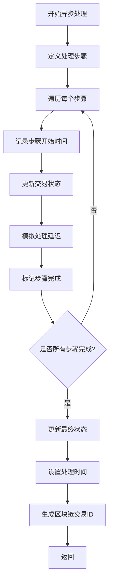
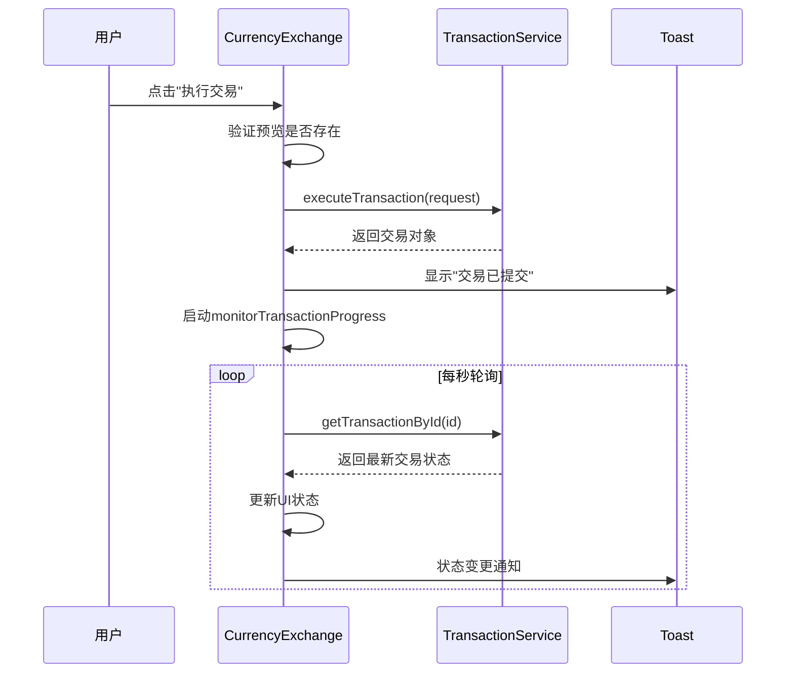
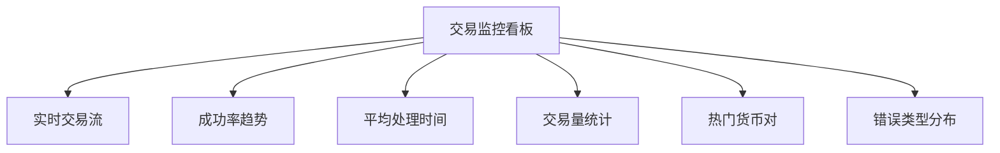

# 交易执行流程

<cite>
**本文档引用的文件**  
- [transactionService.ts](file://src/services/transactionService.ts)
- [CurrencyExchange.tsx](file://src/components/Exchange/CurrencyExchange.tsx)
- [TransactionExecutor.tsx](file://src/components/Blockchain/TransactionExecutor.tsx)
</cite>

## 目录
1. [简介](#简介)
2. [交易执行流程概览](#交易执行流程概览)
3. [核心组件分析](#核心组件分析)
4. [交易ID生成策略](#交易id生成策略)
5. [交易预览与初始化](#交易预览与初始化)
6. [异步处理机制](#异步处理机制)
7. [前端调用链路](#前端调用链路)
8. [错误处理与边界情况](#错误处理与边界情况)
9. [状态同步与用户界面](#状态同步与用户界面)
10. [调试与监控建议](#调试与监控建议)

## 简介
本文档深入解析 `executeTransaction` 方法的完整执行路径，涵盖交易ID生成、交易记录初始化、异步处理流程、前端调用示例、错误处理机制及状态同步策略。系统基于 `transactionService` 服务实现交易生命周期管理，通过前端组件触发并监控交易状态。

## 交易执行流程概览
交易执行流程从用户发起兑换请求开始，经过预览生成、交易提交、异步处理到最终状态更新。整个流程由前端组件调用 `transactionService.executeTransaction` 方法驱动，后端服务负责交易记录创建、状态管理与异步处理。



**Diagram sources**
- [transactionService.ts](file://src/services/transactionService.ts#L153-L196)
- [CurrencyExchange.tsx](file://src/components/Exchange/CurrencyExchange.tsx#L139-L144)

## 核心组件分析

### TransactionService 服务
`TransactionService` 是交易处理的核心服务类，负责交易的创建、预览、执行、状态更新和历史查询。该服务维护一个本地交易列表，并通过异步方法模拟交易处理过程。

**Section sources**
- [transactionService.ts](file://src/services/transactionService.ts#L52-L388)

### 前端交易组件
`CurrencyExchange` 组件提供用户界面用于发起货币兑换交易，而 `TransactionExecutor` 组件则用于执行链上交易。两者均通过调用 `transactionService` 来提交交易。

**Section sources**
- [CurrencyExchange.tsx](file://src/components/Exchange/CurrencyExchange.tsx)
- [TransactionExecutor.tsx](file://src/components/Blockchain/TransactionExecutor.tsx)

## 交易ID生成策略
交易ID采用时间戳与随机字符串组合的方式生成，确保唯一性和可读性。



**Diagram sources**
- [transactionService.ts](file://src/services/transactionService.ts#L276-L280)

### 生成逻辑
- **时间戳部分**：使用 `Date.now().toString()` 获取当前毫秒级时间戳，取其后8位
- **随机部分**：使用 `Math.random().toString(36)` 生成基数为36的随机字符串，截取第2到第8个字符并转为大写
- **最终格式**：`TX` + 时间戳后8位 + 随机字符串，例如 `TX12345678ABCDEF`

**Section sources**
- [transactionService.ts](file://src/services/transactionService.ts#L276-L280)

## 交易预览与初始化

### 获取交易预览
在执行交易前，系统调用 `getTransactionPreview` 方法获取交易基础数据，包括汇率、手续费、预计到账金额等。



**Diagram sources**
- [transactionService.ts](file://src/services/transactionService.ts#L112-L150)
- [CurrencyExchange.tsx](file://src/components/Exchange/CurrencyExchange.tsx#L106-L111)

### 交易对象构建
交易对象初始化包含以下关键字段：
- **ID**：由 `generateTransactionId()` 生成
- **状态**：初始设置为 `processing`
- **时间戳**：使用 `new Date().toISOString()` 记录
- **性能指标**：包含 `startTime`、`endTime` 和 `steps` 数组
- **业务数据**：从预览中获取 `toAmount`、`exchangeRate`、`fee` 等



**Diagram sources**
- [transactionService.ts](file://src/services/transactionService.ts#L153-L196)

**Section sources**
- [transactionService.ts](file://src/services/transactionService.ts#L153-L196)

## 异步处理机制
交易提交后，系统立即返回交易对象，同时启动 `processTransactionAsync` 方法在后台模拟处理流程。



**Diagram sources**
- [transactionService.ts](file://src/services/transactionService.ts#L199-L247)

### 处理步骤
异步处理包含7个步骤，每个步骤都有模拟的处理时间：
1. 验证交易参数（150ms）
2. 检查余额（100ms）
3. 获取最新汇率（200ms）
4. 风险评估（300ms）
5. 执行兑换（400ms）
6. 区块链确认（600ms）
7. 更新余额（150ms）

处理过程中会实时更新交易对象的状态和性能指标数组。

### 成功与失败处理
- **成功率**：95%（通过 `Math.random() > 0.05` 模拟）
- **失败时**：设置状态为 `failed`，添加失败原因说明
- **成功时**：设置状态为 `completed`，计算总处理时间

**Section sources**
- [transactionService.ts](file://src/services/transactionService.ts#L199-L247)

## 前端调用链路
前端通过 `CurrencyExchange` 组件中的 `executeTransaction` 方法发起交易，形成完整的用户操作链路。



**Diagram sources**
- [CurrencyExchange.tsx](file://src/components/Exchange/CurrencyExchange.tsx#L129-L166)
- [transactionService.ts](file://src/services/transactionService.ts#L153-L196)

### 调用示例
```typescript
const transaction = await transactionService.executeTransaction({
  fromCurrency,
  toCurrency,
  fromAmount: parseFloat(fromAmount),
  userId: 'demo-user'
});
```

调用后立即显示交易提交通知，并启动进度监控器 `monitorTransactionProgress`，通过轮询 `getTransactionById` 获取最新状态。

**Section sources**
- [CurrencyExchange.tsx](file://src/components/Exchange/CurrencyExchange.tsx#L139-L144)

## 错误处理与边界情况
系统实现了多层次的错误处理机制，确保交易流程的健壮性。

### 错误类型与处理
| 错误类型 | 触发条件 | 处理方式 |
|---------|---------|---------|
| 参数验证失败 | 缺少必要参数 | 抛出"Invalid transaction parameters" |
| 余额不足 | 余额小于转账金额 | 抛出"Insufficient balance" |
| 预览生成失败 | 汇率服务异常 | 显示"无法生成交易预览" |
| 交易执行失败 | 内部处理异常 | 显示"交易执行失败，请稍后重试" |
| 交易确认失败 | 区块链确认超时 | 设置状态为failed并记录原因 |

### 边界情况处理
- **重复交易ID**：由于ID包含时间戳和随机字符串，冲突概率极低
- **并发交易**：使用 `unshift` 将新交易插入列表头部，保证最新交易优先显示
- **网络延迟**：前端通过轮询机制处理网络延迟，后端无超时限制
- **大额交易**：通过 `calculatePriceImpact` 方法计算价格影响，超过阈值时提示用户

**Section sources**
- [transactionService.ts](file://src/services/transactionService.ts#L153-L196)
- [TransactionExecutor.tsx](file://src/components/Blockchain/TransactionExecutor.tsx#L88-L187)

## 状态同步与用户界面
系统通过多种机制确保用户界面与交易状态保持同步。

### 状态同步策略
1. **即时反馈**：交易提交后立即更新UI，显示"处理中"状态
2. **轮询机制**：通过 `monitorTransactionProgress` 每秒查询交易状态
3. **性能指标展示**：将 `performanceMetrics.steps` 映射为UI进度条
4. **最终状态通知**：交易完成后通过Toast通知用户结果

### UI状态映射
| 交易状态 | UI显示 | 视觉反馈 |
|---------|-------|---------|
| processing | "处理中..." | 加载动画 |
| completed | "交易完成" | 绿色对勾图标 |
| failed | "交易失败" | 红色叉号图标 |
| pending | "等待中" | 时钟图标 |

**Section sources**
- [CurrencyExchange.tsx](file://src/components/Exchange/CurrencyExchange.tsx#L129-L166)
- [TransactionExecutor.tsx](file://src/components/Blockchain/TransactionExecutor.tsx#L88-L187)

## 调试与监控建议

### 调试技巧
- **日志追踪**：检查 `console.error` 输出的错误信息
- **状态检查**：通过 `getTransactionById` 查询特定交易的完整状态
- **性能分析**：查看 `performanceMetrics` 中的各步骤耗时
- **历史查询**：使用 `getTransactionHistory` 验证交易是否正确插入

### 监控指标
- **交易成功率**：通过 `getTransactionStats` 获取成功率统计
- **平均处理时间**：监控 `averageProcessingTime` 指标
- **交易量趋势**：分析 `totalVolume` 随时间变化
- **热门货币对**：关注 `topCurrencyPairs` 数据

### 建议的监控看板


**Section sources**
- [transactionService.ts](file://src/services/transactionService.ts#L350-L388)