# 交易服务管理

<cite>
**本文档引用的文件**
- [transactionService.ts](file://src/services/transactionService.ts)
- [CurrencyExchange.tsx](file://src/components/Exchange/CurrencyExchange.tsx)
- [TransactionHistory.tsx](file://src/components/Transactions/TransactionHistory.tsx)
</cite>

## 目录
1. [简介](#简介)
2. [核心组件](#核心组件)
3. [交易预览生成](#交易预览生成)
4. [交易执行流程](#交易执行流程)
5. [异步处理机制](#异步处理机制)
6. [交易历史查询](#交易历史查询)
7. [ID生成策略](#id生成策略)
8. [业务规则](#业务规则)
9. [交易状态机](#交易状态机)
10. [前端使用示例](#前端使用示例)
11. [模拟数据生成](#模拟数据生成)
12. [错误处理与排查](#错误处理与排查)
13. [性能优化建议](#性能优化建议)

## 简介
交易服务管理文档详细说明了 `TransactionService` 类的实现机制，涵盖了交易预览生成、交易执行流程、异步处理机制和交易历史查询功能。文档解释了交易ID和区块链交易ID的生成策略，以及手续费计算、价格影响评估和处理时间估算等业务规则。同时描述了交易状态机（pending、processing、completed、failed）的转换逻辑和性能指标记录机制。提供了交易服务在前端组件中的使用示例，并说明了模拟交易数据的生成逻辑及其在开发环境中的作用。

## 核心组件

`TransactionService` 类是交易系统的核心组件，负责管理所有交易相关的操作。该服务通过单例模式实例化，确保在整个应用中只有一个实例存在。

**Section sources**
- [transactionService.ts](file://src/services/transactionService.ts#L52-L388)

## 交易预览生成

交易预览功能通过 `getTransactionPreview` 方法实现，该方法在用户确认交易前提供详细的交易信息预览。

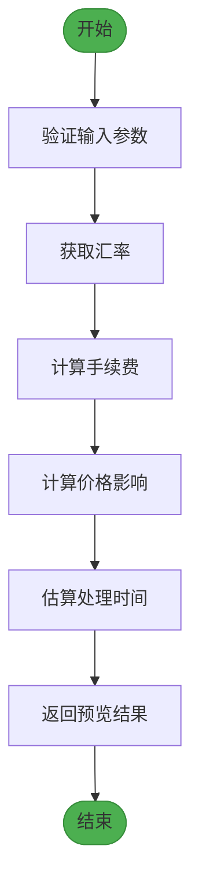

**Diagram sources**
- [transactionService.ts](file://src/services/transactionService.ts#L112-L150)

**Section sources**
- [transactionService.ts](file://src/services/transactionService.ts#L112-L150)

## 交易执行流程

交易执行流程通过 `executeTransaction` 方法实现，该方法处理交易的创建和初始化。

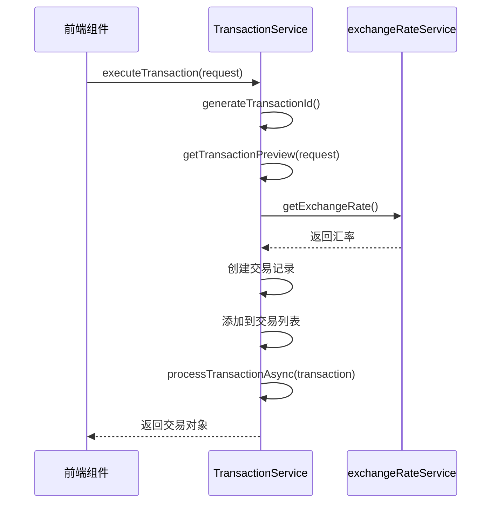

**Diagram sources**
- [transactionService.ts](file://src/services/transactionService.ts#L153-L196)

**Section sources**
- [transactionService.ts](file://src/services/transactionService.ts#L153-L196)

## 异步处理机制

异步处理机制通过 `processTransactionAsync` 方法实现，该方法模拟了交易的后台处理过程。

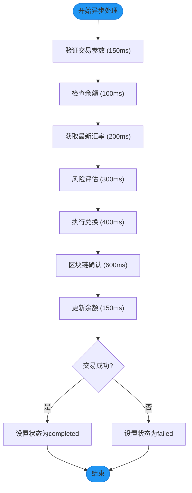

**Diagram sources**
- [transactionService.ts](file://src/services/transactionService.ts#L199-L247)

**Section sources**
- [transactionService.ts](file://src/services/transactionService.ts#L199-L247)

## 交易历史查询

交易历史查询功能通过 `getTransactionHistory` 方法实现，支持按用户ID过滤和结果限制。

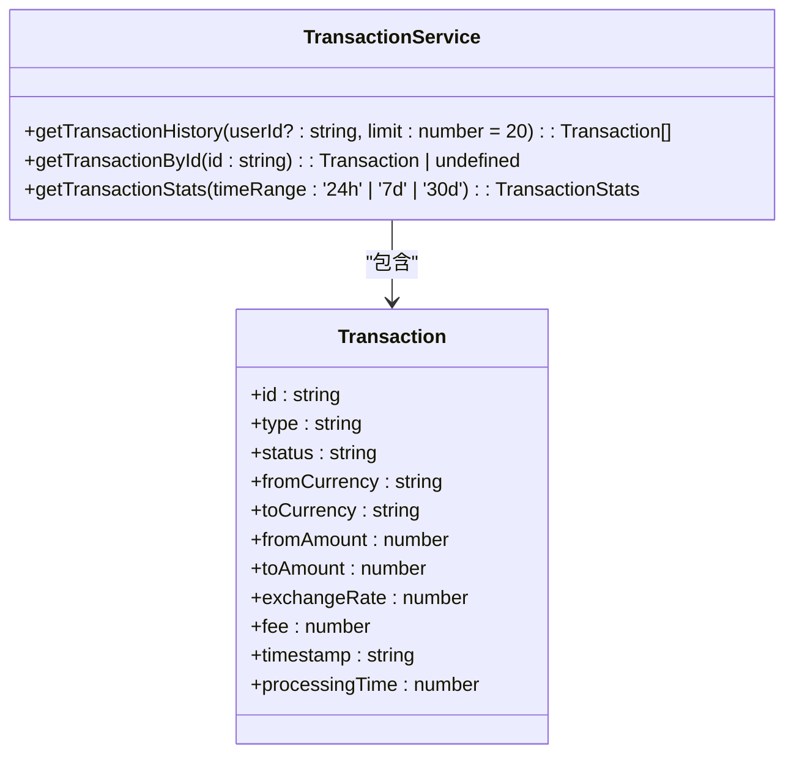

**Diagram sources**
- [transactionService.ts](file://src/services/transactionService.ts#L293-L303)

**Section sources**
- [transactionService.ts](file://src/services/transactionService.ts#L293-L303)

## ID生成策略

### 交易ID生成
交易ID通过 `generateTransactionId` 方法生成，采用时间戳和随机字符串组合的方式。

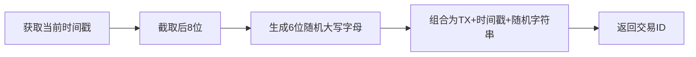

**Diagram sources**
- [transactionService.ts](file://src/services/transactionService.ts#L276-L280)

### 区块链交易ID生成
区块链交易ID通过 `generateBlockchainTxId` 方法生成，模拟以太坊交易哈希格式。

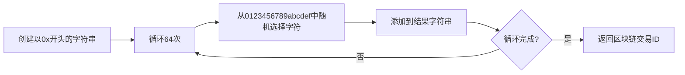

**Diagram sources**
- [transactionService.ts](file://src/services/transactionService.ts#L283-L290)

## 业务规则

### 手续费计算
手续费计算遵循以下规则：
- 基础费率：0.2%
- 最低手续费：1单位
- 最高手续费：100单位

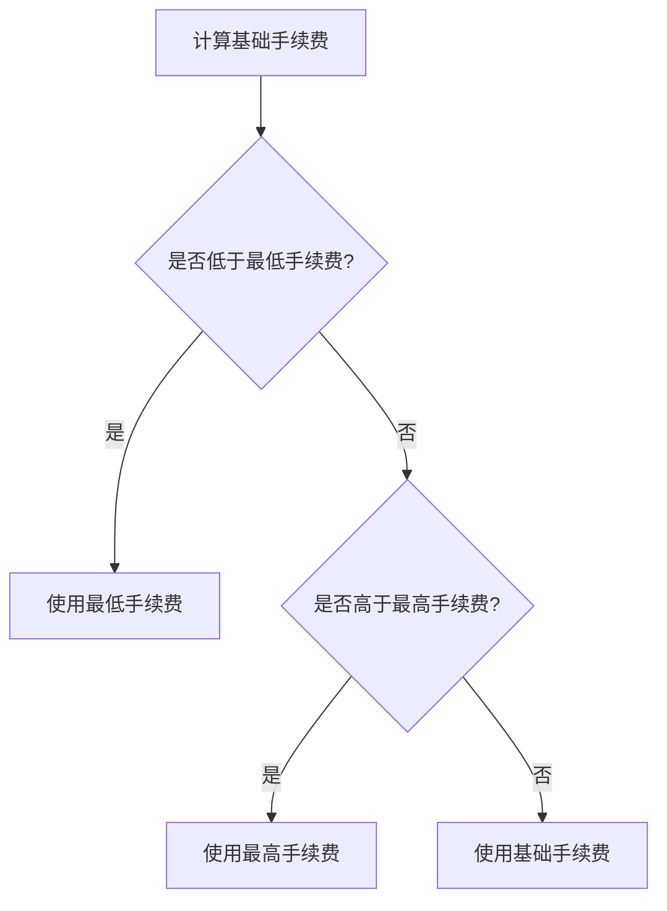

### 价格影响评估
价格影响通过 `calculatePriceImpact` 方法计算，基于交易金额和基础流动性。

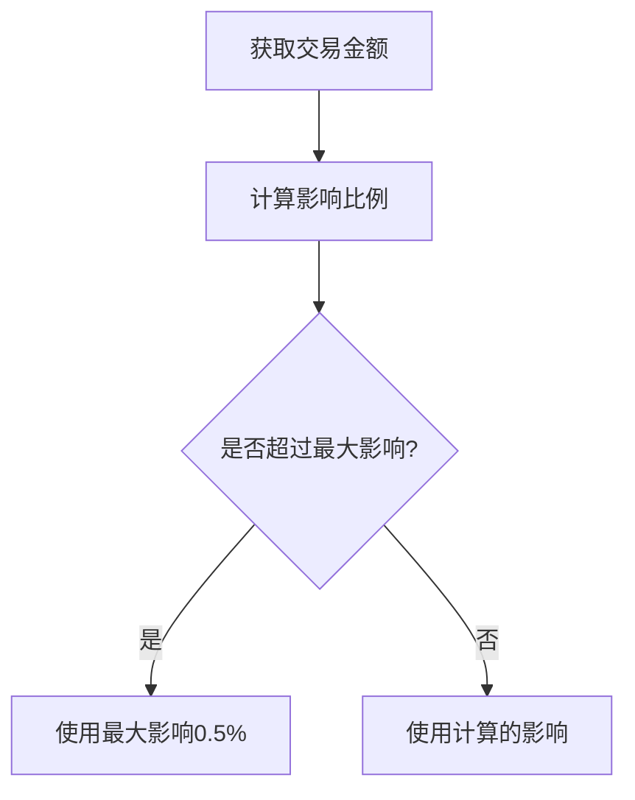

### 处理时间估算
处理时间通过 `estimateProcessingTime` 方法估算，根据交易金额分段。

```mermaid
flowchart TD
A[获取交易金额] --> B{金额 < 1000?}
B --> |是| C[返回"< 30秒"]
B --> |否| D{金额 < 10000?}
D --> |是| E[返回"30-60秒"]
D --> |否| F{金额 < 100000?}
F --> |是| G[返回"1-2分钟"]
F --> |否| H[返回"2-5分钟"]
```

**Section sources**
- [transactionService.ts](file://src/services/transactionService.ts#L249-L274)

## 交易状态机

交易状态机定义了交易的生命周期，包含以下状态：
- pending：待处理
- processing：处理中
- completed：已完成
- failed：失败

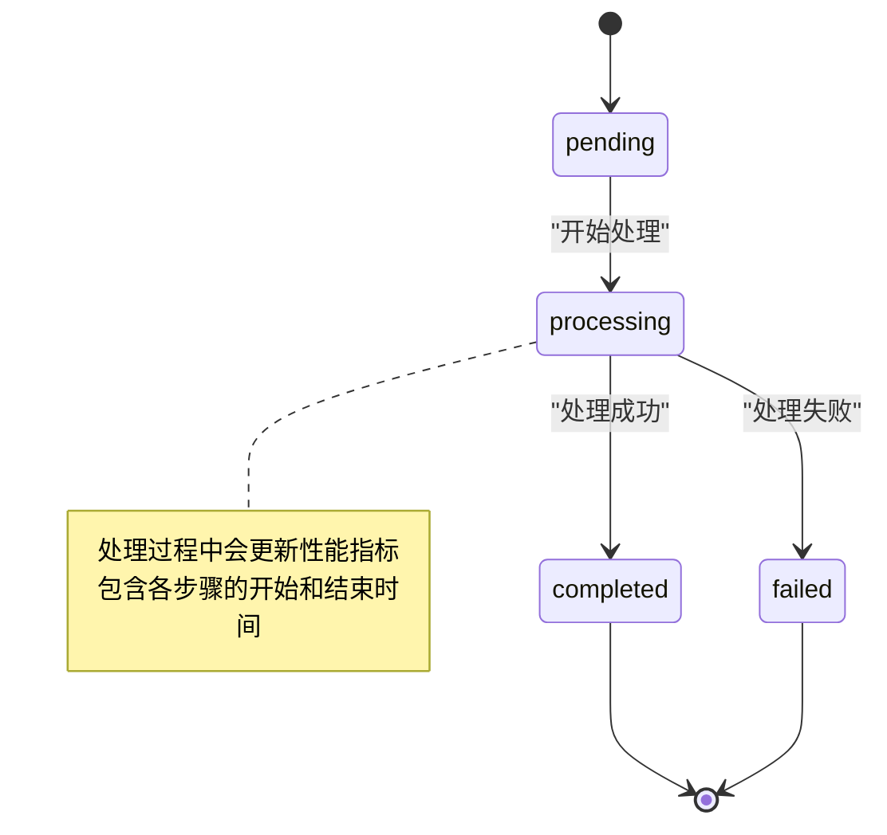

**Section sources**
- [transactionService.ts](file://src/services/transactionService.ts#L199-L247)

## 前端使用示例

### 货币兑换组件
`CurrencyExchange` 组件展示了如何使用交易服务。

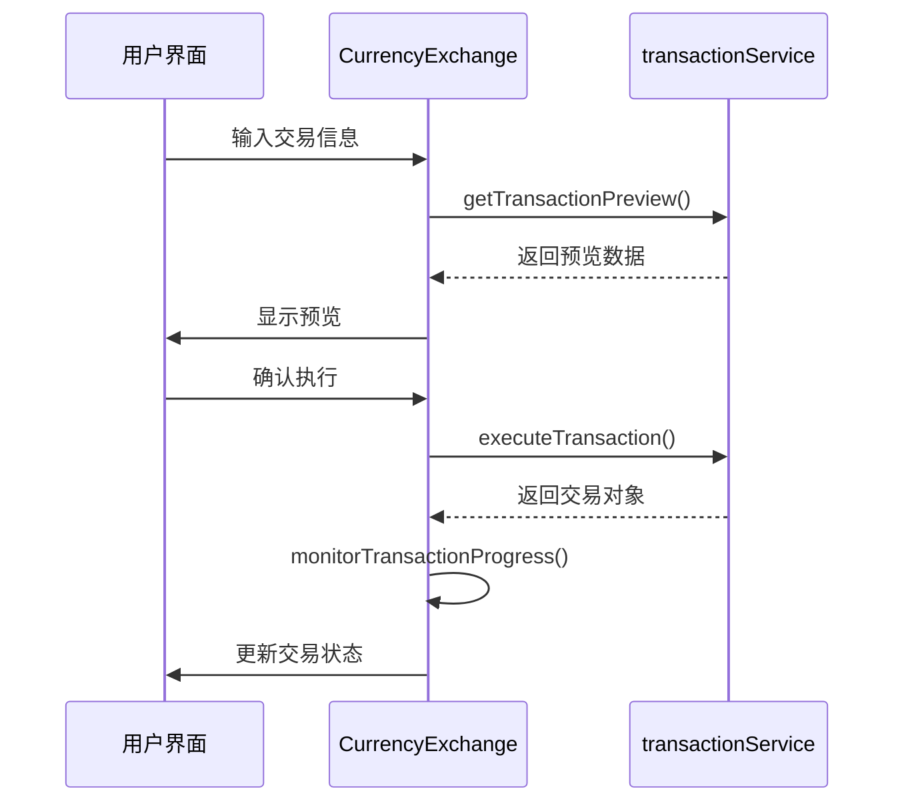

**Diagram sources**
- [CurrencyExchange.tsx](file://src/components/Exchange/CurrencyExchange.tsx#L106-L111)
- [CurrencyExchange.tsx](file://src/components/Exchange/CurrencyExchange.tsx#L139-L144)

**Section sources**
- [CurrencyExchange.tsx](file://src/components/Exchange/CurrencyExchange.tsx#L106-L144)

## 模拟数据生成

模拟数据生成逻辑通过 `initializeMockTransactions` 和 `generateRealtimeData` 方法实现。

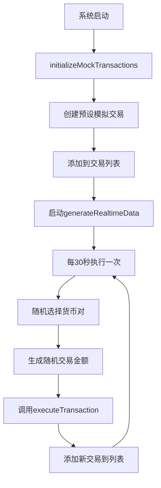

**Section sources**
- [transactionService.ts](file://src/services/transactionService.ts#L62-L90)
- [transactionService.ts](file://src/services/transactionService.ts#L368-L387)

## 错误处理与排查

### 错误处理策略
交易服务实现了全面的错误处理机制：

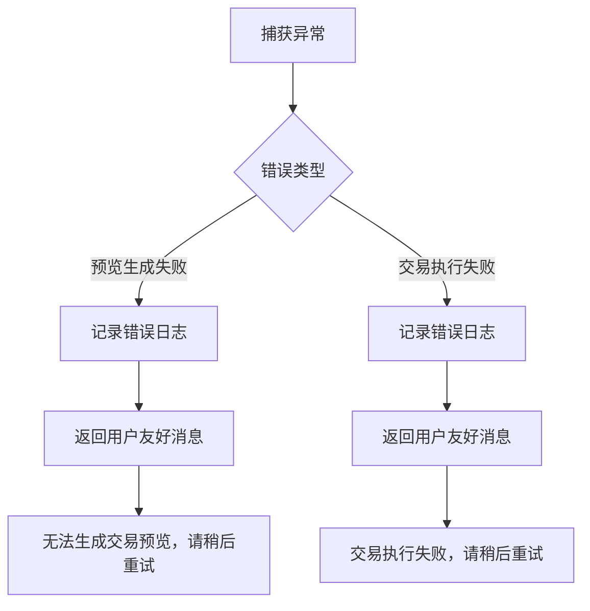

### 常见问题排查
| 问题现象 | 可能原因 | 解决方案 |
|---------|--------|---------|
| 无法生成交易预览 | 汇率服务不可用 | 检查网络连接，确认汇率API正常 |
| 交易长时间处于处理中 | 后台处理延迟 | 检查系统负载，优化处理流程 |
| 交易失败率高 | 网络拥堵 | 建议用户在网络状况良好时重试 |
| 手续费计算异常 | 金额超出范围 | 验证输入金额是否在合理范围内 |

**Section sources**
- [transactionService.ts](file://src/services/transactionService.ts#L112-L150)
- [transactionService.ts](file://src/services/transactionService.ts#L153-L196)

## 性能优化建议

1. **缓存策略**：对频繁访问的数据实施缓存，减少重复计算
2. **批量处理**：将多个小交易合并为批量处理，提高效率
3. **异步优化**：优化异步处理流程，减少不必要的等待时间
4. **数据库索引**：为常用查询字段创建索引，加快查询速度
5. **连接池**：使用数据库连接池，避免频繁创建和销毁连接

**Section sources**
- [transactionService.ts](file://src/services/transactionService.ts#L52-L388)