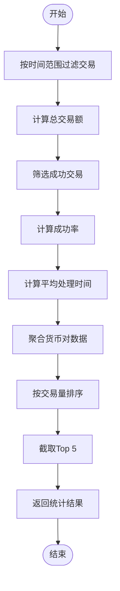
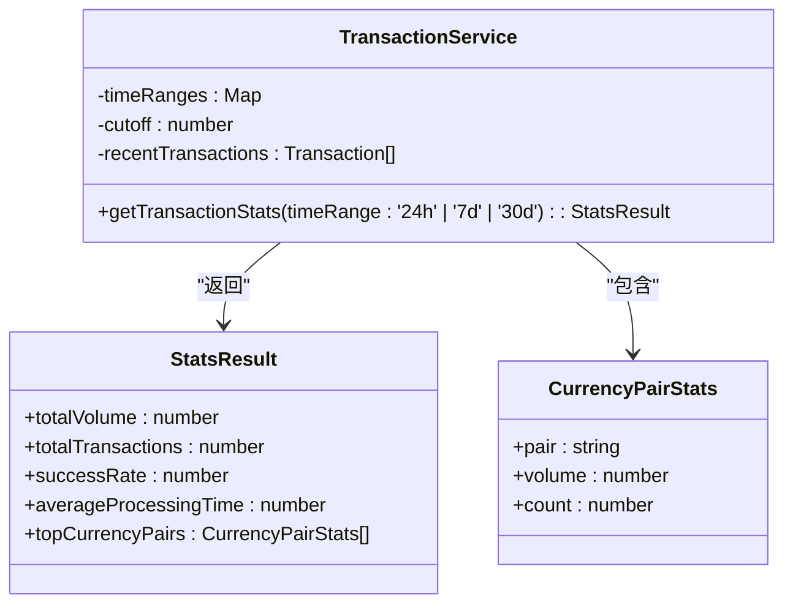
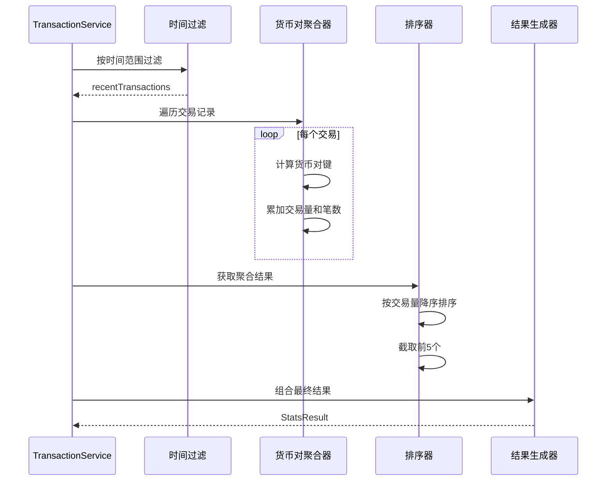
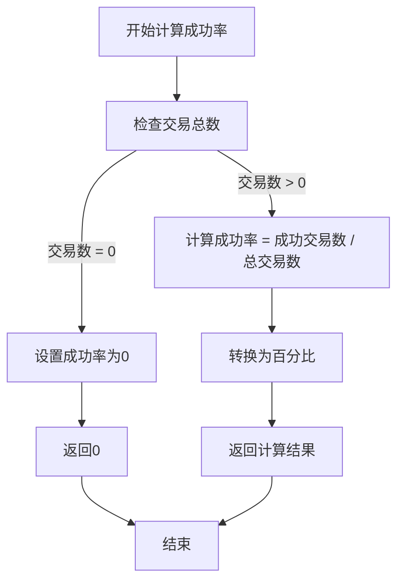
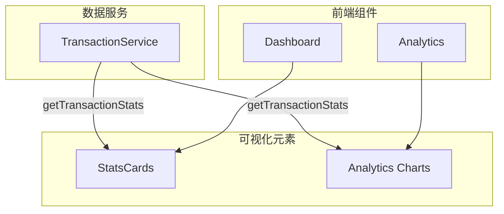

# 交易统计分析

<cite>
**Referenced Files in This Document**   
- [transactionService.ts](file://src/services/transactionService.ts)
- [StatsCards.tsx](file://src/components/Dashboard/StatsCards.tsx)
- [Analytics.tsx](file://src/components/Analytics/Analytics.tsx)
</cite>

## 目录
1. [核心统计逻辑](#核心统计逻辑)
2. [时间范围过滤机制](#时间范围过滤机制)
3. [货币对聚合分析](#货币对聚合分析)
4. [边界条件处理](#边界条件处理)
5. [可视化应用场景](#可视化应用场景)
6. [性能考量与优化建议](#性能考量与优化建议)

## 核心统计逻辑

`getTransactionStats` 方法实现了全面的交易数据分析功能，通过一系列数据处理步骤生成关键业务指标。该方法首先根据指定的时间范围筛选交易数据，然后计算总交易额、交易笔数、成功率和平均处理时间等核心指标。



**Diagram sources**
- [transactionService.ts](file://src/services/transactionService.ts#L311-L363)

**Section sources**
- [transactionService.ts](file://src/services/transactionService.ts#L311-L363)

## 时间范围过滤机制

该方法支持三种时间范围（24小时、7天、30天）的交易数据过滤。通过预定义的时间范围映射对象，将字符串参数转换为毫秒值，然后计算时间截止点，最后使用数组过滤方法获取符合条件的交易记录。



**Diagram sources**
- [transactionService.ts](file://src/services/transactionService.ts#L311-L363)

**Section sources**
- [transactionService.ts](file://src/services/transactionService.ts#L311-L363)

## 货币对聚合分析

货币对统计采用哈希表聚合模式，对每个货币对（如USD/CNY）进行交易量和交易笔数的累加。聚合完成后，通过排序和截取操作获取交易量最高的前五个货币对，为业务决策提供数据支持。



**Diagram sources**
- [transactionService.ts](file://src/services/transactionService.ts#L311-L363)

**Section sources**
- [transactionService.ts](file://src/services/transactionService.ts#L311-L363)

## 边界条件处理

方法实现了完善的边界条件处理机制，特别是在成功率计算时考虑了分母为零的情况。当指定时间范围内没有交易记录时，成功率被安全地设置为0，避免了除以零的错误。



**Diagram sources**
- [transactionService.ts](file://src/services/transactionService.ts#L311-L363)

**Section sources**
- [transactionService.ts](file://src/services/transactionService.ts#L311-L363)

## 可视化应用场景

交易统计数据在系统的多个可视化组件中得到应用，包括仪表板统计卡片和分析报表页面。这些组件通过直观的图表和指标展示，帮助用户快速了解平台的交易状况。



**Diagram sources**
- [transactionService.ts](file://src/services/transactionService.ts#L311-L363)
- [StatsCards.tsx](file://src/components/Dashboard/StatsCards.tsx)
- [Analytics.tsx](file://src/components/Analytics/Analytics.tsx)

**Section sources**
- [StatsCards.tsx](file://src/components/Dashboard/StatsCards.tsx)
- [Analytics.tsx](file://src/components/Analytics/Analytics.tsx)

## 性能考量与优化建议

当前的统计方法在大数据集下可能存在性能瓶颈，因为每次调用都需要遍历所有交易记录。建议的优化方案包括引入后端聚合查询、实现缓存机制以及考虑实时性与准确性的权衡策略。

```mermaid
flowchart LR
A[当前实现] --> B[内存遍历]
B --> C[O(n)时间复杂度]
C --> D[大数据集性能下降]
E[优化方案] --> F[后端聚合查询]
E --> G[Redis缓存]
E --> H[定时预计算]
E --> I[流式处理]
F --> J[数据库层面聚合]
G --> K[减少重复计算]
H --> L[提前生成统计]
I --> M[实时数据处理]
```

**Diagram sources**
- [transactionService.ts](file://src/services/transactionService.ts#L311-L363)

**Section sources**
- [transactionService.ts](file://src/services/transactionService.ts#L311-L363)