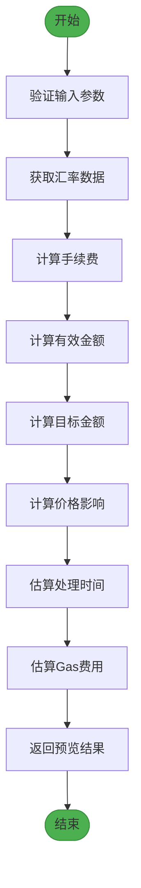
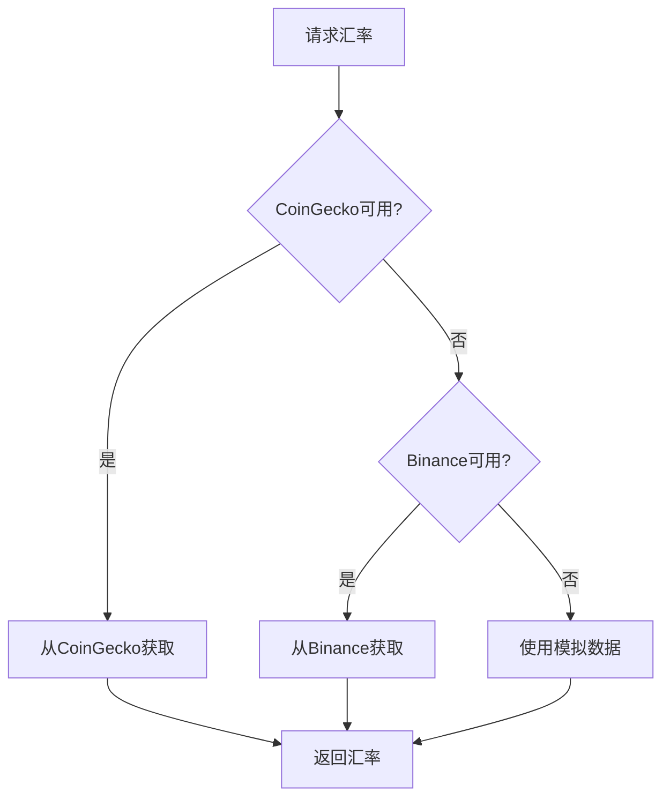
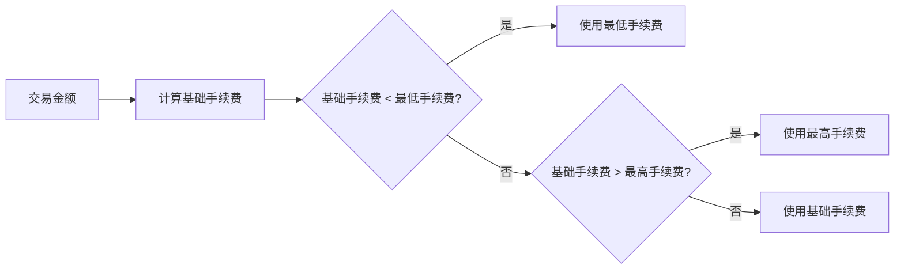
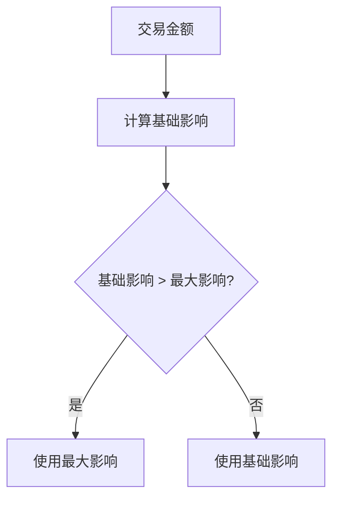
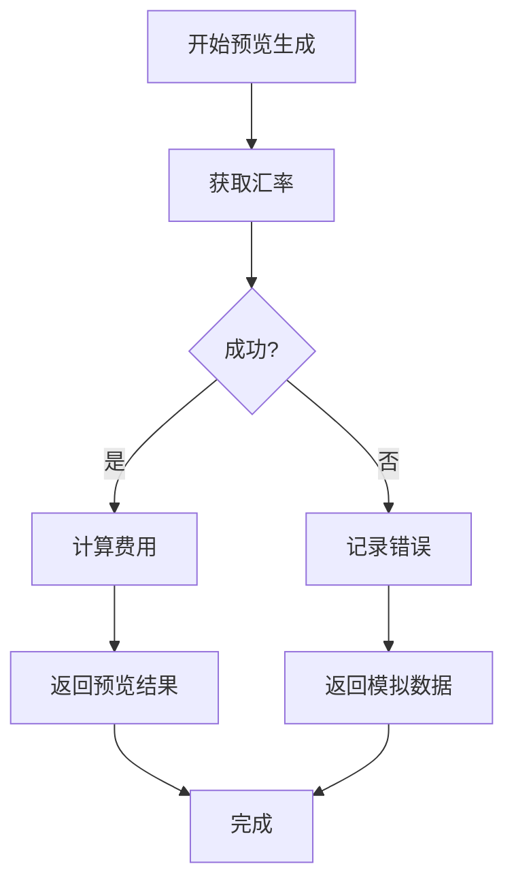
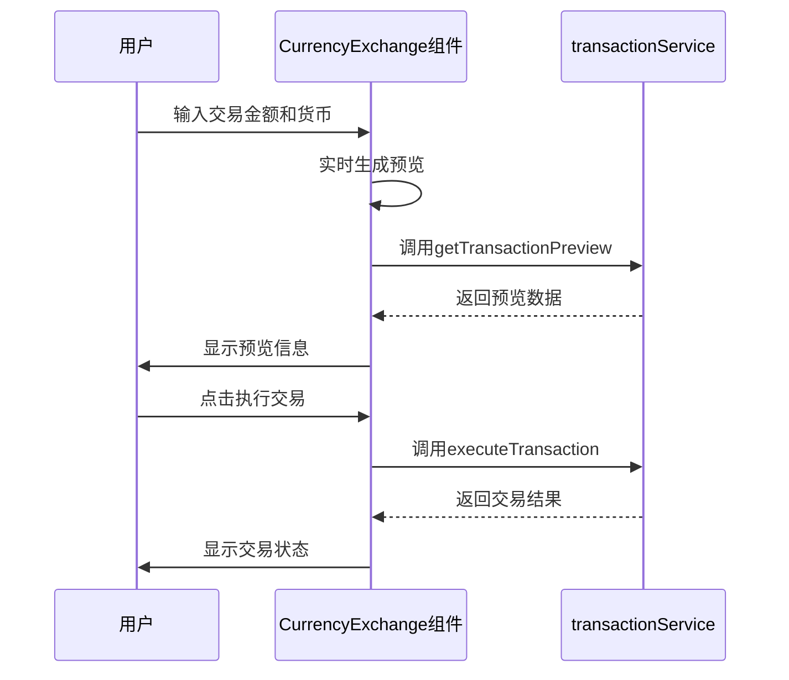

# 交易预览生成

<cite>
**Referenced Files in This Document**  
- [transactionService.ts](file://src/services/transactionService.ts)
- [exchangeRateService.ts](file://src/services/exchangeRateService.ts)
- [CurrencyExchange.tsx](file://src/components/Exchange/CurrencyExchange.tsx)
</cite>

## 目录
1. [简介](#简介)
2. [核心实现机制](#核心实现机制)
3. [汇率获取与缓存策略](#汇率获取与缓存策略)
4. [费用与金额计算](#费用与金额计算)
5. [价格影响与处理时间](#价格影响与处理时间)
6. [Gas费用估算](#gas费用估算)
7. [错误处理与异常捕获](#错误处理与异常捕获)
8. [前端集成与使用场景](#前端集成与使用场景)
9. [性能优化建议](#性能优化建议)
10. [常见问题排查](#常见问题排查)
11. [后端API集成](#后端api集成)

## 简介

交易预览生成功能是跨链交易平台的核心组件，为用户提供交易执行前的详细预估信息。该功能通过`getTransactionPreview`方法实现，为用户展示交易金额、手续费、汇率、处理时间等关键信息，帮助用户做出明智的交易决策。

本文档详细阐述了交易预览的完整实现机制，包括汇率获取、费用计算、价格影响分析、处理时间估算等核心功能。同时，文档还涵盖了错误处理、前端集成和性能优化等关键方面，为开发者提供全面的技术参考。

## 核心实现机制

交易预览生成的核心是`getTransactionPreview`方法，该方法接收交易请求参数并返回详细的预览信息。整个流程包括汇率获取、费用计算、价格影响分析和处理时间估算等多个步骤。



**Diagram sources**
- [transactionService.ts](file://src/services/transactionService.ts#L112-L150)

**Section sources**
- [transactionService.ts](file://src/services/transactionService.ts#L112-L150)

## 汇率获取与缓存策略

### 汇率数据源

系统通过`exchangeRateService`获取实时汇率数据，采用多层数据源策略确保服务的高可用性：

1. **CoinGecko API**：作为主要数据源，提供实时加密货币和法币汇率
2. **Binance API**：作为备用数据源，当CoinGecko不可用时自动切换
3. **模拟数据**：开发环境和API完全失败时的最后保障



**Diagram sources**
- [exchangeRateService.ts](file://src/services/exchangeRateService.ts#L17-L281)

### 缓存机制

为提高性能和减少API调用，系统实现了30秒的内存缓存机制：

- **缓存键**：`from-to`货币对组合
- **缓存时长**：30秒（30000毫秒）
- **缓存策略**：LRU（最近最少使用）内存缓存

当请求的汇率在缓存有效期内，系统直接返回缓存结果，避免重复的网络请求。

**Section sources**
- [exchangeRateService.ts](file://src/services/exchangeRateService.ts#L17-L281)

## 费用与金额计算

### 手续费计算

系统采用分层手续费计算模型，确保手续费在合理范围内：



具体计算逻辑如下：
- **基础费率**：0.2%（`FEE_PERCENTAGE = 0.002`）
- **最低手续费**：1单位（`MIN_FEE = 1`）
- **最高手续费**：100单位（`MAX_FEE = 100`）

**Section sources**
- [transactionService.ts](file://src/services/transactionService.ts#L112-L150)

### 金额计算

交易金额的计算分为多个步骤：

1. **有效金额**：从金额减去手续费
   - `effectiveAmount = fromAmount - fee`
2. **目标金额**：有效金额乘以汇率
   - `toAmount = effectiveAmount * exchangeRate.rate`
3. **价格影响调整**：考虑大额交易的价格影响
   - `finalToAmount = toAmount * (1 - priceImpact)`

**Section sources**
- [transactionService.ts](file://src/services/transactionService.ts#L112-L150)

## 价格影响与处理时间

### 价格影响计算

价格影响是大额交易的重要考虑因素，系统通过流动性模型计算价格影响：



计算公式：
- **基础流动性**：1,000,000单位
- **价格影响**：`Math.min(0.005, amount / baseLiquidity * 0.1)`
- **最大影响**：0.5%（防止过度影响）

**Section sources**
- [transactionService.ts](file://src/services/transactionService.ts#L250-L254)

### 处理时间估算

系统根据交易金额大小分级估算处理时间：

| 交易金额范围 | 估算处理时间 |
|------------|------------|
| < 1,000 | < 30秒 |
| 1,000 - 10,000 | 30-60秒 |
| 10,000 - 100,000 | 1-2分钟 |
| > 100,000 | 2-5分钟 |

这种分级策略为用户提供了合理的预期，同时反映了大额交易需要更多处理时间的实际情况。

**Section sources**
- [transactionService.ts](file://src/services/transactionService.ts#L257-L262)

## Gas费用估算

### 判断条件

系统通过检查交易涉及的货币类型来判断是否需要估算Gas费用：

- **加密货币**：ETH、USDT、USDC、BTC
- **法币**：USD、CNY、RUB

当交易涉及任何加密货币时，系统会估算Gas费用。

### 计算方式

Gas费用采用随机范围估算模型：
- **范围**：5-55美元
- **计算公式**：`Math.random() * 50 + 5`

这种估算方式反映了区块链网络Gas费用的波动性，为用户提供合理的费用预期。

**Section sources**
- [transactionService.ts](file://src/services/transactionService.ts#L265-L273)

## 错误处理与异常捕获

### 异常处理机制

`getTransactionPreview`方法实现了全面的异常捕获机制：



关键错误处理策略：
- **捕获所有异常**：使用try-catch包裹整个预览生成过程
- **详细日志记录**：记录错误详情用于调试
- **用户友好提示**：返回清晰的错误消息
- **优雅降级**：失败时返回模拟数据而非中断

**Section sources**
- [transactionService.ts](file://src/services/transactionService.ts#L112-L150)

### 验证逻辑

系统在生成预览前进行必要的参数验证：
- **金额验证**：确保交易金额大于0
- **货币验证**：确保货币代码有效
- **用户验证**：确保用户身份有效

## 前端集成与使用场景

### CurrencyExchange组件

`CurrencyExchange`组件是交易预览的主要使用场景，实现了完整的用户交互流程：



**Diagram sources**
- [CurrencyExchange.tsx](file://src/components/Exchange/CurrencyExchange.tsx#L0-L623)

### 使用示例

```typescript
// 创建交易请求
const request: TransactionRequest = {
  fromCurrency: 'USD',
  toCurrency: 'CNY',
  fromAmount: 1000,
  userId: 'user123'
};

// 生成交易预览
try {
  const preview = await transactionService.getTransactionPreview(request);
  console.log('交易预览:', preview);
} catch (error) {
  console.error('生成预览失败:', error.message);
}
```

**Section sources**
- [CurrencyExchange.tsx](file://src/components/Exchange/CurrencyExchange.tsx#L0-L623)

## 性能优化建议

### 缓存优化

1. **延长缓存时间**：对于波动较小的法币汇率，可适当延长缓存时间
2. **分布式缓存**：在生产环境中使用Redis等分布式缓存替代内存缓存
3. **预加载机制**：在用户操作前预加载常用汇率

### 并发优化

1. **批量获取**：提供批量获取多个汇率的接口
2. **并行计算**：同时计算多个交易场景的预览
3. **Web Worker**：将复杂计算移至Web Worker避免阻塞UI

### 前端优化

1. **防抖机制**：对用户输入添加防抖，避免频繁调用
2. **本地缓存**：在前端缓存最近的预览结果
3. **渐进式加载**：先显示基础信息，再加载详细数据

## 常见问题排查

### 汇率获取失败

**症状**：无法获取最新汇率，显示"汇率加载失败"

**排查步骤**：
1. 检查网络连接
2. 验证API端点是否可达
3. 查看控制台错误日志
4. 确认API密钥是否有效

**解决方案**：
- 检查`exchangeRateService`的API配置
- 验证网络防火墙设置
- 查看API提供商的服务状态

### 预览生成缓慢

**症状**：预览生成时间过长，用户体验差

**排查步骤**：
1. 检查网络延迟
2. 验证缓存是否正常工作
3. 分析性能指标
4. 检查服务器负载

**解决方案**：
- 优化缓存策略
- 添加CDN加速
- 优化数据库查询

### 费用计算异常

**症状**：手续费计算结果不符合预期

**排查步骤**：
1. 验证费率配置
2. 检查金额输入
3. 确认货币代码
4. 查看计算逻辑

**解决方案**：
- 核对`FEE_PERCENTAGE`、`MIN_FEE`、`MAX_FEE`配置
- 添加计算过程日志
- 实现单元测试验证

## 后端API集成

### API端点

系统通过以下API端点提供交易预览服务：

- **GET /api/exchange/rate/{from}/{to}**：获取汇率
- **POST /api/transaction/preview**：生成交易预览
- **POST /api/transaction/execute**：执行交易

### 请求/响应格式

**请求格式**：
```json
{
  "fromCurrency": "USD",
  "toCurrency": "CNY",
  "fromAmount": 1000,
  "userId": "user123"
}
```

**响应格式**：
```json
{
  "fromAmount": 1000,
  "toAmount": 7320,
  "exchangeRate": 7.32,
  "fee": 2,
  "feePercentage": 0.002,
  "processingTime": "< 30秒",
  "priceImpact": 0,
  "estimatedGasFee": null
}
```

### 安全考虑

1. **身份验证**：所有交易相关API需要用户认证
2. **速率限制**：防止滥用和DDoS攻击
3. **输入验证**：严格验证所有输入参数
4. **日志审计**：记录所有交易操作用于审计

**Section sources**
- [transactionService.ts](file://src/services/transactionService.ts#L112-L150)
- [exchangeRateService.ts](file://src/services/exchangeRateService.ts#L17-L281)