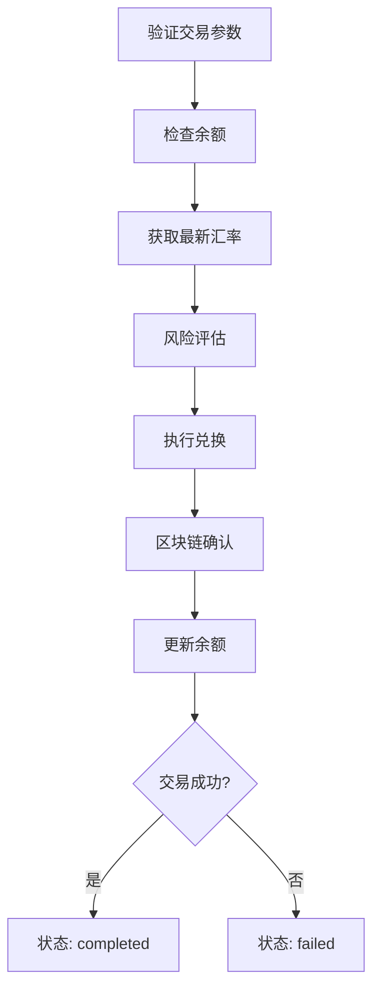
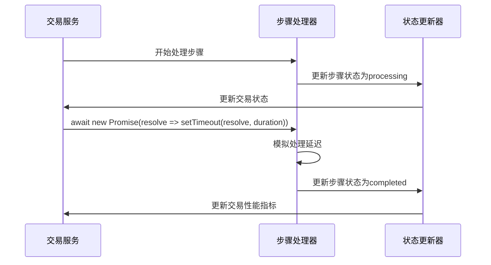
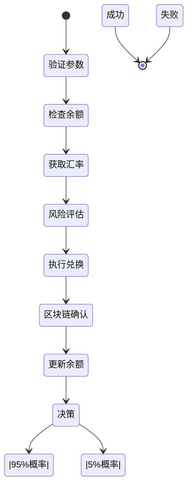
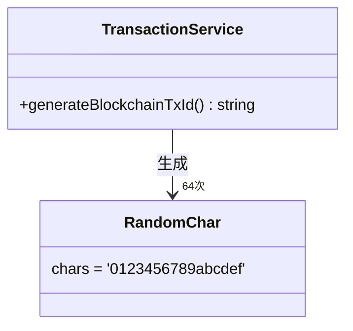
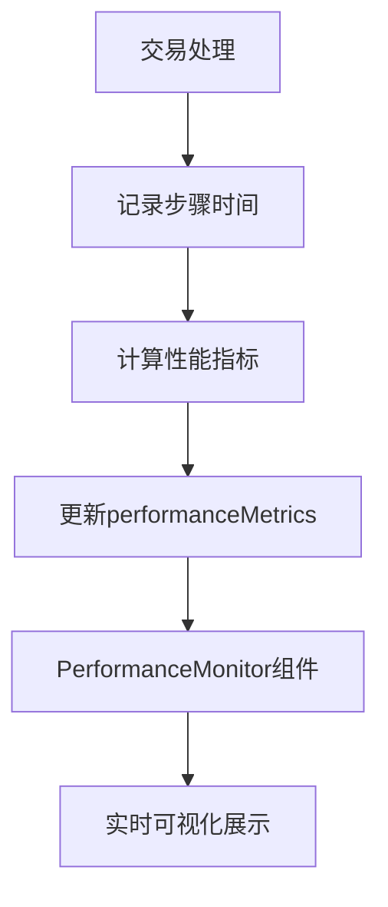

# 异步交易处理

<cite>
**本文档引用文件**  
- [transactionService.ts](file://src/services/transactionService.ts)
- [PerformanceMonitor.tsx](file://src/components/Performance/PerformanceMonitor.tsx)
</cite>

## 目录
1. [简介](#简介)
2. [核心处理流程](#核心处理流程)
3. [异步处理机制](#异步处理机制)
4. [交易状态与结果](#交易状态与结果)
5. [区块链交易ID生成](#区块链交易id生成)
6. [性能监控与可视化](#性能监控与可视化)
7. [异常处理与日志](#异常处理与日志)

## 简介
本文档全面阐述了异步交易处理系统的核心机制，重点分析`processTransactionAsync`方法的工作流程。该方法负责处理跨链交易的完整生命周期，从参数验证到最终状态确认，通过模拟真实区块链环境的延迟和成功率，为用户提供流畅的交易体验。

**Section sources**
- [transactionService.ts](file://src/services/transactionService.ts#L199-L247)

## 核心处理流程
异步交易处理包含七个关键步骤，按顺序执行：

1. **验证交易参数**：验证输入数据的完整性和正确性，持续时间约150毫秒
2. **检查余额**：确认用户账户有足够的资金完成交易，持续时间约100毫秒
3. **获取最新汇率**：从汇率服务获取实时兑换率，持续时间约200毫秒
4. **风险评估**：执行反洗钱(AML)检查和风险评分，持续时间约300毫秒
5. **执行兑换**：在内部账本中执行货币兑换操作，持续时间约400毫秒
6. **区块链确认**：模拟向区块链网络提交交易并等待确认，持续时间约600毫秒
7. **更新余额**：根据交易结果更新用户账户余额，持续时间约150毫秒

每个步骤都包含随机延迟（0-100毫秒），以更真实地模拟网络环境的不确定性。

**Diagram sources**
- [transactionService.ts](file://src/services/transactionService.ts#L199-L247)

**Section sources**
- [transactionService.ts](file://src/services/transactionService.ts#L199-L247)

## 异步处理机制
系统使用Promise和setTimeout实现异步延迟，确保非阻塞执行：

**Diagram sources**
- [transactionService.ts](file://src/services/transactionService.ts#L199-L247)

**Section sources**
- [transactionService.ts](file://src/services/transactionService.ts#L199-L247)

## 交易状态与结果
每一步的状态更新机制如下：

- **处理中状态**：在每个步骤开始时，将`transaction.status`设置为'processing'，并更新`performanceMetrics.steps`数组
- **完成状态**：步骤完成后，将对应步骤的状态从'processing'更新为'completed'
- **最终状态**：所有步骤完成后，根据随机数决定最终状态，实现95%的成功率

交易失败时，系统会记录失败原因："交易失败：网络拥堵，请稍后重试"。

**Diagram sources**
- [transactionService.ts](file://src/services/transactionService.ts#L199-L247)

**Section sources**
- [transactionService.ts](file://src/services/transactionService.ts#L199-L247)

## 区块链交易ID生成
`generateBlockchainTxId`方法生成符合以太坊标准的交易ID：

- 以"0x"为前缀
- 后续64个字符从十六进制字符集(0-9, a-f)中随机选择
- 总长度为66个字符，符合以太坊交易哈希的标准格式

此方法确保生成的ID在格式上与真实的区块链交易ID一致。

**Diagram sources**
- [transactionService.ts](file://src/services/transactionService.ts#L283-L290)

**Section sources**
- [transactionService.ts](file://src/services/transactionService.ts#L283-L290)

## 性能监控与可视化
系统通过`PerformanceMonitor`组件收集和展示性能指标：

- **数据收集**：在交易处理过程中，记录每个步骤的开始时间、结束时间和持续时间
- **指标计算**：计算总处理时间、成功率、平均处理时间等关键性能指标
- **可视化展示**：在前端界面中以进度条、状态图标等形式直观展示交易进度

性能监控数据包括：
- 平均处理时间
- 交易成功率
- 系统可用性
- API响应延迟
- 错误率

**Diagram sources**
- [transactionService.ts](file://src/services/transactionService.ts#L199-L247)
- [PerformanceMonitor.tsx](file://src/components/Performance/PerformanceMonitor.tsx#L0-L389)

**Section sources**
- [transactionService.ts](file://src/services/transactionService.ts#L199-L247)
- [PerformanceMonitor.tsx](file://src/components/Performance/PerformanceMonitor.tsx#L0-L389)

## 异常处理与日志
系统实现了全面的异常处理机制：

- **步骤级错误处理**：每个处理步骤都有独立的错误检测和处理逻辑
- **交易级错误处理**：在`processTransactionAsync`方法中捕获和处理异常
- **日志记录**：使用结构化日志记录关键操作和错误信息
- **用户反馈**：向用户提供清晰的错误消息和重试建议

当交易失败时，系统不仅更新状态，还会在`notes`字段中记录具体的失败原因，便于后续分析和用户沟通。

**Section sources**
- [transactionService.ts](file://src/services/transactionService.ts#L199-L247)