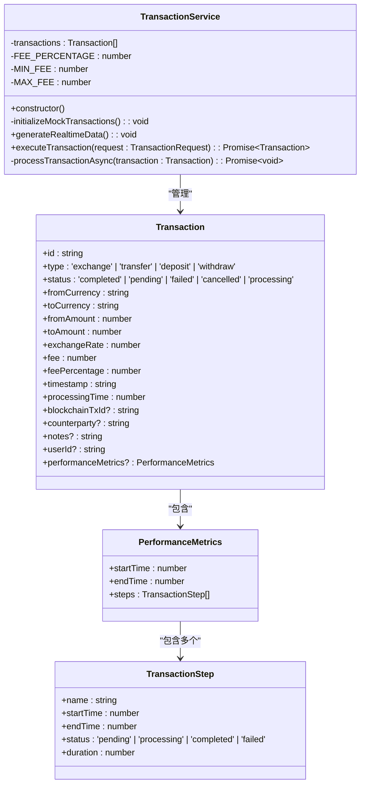
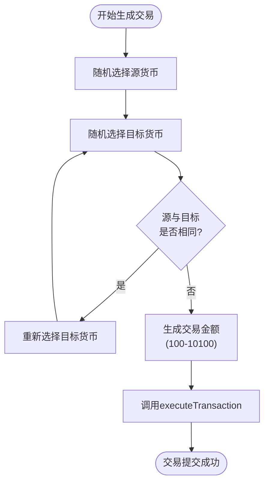
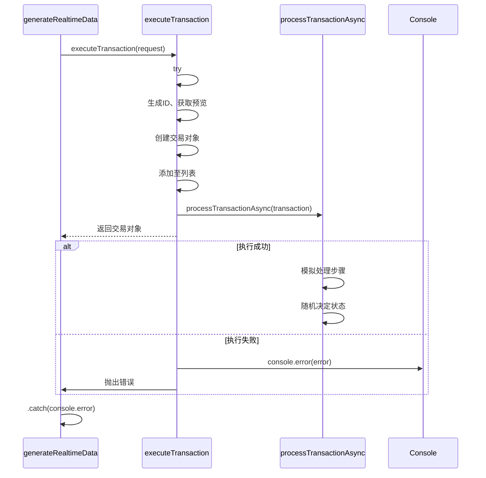

# 模拟数据生成

<cite>
**本文档中引用的文件**  
- [transactionService.ts](file://src/services/transactionService.ts)
</cite>

## 目录
1. [引言](#引言)
2. [核心方法概述](#核心方法概述)
3. [初始化模拟交易数据](#初始化模拟交易数据)
4. [实时数据生成机制](#实时数据生成机制)
5. [交易执行与错误处理](#交易执行与错误处理)
6. [模拟数据的应用场景](#模拟数据的应用场景)
7. [扩展与配置建议](#扩展与配置建议)
8. [向真实API迁移的注意事项](#向真实api迁移的注意事项)
9. [结论](#结论)

## 引言
在开发、测试和演示环境中，稳定且可预测的模拟数据对于系统功能验证和用户体验展示至关重要。本项目通过 `TransactionService` 类中的 `initializeMockTransactions` 和 `generateRealtimeData` 方法，构建了一套完整的交易数据模拟机制。该机制不仅提供了初始状态的交易样本，还支持持续生成动态交易流，为前端界面渲染、性能监控和业务逻辑测试提供了坚实基础。

## 核心方法概述
`TransactionService` 是交易服务的核心类，负责管理所有交易相关的操作。其构造函数在实例化时自动调用 `initializeMockTransactions` 方法以填充初始数据，并可通过手动调用 `generateRealtimeData` 方法启动周期性实时数据生成。



**Diagram sources**  
- [transactionService.ts](file://src/services/transactionService.ts#L0-L60)

**Section sources**  
- [transactionService.ts](file://src/services/transactionService.ts#L0-L60)

## 初始化模拟交易数据
`initializeMockTransactions` 方法用于在服务启动时预设一组具有代表性的交易样本，确保应用加载后立即拥有可用的历史数据。

### 预设交易样本结构
该方法创建两个初始交易对象：
- **已完成交易**：USD → CNY 兑换，金额 1000，状态为“completed”，包含完整的性能指标（如各处理步骤的时间戳和持续时间）。
- **待处理交易**：RUB → USDT 兑换，金额较大（50000），状态为“pending”，并附有备注说明正在审核。

### 状态分布
初始数据涵盖两种典型状态：
- **completed**：表示成功完成的交易，用于展示正常流程结果。
- **pending**：表示正在进行或等待确认的交易，用于测试异步更新和状态轮询机制。

此设计使得前端组件（如交易历史列表）能够在无后端依赖的情况下展示多样化的数据状态。

**Section sources**  
- [transactionService.ts](file://src/services/transactionService.ts#L62-L109)

## 实时数据生成机制
`generateRealtimeData` 方法通过 `setInterval` 实现定时任务，每 30 秒自动生成一笔新的模拟交易，从而模拟真实环境下的持续交易流。

### 货币对随机选择算法


**Diagram sources**  
- [transactionService.ts](file://src/services/transactionService.ts#L366-L387)

#### 关键实现细节
- **货币池定义**：支持 USD、CNY、RUB、USDT、USDC、ETH 六种货币。
- **避免同币种兑换**：使用 `while` 循环确保 `fromCurrency` 与 `toCurrency` 不同。
- **金额范围控制**：使用 `Math.random() * 10000 + 100` 生成 100 至 10100 区间内的随机金额。

### 定时器配置
- **间隔时间**：30000 毫秒（即 30 秒）
- **执行上下文**：在 `TransactionService` 实例内部运行，可直接访问其方法和属性
- **用户标识**：所有模拟交易均标记为 `userId: 'demo-user'`，便于过滤和追踪

**Section sources**  
- [transactionService.ts](file://src/services/transactionService.ts#L366-L387)

## 交易执行与错误处理
当 `generateRealtimeData` 触发新交易时，会调用 `executeTransaction` 方法进行处理。若该方法执行失败，系统具备完善的错误捕获策略。

### 执行流程
1. 生成唯一交易ID
2. 获取交易预览（含汇率、手续费、预计到账金额等）
3. 创建交易记录并插入到交易列表头部
4. 启动异步处理流程 `processTransactionAsync`

### 错误捕获策略
- **Promise 错误捕获**：在 `generateRealtimeData` 中，`executeTransaction(...).catch(console.error)` 确保即使单笔交易失败也不会中断整个定时任务。
- **方法级异常处理**：`executeTransaction` 使用 `try-catch` 捕获内部错误（如汇率获取失败），记录日志并抛出用户友好提示。
- **异步处理容错**：`processTransactionAsync` 中的每一步骤均独立处理，最终根据随机概率决定交易成功（95%）或失败（5%），失败时添加明确错误信息。



**Diagram sources**  
- [transactionService.ts](file://src/services/transactionService.ts#L153-L196)
- [transactionService.ts](file://src/services/transactionService.ts#L199-L247)

**Section sources**  
- [transactionService.ts](file://src/services/transactionService.ts#L153-L247)

## 模拟数据的应用场景
这些模拟数据在多个开发阶段发挥关键作用：

| 应用场景 | 说明 |
|--------|------|
| **开发阶段** | 前端开发者无需等待后端接口完成即可进行UI开发和交互逻辑调试 |
| **测试阶段** | 提供可重复的测试数据集，用于验证交易历史、统计分析、状态更新等功能 |
| **演示环境** | 展示系统在高并发、多状态下的表现，增强客户信心 |
| **性能监控** | 通过持续生成的数据流测试系统吞吐量和响应延迟 |

## 扩展与配置建议
为满足不同测试需求，可对模拟系统进行以下扩展：

### 调整生成频率
修改 `setInterval` 的时间参数即可改变生成频率：
```typescript
// 改为每10秒生成一次
setInterval(() => { /* ... */ }, 10000);
```

### 注入特定测试用例
可通过扩展 `generateRealtimeData` 逻辑，按一定概率注入特殊交易：
- 大额交易（触发价格影响计算）
- 特定货币对（测试汇率服务）
- 高频连续交易（压力测试）

### 扩展模拟场景
- 支持更多交易类型（如 `transfer`, `deposit`）
- 引入网络延迟模拟（使用 `setTimeout` 控制响应时间）
- 模拟区块链确认过程（逐步更新 `confirmations` 字段）

**Section sources**  
- [transactionService.ts](file://src/services/transactionService.ts#L366-L387)

## 向真实API迁移的注意事项
当系统从模拟模式切换至真实API时，需注意以下几点：

1. **移除模拟逻辑**：停用 `initializeMockTransactions` 和 `generateRealtimeData`，改由后端提供真实数据。
2. **错误处理升级**：真实环境中需处理更多异常类型（如网络超时、认证失败、链上交易回滚等）。
3. **数据一致性**：确保前后端时间戳、交易ID生成规则一致。
4. **性能监控对接**：将模拟的 `performanceMetrics` 替换为真实链上数据采集。
5. **用户身份验证**：替换硬编码的 `demo-user` 为真实用户会话信息。

## 结论
`initializeMockTransactions` 和 `generateRealtimeData` 方法共同构建了一个高效、灵活的模拟数据体系，极大提升了开发效率和测试覆盖率。通过预设多样化交易样本和周期性生成新交易，系统能够在脱离真实后端的情况下完整运行。未来可通过参数化配置和场景注入进一步增强其灵活性，为系统演进提供有力支撑。