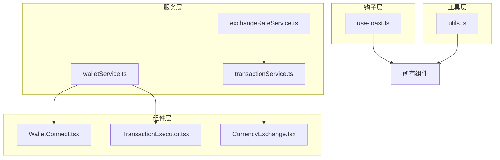
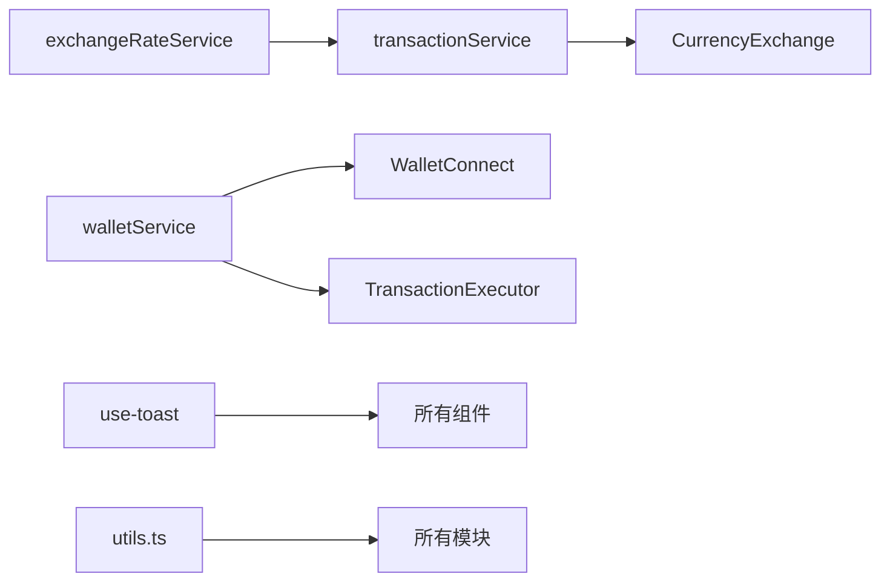
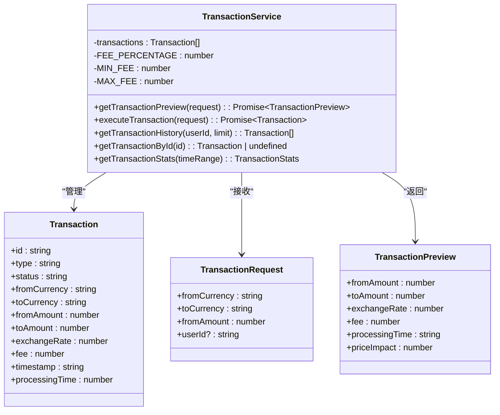
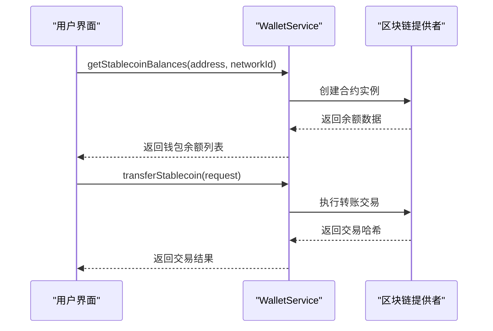
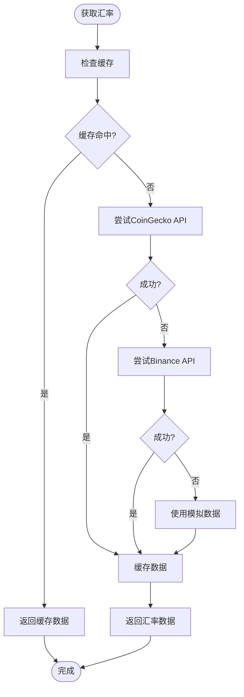
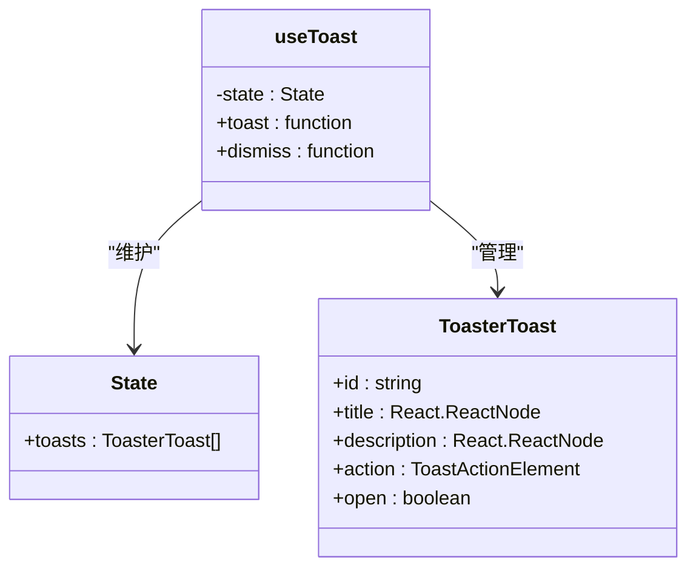
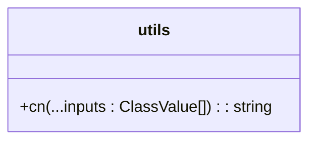
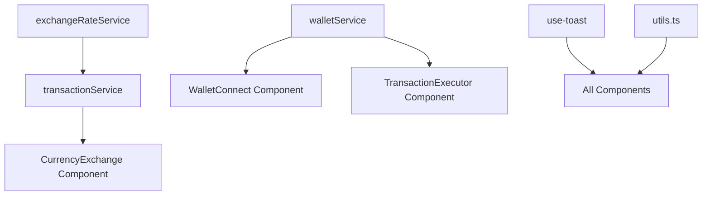

# 数据获取与状态管理

<cite>
**本文档引用文件**   
- [transactionService.ts](file://src/services/transactionService.ts)
- [walletService.ts](file://src/services/walletService.ts)
- [exchangeRateService.ts](file://src/services/exchangeRateService.ts)
- [use-toast.ts](file://src/hooks/use-toast.ts)
- [utils.ts](file://src/lib/utils.ts)
</cite>

## 目录
1. [简介](#简介)
2. [项目结构](#项目结构)
3. [核心组件](#核心组件)
4. [架构概览](#架构概览)
5. [详细组件分析](#详细组件分析)
6. [依赖关系分析](#依赖关系分析)
7. [性能考量](#性能考量)
8. [故障排除指南](#故障排除指南)
9. [结论](#结论)

## 简介
本文档详细说明了前端数据获取与状态管理架构，重点阐述React Query在交易、钱包和汇率服务中的应用。文档涵盖了查询、变更、缓存和错误处理机制，解释了服务类的设计模式（如依赖注入和错误封装），并描述了自定义Hook（如use-toast）的实现原理和复用价值。同时，文档还介绍了工具函数库中的关键辅助方法及其应用场景，并提供了数据同步策略、加载状态管理和乐观更新的最佳实践指南。

## 项目结构
项目采用分层架构设计，将服务、组件、钩子和工具函数分离。核心服务位于`src/services`目录下，包括`transactionService.ts`、`walletService.ts`和`exchangeRateService.ts`。UI组件位于`src/components`目录，自定义Hook位于`src/hooks`目录，工具函数位于`src/lib/utils.ts`。这种结构确保了代码的可维护性和可扩展性。

**图表来源**
- [transactionService.ts](file://src/services/transactionService.ts#L1-L50)
- [walletService.ts](file://src/services/walletService.ts#L1-L50)
- [exchangeRateService.ts](file://src/services/exchangeRateService.ts#L1-L50)
- [use-toast.ts](file://src/hooks/use-toast.ts#L1-L50)
- [utils.ts](file://src/lib/utils.ts#L1-L5)

**章节来源**
- [transactionService.ts](file://src/services/transactionService.ts#L1-L100)
- [walletService.ts](file://src/services/walletService.ts#L1-L100)
- [exchangeRateService.ts](file://src/services/exchangeRateService.ts#L1-L100)

## 核心组件

文档详细分析了三个核心服务组件：`transactionService`、`walletService`和`exchangeRateService`，以及`use-toast`自定义Hook和`utils.ts`工具函数库。

**章节来源**
- [transactionService.ts](file://src/services/transactionService.ts#L52-L388)
- [walletService.ts](file://src/services/walletService.ts#L62-L264)
- [exchangeRateService.ts](file://src/services/exchangeRateService.ts#L17-L281)
- [use-toast.ts](file://src/hooks/use-toast.ts#L1-L186)
- [utils.ts](file://src/lib/utils.ts#L1-L6)

## 架构概览

系统采用服务导向架构，通过单例模式提供服务实例。`exchangeRateService`为`transactionService`提供汇率数据，`walletService`处理区块链交互，`use-toast`提供全局通知机制，`utils.ts`提供通用工具函数。

**图表来源**
- [transactionService.ts](file://src/services/transactionService.ts#L391-L391)
- [walletService.ts](file://src/services/walletService.ts#L267-L269)
- [exchangeRateService.ts](file://src/services/exchangeRateService.ts#L284-L284)

## 详细组件分析

### 交易服务分析

`TransactionService`负责处理交易相关操作，包括交易预览生成、交易执行、交易历史查询等。

#### 类图

**图表来源**
- [transactionService.ts](file://src/services/transactionService.ts#L52-L388)

**章节来源**
- [transactionService.ts](file://src/services/transactionService.ts#L52-L388)

### 钱包服务分析

`WalletService`负责与区块链钱包交互，包括获取余额、执行转账、监控交易状态等。

#### 序列图

**图表来源**
- [walletService.ts](file://src/services/walletService.ts#L62-L264)

**章节来源**
- [walletService.ts](file://src/services/walletService.ts#L62-L264)

### 汇率服务分析

`ExchangeRateService`负责获取实时汇率数据，支持多源API和缓存机制。

#### 流程图

**图表来源**
- [exchangeRateService.ts](file://src/services/exchangeRateService.ts#L17-L281)

**章节来源**
- [exchangeRateService.ts](file://src/services/exchangeRateService.ts#L17-L281)

### 自定义Hook分析

`use-toast`提供全局通知系统，支持添加、更新、关闭和移除通知。

#### 类图

**图表来源**
- [use-toast.ts](file://src/hooks/use-toast.ts#L1-L186)

**章节来源**
- [use-toast.ts](file://src/hooks/use-toast.ts#L1-L186)

### 工具函数分析

`utils.ts`提供通用工具函数，主要用于CSS类名合并。

#### 类图

**图表来源**
- [utils.ts](file://src/lib/utils.ts#L1-L6)

**章节来源**
- [utils.ts](file://src/lib/utils.ts#L1-L6)

## 依赖关系分析

系统组件之间存在明确的依赖关系，确保了职责分离和代码复用。

**图表来源**
- [transactionService.ts](file://src/services/transactionService.ts#L391-L391)
- [walletService.ts](file://src/services/walletService.ts#L267-L269)
- [exchangeRateService.ts](file://src/services/exchangeRateService.ts#L284-L284)

**章节来源**
- [transactionService.ts](file://src/services/transactionService.ts#L1-L50)
- [walletService.ts](file://src/services/walletService.ts#L1-L50)
- [exchangeRateService.ts](file://src/services/exchangeRateService.ts#L1-L50)

## 性能考量

系统在性能方面进行了多项优化：
- 汇率服务使用30秒缓存，减少API调用频率
- 交易服务使用内存存储，提供快速访问
- 钱包服务使用异步操作，避免阻塞UI
- 通知系统使用内存状态管理，确保响应性

## 故障排除指南

常见问题及解决方案：
- **汇率获取失败**：检查网络连接，系统会自动切换到备用API或使用模拟数据
- **钱包连接失败**：确保MetaMask已安装并解锁
- **交易执行失败**：检查网络状态和余额，系统会提供详细的错误信息
- **通知不显示**：检查`use-toast`是否正确导入和使用

**章节来源**
- [exchangeRateService.ts](file://src/services/exchangeRateService.ts#L17-L281)
- [walletService.ts](file://src/services/walletService.ts#L62-L264)
- [transactionService.ts](file://src/services/transactionService.ts#L52-L388)
- [use-toast.ts](file://src/hooks/use-toast.ts#L1-L186)

## 结论

本文档全面分析了前端数据获取与状态管理架构。系统采用服务导向设计，通过单例模式提供核心功能。`exchangeRateService`、`transactionService`和`walletService`各司其职，通过清晰的接口进行交互。`use-toast`提供统一的通知机制，`utils.ts`提供通用工具函数。整体架构清晰、职责分明，具有良好的可维护性和扩展性。