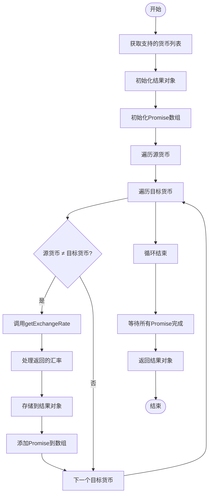
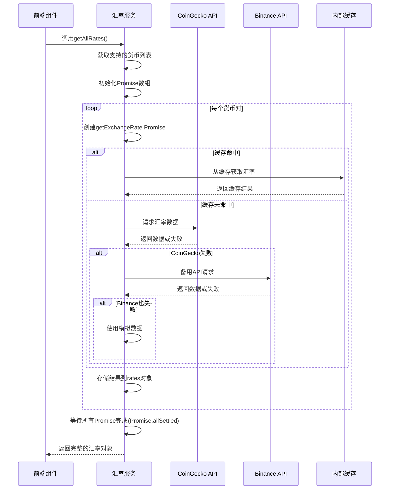
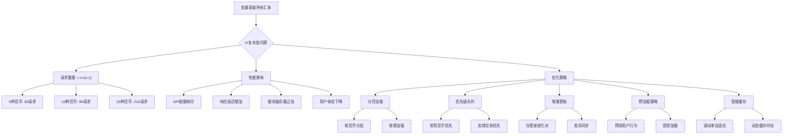
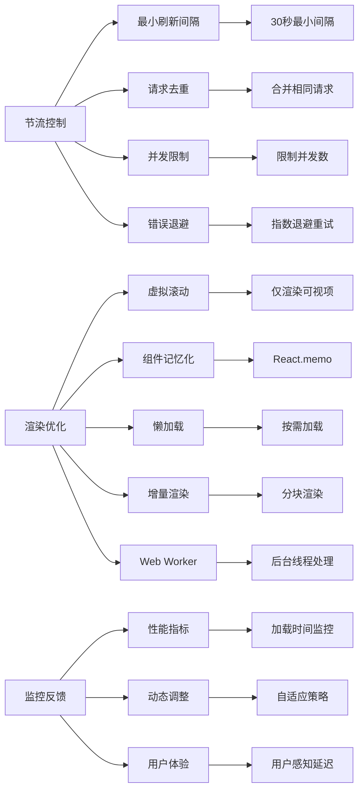

# 批量汇率获取

<cite>
**本文档引用的文件**
- [exchangeRateService.ts](file://src/services/exchangeRateService.ts)
- [CurrencyExchange.tsx](file://src/components/Exchange/CurrencyExchange.tsx)
</cite>

## 目录
1. [简介](#简介)
2. [批量处理机制](#批量处理机制)
3. [并发性能优势](#并发性能优势)
4. [结果数据结构](#结果数据结构)
5. [性能影响与优化](#性能影响与优化)
6. [节流控制与渲染优化](#节流控制与渲染优化)
7. [结论](#结论)

## 简介
本文档深入解析`getAllRates`方法的批量处理机制，说明其如何基于`getSupportedCurrencies`返回的货币列表生成所有可能的兑换组合。阐述使用`Promise.allSettled`并发调用`getExchangeRate`的性能优势与错误隔离特性。解释结果对象`{ [pair: string]: ExchangeRate }`的数据结构设计及其在前端仪表盘展示中的应用。讨论大规模货币对（n²复杂度）带来的性能影响及潜在优化策略，如分页加载或优先级队列。提供批量请求的节流控制建议和前端渲染优化方案。

**Section sources**
- [exchangeRateService.ts](file://src/services/exchangeRateService.ts#L254-L285)

## 批量处理机制
`getAllRates`方法通过双重循环遍历`getSupportedCurrencies`返回的货币列表，为每一对不同的货币组合（from-to）创建一个获取汇率的Promise。该方法首先获取支持的货币列表，然后对每个货币作为源货币，与其他所有货币（目标货币）进行组合，排除自身兑换的情况。对于每个货币对，调用`getExchangeRate`方法并将其Promise添加到promises数组中。最终通过`Promise.allSettled`并发执行所有请求，确保即使部分请求失败也不会影响整体流程。结果以`{ [pair: string]: ExchangeRate }`的格式存储，其中键为"FROM-TO"格式的字符串，值为包含汇率详情的对象。



**Diagram sources**
- [exchangeRateService.ts](file://src/services/exchangeRateService.ts#L254-L285)

**Section sources**
- [exchangeRateService.ts](file://src/services/exchangeRateService.ts#L254-L285)

## 并发性能优势
`getAllRates`方法采用`Promise.allSettled`而非`Promise.all`进行并发调用，这一设计带来了显著的性能优势和错误隔离特性。`Promise.allSettled`会等待所有Promise完成，无论成功或失败，这确保了即使某些汇率API调用失败，其他成功的请求结果仍然可用。相比之下，`Promise.all`在遇到第一个失败时就会拒绝，导致整个批量请求失败。该方法通过并发执行所有汇率请求，大大减少了总等待时间。例如，如果有6种支持的货币，则需要获取30个汇率对（6×5），如果串行执行每个请求需要100ms，则总耗时约3秒；而并发执行理论上只需约100ms（取决于最慢的请求）。此外，服务内部的缓存机制（30秒缓存）进一步提升了性能，重复请求可以直接从缓存中获取结果，避免了不必要的网络调用。



**Diagram sources**
- [exchangeRateService.ts](file://src/services/exchangeRateService.ts#L254-L285)

**Section sources**
- [exchangeRateService.ts](file://src/services/exchangeRateService.ts#L254-L285)

## 结果数据结构
`getAllRates`方法返回的结果对象采用`{ [pair: string]: ExchangeRate }`的字典结构，这种设计在前端仪表盘展示中具有显著优势。键值为"FROM-TO"格式的字符串（如"USD-CNY"），便于快速查找特定货币对的汇率。`ExchangeRate`接口包含`from`、`to`、`rate`、`timestamp`和`source`五个属性，提供了完整的汇率信息。这种扁平化的数据结构非常适合前端组件的渲染需求，避免了复杂的嵌套遍历。在`CurrencyExchange`组件中，该结构可以直接用于构建货币对选择器、实时汇率显示和交易预览功能。此外，时间戳字段支持前端实现汇率更新时间的显示，而来源字段可用于标识数据是来自真实API还是模拟数据，增强用户信任度。该设计还支持高效的增量更新和缓存策略，前端可以仅请求变化的货币对，减少数据传输量。

```mermaid
classDiagram
class ExchangeRate {
+from : string
+to : string
+rate : number
+timestamp : number
+source : 'coingecko' | 'binance' | 'mock'
}
class PriceData {
+[currency : string] : {
usd : number
cny : number
rub : number
}
}
class ExchangeRateService {
-cache : Map<string, { rate : ExchangeRate; expiry : number }>
-CACHE_DURATION : number
+getSupportedCurrencies() : string[]
+getExchangeRate(from : string, to : string) : Promise<ExchangeRate>
+getAllRates() : Promise<{ [pair : string] : ExchangeRate }>
+clearCache() : void
}
class CurrencyExchange {
-fromAmount : string
-fromCurrency : string
-toCurrency : string
-exchangeRate : ExchangeRate | null
-performanceMetrics : { rateUpdateTime : number, ... }
+loadExchangeRate() : Promise<void>
+generatePreview() : Promise<void>
+executeTransaction() : Promise<void>
}
ExchangeRateService --> ExchangeRate : "生成"
ExchangeRateService --> PriceData : "内部使用"
CurrencyExchange --> ExchangeRateService : "依赖"
CurrencyExchange --> ExchangeRate : "显示"
```

**Diagram sources**
- [exchangeRateService.ts](file://src/services/exchangeRateService.ts#L1-L285)
- [CurrencyExchange.tsx](file://src/components/Exchange/CurrencyExchange.tsx#L15-L621)

**Section sources**
- [exchangeRateService.ts](file://src/services/exchangeRateService.ts#L1-L285)
- [CurrencyExchange.tsx](file://src/components/Exchange/CurrencyExchange.tsx#L15-L621)

## 性能影响与优化
`getAllRates`方法的时间复杂度为O(n²)，其中n为支持的货币数量。当货币数量增加时，请求数量呈平方级增长，可能带来显著的性能影响。例如，支持6种货币需要30个请求，而支持10种货币则需要90个请求。这种n²复杂度可能导致API配额耗尽、响应延迟增加和服务器负载过高。潜在优化策略包括：分页加载，将货币对分组，按需加载特定货币的汇率；优先级队列，根据用户常用货币对或交易频率优先加载高优先级的汇率；增量更新，仅请求自上次获取以来可能变化的货币对；以及预加载策略，在用户操作前预测可能需要的汇率并提前加载。此外，可以实现更智能的缓存策略，根据不同货币对的波动频率设置不同的缓存时长，高波动货币对使用较短缓存，稳定货币对使用较长缓存。



**Diagram sources**
- [exchangeRateService.ts](file://src/services/exchangeRateService.ts#L254-L285)

**Section sources**
- [exchangeRateService.ts](file://src/services/exchangeRateService.ts#L254-L285)

## 节流控制与渲染优化
针对批量汇率请求，建议实施节流控制策略以避免过度请求。可以设置最小刷新间隔（如30秒），在此期间内直接使用缓存结果，无论前端如何调用。同时，实现请求去重机制，当多个组件同时请求相同时段的汇率时，合并为单个请求。对于前端渲染优化，建议采用虚拟滚动技术展示大量货币对，仅渲染可视区域内的项目，显著提升列表性能。使用React.memo进行组件记忆化，避免不必要的重渲染。实施懒加载策略，初始仅加载主要货币对，其他货币对在用户滚动或搜索时按需加载。在`CurrencyExchange`组件中，可以通过性能指标监控（rateUpdateTime、previewGenerationTime）来动态调整请求策略，当检测到网络延迟较高时，自动延长刷新间隔或减少并发请求数量。此外，可以实现WebSocket实时更新，仅推送变化的汇率数据，而非全量更新，大幅减少数据传输量和渲染开销。



**Diagram sources**
- [CurrencyExchange.tsx](file://src/components/Exchange/CurrencyExchange.tsx#L15-L621)

**Section sources**
- [CurrencyExchange.tsx](file://src/components/Exchange/CurrencyExchange.tsx#L15-L621)

## 结论
`getAllRates`方法通过`Promise.allSettled`并发获取所有货币对的汇率，实现了高效的批量处理。其返回的`{ [pair: string]: ExchangeRate }`数据结构设计合理，便于前端快速查找和展示。尽管存在n²复杂度的性能挑战，但通过分页加载、优先级队列、智能缓存等优化策略可以有效缓解。节流控制和渲染优化措施进一步提升了用户体验，确保系统在高负载下仍能稳定运行。未来可考虑引入WebSocket实时更新和预测性预加载，以提供更流畅的汇率服务。