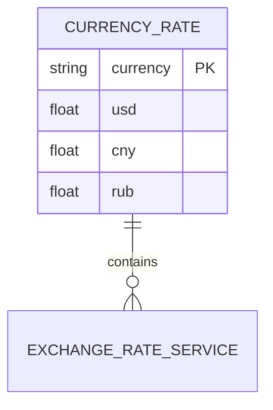
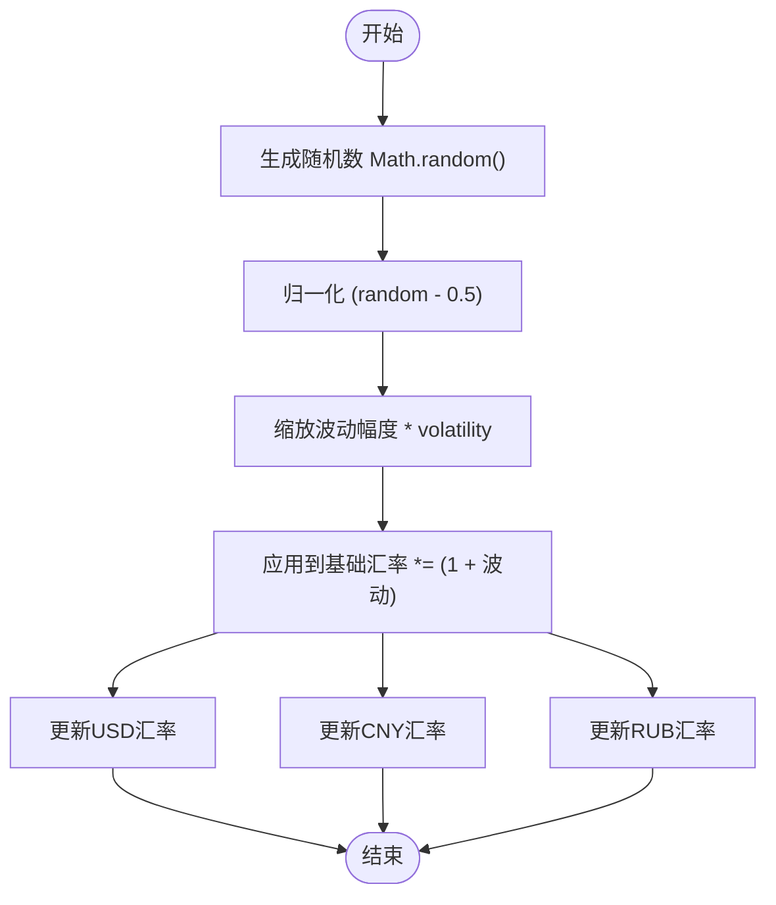
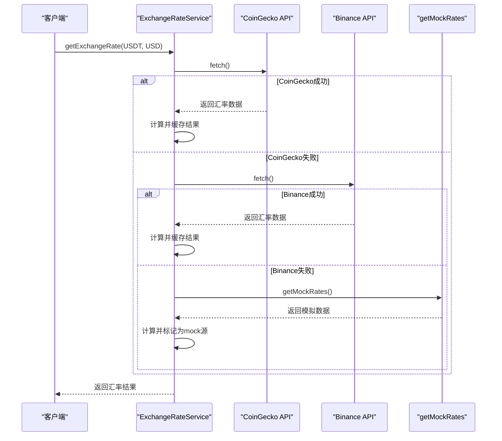
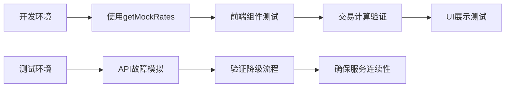

# 模拟汇率数据生成

<cite>
**Referenced Files in This Document**   
- [exchangeRateService.ts](file://src/services/exchangeRateService.ts)
- [exchangeRateService.test.ts](file://src/services/__tests__/exchangeRateService.test.ts)
</cite>

## 目录
1. [引言](#引言)
2. [核心功能分析](#核心功能分析)
3. [基础汇率配置结构](#基础汇率配置结构)
4. [随机波动实现机制](#随机波动实现机制)
5. [降级启用流程](#降级启用流程)
6. [配置调整建议](#配置调整建议)
7. [最佳实践](#最佳实践)
8. [结论](#结论)

## 引言

在跨链桥接系统中，汇率服务是核心金融功能模块之一，负责提供准确的货币兑换率。当外部API服务不可用时，系统需要具备可靠的降级机制以确保服务连续性。`getMockRates`方法作为关键的模拟数据生成器，在开发调试、故障恢复和测试验证中发挥着重要作用。本文档详细解析该方法的实现原理、配置结构和应用场景。

## 核心功能分析

`getMockRates`方法是`ExchangeRateService`类中的私有方法，其主要职责是生成带有随机波动的模拟汇率数据。该方法在两种关键场景下被调用：一是当外部API（如CoinGecko、Binance）调用失败时作为降级方案；二是在开发和测试环境中提供稳定的模拟数据源。

该方法通过`getExchangeRate`方法间接调用，存在两条调用路径：在API连续失败的情况下直接使用模拟数据，或在捕获异常后作为后备方案。这种设计确保了服务的高可用性，即使在外部依赖失效的情况下也能返回合理的汇率数据。

**Section sources**
- [exchangeRateService.ts](file://src/services/exchangeRateService.ts#L102-L121)
- [exchangeRateService.ts](file://src/services/exchangeRateService.ts#L124-L180)

## 基础汇率配置结构

模拟汇率数据基于预定义的基础汇率表，涵盖了主要加密资产和法币的初始值。数据结构采用嵌套对象形式，外层键为加密货币代码（USDT、USDC、ETH、BTC），内层包含对三种法币（USD、CNY、RUB）的汇率映射。

基础配置体现了当前市场的大致水平：稳定币USDT和USDC对美元汇率接近1:1，以太坊（ETH）价格约为2045美元，比特币（BTC）价格约为43250美元。法币汇率方面，美元对人民币约为7.32，对卢布约为96.8。这些基准值为后续的随机波动计算提供了稳定的基础。

**Diagram sources**
- [exchangeRateService.ts](file://src/services/exchangeRateService.ts#L104-L112)

**Section sources**
- [exchangeRateService.ts](file://src/services/exchangeRateService.ts#L104-L112)

## 随机波动实现机制

为了模拟真实市场的动态变化，系统引入了0.1%的随机波动算法。该算法通过`Math.random()`函数生成0到1之间的随机数，减去0.5后得到-0.5到0.5之间的值，再乘以波动率系数0.001（即0.1%），最终形成-0.05%到+0.05%的实际波动范围。

**Diagram sources**
- [exchangeRateService.ts](file://src/services/exchangeRateService.ts#L114-L120)

**Section sources**
- [exchangeRateService.ts](file://src/services/exchangeRateService.ts#L114-L120)

波动算法同时作用于三个法币维度（USD、CNY、RUB），确保了不同货币对之间汇率的一致性。例如，当USDT对USD的汇率波动时，其对CNY和RUB的汇率也会按相同比例调整，保持了汇率三角关系的数学一致性。这种设计避免了套利机会的产生，使模拟数据更接近真实市场行为。

## 降级启用流程

当主API服务不可用时，系统会自动启用模拟数据作为降级方案。该流程通过分层的异常处理机制实现：首先尝试从CoinGecko获取数据，失败后尝试Binance作为备用源，只有当所有外部API都失败时才调用`getMockRates`方法。

**Diagram sources**
- [exchangeRateService.ts](file://src/services/exchangeRateService.ts#L130-L145)
- [exchangeRateService.ts](file://src/services/exchangeRateService.ts#L169-L175)

**Section sources**
- [exchangeRateService.ts](file://src/services/exchangeRateService.ts#L130-L145)
- [exchangeRateService.ts](file://src/services/exchangeRateService.ts#L169-L175)

在最终的异常处理块中，即使主流程失败，系统仍会调用`getMockRates`生成数据并返回，同时将数据源标记为"mock"。这种双重保障机制确保了服务的最高可用性，永远不会因为汇率获取失败而导致交易中断。

## 配置调整建议

调整模拟数据的波动幅度和基础汇率需要修改`getMockRates`方法中的相应参数。波动幅度由`volatility`常量控制，当前设置为0.001（0.1%）。若需增加市场波动感，可适当提高该值至0.005（0.5%）或更高；若需更稳定的测试环境，可降低至0.0001（0.01%）。

基础汇率的调整应反映当前市场实际情况。建议定期检查并更新基准值，特别是对于BTC和ETH等价格波动较大的资产。调整时应注意保持法币汇率之间的一致性，例如USD/CNY和USD/RUB的比率应与CNY/RUB的直接汇率相符。

对于特定测试场景，可以考虑实现配置化管理，将基础汇率和波动参数提取到配置文件中，便于不同环境（开发、测试、预发布）使用不同的模拟策略。

## 最佳实践

在单元测试中，`getMockRates`方法提供了可预测的测试环境。通过测试用例验证当API失败时系统能正确返回模拟数据，确保了降级机制的可靠性。前端联调期间，模拟数据使开发团队无需依赖外部服务即可进行完整的汇率显示和交易计算功能测试。

**Diagram sources**
- [exchangeRateService.test.ts](file://src/services/__tests__/exchangeRateService.test.ts#L35-L42)

**Section sources**
- [exchangeRateService.test.ts](file://src/services/__tests__/exchangeRateService.test.ts#L35-L42)

最佳实践包括：在测试中验证模拟数据的合理性，确保波动后的汇率仍在合理范围内；监控生产环境中"mock"源的使用频率，过高可能表明外部API存在问题；在文档中明确说明模拟数据的使用场景和限制，避免用户误解。

## 结论

`getMockRates`方法作为系统的关键降级机制，不仅保障了服务的高可用性，还为开发和测试提供了便利。其设计体现了良好的容错原则和用户体验考虑。通过合理的配置和使用，该功能能够在保证系统稳定性的同时，提供接近真实市场的模拟体验。未来可考虑增加更多配置选项和监控指标，进一步提升系统的可观测性和灵活性。