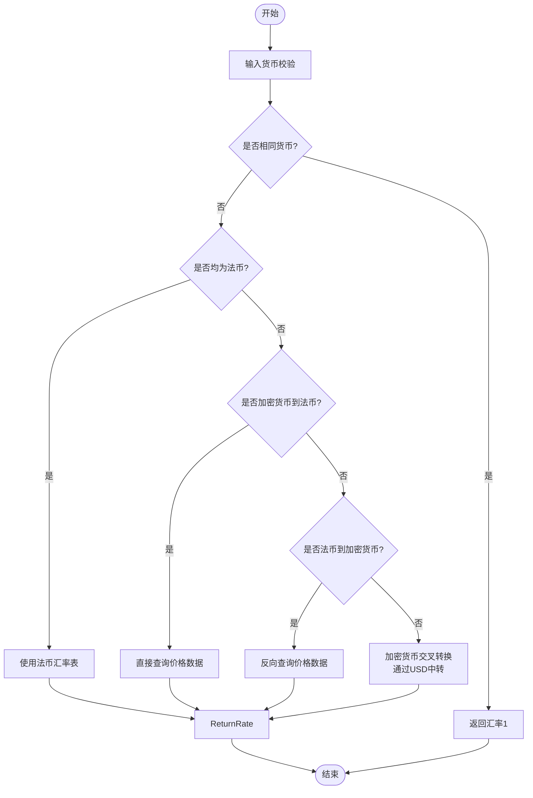
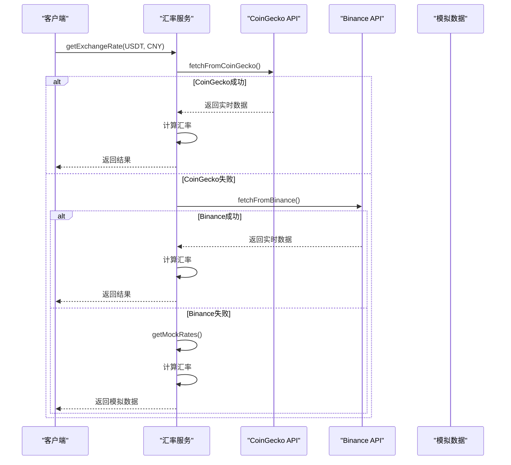

# 汇率数据源集成

<cite>
**Referenced Files in This Document**  
- [exchangeRateService.ts](file://src/services/exchangeRateService.ts)
</cite>

## 目录
1. [引言](#引言)
2. [核心组件](#核心组件)
3. [CoinGecko API 集成](#coingecko-api-集成)
4. [Binance API 集成](#binance-api-集成)
5. [数据结构适配与转换](#数据结构适配与转换)
6. [降级与容错机制](#降级与容错机制)
7. [性能与缓存策略](#性能与缓存策略)
8. [API 调用建议](#api-调用建议)

## 引言

本文档详细说明了汇率服务中多数据源的集成机制，重点解析了CoinGecko和Binance API的调用逻辑。系统通过主备数据源结合模拟数据降级的策略，确保汇率获取的高可用性和稳定性。核心实现位于 `exchangeRateService.ts` 文件中，采用类封装的方式管理汇率获取、缓存和转换逻辑。

## 核心组件

`ExchangeRateService` 类是汇率服务的核心，负责协调多个数据源的调用、结果缓存和错误处理。该服务支持多种货币对之间的实时汇率查询，包括稳定币（USDT、USDC）、主流加密货币（ETH、BTC）与法币（USD、CNY、RUB）之间的兑换。

服务采用分层架构设计，包含数据获取层（`fetchFromCoinGecko`、`fetchFromBinance`）、数据处理层（`calculateExchangeRate`）和缓存管理层（`cache`）。这种设计实现了关注点分离，提高了代码的可维护性和可测试性。

**Section sources**
- [exchangeRateService.ts](file://src/services/exchangeRateService.ts#L1-L285)

## CoinGecko API 集成

### 请求参数与端点

`fetchFromCoinGecko` 方法通过以下HTTP请求获取实时价格数据：

```
GET https://api.coingecko.com/api/v3/simple/price?ids=tether,usd-coin,ethereum&vs_currencies=usd,cny,rub
```

该请求包含两个关键查询参数：
- `ids`: 指定要查询的加密资产，包括tether（USDT）、usd-coin（USDC）和ethereum（ETH）
- `vs_currencies`: 指定目标计价货币，包括美元（usd）、人民币（cny）和卢布（rub）

### 响应格式与数据处理

CoinGecko API返回的JSON数据结构为嵌套对象格式，服务方法将其转换为统一的 `PriceData` 接口格式：

```typescript
interface PriceData {
  [currency: string]: {
    usd: number;
    cny: number;
    rub: number;
  };
}
```

转换过程中，代码使用可选链操作符（`?.`）安全访问嵌套属性，并为可能缺失的数据提供合理的默认值（如USDT兑USD默认为1）。

### 错误处理策略

该方法实现了完善的错误处理机制：
1. 检查HTTP响应状态码，非200状态码将触发错误
2. 捕获网络请求异常和JSON解析错误
3. 记录警告日志，便于问题排查
4. 抛出错误以通知调用方，触发备用数据源切换

**Section sources**
- [exchangeRateService.ts](file://src/services/exchangeRateService.ts#L22-L56)

## Binance API 集成

### 批量查询机制

`fetchFromBinance` 方法作为备用数据源，实现了对多个交易对的批量查询：

```
GET https://api.binance.com/api/v3/ticker/price?symbols=["USDTRUB","USDTCNY","ETHUSDT"]
```

该方法通过`symbols`参数一次性查询USDTRUB、USDTCNY和ETHUSDT三个关键交易对的价格，减少了HTTP请求数量，提高了效率。

### 数据结构差异与适配

Binance API返回的数据结构与CoinGecko存在显著差异：
- Binance返回数组格式，每个元素包含`symbol`和`price`字段
- CoinGecko返回嵌套对象格式，按资产和计价货币组织

服务通过以下代码实现数据结构适配：

```typescript
const rates: { [key: string]: number } = {};
data.forEach((item: { symbol: string; price: string }) => {
  rates[item.symbol] = parseFloat(item.price);
});
```

### 汇率推导逻辑

由于Binance不直接提供所有需要的汇率对，服务实现了汇率推导逻辑：
- USDT兑CNY使用固定汇率7.3（需通过其他方式更新）
- ETH兑CNY通过ETHUSDT × USDTCNY计算得出
- ETH兑RUB通过ETHUSDT × USDTRUB计算得出

这种推导机制确保了在有限的API数据下仍能提供完整的汇率矩阵。

**Section sources**
- [exchangeRateService.ts](file://src/services/exchangeRateService.ts#L59-L99)

## 数据结构适配与转换

### 统一数据模型

服务定义了 `PriceData` 接口作为内部统一的数据模型，屏蔽了不同API的数据结构差异。这种适配器模式使得上层业务逻辑无需关心底层数据源的具体实现。

### 货币代码规范化

`normalizeCurrency` 方法处理了货币代码的多种表示形式，如：
- RMB → CNY
- YUAN → CNY
- RUBLE → RUB

这种规范化确保了输入的灵活性和系统的健壮性。

### 汇率计算逻辑

`calculateExchangeRate` 方法支持多种汇率计算场景：
- 加密货币到法币的直接转换
- 法币到加密货币的反向转换
- 加密货币之间的交叉转换（通过USD中转）
- 法币之间的固定汇率转换



**Diagram sources**
- [exchangeRateService.ts](file://src/services/exchangeRateService.ts#L180-L220)

**Section sources**
- [exchangeRateService.ts](file://src/services/exchangeRateService.ts#L180-L220)

## 降级与容错机制

### 主备切换策略

服务采用优先级的主备切换策略：



**Diagram sources**
- [exchangeRateService.ts](file://src/services/exchangeRateService.ts#L102-L135)

### 模拟数据生成

当主备API均失败时，系统自动降级到模拟数据。`getMockRates` 方法不仅提供静态默认值，还添加了小幅随机波动（0.1%）来模拟真实市场的价格变动，避免了完全静态数据可能带来的问题。

### 异常处理完整性

服务在最外层 `getExchangeRate` 方法中还包含额外的异常捕获，确保即使在极端情况下也能返回合理的汇率数据，体现了防御性编程的设计思想。

**Section sources**
- [exchangeRateService.ts](file://src/services/exchangeRateService.ts#L102-L135)

## 性能与缓存策略

### 缓存机制

服务实现了基于内存的缓存机制，具有以下特点：
- 使用 `Map` 数据结构存储缓存项
- 缓存键为 `from-to` 格式的货币对
- 缓存有效期为30秒（`CACHE_DURATION`）
- 自动清理过期缓存

这种缓存策略显著减少了对外部API的调用频率，既提高了响应速度，又避免了超出API配额限制。

### 批量查询优化

`getAllRates` 方法支持批量获取所有支持货币对的汇率，通过 `Promise.allSettled` 并发执行所有汇率查询，最大限度地减少了总等待时间。

### 内存管理

缓存使用弱引用数据结构，避免了内存泄漏风险。`clearCache` 方法提供了手动清理缓存的接口，便于在需要时重置状态。

**Section sources**
- [exchangeRateService.ts](file://src/services/exchangeRateService.ts#L10-L15)

## API 调用建议

### 配额管理

根据分析，建议的API调用频率限制如下：
- **CoinGecko**: 免费版API限制为每分钟10次请求，建议实际使用不超过每30秒1次
- **Binance**: 公共API限制为每分钟1200次请求，但应考虑服务整体负载

### 错误处理最佳实践

1. 始终检查HTTP响应状态码
2. 实现超时机制防止请求挂起
3. 记录详细的错误日志用于监控
4. 提供有意义的错误信息给上层调用

### 数据一致性

由于不同数据源可能存在汇率差异，建议：
- 明确标注汇率数据来源
- 在界面中显示数据更新时间
- 对关键交易实施双重校验
- 定期对比不同数据源的差异

### 监控与告警

建议实施以下监控措施：
- API调用成功率监控
- 响应时间监控
- 降级到模拟数据的告警
- 缓存命中率统计

这些措施有助于及时发现和解决潜在问题，确保汇率服务的稳定可靠。