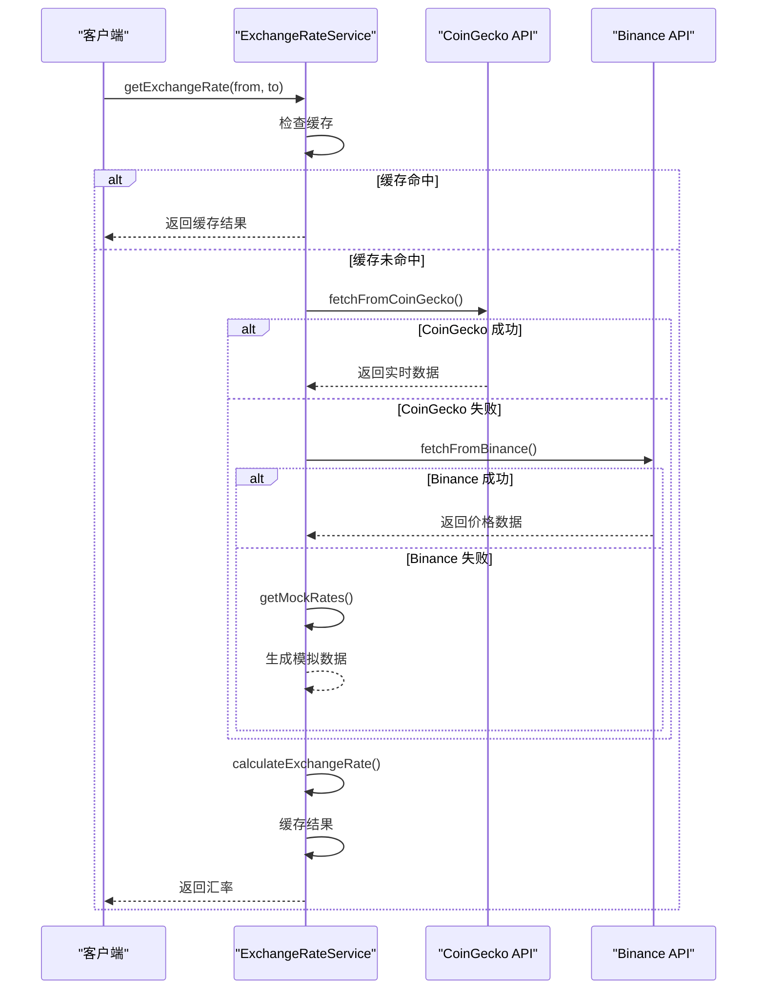
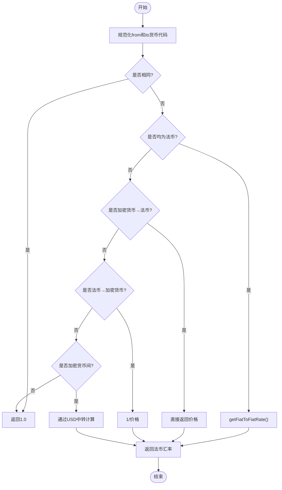

# 汇率服务管理

<cite>
**本文档引用的文件**
- [exchangeRateService.ts](file://src/services/exchangeRateService.ts)
- [exchangeRateService.test.ts](file://src/services/__tests__/exchangeRateService.test.ts)
- [CurrencyExchange.tsx](file://src/components/Exchange/CurrencyExchange.tsx)
</cite>

## 目录
1. [简介](#简介)
2. [核心组件](#核心组件)
3. [多源汇率获取机制](#多源汇率获取机制)
4. [汇率缓存机制](#汇率缓存机制)
5. [汇率计算逻辑](#汇率计算逻辑)
6. [支持的货币与批量获取](#支持的货币与批量获取)
7. [使用示例与错误处理](#使用示例与错误处理)
8. [模拟数据机制](#模拟数据机制)
9. [性能优化与缓存管理](#性能优化与缓存管理)
10. [第三方API使用限制](#第三方api使用限制)

## 简介
`ExchangeRateService` 是一个用于管理加密货币与法币之间实时汇率的核心服务模块。该服务通过多源API获取实时汇率数据，结合本地缓存和模拟数据机制，确保在各种网络和API故障情况下仍能提供稳定可靠的汇率服务。服务支持USD、CNY、RUB等法币与USDT、USDC、ETH、BTC等主流加密货币之间的双向兑换计算。

**Section sources**
- [exchangeRateService.ts](file://src/services/exchangeRateService.ts#L1-L20)

## 核心组件

`ExchangeRateService` 类是汇率服务的核心实现，封装了汇率获取、缓存管理、数据源回退、货币规范化和汇率计算等关键功能。该服务采用单例模式导出，确保全局唯一实例，避免重复请求和缓存不一致问题。

**Section sources**
- [exchangeRateService.ts](file://src/services/exchangeRateService.ts#L17-L285)

## 多源汇率获取机制

该服务实现了三级数据源获取策略，确保高可用性：

1. **主数据源 - CoinGecko API**：通过 `fetchFromCoinGecko` 方法调用免费版CoinGecko API获取USDT、USDC、ETH对USD、CNY、RUB的实时汇率。
2. **备用数据源 - Binance API**：当CoinGecko失败时，通过 `fetchFromBinance` 方法调用Binance价格接口获取USDTRUB、USDTCNY、ETHUSDT等交易对价格，并推导其他汇率。
3. **最终回退 - 模拟数据**：当所有API均失败时，使用 `getMockRates` 生成带有轻微随机波动的模拟市场数据。



**Diagram sources**
- [exchangeRateService.ts](file://src/services/exchangeRateService.ts#L22-L147)

## 汇率缓存机制

服务采用内存Map实现高效缓存，具有以下特性：

- **缓存有效期**：30秒（30000毫秒），通过 `CACHE_DURATION` 常量定义
- **缓存键生成**：采用 `${from}-${to}` 格式，如 "USD-CNY"、"USDT-ETH"
- **缓存结构**：存储汇率对象和过期时间戳，实现时间有效性检查
- **缓存清除**：提供 `clearCache()` 方法用于手动清除所有缓存

```mermaid
classDiagram
class ExchangeRateService {
-cache : Map<string, {rate : ExchangeRate, expiry : number}>
-CACHE_DURATION : number
+getExchangeRate(from : string, to : string) : Promise~ExchangeRate~
+clearCache() : void
}
class ExchangeRate {
+from : string
+to : string
+rate : number
+timestamp : number
+source : 'coingecko' | 'binance' | 'mock'
}
ExchangeRateService --> ExchangeRate : "缓存"
```

**Diagram sources**
- [exchangeRateService.ts](file://src/services/exchangeRateService.ts#L17-L20)
- [exchangeRateService.ts](file://src/services/exchangeRateService.ts#L130-L147)

## 汇率计算逻辑

### 货币代码规范化
`normalizeCurrency` 方法将多种货币代码别名统一为标准大写格式：
- RMB、YUAN → CNY
- RUBLE → RUB
- BITCOIN → BTC
- ETHEREUM → ETH

### 汇率计算算法
`calculateExchangeRate` 方法根据货币类型组合采用不同计算策略：



**Diagram sources**
- [exchangeRateService.ts](file://src/services/exchangeRateService.ts#L236-L245)
- [exchangeRateService.ts](file://src/services/exchangeRateService.ts#L183-L231)

## 支持的货币与批量获取

### 支持的货币列表
通过 `getSupportedCurrencies()` 方法返回支持的货币数组：
```json
["USD", "CNY", "RUB", "USDT", "USDC", "ETH", "BTC"]
```

### 批量获取功能
`getAllRates()` 方法并发获取所有货币对的汇率，适用于汇率表格、市场行情等需要批量数据的场景。该方法使用 `Promise.allSettled()` 确保即使部分请求失败，其他成功的结果仍可返回。

**Section sources**
- [exchangeRateService.ts](file://src/services/exchangeRateService.ts#L247-L264)

## 使用示例与错误处理

### 使用示例
```typescript
// 获取USD到CNY的汇率
const rate = await exchangeRateService.getExchangeRate('USD', 'CNY');
console.log(`1 USD = ${rate.rate} CNY`);

// 获取USDT到ETH的汇率
const cryptoRate = await exchangeRateService.getExchangeRate('USDT', 'ETH');
```

### 错误处理策略
- **API调用失败**：自动降级到备用数据源或模拟数据
- **异常捕获**：在 `getExchangeRate` 中捕获所有错误，确保不会抛出未处理异常
- **日志记录**：在API失败时输出警告日志，便于监控和调试
- **最终回退**：即使所有数据源失败，仍返回模拟数据保证服务可用

**Section sources**
- [exchangeRateService.ts](file://src/services/exchangeRateService.ts#L130-L175)
- [exchangeRateService.test.ts](file://src/services/__tests__/exchangeRateService.test.ts#L42-L62)

## 模拟数据机制

`getMockRates()` 方法在以下场景提供后备支持：
- 开发环境
- 所有第三方API服务不可用
- 单元测试

模拟数据特点：
- 基于预设基准汇率
- 添加0.1%的随机波动模拟市场变化
- 包含BTC等未在主API中获取的货币
- 用于UI展示和功能测试

**Section sources**
- [exchangeRateService.ts](file://src/services/exchangeRateService.ts#L101-L126)

## 性能优化与缓存管理

### 性能优化建议
1. **合理利用缓存**：30秒缓存期平衡了数据新鲜度和请求频率
2. **批量获取优化**：`getAllRates()` 使用并发请求，减少总等待时间
3. **避免重复计算**：相同货币对直接返回1.0，无需API调用
4. **前端自动刷新**：在 `CurrencyExchange.tsx` 中每30秒自动刷新汇率

### 缓存管理策略
- **自动过期**：基于时间戳检查，过期自动重新获取
- **手动清除**：提供 `clearCache()` 方法用于强制刷新
- **内存安全**：使用Map结构，避免内存泄漏
- **键名规范**：统一格式确保缓存命中率

**Section sources**
- [exchangeRateService.ts](file://src/services/exchangeRateService.ts#L17-L20)
- [CurrencyExchange.tsx](file://src/components/Exchange/CurrencyExchange.tsx#L42-L64)

## 第三方API使用限制

### CoinGecko API限制
- 免费版有请求频率限制
- 无API密钥，可能被限流
- 数据更新频率约1-2分钟

### Binance API限制
- 无认证请求有速率限制
- 需要正确格式化symbols参数
- 价格数据为实时撮合价，可能波动较大

### 最佳实践
1. **始终使用缓存**：避免频繁调用第三方API
2. **监控API健康**：记录失败次数，及时发现服务异常
3. **合理设置超时**：防止网络问题导致请求长时间挂起
4. **准备备用方案**：模拟数据确保核心功能可用

**Section sources**
- [exchangeRateService.ts](file://src/services/exchangeRateService.ts#L22-L56)
- [exchangeRateService.ts](file://src/services/exchangeRateService.ts#L59-L98)