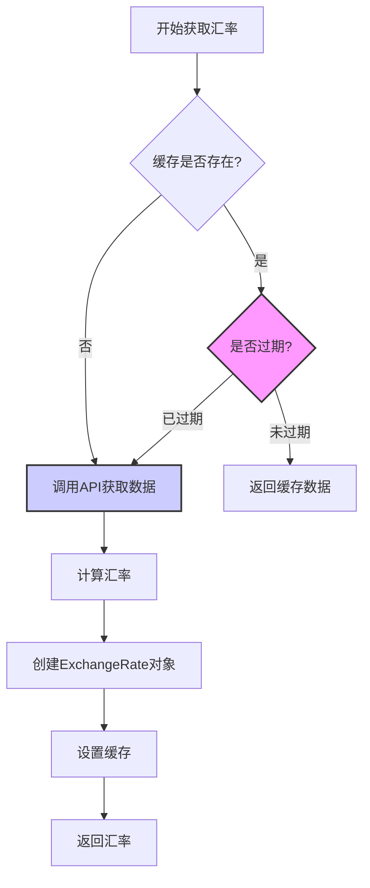
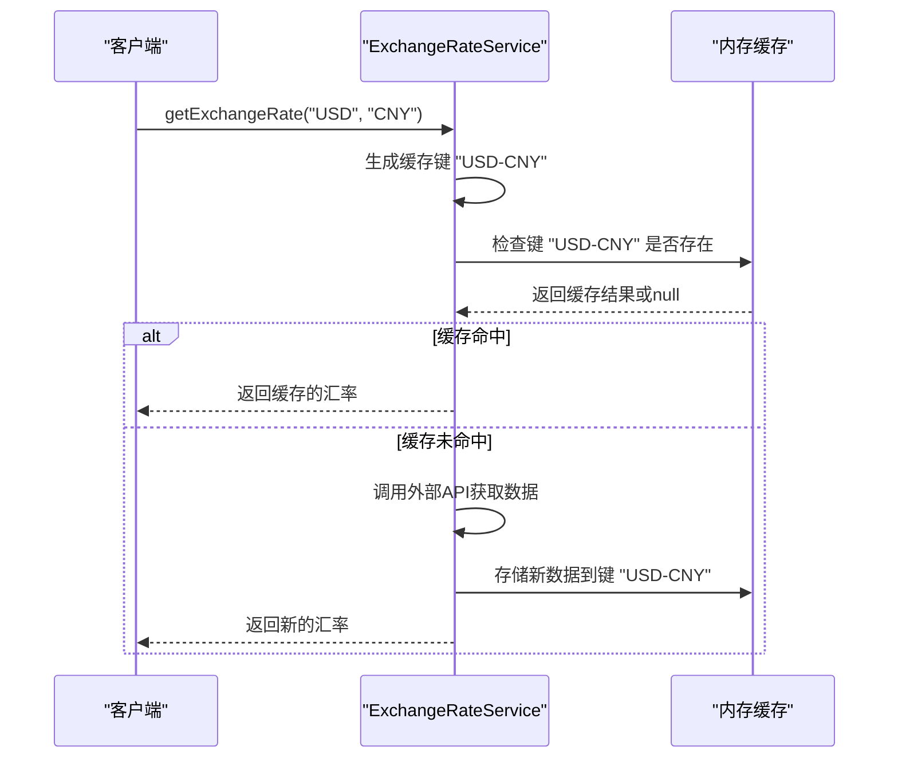
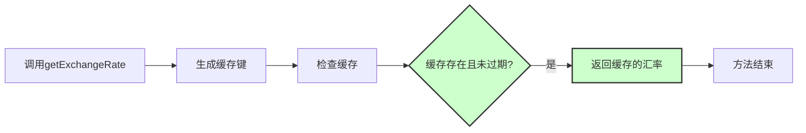
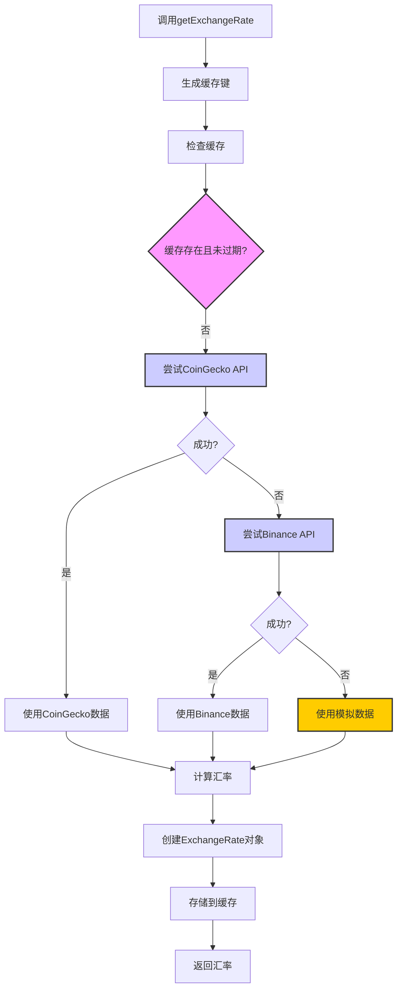
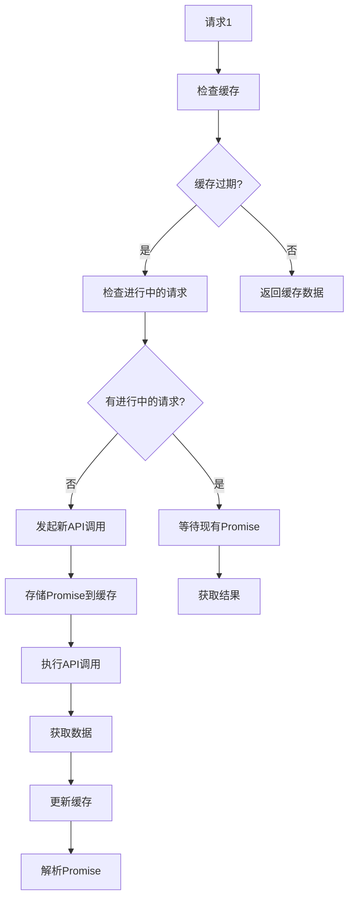
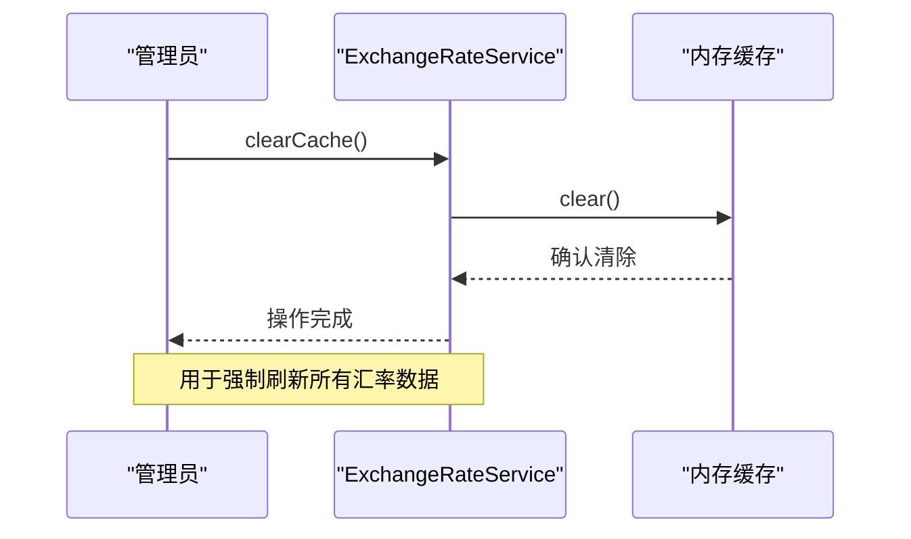
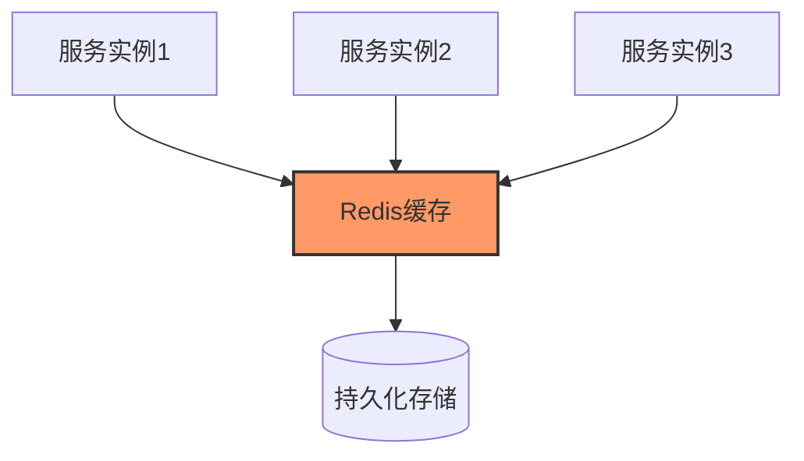
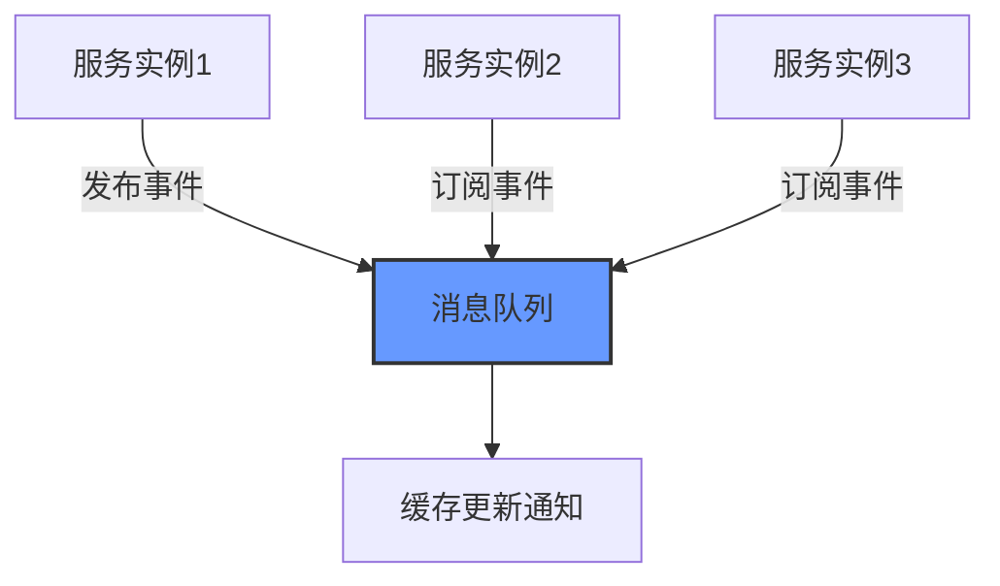
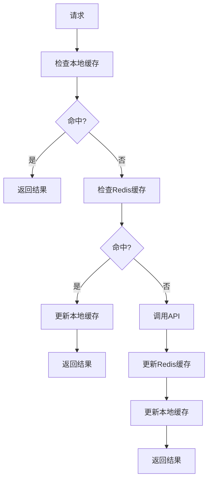

# 汇率缓存机制

<cite>
**本文档中引用的文件**
- [exchangeRateService.ts](file://src/services/exchangeRateService.ts)
- [CurrencyExchange.tsx](file://src/components/Exchange/CurrencyExchange.tsx)
- [transactionService.ts](file://src/services/transactionService.ts)
- [exchangeRateService.test.ts](file://src/services/__tests__/exchangeRateService.test.ts)
</cite>

## 目录
1. [引言](#引言)
2. [核心缓存结构](#核心缓存结构)
3. [缓存有效期设计](#缓存有效期设计)
4. [缓存键生成规则](#缓存键生成规则)
5. [缓存命中与未命中处理](#缓存命中与未命中处理)
6. [并发请求处理策略](#并发请求处理策略)
7. [缓存清除机制](#缓存清除机制)
8. [性能优化建议](#性能优化建议)
9. [分布式环境挑战](#分布式环境挑战)

## 引言
汇率服务在现代金融系统中扮演着关键角色，其性能和可靠性直接影响用户体验。本文档深入解析汇率服务的内存缓存设计与实现，重点阐述基于Map的缓存结构、30秒缓存有效期的设计考量、缓存键的生成规则以及缓存命中与未命中的处理流程。通过分析`ExchangeRateService`类的实现，我们将全面理解该服务如何在保证数据实时性的同时提升系统性能。

## 核心缓存结构
汇率服务采用基于Map的内存缓存结构来存储汇率数据，这种设计提供了高效的键值查找性能。

```mermaid
classDiagram
class ExchangeRateService {
-cache : Map<string, { rate : ExchangeRate; expiry : number }>
-CACHE_DURATION : number
+getExchangeRate(from : string, to : string) : Promise<ExchangeRate>
+clearCache() : void
}
class ExchangeRate {
+from : string
+to : string
+rate : number
+timestamp : number
+source : 'coingecko' | 'binance' | 'mock'
}
ExchangeRateService --> ExchangeRate : "包含"
```

**图示来源**
- [exchangeRateService.ts](file://src/services/exchangeRateService.ts#L17-L281)

**本节来源**
- [exchangeRateService.ts](file://src/services/exchangeRateService.ts#L17-L281)

### 缓存数据结构
缓存使用`Map<string, { rate: ExchangeRate; expiry: number }>`结构，其中：
- **键（Key）**：由源货币和目标货币组成的字符串，格式为"from-to"
- **值（Value）**：包含两个字段的对象
  - **rate**：`ExchangeRate`对象，存储具体的汇率信息
  - **expiry**：时间戳，表示缓存项的过期时间

`ExchangeRate`接口定义了汇率的核心属性：
- `from`：源货币代码
- `to`：目标货币代码
- `rate`：兑换比率
- `timestamp`：获取汇率的时间戳
- `source`：数据来源（'coingecko'、'binance'或'mock'）

## 缓存有效期设计
缓存有效期（CACHE_DURATION）设置为30秒，这是一个经过深思熟虑的性能与数据新鲜度的平衡点。



**图示来源**
- [exchangeRateService.ts](file://src/services/exchangeRateService.ts#L124-L180)

**本节来源**
- [exchangeRateService.ts](file://src/services/exchangeRateService.ts#L19-L19)

### 设计考量
30秒缓存有效期的设计基于以下考量：
1. **性能优化**：避免频繁调用外部API，减少网络延迟和服务器负载
2. **数据新鲜度**：在大多数金融交易场景中，30秒内的汇率波动通常在可接受范围内
3. **用户体验**：提供快速响应，提升用户操作流畅性
4. **成本控制**：减少对外部API的调用次数，降低潜在的API使用费用

### 性能影响
- **正面影响**：缓存命中时，响应时间从数百毫秒降低到几毫秒
- **负面影响**：存在30秒的数据延迟，不适合对实时性要求极高的交易场景
- **内存占用**：每个缓存项占用约200-300字节内存，对于支持的7种货币，最多产生42个缓存项（7×6），总内存占用约8-12KB

## 缓存键生成规则
缓存键的生成遵循简单的"from-to"格式规则，确保了键的唯一性和可预测性。



**图示来源**
- [exchangeRateService.ts](file://src/services/exchangeRateService.ts#L124-L180)
- [CurrencyExchange.tsx](file://src/components/Exchange/CurrencyExchange.tsx#L74-L74)

**本节来源**
- [exchangeRateService.ts](file://src/services/exchangeRateService.ts#L124-L126)

### 键生成实现
在`getExchangeRate`方法中，缓存键通过字符串模板生成：
```typescript
const cacheKey = `${from}-${to}`;
```

这种设计具有以下优点：
- **简单直观**：易于理解和调试
- **高效**：字符串拼接操作性能优异
- **唯一性**：每种货币对都有唯一的键
- **可读性**：键名直接反映了其代表的货币转换关系

### 货币代码规范化
在生成缓存键之前，系统会对货币代码进行规范化处理，确保不同表示方式的相同货币能映射到同一缓存键：
- 'RMB' → 'CNY'
- 'YUAN' → 'CNY'
- 'RUBLE' → 'RUB'
- 'BITCOIN' → 'BTC'
- 'ETHEREUM' → 'ETH'

这通过`normalizeCurrency`方法实现，确保了缓存的一致性和高效性。

## 缓存命中与未命中处理
系统采用优雅的缓存策略来处理命中与未命中的情况，确保最佳的性能和可靠性。

### 缓存命中流程
当请求的汇率在缓存中存在且未过期时，系统直接返回缓存数据：



**图示来源**
- [exchangeRateService.ts](file://src/services/exchangeRateService.ts#L124-L180)

### 缓存未命中流程
当缓存不存在或已过期时，系统会执行完整的获取流程：



**图示来源**
- [exchangeRateService.ts](file://src/services/exchangeRateService.ts#L124-L180)

**本节来源**
- [exchangeRateService.ts](file://src/services/exchangeRateService.ts#L124-L180)

### 处理逻辑详解
1. **缓存检查**：首先检查请求的货币对是否有有效的缓存
2. **API调用层级**：采用多级API调用策略，优先使用CoinGecko，失败后尝试Binance，最后使用模拟数据作为后备
3. **数据计算**：根据获取的原始数据计算实际的兑换汇率
4. **缓存更新**：将新获取的数据存储到缓存中，设置新的过期时间
5. **异常处理**：捕获所有错误，确保即使外部API失败也能返回合理的汇率数据

## 并发请求处理策略
系统设计考虑了并发请求的场景，采用简单的但有效的策略来处理高并发情况。

### 当前策略分析
当前实现中，每个请求独立检查缓存并可能触发API调用。这意味着在缓存过期后，多个并发请求可能导致：
- **重复API调用**：多个请求同时发现缓存过期，都尝试调用外部API
- **缓存击穿**：大量请求同时穿透缓存，给外部API带来压力
- **数据不一致**：不同请求可能获取到略有差异的汇率数据

### 改进建议
为优化并发处理，建议实现以下策略：
1. **缓存锁机制**：当一个请求开始获取数据时，为该缓存键设置临时锁，其他请求等待结果
2. **Promise缓存**：将正在进行的API调用Promise存储在缓存中，后续请求直接await同一个Promise
3. **批量处理**：收集一段时间内的汇率请求，一次性获取所有需要的数据



## 缓存清除机制
系统提供了`clearCache`方法来手动清除所有缓存数据，这在特定场景下非常有用。



**图示来源**
- [exchangeRateService.ts](file://src/services/exchangeRateService.ts#L278-L280)
- [exchangeRateService.test.ts](file://src/services/__tests__/exchangeRateService.test.ts#L8-L14)

**本节来源**
- [exchangeRateService.ts](file://src/services/exchangeRateService.ts#L278-L280)

### 使用场景
`clearCache`方法适用于以下场景：
1. **系统维护**：在部署新版本或配置变更后强制刷新缓存
2. **数据同步**：当检测到外部数据源有重大更新时
3. **测试环境**：在单元测试中重置服务状态
4. **故障恢复**：当怀疑缓存数据损坏时

### 系统行为影响
调用`clearCache`后，系统行为将发生以下变化：
- **首次请求变慢**：所有后续的汇率请求都需要重新调用外部API
- **API调用增加**：短期内外部API调用次数显著增加
- **内存使用降低**：缓存占用的内存被释放
- **数据新鲜度提升**：确保所有用户获取到最新的汇率数据

## 性能优化建议
基于当前实现，提出以下性能优化建议以进一步提升系统效率。

### 缓存命中率优化
1. **智能缓存预热**：在系统启动或低峰期预加载常用货币对的汇率
2. **动态缓存时长**：根据货币对的波动性调整缓存时间，稳定货币对可使用更长缓存
3. **访问模式分析**：监控常用货币对组合，优先保证高频请求的缓存有效性

### 内存占用评估
当前内存占用分析：
- **缓存项数量**：最多42个（7种货币的排列组合）
- **单个缓存项大小**：约250字节
- **总内存占用**：约10.5KB
- **扩展性**：每增加一种货币，缓存项增加当前货币数-1个

### 监控指标建议
应监控以下关键指标：
- **缓存命中率**：理想情况下应保持在80%以上
- **平均响应时间**：区分缓存命中和未命中的响应时间
- **API调用频率**：监控外部API的调用次数和成功率
- **内存使用**：跟踪缓存占用的内存增长趋势

## 分布式环境挑战
在分布式环境下，当前的内存缓存设计面临诸多挑战，需要相应的解决方案。

### 主要挑战
1. **缓存一致性**：多个服务实例的缓存可能不一致
2. **内存冗余**：每个实例都维护独立的缓存，造成内存浪费
3. **扩展限制**：无法通过简单增加实例来线性扩展缓存容量
4. **故障隔离**：单个实例的缓存问题不会影响其他实例

### 解决方案
#### 方案一：集中式缓存
使用Redis等集中式缓存系统替代内存Map：



**优势**：
- 统一的数据视图
- 更大的缓存容量
- 持久化能力
- 易于监控和管理

#### 方案二：缓存同步机制
在保持内存缓存的同时，增加实例间的同步机制：



**优势**：
- 保持低延迟
- 减少外部依赖
- 逐步迁移的灵活性

#### 方案三：混合缓存策略
结合本地缓存和集中式缓存的混合模式：



这种方案在性能和一致性之间取得了最佳平衡，推荐作为分布式环境下的首选方案。