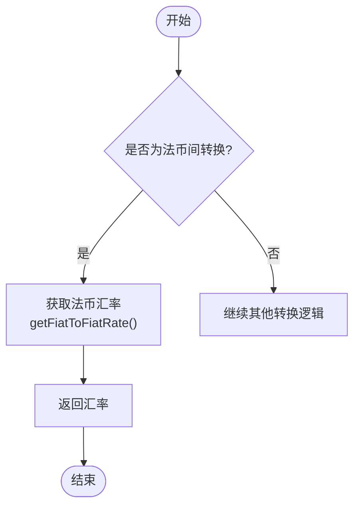
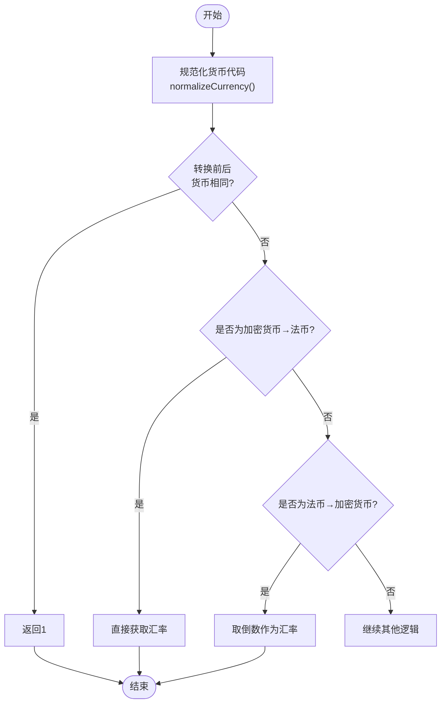
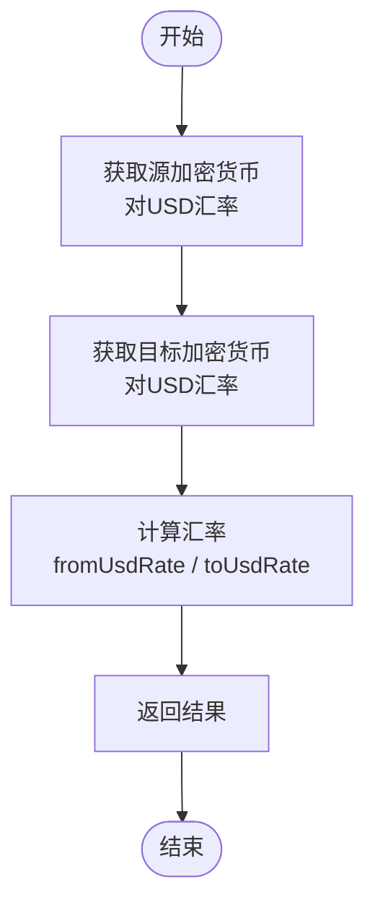
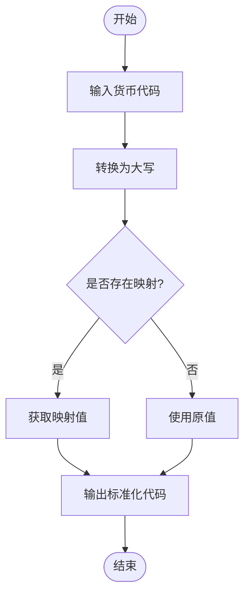
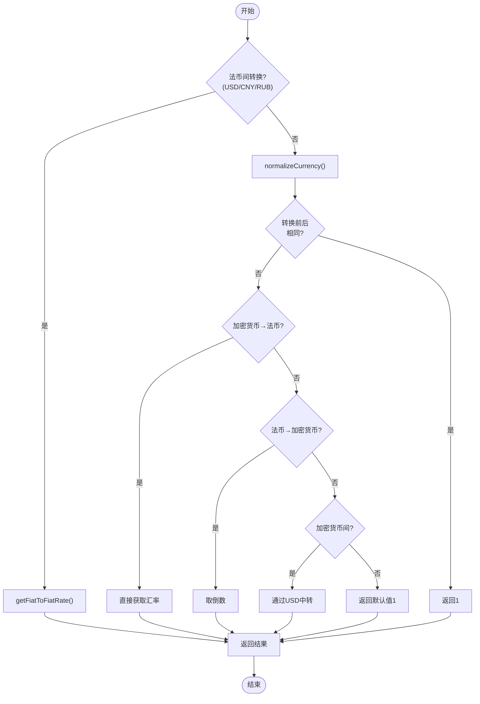
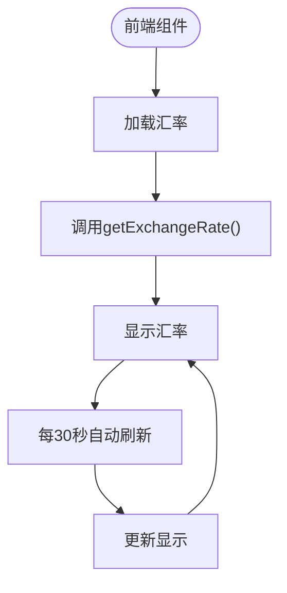

# 汇率计算逻辑

<cite>
**Referenced Files in This Document**  
- [exchangeRateService.ts](file://src/services/exchangeRateService.ts)
- [CurrencyExchange.tsx](file://src/components/Exchange/CurrencyExchange.tsx)
- [exchangeRateService.test.ts](file://src/services/__tests__/exchangeRateService.test.ts)
</cite>

## 目录
1. [核心汇率计算算法](#核心汇率计算算法)
2. [法币间汇率转换](#法币间汇率转换)
3. [加密货币与法币转换](#加密货币与法币转换)
4. [加密货币间汇率转换](#加密货币间汇率转换)
5. [货币代码规范化](#货币代码规范化)
6. [汇率计算流程图](#汇率计算流程图)
7. [测试用例分析](#测试用例分析)
8. [前端集成与用户体验](#前端集成与用户体验)

## 核心汇率计算算法

`calculateExchangeRate` 方法是整个汇率系统的核心，它根据不同的货币类型组合采用不同的计算策略。该方法首先判断是否为法币到法币的转换，然后处理加密货币与法币之间的双向转换，最后处理加密货币之间的转换。

**Section sources**
- [exchangeRateService.ts](file://src/services/exchangeRateService.ts#L183-L222)

## 法币间汇率转换

法币间（USD/CNY/RUB）的汇率转换通过 `getFiatToFiatRate` 方法实现，采用预定义的固定汇率表。该方法维护了一个二维汇率矩阵，包含了三种主要法币之间的相互转换率。

**Diagram sources**
- [exchangeRateService.ts](file://src/services/exchangeRateService.ts#L225-L233)

**Section sources**
- [exchangeRateService.ts](file://src/services/exchangeRateService.ts#L225-L233)

## 加密货币与法币转换

加密货币与法币之间的转换分为正向和反向两种情况。正向转换（加密货币到法币）直接使用价格数据中的对应汇率，而反向转换（法币到加密货币）则需要取倒数。

**Diagram sources**
- [exchangeRateService.ts](file://src/services/exchangeRateService.ts#L183-L222)

**Section sources**
- [exchangeRateService.ts](file://src/services/exchangeRateService.ts#L183-L222)

## 加密货币间汇率转换

加密货币之间的转换通过USD作为中间基准进行。系统首先获取源加密货币对USD的汇率，然后获取目标加密货币对USD的汇率，最后通过除法计算出两者之间的直接汇率。

**Diagram sources**
- [exchangeRateService.ts](file://src/services/exchangeRateService.ts#L183-L222)

**Section sources**
- [exchangeRateService.ts](file://src/services/exchangeRateService.ts#L183-L222)

## 货币代码规范化

`normalizeCurrency` 方法负责将各种可能的货币代码变体规范化为标准格式。该方法通过映射表处理常见的别名，如RMB→CNY、RUBLE→RUB等，并将所有输入转换为大写形式。

**Diagram sources**
- [exchangeRateService.ts](file://src/services/exchangeRateService.ts#L236-L246)

**Section sources**
- [exchangeRateService.ts](file://src/services/exchangeRateService.ts#L236-L246)

## 汇率计算流程图

**Diagram sources**
- [exchangeRateService.ts](file://src/services/exchangeRateService.ts#L183-L222)

## 测试用例分析

测试用例验证了汇率服务的核心功能，包括相同货币转换、法币间转换以及API失败时的后备机制。特别地，通过间接测试验证了货币代码规范化功能。

**Section sources**
- [exchangeRateService.test.ts](file://src/services/__tests__/exchangeRateService.test.ts#L42-L62)

## 前端集成与用户体验

前端组件 `CurrencyExchange` 集成了汇率服务，实现了实时汇率显示、自动刷新和交易预览功能。用户界面提供了清晰的汇率信息和性能指标，增强了用户体验。

**Diagram sources**
- [CurrencyExchange.tsx](file://src/components/Exchange/CurrencyExchange.tsx#L42-L64)

**Section sources**
- [CurrencyExchange.tsx](file://src/components/Exchange/CurrencyExchange.tsx#L15-L40)