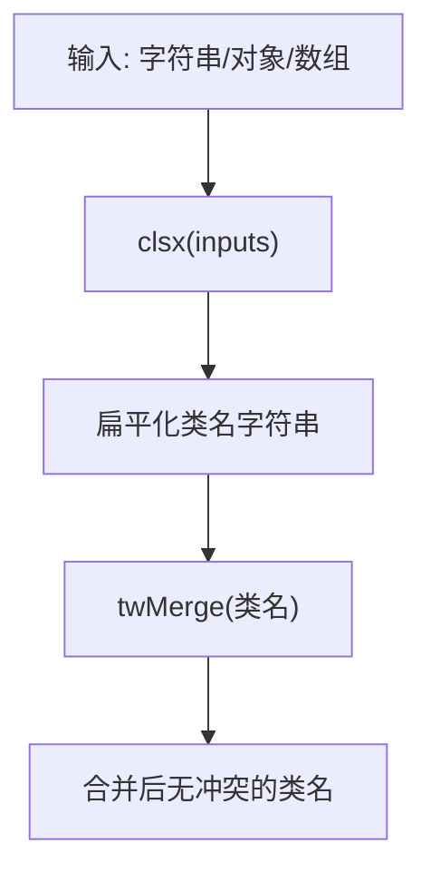

# 工具函数

<cite>
**本文档引用的文件**  
- [utils.ts](file://src/lib/utils.ts)
- [button.tsx](file://src/components/ui/button.tsx)
- [WalletConnect.tsx](file://src/components/Wallet/WalletConnect.tsx)
- [TransactionExecutor.tsx](file://src/components/Blockchain/TransactionExecutor.tsx)
</cite>

## 目录
1. [简介](#简介)
2. [核心实现机制](#核心实现机制)
3. [ClassValue 类型详解](#classvalue-类型详解)
4. [JSX 中的动态样式组合实践](#jsx-中的动态样式组合实践)
5. [项目中的实际应用示例](#项目中的实际应用示例)
6. [性能优化建议](#性能优化建议)
7. [常见使用误区](#常见使用误区)
8. [可访问性考虑](#可访问性考虑)
9. [总结](#总结)

## 简介
`cn` 函数是项目中用于安全合并 Tailwind CSS 类名的核心工具函数。它结合了 `clsx` 和 `tailwind-merge` 两个库的能力，确保在动态组合类名时不会产生样式冲突，并能正确处理多种输入类型。该函数广泛应用于 UI 组件和业务组件中，为构建响应式、可维护的前端界面提供了基础支持。

**Section sources**  
- [utils.ts](file://src/lib/utils.ts#L3-L5)

## 核心实现机制
`cn` 函数通过组合 `clsx` 和 `tailwind-merge` 实现安全的类名合并：

1. **`clsx`**：负责将多种输入类型（字符串、对象、数组）规范化为扁平化的类名字符串。
2. **`tailwind-merge`**：对生成的类名进行智能合并，自动解决冲突（如 `text-red-500` 与 `text-blue-500` 取后者），并优化最终输出。

这种组合方式既保留了 `clsx` 的灵活性，又利用了 `tailwind-merge` 的冲突解决能力，避免了手动管理类名优先级的复杂性。



**Diagram sources**  
- [utils.ts](file://src/lib/utils.ts#L3-L5)

**Section sources**  
- [utils.ts](file://src/lib/utils.ts#L3-L5)

## ClassValue 类型详解
`ClassValue` 是 `clsx` 库定义的类型，支持多种输入形式：

- **字符串**：直接作为类名使用（如 `"text-lg"`）
- **对象**：键为类名，值为布尔值，决定是否包含（如 `{ "hidden": isVisible }`）
- **数组**：递归处理嵌套结构，支持混合类型
- **null/undefined/false**：被忽略，不影响输出

这使得 `cn` 函数能够灵活处理条件样式、动态类名组合等复杂场景。

**Section sources**  
- [utils.ts](file://src/lib/utils.ts#L3-L5)

## JSX 中的动态样式组合实践
在 JSX 中，`cn` 函数常用于根据组件 `props` 动态组合样式。以按钮组件为例：

```tsx
const Button = ({ className, variant, size, ...props }) => {
  return (
    <button
      className={cn(
        buttonVariants({ variant, size }), // 基础变体样式
        className // 外部传入的覆盖样式
      )}
      {...props}
    />
  )
}
```

这种方式实现了：
- **基础样式与状态样式的分离**
- **外部样式的安全合并**
- **变体系统的可扩展性**

**Section sources**  
- [button.tsx](file://src/components/ui/button.tsx#L25-L35)

## 项目中的实际应用示例

### WalletConnect 组件
在钱包连接组件中，`cn` 函数用于条件渲染网络徽章颜色：

```tsx
<Badge className={cn(getNetworkBadgeColor(chain?.id || 0), "text-white")}>
  {chain?.name || 'Unknown'}
</Badge>
```

此处 `getNetworkBadgeColor` 返回不同的背景色类名，`cn` 确保其与 `"text-white"` 正确合并。

**Section sources**  
- [WalletConnect.tsx](file://src/components/Wallet/WalletConnect.tsx#L108-L110)

### TransactionExecutor 组件
在交易执行器中，`cn` 用于根据交易状态动态设置徽章样式：

```tsx
<Badge className={
  transaction.status === 'confirmed' ? 'bg-green-500' :
  transaction.status === 'failed' ? 'bg-red-500' : 'bg-yellow-500'
}>
  {transaction.statusLabel}
</Badge>
```

虽然此处未直接调用 `cn`，但其设计模式体现了动态类名组合的思想，若结合 `cn` 可进一步简化为：

```tsx
<Badge className={cn({
  'bg-green-500': transaction.status === 'confirmed',
  'bg-red-500': transaction.status === 'failed',
  'bg-yellow-500': transaction.status === 'pending'
})}>
```

**Section sources**  
- [TransactionExecutor.tsx](file://src/components/Blockchain/TransactionExecutor.tsx#L258-L264)

## 性能优化建议
1. **避免在渲染时重复计算**：将静态类名组合提取到组件外部或使用 `useMemo` 缓存。
2. **减少深层嵌套数组**：过度嵌套会增加 `clsx` 的处理开销。
3. **优先使用对象语法**：相比三元表达式，对象语法更简洁且易于 `tailwind-merge` 优化。
4. **避免不必要的合并**：若仅有一个类名输入，可直接使用，无需调用 `cn`。

## 常见使用误区
1. **忽略类型安全**：传入非 `ClassValue` 类型（如数字、函数）会导致运行时错误。
2. **过度使用**：在简单场景（如单一类名）中使用 `cn` 会增加不必要的函数调用开销。
3. **误解合并优先级**：`tailwind-merge` 按定义顺序处理冲突，后出现的类名优先级更高。
4. **在 SSR 中滥用**：虽无直接问题，但应在服务端保持类名一致性，避免水合错误。

## 可访问性考虑
1. **语义化类名**：避免使用纯样式类名（如 `mt-4`），应结合语义化命名（如 `spacing-medium`）提升可维护性。
2. **状态类名的可读性**：确保通过 `cn` 生成的状态类名（如 `is-loading`）在开发者工具中清晰可见。
3. **高对比度模式兼容**：`tailwind-merge` 不影响 CSS 优先级，需确保自定义样式遵循 WCAG 对比度标准。
4. **动态内容的 ARIA 支持**：当类名变化反映状态时（如 `hidden`），应同步更新 `aria-*` 属性。

## 总结
`cn` 函数作为项目中的核心工具，通过 `clsx` 和 `tailwind-merge` 的协同工作，实现了安全、灵活的 Tailwind CSS 类名合并。它不仅简化了动态样式管理，还通过类型系统和智能合并机制避免了常见的样式冲突问题。在实际应用中，应结合性能优化和可访问性最佳实践，充分发挥其在构建高质量 UI 组件中的价值。