# 状态管理与工具函数

<cite>
**本文档引用的文件**   
- [utils.ts](file://src/lib/utils.ts)
- [use-toast.ts](file://src/hooks/use-toast.ts)
- [toast.tsx](file://src/components/ui/toast.tsx)
- [toaster.tsx](file://src/components/ui/toaster.tsx)
- [WalletManagement.tsx](file://src/components/Wallet/WalletManagement.tsx)
- [TransactionHistory.tsx](file://src/components/Transactions/TransactionHistory.tsx)
- [CurrencyExchange.tsx](file://src/components/Exchange/CurrencyExchange.tsx)
- [Settings.tsx](file://src/pages/Settings.tsx)
</cite>

## 目录
1. [简介](#简介)
2. [项目结构](#项目结构)
3. [核心组件](#核心组件)
4. [架构概述](#架构概述)
5. [详细组件分析](#详细组件分析)
6. [依赖分析](#依赖分析)
7. [性能考虑](#性能考虑)
8. [故障排除指南](#故障排除指南)
9. [结论](#结论)
10. [附录](#附录)（如有必要）

## 简介
本文档全面介绍了项目中的状态管理与工具函数实现，重点阐述了cn工具函数的实现原理、基于clsx和tailwind-merge库的类名合并机制及其在组件样式组合中的应用。深入解析了useToast自定义Hook的设计模式，包括全局状态管理、Toast队列控制和超时移除机制。详细说明了TOAST_LIMIT和TOAST_REMOVE_DELAY配置参数的作用和可调性。描述了Toast组件与useToast Hook的集成方式，以及在用户界面中提供反馈的最佳实践。提供了这些工具函数在项目中的实际使用示例，如在交易操作成功或失败时显示相应提示，并包含性能考虑、可访问性建议和自定义扩展的可能性。

## 项目结构
项目采用分层架构设计，将工具函数和状态管理逻辑集中管理。核心工具函数位于`src/lib/utils.ts`，而状态管理相关的Hook则位于`src/hooks/`目录下。UI组件中的Toast相关实现位于`src/components/ui/`目录，包括`toast.tsx`和`toaster.tsx`。这些工具函数被广泛应用于各个业务组件中，如钱包管理、交易历史、货币兑换和设置页面等。

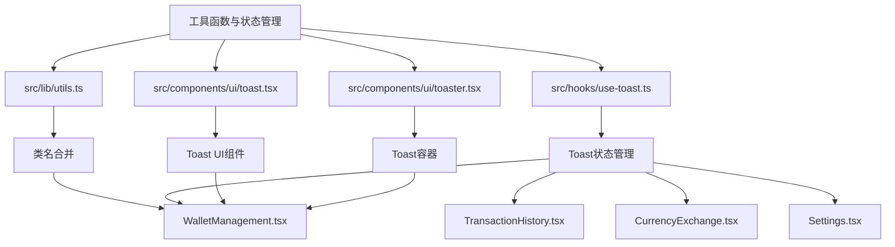

**图表来源**
- [utils.ts](file://src/lib/utils.ts)
- [use-toast.ts](file://src/hooks/use-toast.ts)
- [toast.tsx](file://src/components/ui/toast.tsx)
- [toaster.tsx](file://src/components/ui/toaster.tsx)
- [WalletManagement.tsx](file://src/components/Wallet/WalletManagement.tsx)
- [TransactionHistory.tsx](file://src/components/Transactions/TransactionHistory.tsx)
- [CurrencyExchange.tsx](file://src/components/Exchange/CurrencyExchange.tsx)
- [Settings.tsx](file://src/pages/Settings.tsx)

**章节来源**
- [utils.ts](file://src/lib/utils.ts)
- [use-toast.ts](file://src/hooks/use-toast.ts)
- [toast.tsx](file://src/components/ui/toast.tsx)
- [toaster.tsx](file://src/components/ui/toaster.tsx)

## 核心组件
本节分析项目中的核心工具函数和状态管理组件。`cn`工具函数作为类名合并的核心，基于`clsx`和`tailwind-merge`库实现，确保了Tailwind CSS类名的正确合并和优先级处理。`useToast`自定义Hook实现了全局Toast状态管理，通过Redux-like的reducer模式管理Toast队列，支持添加、更新、关闭和移除操作。`Toast`和`Toaster`组件负责Toast消息的UI渲染和容器管理，与`useToast` Hook紧密集成，实现了响应式的用户反馈系统。

**章节来源**
- [utils.ts](file://src/lib/utils.ts#L3-L5)
- [use-toast.ts](file://src/hooks/use-toast.ts#L165-L183)
- [toast.tsx](file://src/components/ui/toast.tsx#L42-L44)
- [toaster.tsx](file://src/components/ui/toaster.tsx#L3-L23)

## 架构概述
系统的状态管理与工具函数架构采用分层设计模式。最底层是`clsx`和`tailwind-merge`库，提供基础的类名处理能力。中间层是`cn`工具函数，封装了这两个库的功能，提供简洁的API。上层是`useToast`自定义Hook，实现了全局状态管理逻辑。最上层是UI组件，通过`useToast` Hook和`cn`函数与底层逻辑交互。这种架构实现了关注点分离，提高了代码的可维护性和可复用性。

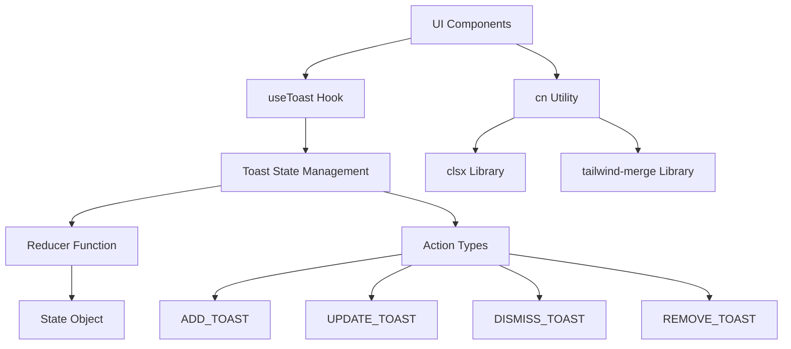

**图表来源**
- [utils.ts](file://src/lib/utils.ts#L3-L5)
- [use-toast.ts](file://src/hooks/use-toast.ts#L30-L46)
- [use-toast.ts](file://src/hooks/use-toast.ts#L48-L50)
- [use-toast.ts](file://src/hooks/use-toast.ts#L136-L163)
- [toast.tsx](file://src/components/ui/toast.tsx#L42-L44)

**章节来源**
- [utils.ts](file://src/lib/utils.ts#L3-L5)
- [use-toast.ts](file://src/hooks/use-toast.ts#L30-L183)

## 详细组件分析
本节深入分析各个核心组件的实现细节和设计模式。

### cn工具函数分析
`cn`工具函数是项目中类名合并的核心实现，基于`clsx`和`tailwind-merge`两个库构建。它解决了在使用Tailwind CSS时常见的类名冲突和覆盖问题，确保样式能够正确应用。

#### 实现原理
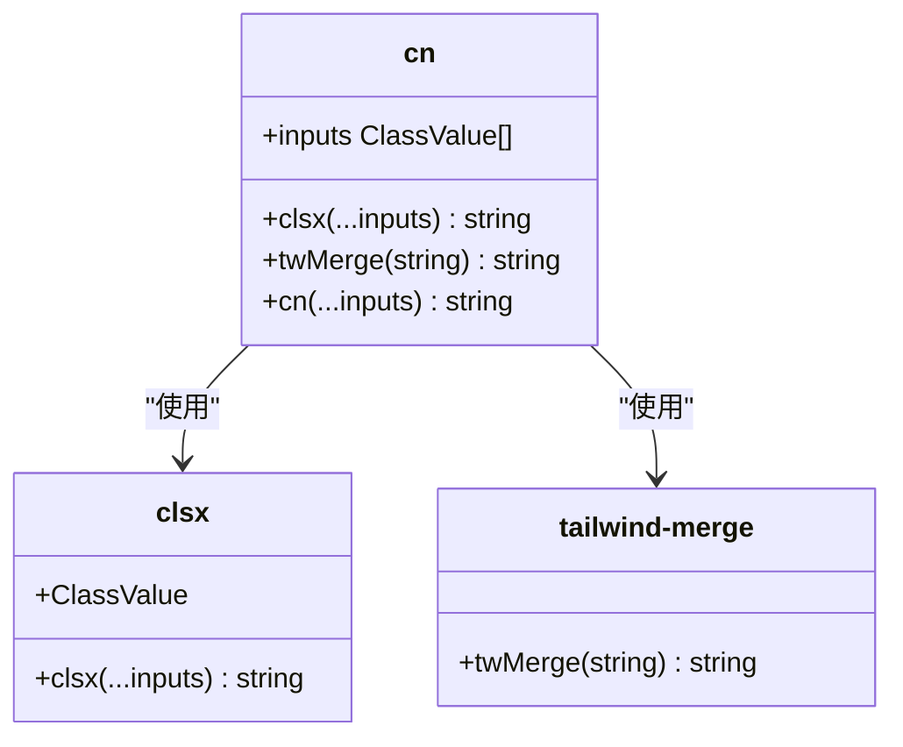

**图表来源**
- [utils.ts](file://src/lib/utils.ts#L3-L5)
- [node_modules/clsx/clsx.d.ts](file://node_modules/clsx/clsx.d.ts)
- [node_modules/tailwind-merge/index.d.ts](file://node_modules/tailwind-merge/index.d.ts)

#### 类名合并机制
`cn`函数的执行流程如下：
1. 接收任意数量的类名输入（支持字符串、数组、对象等多种格式）
2. 使用`clsx`函数将输入转换为扁平化的类名字符串
3. 使用`tailwind-merge`函数对类名进行智能合并，解决冲突
4. 返回最终的类名字符串

这种机制确保了即使在复杂的类名组合场景下，也能产生正确的CSS类名输出。例如，当同时存在`bg-red-500`和`bg-blue-500`时，`tailwind-merge`会根据Tailwind的排序规则正确处理优先级。

**章节来源**
- [utils.ts](file://src/lib/utils.ts#L3-L5)

### useToast自定义Hook分析
`useToast`自定义Hook是项目中全局状态管理的核心实现，采用Redux-like的设计模式，提供了完整的Toast消息管理功能。

#### 设计模式
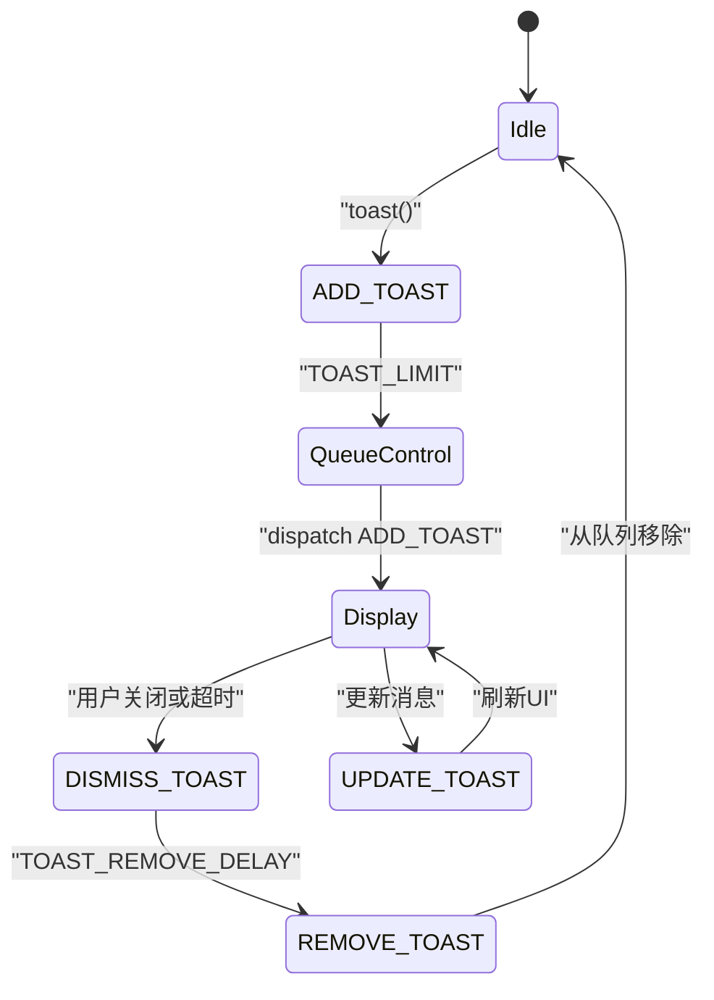

**图表来源**
- [use-toast.ts](file://src/hooks/use-toast.ts#L127-L132)
- [use-toast.ts](file://src/hooks/use-toast.ts#L136-L163)
- [use-toast.ts](file://src/hooks/use-toast.ts#L165-L183)

#### 全局状态管理
`useToast` Hook通过闭包变量`memoryState`和`listeners`数组实现了全局状态管理。`memoryState`存储当前的Toast状态，`listeners`数组存储所有订阅该状态的组件。当状态发生变化时，通过`dispatch`函数通知所有订阅者更新UI。

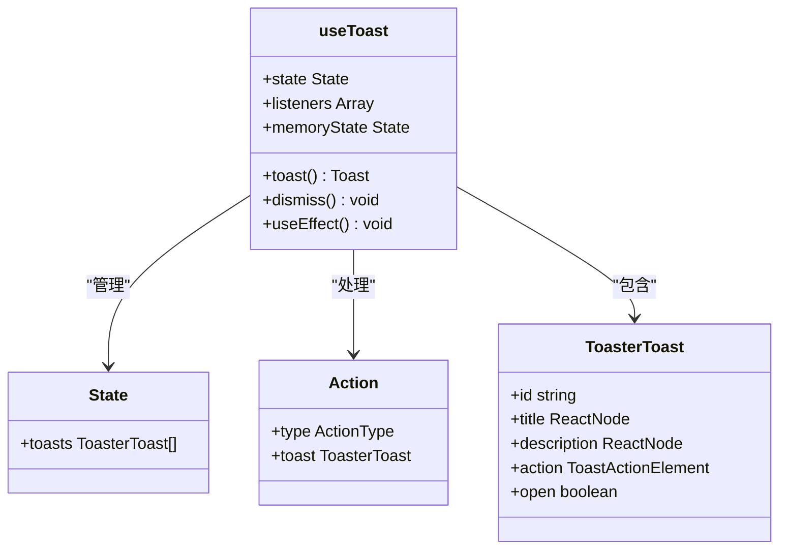

**图表来源**
- [use-toast.ts](file://src/hooks/use-toast.ts#L48-L50)
- [use-toast.ts](file://src/hooks/use-toast.ts#L30-L46)
- [use-toast.ts](file://src/hooks/use-toast.ts#L165-L183)

#### Toast队列控制
`useToast` Hook通过`TOAST_LIMIT`常量实现了Toast队列的长度限制。当新Toast被添加时，reducer函数会确保队列长度不超过限制，通过数组切片操作保留最新的Toast消息。

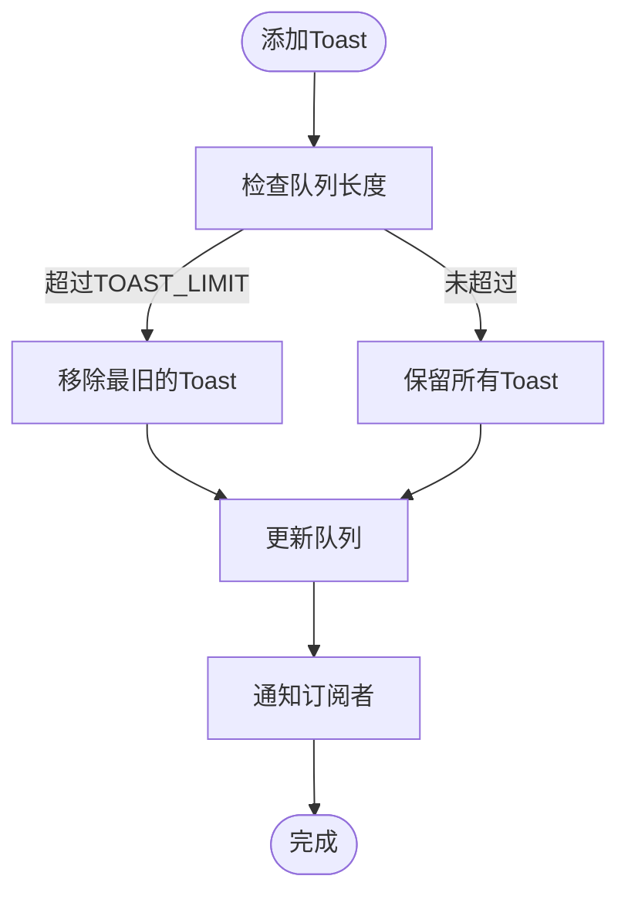

**图表来源**
- [use-toast.ts](file://src/hooks/use-toast.ts#L1-L2)
- [use-toast.ts](file://src/hooks/use-toast.ts#L100-L105)

#### 超时移除机制
`useToast` Hook通过`addToRemoveQueue`函数和`toastTimeouts` Map对象实现了超时移除机制。当Toast被关闭时，会设置一个定时器，在`TOAST_REMOVE_DELAY`毫秒后将其从队列中完全移除。

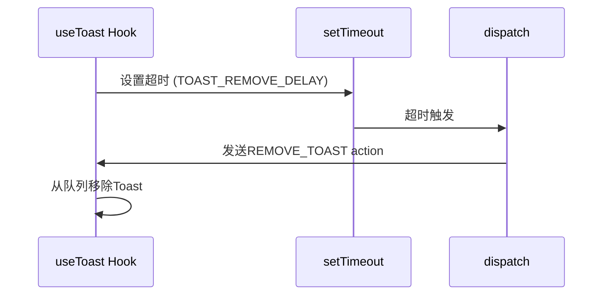

**图表来源**
- [use-toast.ts](file://src/hooks/use-toast.ts#L70-L85)
- [use-toast.ts](file://src/hooks/use-toast.ts#L127-L132)

### 配置参数分析
本节分析`TOAST_LIMIT`和`TOAST_REMOVE_DELAY`配置参数的作用和可调性。

#### TOAST_LIMIT参数
`TOAST_LIMIT`常量定义了Toast队列的最大长度。当前设置为1，意味着任何时候最多只显示一个Toast消息。这个参数可以根据用户体验需求进行调整：

- **值为1**：确保用户注意力集中，避免消息过载
- **值为3-5**：允许同时显示多个相关消息，提高信息密度
- **值为0**：禁用Toast功能（不推荐）

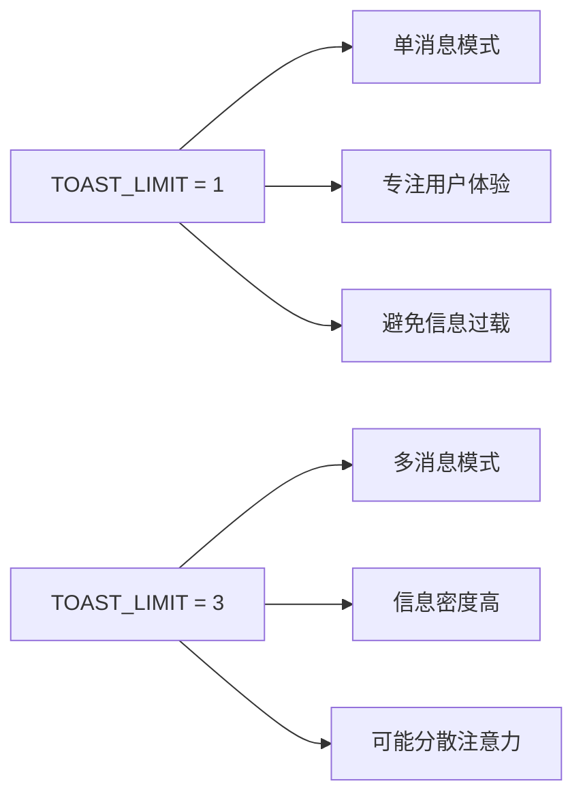

**图表来源**
- [use-toast.ts](file://src/hooks/use-toast.ts#L1-L2)

#### TOAST_REMOVE_DELAY参数
`TOAST_REMOVE_DELAY`常量定义了Toast消息在关闭后被完全移除的延迟时间。当前设置为1000000毫秒（约16.7分钟），这是一个非常长的时间，可能是为了调试目的。

- **短延迟（5000-10000ms）**：适合临时提示，如操作成功/失败
- **中等延迟（30000-60000ms）**：适合重要通知，给用户足够时间阅读
- **长延迟（>300000ms）**：适合关键系统消息，确保不会被意外错过

**章节来源**
- [use-toast.ts](file://src/hooks/use-toast.ts#L1-L2)

### 组件集成分析
本节分析Toast组件与useToast Hook的集成方式，以及在用户界面中提供反馈的最佳实践。

#### 集成方式
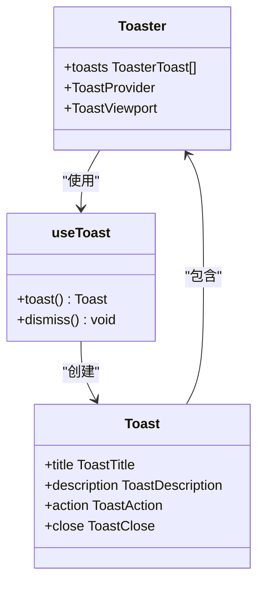

**图表来源**
- [toaster.tsx](file://src/components/ui/toaster.tsx#L3-L23)
- [toast.tsx](file://src/components/ui/toast.tsx#L42-L85)
- [use-toast.ts](file://src/hooks/use-toast.ts#L136-L163)

#### 最佳实践
在用户界面中使用Toast提供反馈的最佳实践包括：

1. **语义化消息**：使用不同的variant（default, destructive）表示消息类型
2. **简洁文案**：保持标题和描述简短明了
3. **及时反馈**：在操作完成后立即显示Toast
4. **可操作性**：为重要消息提供操作按钮（action）
5. **可访问性**：确保Toast对屏幕阅读器友好

**章节来源**
- [toaster.tsx](file://src/components/ui/toaster.tsx#L3-L23)
- [toast.tsx](file://src/components/ui/toast.tsx#L83-L93)

### 实际使用示例
本节提供工具函数在项目中的实际使用示例。

#### 钱包管理中的使用
在钱包管理组件中，`useToast`被用于提供各种操作反馈：

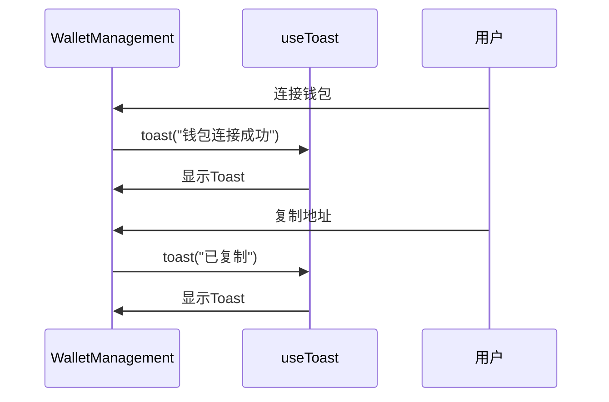

**章节来源**
- [WalletManagement.tsx](file://src/components/Wallet/WalletManagement.tsx#L36-L351)

#### 交易历史中的使用
在交易历史组件中，`useToast`被用于提供交易状态反馈：

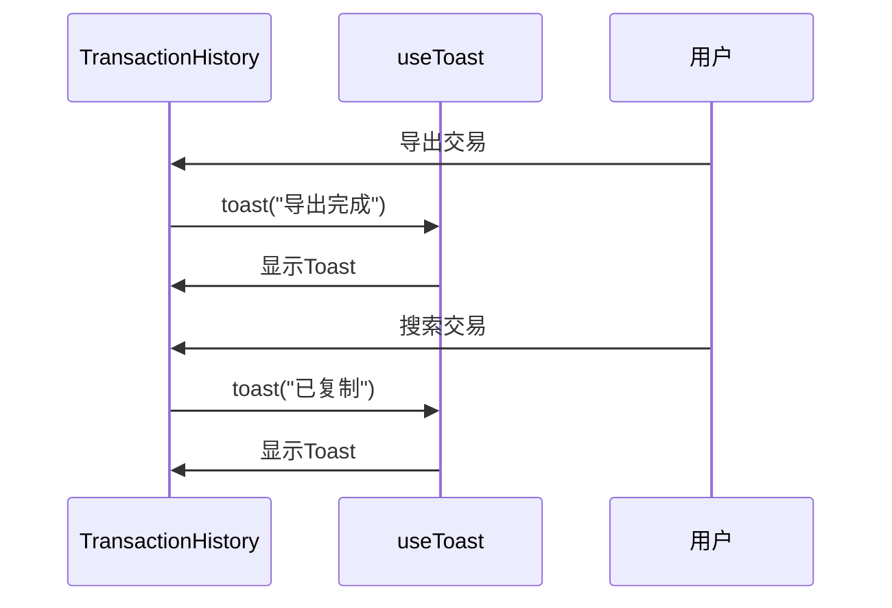

**章节来源**
- [TransactionHistory.tsx](file://src/components/Transactions/TransactionHistory.tsx#L39-L495)

#### 货币兑换中的使用
在货币兑换组件中，`useToast`被用于提供交易流程反馈：

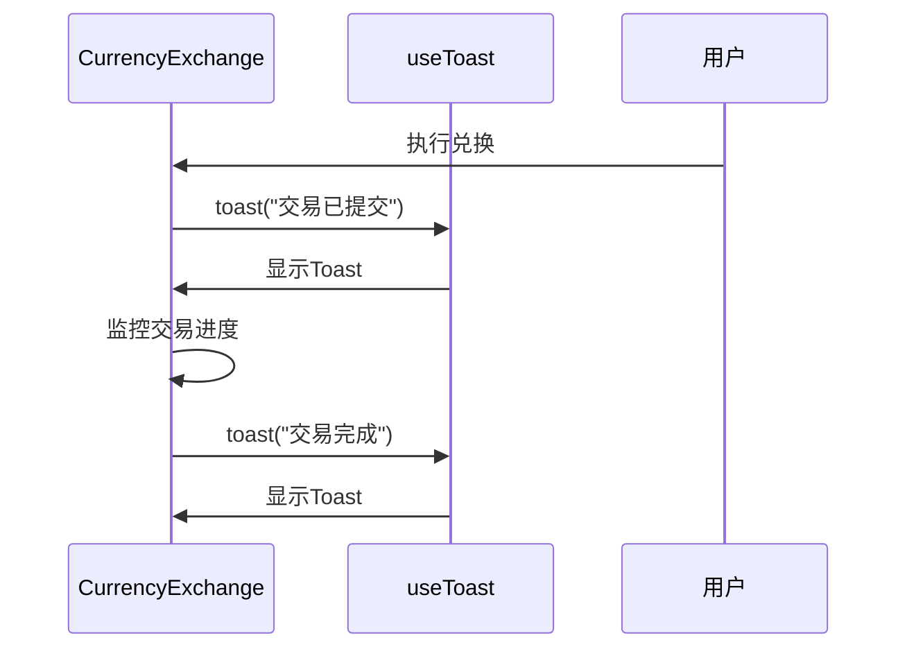

**章节来源**
- [CurrencyExchange.tsx](file://src/components/Exchange/CurrencyExchange.tsx#L15-L621)

#### 设置页面中的使用
在设置页面中，`useToast`被用于提供设置保存反馈：

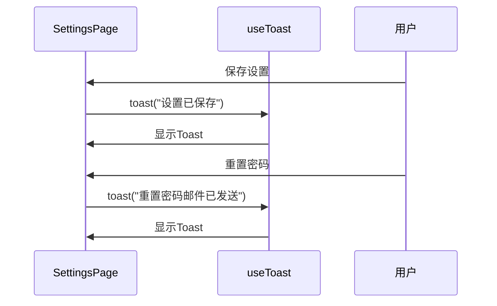

**章节来源**
- [Settings.tsx](file://src/pages/Settings.tsx#L49-L533)

## 依赖分析
本节分析组件之间的依赖关系和外部依赖。

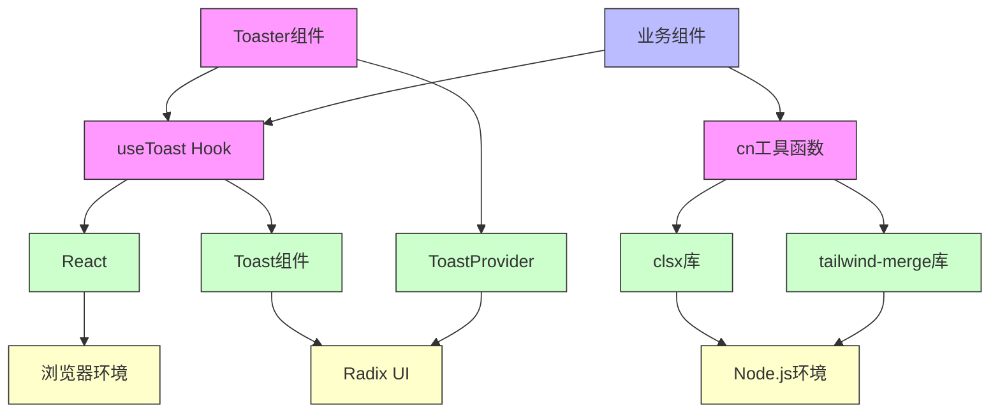

**图表来源**
- [utils.ts](file://src/lib/utils.ts#L1-L2)
- [use-toast.ts](file://src/hooks/use-toast.ts#L1)
- [toast.tsx](file://src/components/ui/toast.tsx#L1)
- [toaster.tsx](file://src/components/ui/toaster.tsx#L1)
- [package.json](file://package.json)

**章节来源**
- [utils.ts](file://src/lib/utils.ts#L1-L5)
- [use-toast.ts](file://src/hooks/use-toast.ts#L1-L186)
- [toast.tsx](file://src/components/ui/toast.tsx#L1-L111)
- [toaster.tsx](file://src/components/ui/toaster.tsx#L1-L23)

## 性能考虑
在使用这些工具函数和状态管理机制时，需要考虑以下性能因素：

1. **类名合并性能**：`cn`函数的执行时间随着输入参数数量的增加而增加，应避免在渲染循环中传递大量动态类名。
2. **状态更新频率**：频繁调用`toast()`函数可能导致不必要的状态更新，应合理控制Toast的显示频率。
3. **内存占用**：`toastTimeouts` Map对象会随着Toast数量的增加而增长，需要确保超时机制正常工作以释放内存。
4. **渲染性能**：Toast组件的动画效果可能影响低端设备的渲染性能，应提供性能模式选项。

**章节来源**
- [utils.ts](file://src/lib/utils.ts#L3-L5)
- [use-toast.ts](file://src/hooks/use-toast.ts#L70-L85)
- [use-toast.ts](file://src/hooks/use-toast.ts#L127-L132)

## 故障排除指南
本节提供常见问题的解决方案。

### Toast不显示
可能原因及解决方案：
- **未正确集成Toaster组件**：确保在应用根组件中渲染`<Toaster />`
- **z-index冲突**：检查Toast的z-index是否被其他元素覆盖
- **状态更新问题**：确认`useToast` Hook正确订阅了状态变化

### 类名合并错误
可能原因及解决方案：
- **库版本不兼容**：确保`clsx`和`tailwind-merge`版本兼容
- **输入格式错误**：检查传递给`cn`函数的参数格式是否正确
- **Tree-shaking问题**：确认构建工具正确处理了库的导入

**章节来源**
- [toaster.tsx](file://src/components/ui/toaster.tsx#L3-L23)
- [utils.ts](file://src/lib/utils.ts#L3-L5)

## 结论
本文档全面分析了项目中的状态管理与工具函数实现。`cn`工具函数通过结合`clsx`和`tailwind-merge`库，提供了强大而可靠的类名合并能力，解决了Tailwind CSS开发中的常见痛点。`useToast`自定义Hook采用Redux-like的设计模式，实现了优雅的全局状态管理，支持Toast队列控制和超时移除机制。这些工具函数在项目中得到了广泛应用，为用户提供了一致且友好的反馈体验。建议在未来的开发中继续遵循这些最佳实践，并根据实际需求调整配置参数以优化用户体验。