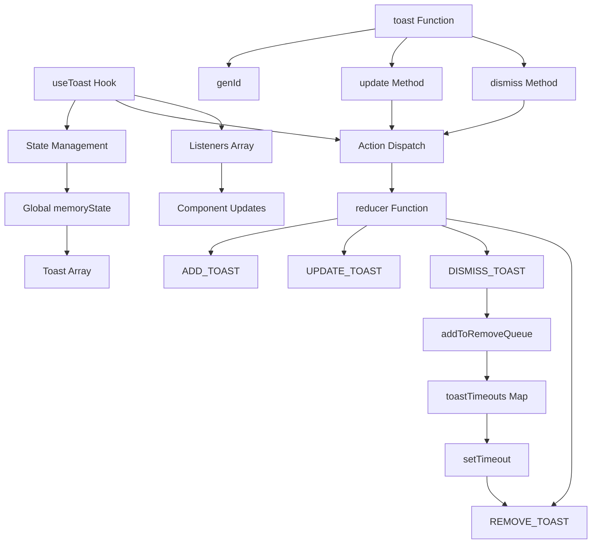
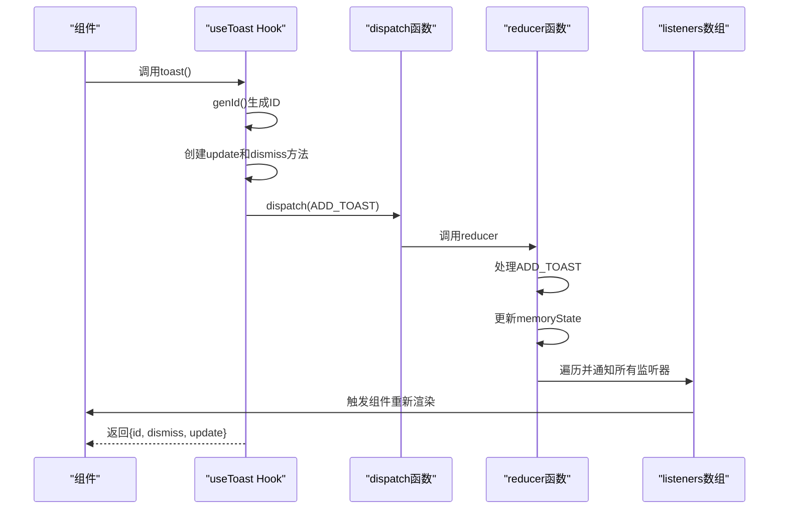
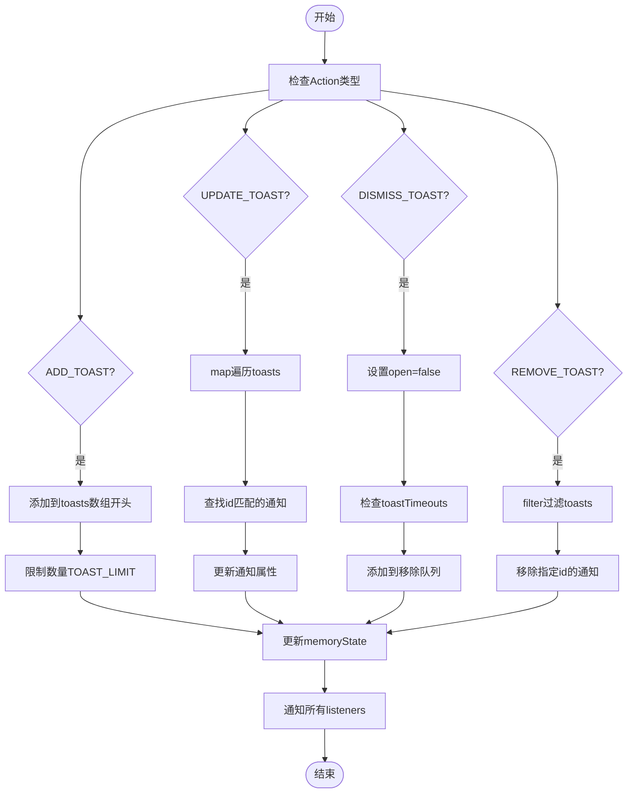
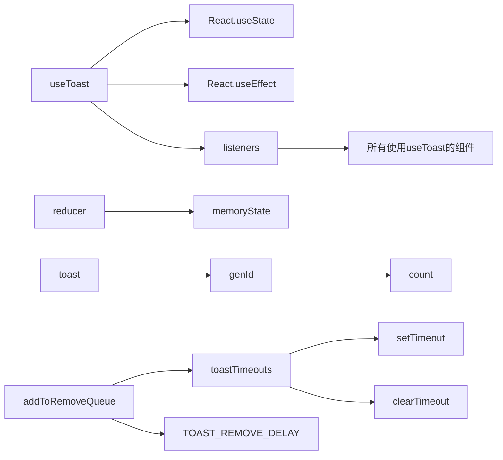

# 通知系统

<cite>
**本文档引用的文件**
- [use-toast.ts](file://src/hooks/use-toast.ts)
- [toaster.tsx](file://src/components/ui/toaster.tsx)
- [toast.tsx](file://src/components/ui/toast.tsx)
- [CurrencyExchange.tsx](file://src/components/Exchange/CurrencyExchange.tsx)
- [KYCVerification.tsx](file://src/components/Compliance/KYCVerification.tsx)
- [WalletManagement.tsx](file://src/components/Wallet/WalletManagement.tsx)
- [TransactionHistory.tsx](file://src/components/Transactions/TransactionHistory.tsx)
- [NotificationCenter.tsx](file://src/components/Notifications/NotificationCenter.tsx)
</cite>

## 目录
1. [简介](#简介)
2. [核心组件](#核心组件)
3. [架构概述](#架构概述)
4. [详细组件分析](#详细组件分析)
5. [依赖分析](#依赖分析)
6. [性能考虑](#性能考虑)
7. [故障排除指南](#故障排除指南)
8. [结论](#结论)

## 简介
本通知系统文档深入解析了基于React的全局通知机制实现，重点阐述了`useToast`自定义Hook和全局Toast管理器的设计原理。该系统采用单例模式进行状态管理，通过reducer函数处理通知的添加、更新、关闭和移除等操作。系统配置了`TOAST_LIMIT`和`TOAST_REMOVE_DELAY`参数来控制通知显示数量和自动移除延迟，优化用户体验。通知系统通过listeners数组实现状态广播，确保所有监听组件同步更新。文档还提供了在交易操作、KYC状态更新等实际场景中的使用示例，以及内存泄漏防范措施和自定义扩展建议。

## 核心组件

`useToast` Hook是通知系统的核心，它通过`React.useState`从`memoryState`初始化状态，并在`useEffect`中将`setState`函数添加到全局`listeners`数组中，实现状态广播机制。Hook返回当前状态、`toast`函数和`dismiss`方法，为组件提供完整的通知控制能力。`toast`函数生成唯一ID，创建`update`和`dismiss`方法，并通过`dispatch`触发`ADD_TOAST`动作，将新通知添加到状态中。

**Section sources**
- [use-toast.ts](file://src/hooks/use-toast.ts#L165-L183)

## 架构概述

通知系统采用全局单例模式设计，通过`memoryState`变量存储所有通知的全局状态，确保应用中所有组件共享同一份通知数据。系统使用`reducer`函数处理四种action类型：`ADD_TOAST`、`UPDATE_TOAST`、`DISMISS_TOAST`和`REMOVE_TOAST`，通过纯函数的方式更新状态。`toastTimeouts` Map用于管理自动移除定时器，防止重复创建。`listeners`数组存储所有状态监听器，当状态变化时通知所有监听组件重新渲染。

**Diagram sources**
- [use-toast.ts](file://src/hooks/use-toast.ts#L4-L186)

## 详细组件分析

### useToast Hook分析
`useToast` Hook实现了通知系统的状态管理和广播机制。它使用`React.useState`创建本地状态，并在`useEffect`中将`setState`函数添加到全局`listeners`数组。当组件卸载时，通过`indexOf`和`splice`方法从listeners中移除对应的监听器，防止内存泄漏。Hook返回解构后的状态以及`toast`和`dismiss`方法，使组件能够方便地创建和控制通知。

#### 对于API/Service组件：

**Diagram sources**
- [use-toast.ts](file://src/hooks/use-toast.ts#L165-L183)

### Toast状态管理分析
Toast状态管理采用全局单例模式，通过`memoryState`变量存储所有通知的全局状态。`reducer`函数是状态更新的核心，它根据不同的action类型执行相应的状态转换。`ADD_TOAST`将新通知添加到数组开头，并通过`slice(0, TOAST_LIMIT)`限制通知数量。`UPDATE_TOAST`通过`map`方法找到匹配ID的通知并更新其属性。`DISMISS_TOAST`将指定通知的`open`状态设为`false`，并调用`addToRemoveQueue`安排移除。`REMOVE_TOAST`从数组中永久移除通知。

#### 对于复杂逻辑组件：

**Diagram sources**
- [use-toast.ts](file://src/hooks/use-toast.ts#L70-L121)

## 依赖分析

通知系统依赖于React的`useState`和`useEffect` Hook进行状态管理和副作用处理。`toastTimeouts` Map依赖JavaScript的`setTimeout`和`clearTimeout`进行定时器管理。系统通过`listeners`数组与所有使用`useToast`的组件建立依赖关系，形成状态广播网络。`genId`函数依赖`count`变量的递增来生成唯一ID。`addToRemoveQueue`函数依赖`TOAST_REMOVE_DELAY`配置参数来设置自动移除延迟。

**Diagram sources**
- [use-toast.ts](file://src/hooks/use-toast.ts#L4-L186)

## 性能考虑

通知系统在性能方面进行了多项优化。`TOAST_LIMIT`配置限制了同时显示的通知数量，防止界面过度拥挤。`TOAST_REMOVE_DELAY`设置合理的自动移除延迟，平衡用户体验和界面整洁。`addToRemoveQueue`函数通过检查`toastTimeouts.has(toastId)`防止重复创建定时器，避免内存泄漏。`reducer`函数采用不可变更新模式，确保状态更新的可预测性。系统使用`memoryState`全局变量而非Context，减少不必要的组件重新渲染。`listeners`数组的管理确保组件卸载时及时清理监听器，防止内存泄漏。

## 故障排除指南

当通知系统出现问题时，首先检查`useToast`是否正确导入和调用。如果通知不显示，确认`Toaster`组件是否在应用顶层渲染。对于内存泄漏问题，确保`useEffect`的清理函数正确执行，`listeners`数组不会无限增长。如果通知重复出现，检查`addToRemoveQueue`是否被多次调用，确认`toastTimeouts.has(toastId)`检查是否生效。对于状态不同步问题，验证`dispatch`函数是否正确通知所有`listeners`。在调试时，可以临时添加日志输出`memoryState`和`listeners`的状态，帮助定位问题。

**Section sources**
- [use-toast.ts](file://src/hooks/use-toast.ts#L127-L132)
- [use-toast.ts](file://src/hooks/use-toast.ts#L54-L68)

## 结论

本通知系统通过精心设计的全局单例模式和reducer状态管理，实现了高效、可靠的通知机制。`useToast` Hook提供了简洁的API，使组件能够轻松创建和控制通知。系统通过`TOAST_LIMIT`和`TOAST_REMOVE_DELAY`配置参数优化用户体验，通过`toastTimeouts`和`listeners`管理确保内存安全。在交易操作、KYC验证等关键场景中，该系统提供了及时的反馈，增强了应用的可用性。未来可扩展支持通知持久化、分类管理和用户偏好设置，进一步提升系统的功能性和用户体验。