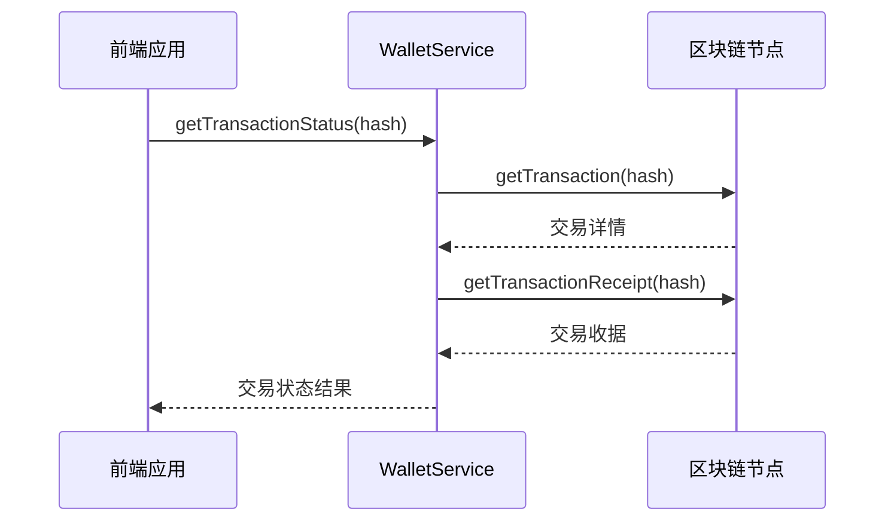
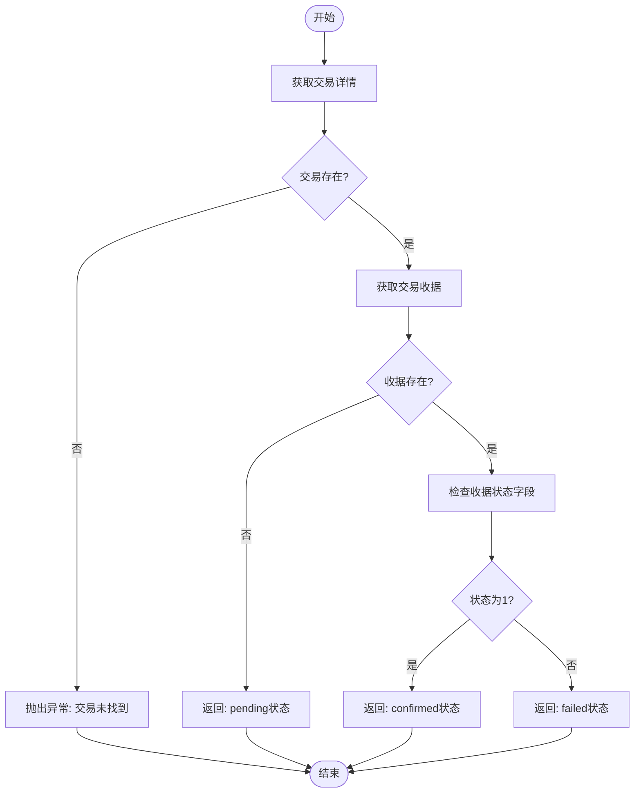
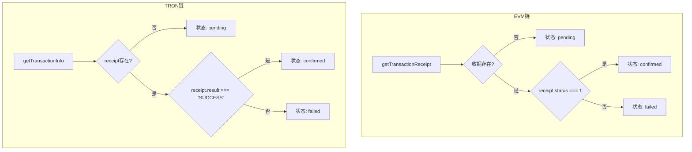
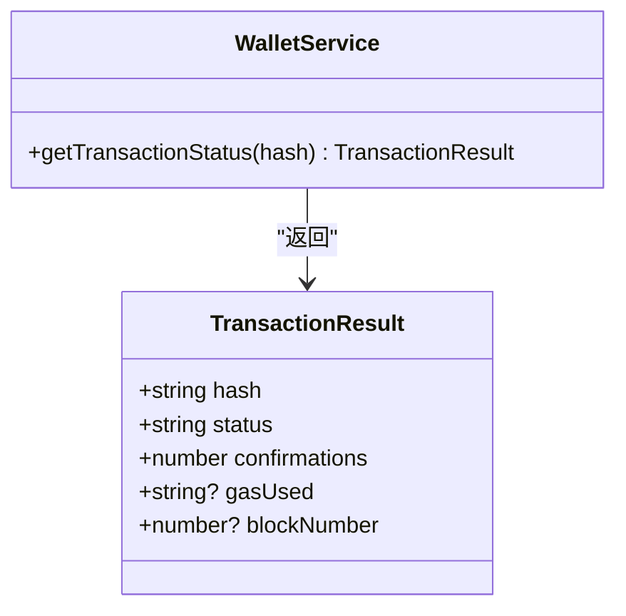
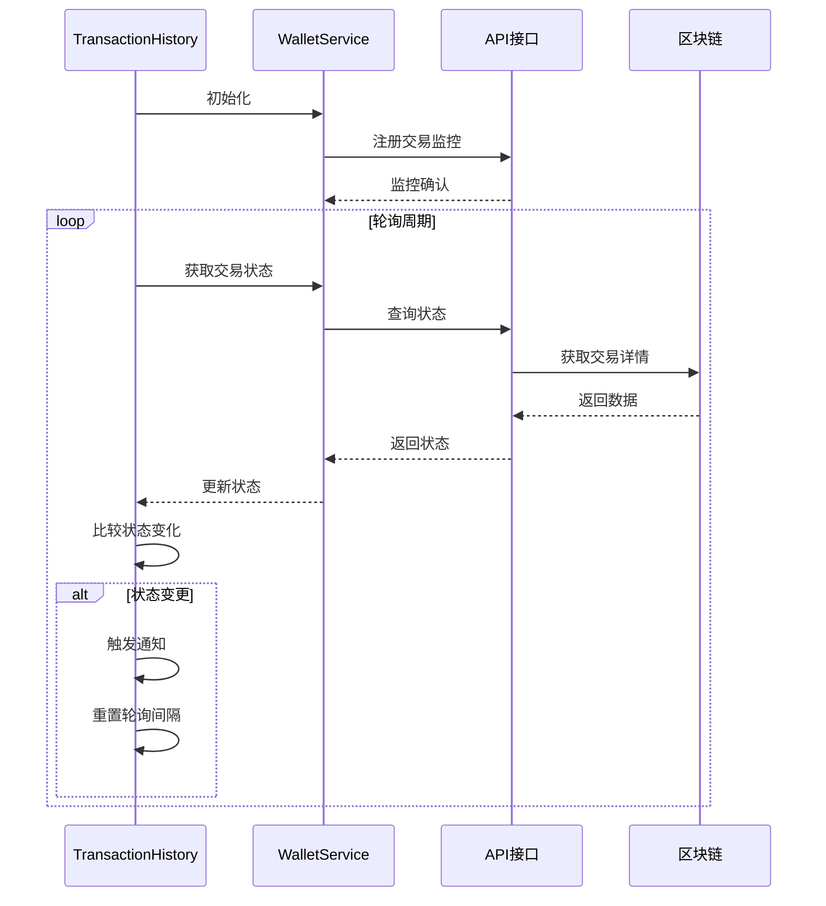
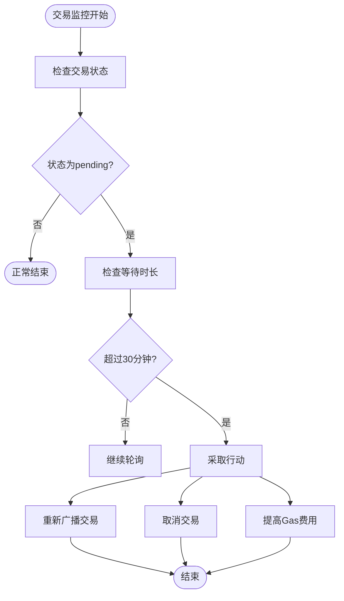
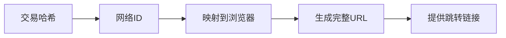
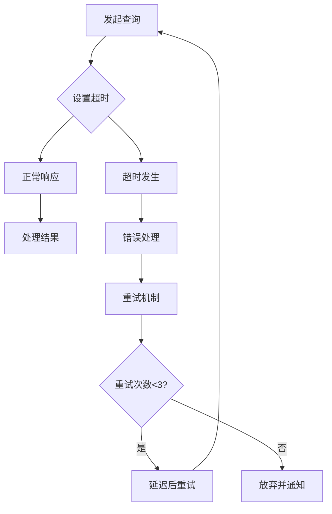

# 交易状态监控

<cite>
**本文档引用文件**  
- [walletService.ts](file://src/services/walletService.ts#L151-L186)
- [multiChainService.ts](file://backend/src/services/multiChainService.ts#L363-L440)
- [TransactionHistory.tsx](file://src/components/Transactions/TransactionHistory.tsx)
- [route.ts](file://src/app/api/wallet/transaction/route.ts#L100-L143)
</cite>

## 目录
1. [简介](#简介)
2. [交易状态获取原理](#交易状态获取原理)
3. [交易状态判断逻辑](#交易状态判断逻辑)
4. [确认数计算与安全性评估](#确认数计算与安全性评估)
5. [交易监控实现模式](#交易监控实现模式)
6. [异常情况处理策略](#异常情况处理策略)
7. [区块浏览器集成](#区块浏览器集成)
8. [网络超时解决方案](#网络超时解决方案)

## 简介
本文档全面介绍交易状态监控系统的工作机制，重点阐述`getTransactionStatus`方法的实现原理。文档详细说明如何通过区块链API获取交易详情与收据，解释pending、confirmed、failed三种状态的判断逻辑，并阐述确认数在交易安全性评估中的重要意义。同时提供在TransactionHistory组件中实现轮询监控的完整方案，包括轮询策略、状态更新和通知机制。

## 交易状态获取原理

交易状态监控的核心是通过区块链节点API获取交易详情和交易收据。系统采用双API调用模式：首先调用`getTransaction`获取交易基本信息，然后调用`getTransactionReceipt`获取交易执行结果。



**图示来源**
- [walletService.ts](file://src/services/walletService.ts#L151-L186)

**本节来源**
- [walletService.ts](file://src/services/walletService.ts#L151-L186)

## 交易状态判断逻辑

系统通过分析交易详情和交易收据的存在性及内容来判断交易状态，采用三级状态判断机制：

### 状态判断流程


### 多链状态判断
系统支持EVM和TRON链的交易状态查询，针对不同链采用不同的判断逻辑：



**图示来源**
- [multiChainService.ts](file://backend/src/services/multiChainService.ts#L363-L440)

**本节来源**
- [walletService.ts](file://src/services/walletService.ts#L151-L186)
- [multiChainService.ts](file://backend/src/services/multiChainService.ts#L363-L440)

## 确认数计算与安全性评估

确认数（confirmations）是衡量交易安全性的关键指标，表示交易所在区块之后已产生的新区块数量。

### 确认数计算公式
```
确认数 = 当前区块高度 - 交易所在区块高度 + 1
```

### 安全性评估标准
不同区块链网络对确认数的安全要求不同，一般建议：

| 区块链 | 最低安全确认数 | 高安全确认数 |
|--------|----------------|--------------|
| Ethereum | 12 | 30+ |
| BSC | 15 | 30+ |
| TRON | 19 | 30+ |



**图示来源**
- [walletService.ts](file://src/services/walletService.ts#L151-L186)

**本节来源**
- [walletService.ts](file://src/services/walletService.ts#L151-L186)

## 交易监控实现模式

TransactionHistory组件实现了完整的交易状态轮询监控机制，确保用户能实时获取交易状态更新。

### 轮询监控架构
```mermaid
graph TB
subgraph 前端
A[TransactionHistory] --> B[轮询控制器]
B --> C[状态更新]
C --> D[UI渲染]
D --> E[用户通知]
end
subgraph 后端
F[API接口] --> G[区块链服务]
G --> H[区块链节点]
end
B --> F : 定期请求
F --> B : 返回状态
```

### 轮询策略
- **初始间隔**：3秒
- **最大间隔**：30秒
- **指数退避**：状态不变时逐步增加间隔
- **状态变更**：立即重置为初始间隔

### 状态更新机制
组件通过React的useState和useEffect钩子实现状态管理：



**图示来源**
- [TransactionHistory.tsx](file://src/components/Transactions/TransactionHistory.tsx)
- [walletService.ts](file://src/services/walletService.ts#L151-L186)

**本节来源**
- [TransactionHistory.tsx](file://src/components/Transactions/TransactionHistory.tsx)
- [walletService.ts](file://src/services/walletService.ts#L151-L186)

## 异常情况处理策略

系统针对长时间pending的交易提供了完整的处理策略，确保用户体验和资金安全。

### 长时间Pending处理


### 处理策略
1. **重新广播交易**：使用相同nonce重新发送交易
2. **取消交易**：发送相同nonce但接收地址为自身的空交易
3. **提高Gas费用**：使用更高Gas费用重新广播
4. **用户通知**：通过弹窗和邮件通知用户

**本节来源**
- [TransactionHistory.tsx](file://src/components/Transactions/TransactionHistory.tsx)
- [walletService.ts](file://src/services/walletService.ts#L151-L186)

## 区块浏览器集成

系统集成了区块浏览器功能，方便用户在外部验证交易状态。

### 区块浏览器链接生成


### 支持的区块浏览器
| 网络ID | 区块浏览器 |
|--------|------------|
| 1 | https://etherscan.io |
| 11155111 | https://sepolia.etherscan.io |
| 3448148188 | https://nile.tronscan.org |

```javascript
function getExplorerUrl(networkId: number, txHash: string): string {
  const explorers = {
    1: 'https://etherscan.io',
    11155111: 'https://sepolia.etherscan.io',
    3448148188: 'https://nile.tronscan.org'
  }
  
  const explorer = explorers[networkId as keyof typeof explorers] || 'https://etherscan.io'
  return `${explorer}/tx/${txHash}`
}
```

**图示来源**
- [route.ts](file://src/app/api/wallet/transaction/route.ts#L100-L143)

**本节来源**
- [route.ts](file://src/app/api/wallet/transaction/route.ts#L100-L143)

## 网络超时解决方案

针对网络延迟导致的查询超时问题，系统采用多层次的容错机制。

### 超时处理架构


### 具体措施
1. **请求超时设置**：所有API请求设置10秒超时
2. **重试机制**：最多重试3次，采用指数退避
3. **备用节点**：配置多个RPC节点作为备用
4. **缓存机制**：本地缓存最近的交易状态
5. **降级策略**：网络异常时提供离线状态显示

**本节来源**
- [walletService.ts](file://src/services/walletService.ts#L151-L186)
- [multiChainService.ts](file://backend/src/services/multiChainService.ts#L363-L440)