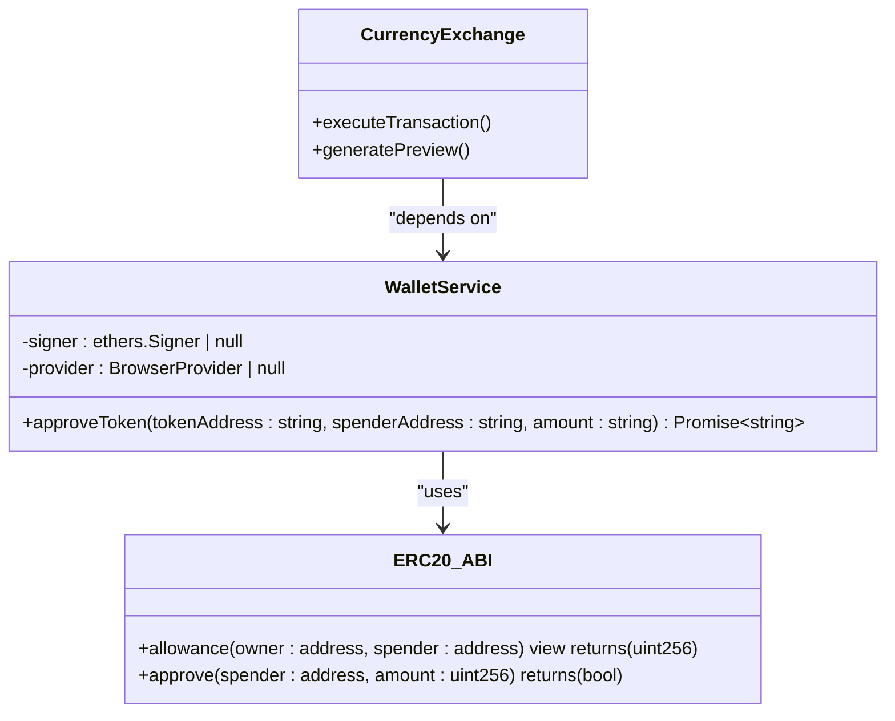
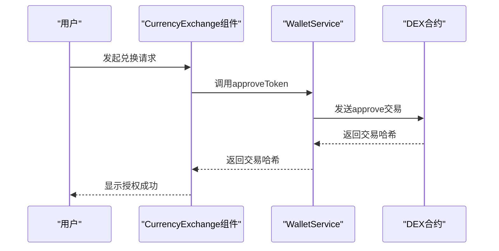
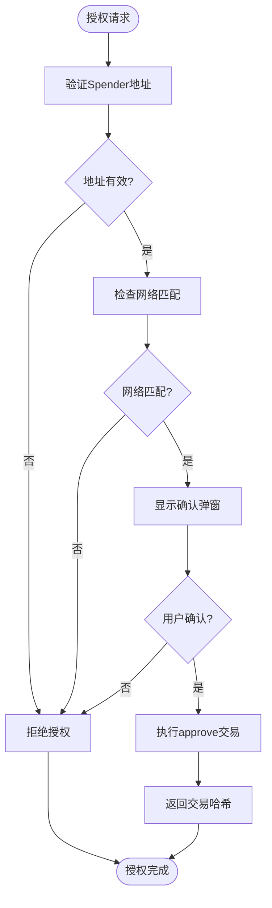
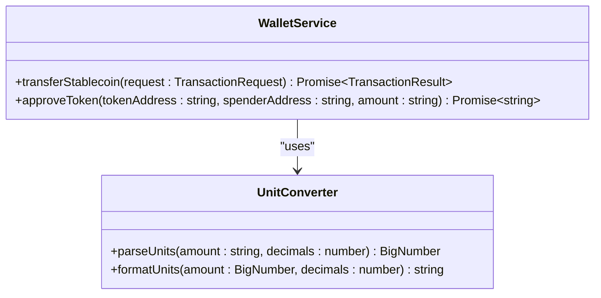
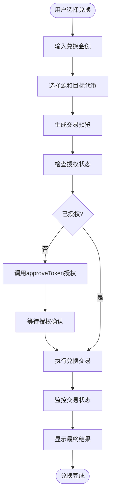

# 代币授权机制

<cite>
**Referenced Files in This Document**  
- [walletService.ts](file://src/services/walletService.ts)
- [CurrencyExchange.tsx](file://src/components/Exchange/CurrencyExchange.tsx)
- [transactionService.ts](file://src/services/transactionService.ts)
</cite>

## Table of Contents
1. [代币授权机制](#代币授权机制)
2. [核心功能分析](#核心功能分析)
3. [授权流程详解](#授权流程详解)
4. [安全验证要求](#安全验证要求)
5. [精度处理机制](#精度处理机制)
6. [状态确认流程](#状态确认流程)
7. [完整应用示例](#完整应用示例)
8. [风险提示与安全建议](#风险提示与安全建议)
9. [授权撤销操作指南](#授权撤销操作指南)
10. [常见问题排查](#常见问题排查)

## 核心功能分析

代币授权功能是去中心化交易所（DEX）交互的核心安全机制，通过ERC20标准的allowance机制实现用户资产的安全授权。该功能允许用户在不转移资产所有权的情况下，授权第三方合约代为操作特定数量的代币。



**Diagram sources**
- [walletService.ts](file://src/services/walletService.ts#L189-L202)
- [CurrencyExchange.tsx](file://src/components/Exchange/CurrencyExchange.tsx#L15-L621)

**Section sources**
- [walletService.ts](file://src/services/walletService.ts#L62-L264)
- [CurrencyExchange.tsx](file://src/components/Exchange/CurrencyExchange.tsx#L15-L621)

## 授权流程详解

代币授权流程通过`approveToken`方法实现，该方法在去中心化交易所交互中扮演关键角色。当用户需要在DEX进行代币兑换时，必须先授权交易所合约操作其代币余额。



**Diagram sources**
- [walletService.ts](file://src/services/walletService.ts#L189-L202)
- [CurrencyExchange.tsx](file://src/components/Exchange/CurrencyExchange.tsx#L15-L621)

**Section sources**
- [walletService.ts](file://src/services/walletService.ts#L189-L202)

## 安全验证要求

在代币授权过程中，`spenderAddress`作为合约地址必须经过严格的安全验证。系统通过多重机制确保授权目标的安全性：

1. **合约地址白名单验证**：只允许预定义的可信合约地址作为spender
2. **网络环境匹配**：确保spender地址与当前区块链网络匹配
3. **用户二次确认**：在钱包弹窗中显示完整的授权信息供用户确认



**Diagram sources**
- [walletService.ts](file://src/services/walletService.ts#L189-L202)
- [walletService.ts](file://src/services/walletService.ts#L62-L264)

**Section sources**
- [walletService.ts](file://src/services/walletService.ts#L189-L202)

## 精度处理机制

`parseUnits`在授权金额精度处理中起着至关重要的作用。由于区块链上的代币余额以最小单位（wei）存储，而用户界面通常显示人类可读的单位（如ETH），因此需要精确的单位转换。



**Diagram sources**
- [walletService.ts](file://src/services/walletService.ts#L113-L155)
- [walletService.ts](file://src/services/walletService.ts#L189-L202)

**Section sources**
- [walletService.ts](file://src/services/walletService.ts#L113-L155)

## 状态确认流程

交易哈希返回后的授权状态确认流程确保用户能够准确了解授权结果。系统通过多阶段监控机制提供实时的状态更新：

```mermaid
sequenceDiagram
participant Frontend as "前端界面"
participant WalletService as "WalletService"
participant Blockchain as "区块链"
Frontend->>WalletService : 调用approveToken
WalletService->>Blockchain : 发送approve交易
Blockchain-->>WalletService : 返回交易哈希
WalletService-->>Frontend : 返回交易哈希
loop 状态轮询
Frontend->>WalletService : 调用getTransactionStatus
WalletService->>Blockchain : 查询交易状态
Blockchain-->>WalletService : 返回状态信息
WalletService-->>Frontend : 更新状态
alt 交易确认
Frontend->>User : 显示"授权成功"
break
else 交易失败
Frontend->>User : 显示"授权失败"
break
end
end
```

**Diagram sources**
- [walletService.ts](file://src/services/walletService.ts#L204-L229)
- [walletService.ts](file://src/services/walletService.ts#L189-L202)

**Section sources**
- [walletService.ts](file://src/services/walletService.ts#L204-L229)

## 完整应用示例

在`CurrencyExchange`组件中调用代币授权功能实现代币兑换的完整流程如下：



**Diagram sources**
- [CurrencyExchange.tsx](file://src/components/Exchange/CurrencyExchange.tsx#L15-L621)
- [walletService.ts](file://src/services/walletService.ts#L189-L202)

**Section sources**
- [CurrencyExchange.tsx](file://src/components/Exchange/CurrencyExchange.tsx#L15-L621)

## 风险提示与安全建议

### 无限授权风险
无限授权（approving MAX_UINT256）虽然方便，但存在重大安全风险：
- 一旦合约被攻击，攻击者可以提取用户全部代币余额
- 用户无法通过简单撤销来限制已授权的额度

### 安全建议
1. **最小授权原则**：只授权当前交易所需的最小金额
2. **定期审查授权**：定期检查并撤销不再需要的授权
3. **使用可撤销授权**：优先选择支持授权撤销的协议
4. **监控异常活动**：设置钱包通知，监控异常的代币转移

## 授权撤销操作指南

授权撤销是管理代币安全的重要操作，可通过以下步骤完成：

```mermaid
sequenceDiagram
participant User as "用户"
participant Interface as "用户界面"
participant WalletService as "WalletService"
participant Contract as "代币合约"
User->>Interface : 请求撤销授权
Interface->>WalletService : 调用approveToken
WalletService->>Contract : 发送approve交易(金额=0)
Contract-->>WalletService : 返回交易哈希
WalletService-->>Interface : 返回交易哈希
Interface-->>User : 显示撤销请求已提交
loop 状态监控
Interface->>WalletService : 查询授权状态
WalletService->>Contract : 调用allowance
Contract-->>WalletService : 返回当前授权额度
WalletService-->>Interface : 返回查询结果
alt 授权额度为0
Interface->>User : 显示"授权已成功撤销"
break
end
end
```

**Diagram sources**
- [walletService.ts](file://src/services/walletService.ts#L189-L202)
- [walletService.ts](file://src/services/walletService.ts#L25-L37)

**Section sources**
- [walletService.ts](file://src/services/walletService.ts#L189-L202)

## 常见问题排查

### 授权失败常见原因
1. **钱包未连接**：确保钱包已正确连接到应用
2. **网络不匹配**：检查当前网络与目标合约网络是否一致
3. **余额不足**：确认授权代币余额充足
4. **Gas不足**：确保账户有足够的ETH支付Gas费用

### 排查步骤
1. 检查浏览器控制台是否有错误信息
2. 确认钱包插件是否正常运行
3. 验证网络设置是否正确
4. 查看交易是否在钱包中被拒绝
5. 检查区块链浏览器中的交易状态