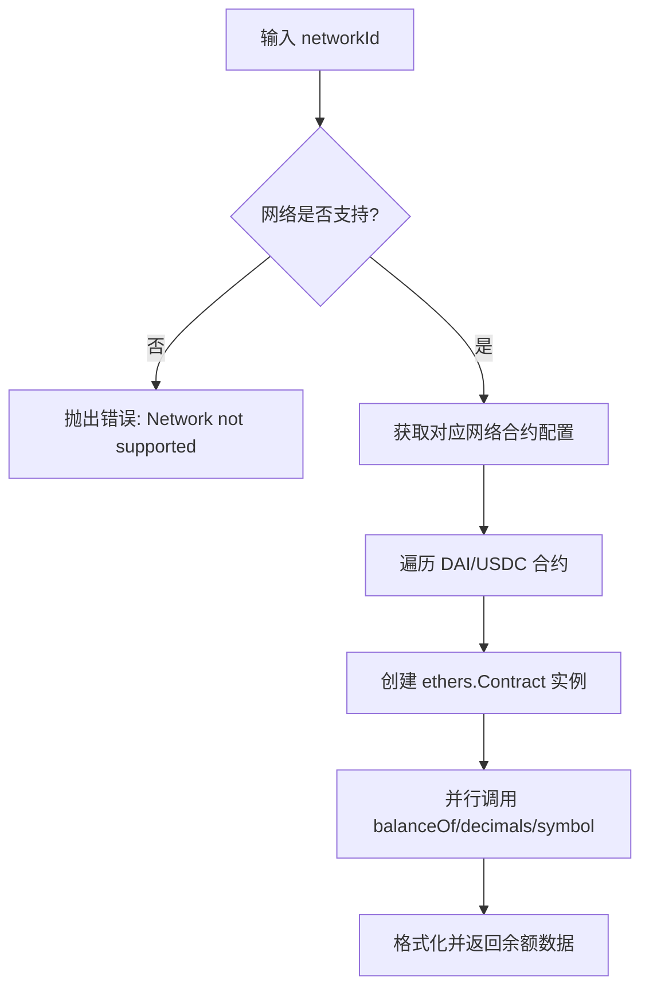
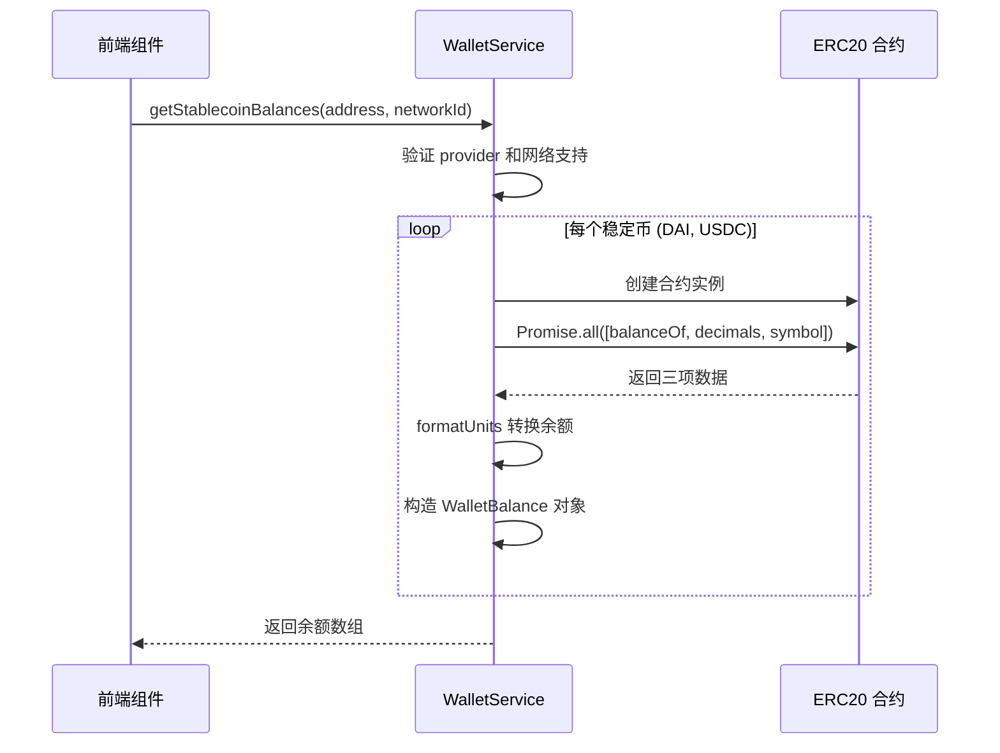
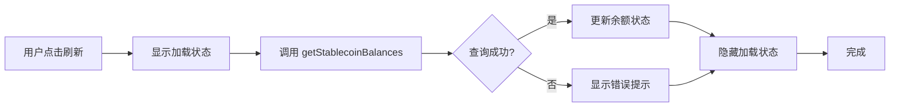

# 稳定币余额查询

<cite>
**本文档引用文件**  
- [walletService.ts](file://src/services/walletService.ts)
- [WalletManagement.tsx](file://src/components/Wallet/WalletManagement.tsx)
- [wagmi.tsx](file://src/config/wagmi.tsx)
</cite>

## 目录
1. [简介](#简介)
2. [核心功能实现](#核心功能实现)
3. [STABLECOIN_CONTRACTS 配置结构](#stablecoin_contracts-配置结构)
4. [单位转换与 formatUnits 函数](#单位转换与-formatunits-函数)
5. [多代币并发查询机制](#多代币并发查询机制)
6. [组件调用示例](#组件调用示例)
7. [常见问题排查](#常见问题排查)
8. [性能优化建议](#性能优化建议)

## 简介
本文档详细说明 `getStablecoinBalances` 方法的实现机制，涵盖通过 ethers.js 与 ERC20 合约交互获取 DAI 和 USDC 余额的技术细节。文档阐述了稳定币合约地址的网络映射关系、单位转换逻辑、并发查询实现方式，并提供在前端组件中的实际调用示例及错误处理策略。

## 核心功能实现
`getStablecoinBalances` 方法是钱包服务的核心功能之一，用于查询指定地址在特定网络上的稳定币余额。该方法首先验证 provider 是否已初始化，然后根据传入的 `networkId` 查找对应的稳定币合约配置。

当网络不支持时，方法将抛出异常。对于每个配置的稳定币，系统会创建一个 ethers.js 合约实例，并通过 `balanceOf`、`decimals` 和 `symbol` 方法并行获取余额、精度和代币符号信息。最终返回标准化的余额对象数组。

**Section sources**
- [walletService.ts](file://src/services/walletService.ts#L78-L113)

## STABLECOIN_CONTRACTS 配置结构
`STABLECOIN_CONTRACTS` 是一个静态配置对象，定义了不同区块链网络上 DAI 和 USDC 的智能合约地址。其结构采用链 ID 作为主键，支持多网络部署。

目前配置包含：
- **11155111**: Ethereum Sepolia 测试网，用于开发和测试环境
- **1**: Ethereum 主网，作为参考配置

每个网络下包含 DAI 和 USDC 的合约地址，便于通过 `networkId` 动态访问对应网络的合约。这种设计实现了网络与合约地址的解耦，便于扩展新网络。

**Diagram sources**
- [walletService.ts](file://src/services/walletService.ts#L11-L22)

**Section sources**
- [walletService.ts](file://src/services/walletService.ts#L11-L22)

## 单位转换与 formatUnits 函数
`formatUnits` 是 ethers.js 提供的关键工具函数，负责将区块链上以“wei”为单位的大整数余额转换为人类可读的十进制数值。由于 ERC20 代币具有不同的小数位数（如 DAI 和 USDC 通常为 18 位），直接显示原始值会导致误解。

该函数接收两个参数：原始余额值和代币精度（decimals），自动进行除法运算并将结果以字符串形式返回，避免浮点数精度丢失问题。例如，1 DAI 的原始值为 `1000000000000000000`，经 `formatUnits(value, 18)` 转换后正确显示为 `"1.0"`。

**Section sources**
- [walletService.ts](file://src/services/walletService.ts#L98)

## 多代币并发查询机制
为提升查询效率，系统采用 `Promise.all` 实现多代币余额的并发获取。在遍历 `STABLECOIN_CONTRACTS` 配置时，对每个代币的 `balanceOf`、`decimals` 和 `symbol` 调用封装为独立 Promise，并通过 `Promise.all` 并行执行。

这种方式显著减少了总响应时间——若单个查询耗时 200ms，串行查询两个代币需 400ms，而并发模式下仅需约 200ms。即使某个代币查询失败，系统也会通过 try-catch 捕获异常并继续处理其他代币，确保部分数据仍可返回。

**Diagram sources**
- [walletService.ts](file://src/services/walletService.ts#L88-L106)

**Section sources**
- [walletService.ts](file://src/services/walletService.ts#L88-L106)

## 组件调用示例
`WalletManagement` 组件展示了如何在实际 UI 中调用稳定币余额查询功能。虽然当前实现为模拟数据，但其结构清晰体现了真实调用流程：通过状态管理维护钱包列表，提供刷新余额按钮触发查询。

在真实场景中，`refreshBalance` 方法应实例化 `WalletService`，调用 `getStablecoinBalances` 并更新状态。同时需处理加载状态（如设置 `isRefreshing`）和错误提示（通过 `useToast` 显示异常信息），确保用户体验流畅。

**Diagram sources**
- [WalletManagement.tsx](file://src/components/Wallet/WalletManagement.tsx#L131-L184)

**Section sources**
- [WalletManagement.tsx](file://src/components/Wallet/WalletManagement.tsx#L131-L184)

## 常见问题排查
### 余额显示为 0 的可能原因
- **地址错误**：检查传入的地址是否正确且属于用户
- **网络不匹配**：确保 `networkId` 与钱包当前网络一致
- **合约地址错误**：确认 `STABLECOIN_CONTRACTS` 中的地址准确无误
- **无持仓**：该地址在目标网络上确实没有 DAI/USDC 余额

### 网络不匹配错误解决方案
- 使用 `getNetwork()` 方法获取当前链 ID 进行校验
- 调用 `switchNetwork(chainId)` 引导用户切换至正确网络
- 在配置中添加缺失的网络支持（如添加新测试网）

**Section sources**
- [walletService.ts](file://src/services/walletService.ts#L82-L84)
- [walletService.ts](file://src/services/walletService.ts#L238-L255)

## 性能优化建议
- **缓存机制**：对频繁查询的地址余额进行短期缓存，避免重复请求
- **批量查询**：考虑使用 Multicall 聚合合约减少 RPC 调用次数
- **错误重试**：对网络请求失败实现指数退避重试机制
- **懒加载**：仅在用户查看钱包时才触发余额查询，减少初始加载负担