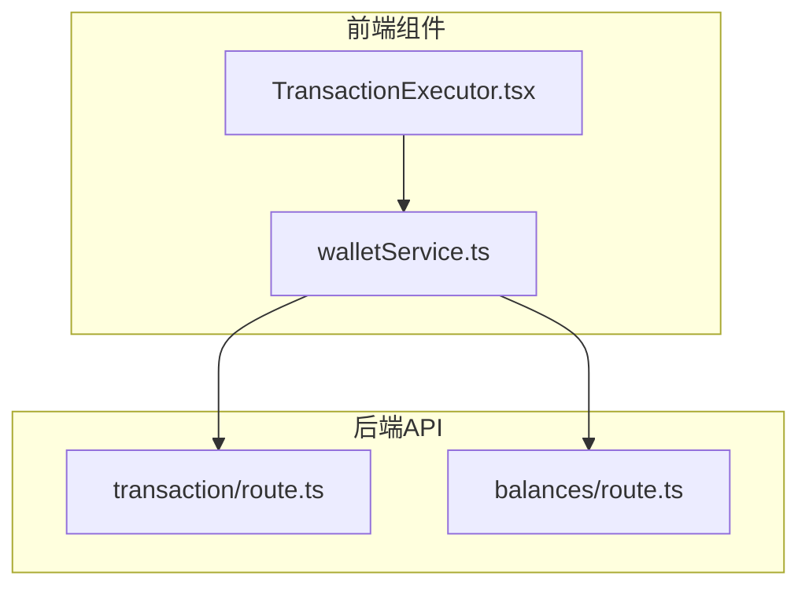
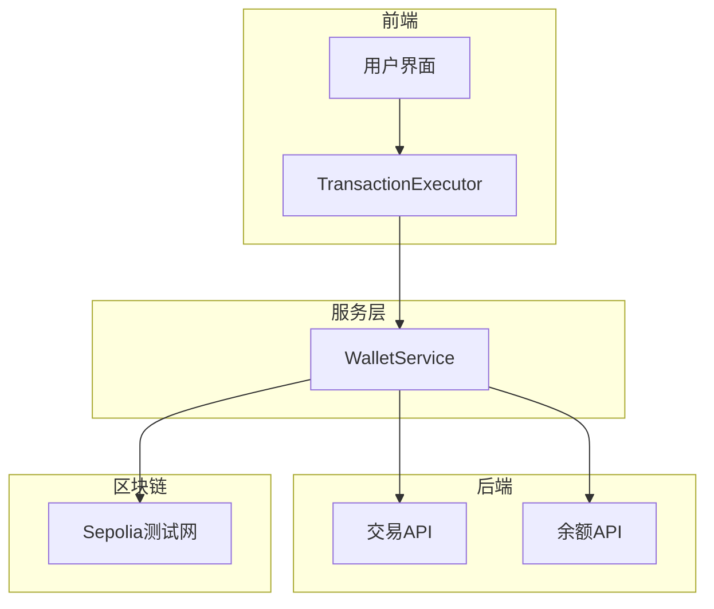
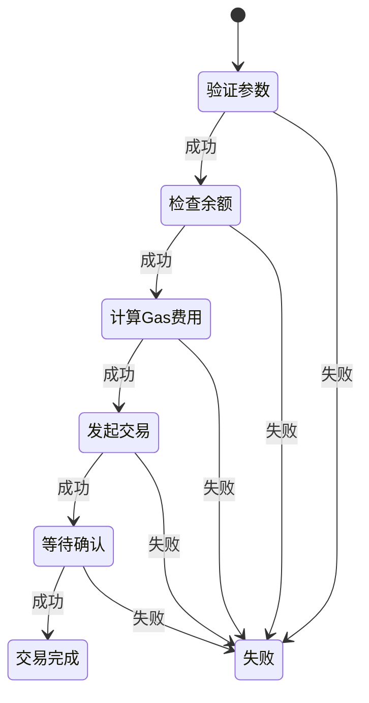
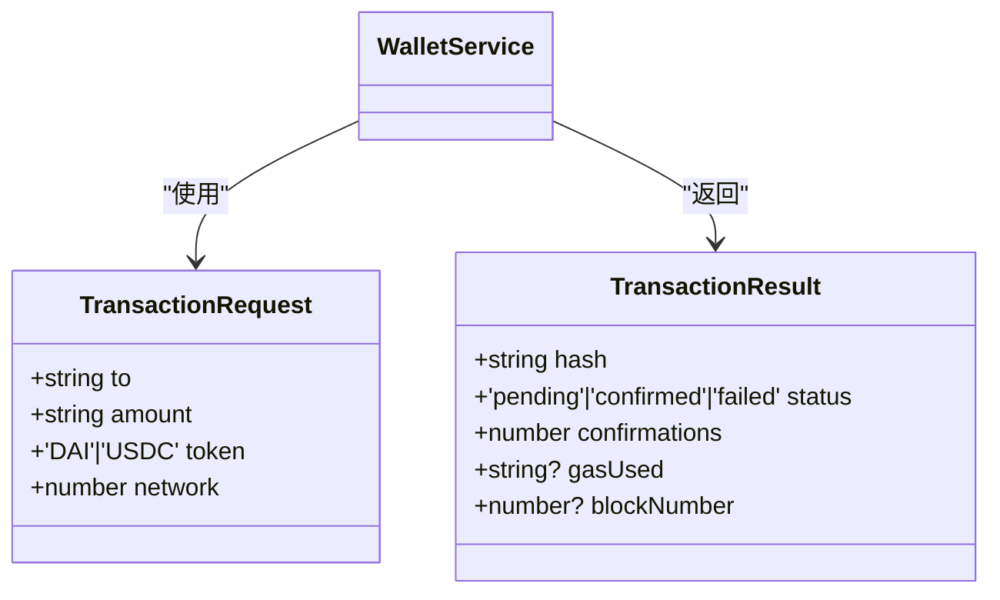
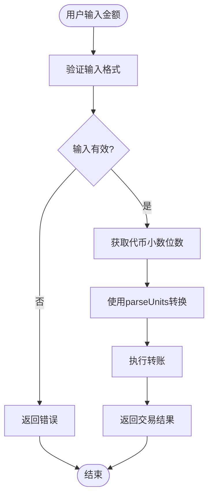
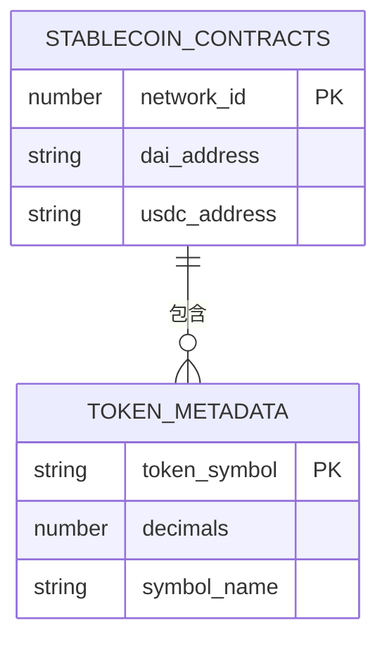
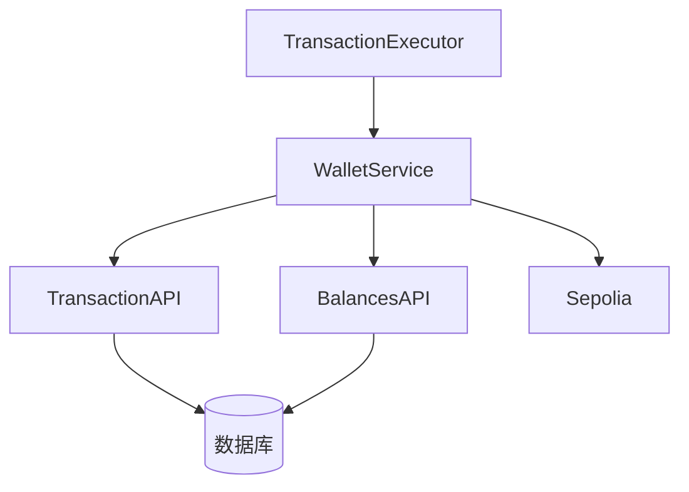

# 稳定币转账功能

<cite>
**本文档引用文件**  
- [TransactionExecutor.tsx](file://src/components/Blockchain/TransactionExecutor.tsx)
- [walletService.ts](file://src/services/walletService.ts)
- [route.ts](file://src/app/api/wallet/transaction/route.ts)
- [route.ts](file://src/app/api/wallet/balances/route.ts)
</cite>

## 目录
1. [简介](#简介)
2. [项目结构](#项目结构)
3. [核心组件](#核心组件)
4. [架构概览](#架构概览)
5. [详细组件分析](#详细组件分析)
6. [依赖分析](#依赖分析)
7. [性能考虑](#性能考虑)
8. [故障排除指南](#故障排除指南)
9. [结论](#结论)

## 简介
本文档深入解析了稳定币转账功能的实现机制，重点阐述了`transferStablecoin`方法的执行流程。文档详细说明了交易参数验证、金额精度处理、签名发送交易等核心环节，并解释了USDC和DAI代币在Sepolia测试网的合约调用差异。同时，文档还涵盖了前端状态管理策略、表单验证、Gas费用预估和用户确认对话框的实现方案，以及交易失败的常见原因和错误提示策略。

## 项目结构
项目采用Next.js全栈架构，前端组件与后端API路由分离。稳定币转账功能主要涉及以下目录结构：

**图表来源**  
- [TransactionExecutor.tsx](file://src/components/Blockchain/TransactionExecutor.tsx)
- [walletService.ts](file://src/services/walletService.ts)
- [route.ts](file://src/app/api/wallet/transaction/route.ts)
- [route.ts](file://src/app/api/wallet/balances/route.ts)

**章节来源**  
- [TransactionExecutor.tsx](file://src/components/Blockchain/TransactionExecutor.tsx)
- [walletService.ts](file://src/services/walletService.ts)

## 核心组件
稳定币转账功能的核心组件包括`TransactionExecutor`组件、`WalletService`服务类以及后端API路由。这些组件协同工作，实现了从用户界面到区块链网络的完整交易流程。

**章节来源**  
- [TransactionExecutor.tsx](file://src/components/Blockchain/TransactionExecutor.tsx)
- [walletService.ts](file://src/services/walletService.ts)

## 架构概览
系统采用分层架构设计，前端组件负责用户交互，服务层处理业务逻辑，后端API负责数据持久化和外部系统集成。

**图表来源**  
- [TransactionExecutor.tsx](file://src/components/Blockchain/TransactionExecutor.tsx)
- [walletService.ts](file://src/services/walletService.ts)
- [route.ts](file://src/app/api/wallet/transaction/route.ts)
- [route.ts](file://src/app/api/wallet/balances/route.ts)

## 详细组件分析
### TransactionExecutor组件分析
`TransactionExecutor`组件是稳定币转账功能的用户界面入口，负责收集用户输入、显示交易进度和处理用户交互。

#### 组件状态管理
组件使用React的useState和useCallback钩子来管理交易状态和步骤进度。交易流程被分解为六个步骤：验证参数、检查余额、计算Gas费用、发起交易、等待确认和交易完成。

**图表来源**  
- [TransactionExecutor.tsx](file://src/components/Blockchain/TransactionExecutor.tsx#L22-L388)

#### 交易执行流程
当用户点击"执行交易"按钮时，组件会依次执行以下步骤：
1. 验证交易参数（接收地址和转账金额）
2. 检查钱包余额是否充足
3. 计算Gas费用
4. 调用WalletService发起交易
5. 监控交易状态直到确认
6. 记录交易到后端数据库

**章节来源**  
- [TransactionExecutor.tsx](file://src/components/Blockchain/TransactionExecutor.tsx#L22-L388)

### WalletService服务分析
`WalletService`类是稳定币转账功能的核心业务逻辑层，负责与区块链网络交互。

#### TransactionRequest接口验证
`TransactionRequest`接口定义了交易请求的参数结构，包括接收地址、转账金额、代币类型和网络ID。服务在执行交易前会对这些参数进行严格验证。

**图表来源**  
- [walletService.ts](file://src/services/walletService.ts#L47-L52)
- [walletService.ts](file://src/services/walletService.ts#L54-L60)

#### 金额精度处理
服务使用ethers.js库的`parseUnits`函数处理金额精度。不同代币有不同的小数位数（DAI为18位，USDC为6位），`parseUnits`函数会根据代币的decimals值将用户输入的字符串金额转换为区块链可识别的整数格式。

**图表来源**  
- [walletService.ts](file://src/services/walletService.ts#L116-L148)

#### 签名发送交易
服务通过MetaMask等钱包提供的Signer对象对交易进行签名。Signer对象封装了用户的私钥，确保交易的安全性。签名后的交易会被发送到区块链网络等待确认。

**章节来源**  
- [walletService.ts](file://src/services/walletService.ts#L116-L148)

### USDC和DAI代币差异
在Sepolia测试网上，USDC和DAI代币有不同的合约地址和小数位数。服务通过`STABLECOIN_CONTRACTS`常量对象管理这些差异。

**图表来源**  
- [walletService.ts](file://src/services/walletService.ts#L11-L25)

## 依赖分析
系统各组件之间的依赖关系清晰，前端组件依赖服务层，服务层依赖后端API和区块链网络。

**图表来源**  
- [TransactionExecutor.tsx](file://src/components/Blockchain/TransactionExecutor.tsx)
- [walletService.ts](file://src/services/walletService.ts)
- [route.ts](file://src/app/api/wallet/transaction/route.ts)
- [route.ts](file://src/app/api/wallet/balances/route.ts)

## 性能考虑
稳定币转账功能的性能主要受区块链网络确认速度的影响。为了提升用户体验，系统采用了以下优化策略：
- 在前端显示交易进度条，让用户了解当前交易状态
- 使用模拟确认过程，避免用户长时间等待
- 预先加载常用数据，减少用户等待时间

## 故障排除指南
### 交易失败原因
稳定币转账可能因以下原因失败：
- 余额不足
- 网络拥堵
- Gas费用不足
- 接收地址无效
- 网络连接问题

### 错误提示方案
系统为不同类型的错误提供了相应的提示信息：
- 余额不足：显示"余额不足，请检查您的钱包余额"
- 网络问题：显示"网络连接失败，请检查您的网络设置"
- 交易失败：显示"交易失败，请重试或联系客服"

**章节来源**  
- [TransactionExecutor.tsx](file://src/components/Blockchain/TransactionExecutor.tsx#L22-L388)
- [walletService.ts](file://src/services/walletService.ts#L116-L148)

## 结论
稳定币转账功能通过清晰的分层架构和严谨的错误处理机制，为用户提供了一个安全、可靠的区块链交易体验。通过`TransactionExecutor`组件和`WalletService`服务的协同工作，系统实现了从用户界面到区块链网络的完整交易流程。未来可以进一步优化Gas费用预估算法，提升交易成功率。