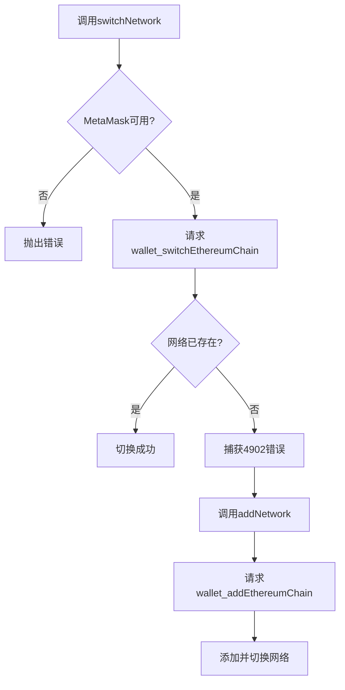
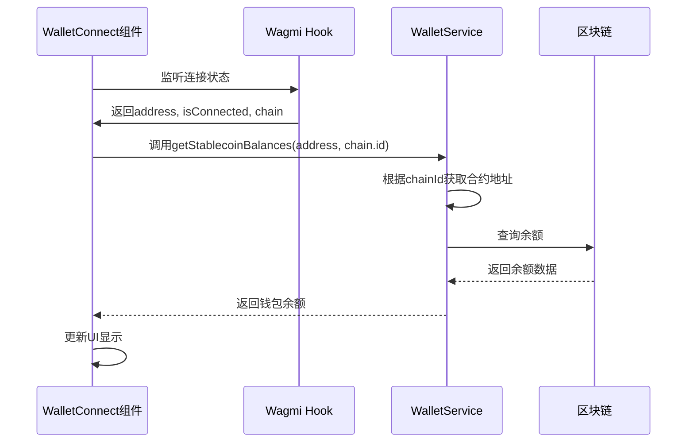

# 网络切换机制

<cite>
**本文档引用文件**  
- [walletService.ts](file://src/services/walletService.ts)
- [WalletConnect.tsx](file://src/components/Wallet/WalletConnect.tsx)
- [wagmi.tsx](file://src/config/wagmi.tsx)
</cite>

## 目录
1. [简介](#简介)
2. [核心方法实现](#核心方法实现)
3. [RPC方法调用规范](#rpc方法调用规范)
4. [错误码处理](#错误码处理)
5. [网络配置参数](#网络配置参数)
6. [UI集成实现](#ui集成实现)
7. [异常情况处理](#异常情况处理)

## 简介
本文档系统阐述了TriBridge平台中网络切换功能的实现机制。重点分析`switchNetwork`和`addNetwork`方法的逻辑流程，说明`wallet_switchEthereumChain`和`wallet_addEthereumChain` RPC方法的使用规范，并详细描述在WalletConnect组件中的UI集成方案。

## 核心方法实现

### switchNetwork方法
`switchNetwork`方法用于请求钱包切换到指定的区块链网络。该方法首先检查MetaMask是否可用，然后通过`wallet_switchEthereumChain` RPC方法发起网络切换请求。

当目标网络尚未添加到钱包时，会捕获4902错误码并自动调用`addNetwork`方法进行网络添加。

### addNetwork方法
`addNetwork`方法用于动态向钱包添加新的区块链网络配置。目前支持Sepolia测试网的自动添加，包含完整的RPC节点、区块浏览器和原生代币配置。

**Section sources**
- [walletService.ts](file://src/services/walletService.ts#L215-L263)

## RPC方法调用规范

### wallet_switchEthereumChain
该RPC方法用于请求用户钱包切换到指定的以太坊链。调用时必须遵循以下规范：

- **方法名**: `wallet_switchEthereumChain`
- **参数结构**: 包含`chainId`字段的对象数组
- **chainId格式**: 必须为十六进制字符串（如`0xaa36a7`）

### chainId十六进制转换的必要性
EIP-155标准要求所有区块链ID在RPC通信中必须以十六进制格式表示。这是因为：
1. 避免十进制和十六进制的混淆
2. 与以太坊生态系统标准保持一致
3. 确保跨平台兼容性

转换方法：`0x${chainId.toString(16)}`

**Section sources**
- [walletService.ts](file://src/services/walletService.ts#L215-L233)

## 错误码处理

### 4902错误码（Unrecognized chain ID）
当调用`wallet_switchEthereumChain`时，如果目标链ID未被钱包识别，会返回4902错误码。处理流程如下：

1. 捕获4902错误
2. 调用`addNetwork`方法添加网络配置
3. 使用`wallet_addEthereumChain` RPC方法提交完整网络参数

该机制实现了无缝的网络切换体验，用户无需手动添加网络。



**Diagram sources**
- [walletService.ts](file://src/services/walletService.ts#L215-L263)

## 网络配置参数

### networkConfig对象参数
Sepolia测试网的完整配置参数如下：

```json
{
  "chainId": "0xaa36a7",
  "chainName": "Sepolia Testnet",
  "rpcUrls": ["https://rpc.sepolia.org"],
  "nativeCurrency": {
    "name": "Sepolia Ether",
    "symbol": "SEP",
    "decimals": 18
  },
  "blockExplorerUrls": ["https://sepolia.etherscan.io"]
}
```

#### 参数说明
- **chainId**: 链标识符（十六进制）
- **chainName**: 网络显示名称
- **rpcUrls**: RPC节点地址数组
- **nativeCurrency**: 原生代币信息
  - name: 代币全称
  - symbol: 代币符号
  - decimals: 小数位数
- **blockExplorerUrls**: 区块浏览器地址

**Section sources**
- [walletService.ts](file://src/services/walletService.ts#L235-L263)

## UI集成实现

### 网络选择器
在WalletConnect组件中实现了网络状态显示，包括：
- 网络名称显示
- 网络状态徽章（颜色编码）
- 地址显示和复制功能
- 区块浏览器跳转

### 自动重连机制
组件使用`useAccount` Hook监听钱包连接状态，当网络切换或账户变更时自动：
1. 检测新的链ID
2. 重新加载对应网络的余额
3. 更新UI显示



**Diagram sources**
- [WalletConnect.tsx](file://src/components/Wallet/WalletConnect.tsx#L16-L241)
- [walletService.ts](file://src/services/walletService.ts#L150-L180)

## 异常情况处理

### MetaMask未安装
当检测到`window.ethereum`不存在时，抛出"MetaMask not available"错误，提示用户安装MetaMask。

### 用户拒绝切换
如果用户拒绝网络切换请求，钱包会返回相应的错误码，前端应：
1. 捕获错误
2. 显示友好提示
3. 保持当前网络状态

### 不支持的网络
当请求切换到未配置的网络时，`addNetwork`方法会抛出"Network {chainId} not supported"错误，防止无效的网络添加请求。

**Section sources**
- [walletService.ts](file://src/services/walletService.ts#L215-L263)
- [WalletConnect.tsx](file://src/components/Wallet/WalletConnect.tsx#L16-L241)