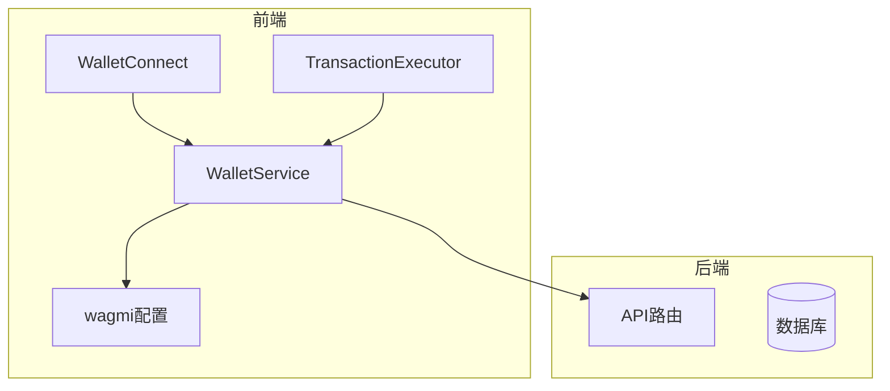
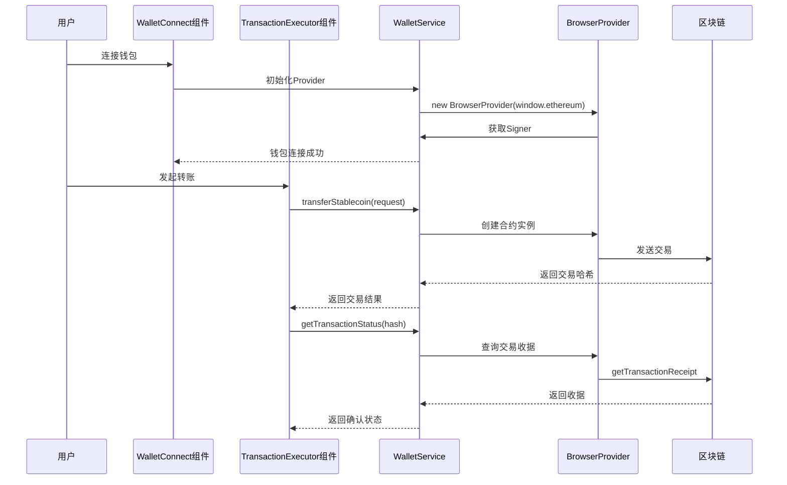
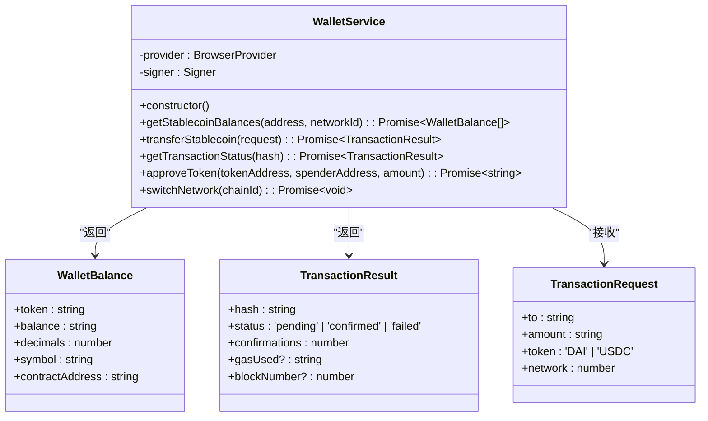
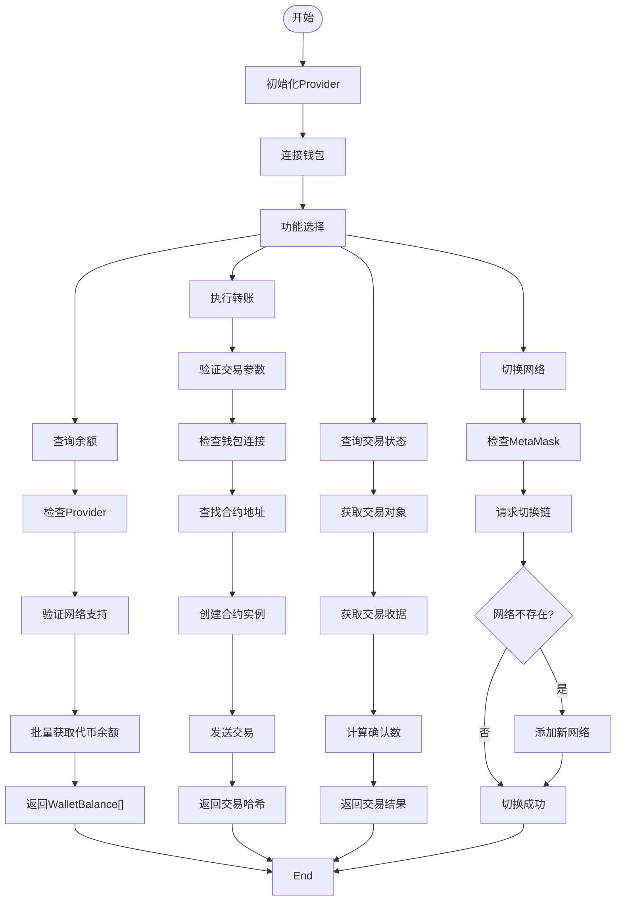
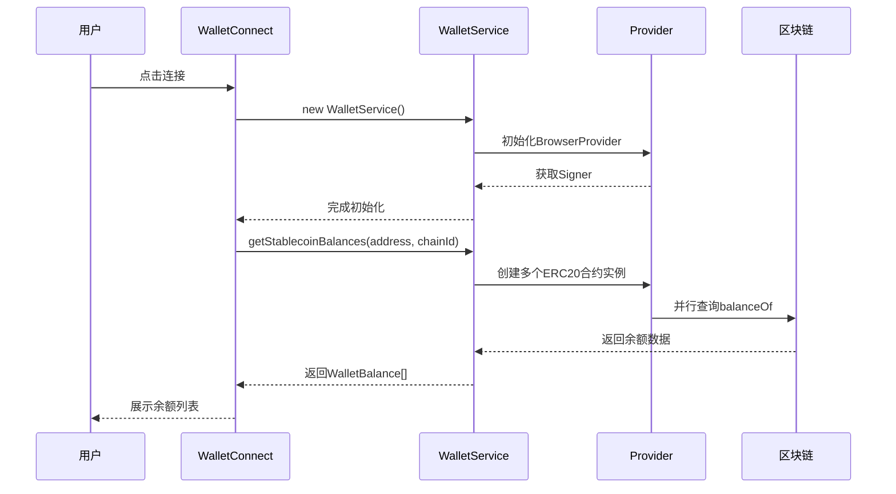
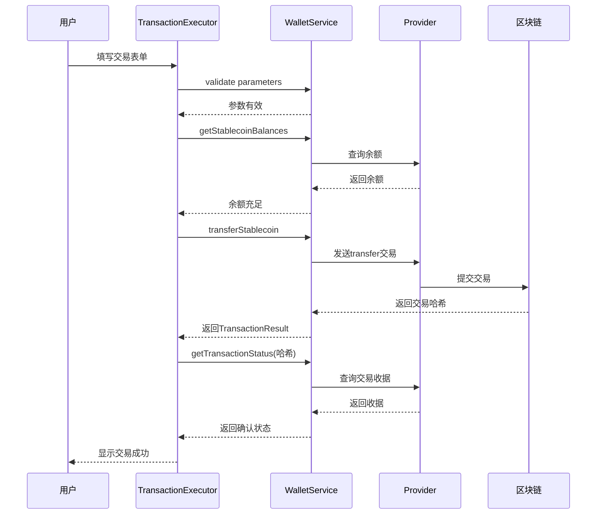
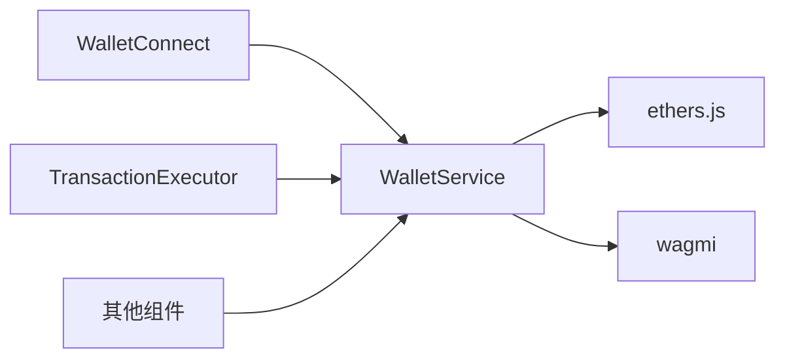

# 钱包服务集成

<cite>
**本文档中引用的文件**  
- [walletService.ts](file://src/services/walletService.ts)
- [WalletConnect.tsx](file://src/components/Wallet/WalletConnect.tsx)
- [TransactionExecutor.tsx](file://src/components/Blockchain/TransactionExecutor.tsx)
- [wagmi.tsx](file://src/config/wagmi.tsx)
</cite>

## 目录
1. [简介](#简介)
2. [项目结构](#项目结构)
3. [核心组件](#核心组件)
4. [架构概述](#架构概述)
5. [详细组件分析](#详细组件分析)
6. [依赖分析](#依赖分析)
7. [性能考虑](#性能考虑)
8. [故障排除指南](#故障排除指南)
9. [结论](#结论)

## 简介
本文档全面介绍 `WalletService` 类的功能与使用方法，涵盖钱包余额查询、稳定币转账、交易状态监控和网络切换等核心功能。文档详细说明了与 ethers.js 库的集成方式、多网络支持机制、代币合约地址管理以及在前端组件中的实际应用。同时，还阐述了 approveToken 授权功能在 DEX 交互中的应用场景，并提供错误处理机制、安全注意事项及常见连接问题的解决方案。

## 项目结构
本项目采用模块化设计，前端逻辑主要集中在 `src` 目录下，后端服务位于 `backend` 目录。钱包相关功能主要由 `src/services/walletService.ts` 实现，前端组件如 `WalletConnect` 和 `TransactionExecutor` 调用该服务完成用户交互。

**图示来源**  
- [walletService.ts](file://src/services/walletService.ts#L1-L270)
- [WalletConnect.tsx](file://src/components/Wallet/WalletConnect.tsx#L1-L242)
- [TransactionExecutor.tsx](file://src/components/Blockchain/TransactionExecutor.tsx#L1-L389)
- [wagmi.tsx](file://src/config/wagmi.tsx#L1-L80)

**本节来源**  
- [walletService.ts](file://src/services/walletService.ts#L1-L270)
- [WalletConnect.tsx](file://src/components/Wallet/WalletConnect.tsx#L1-L242)

## 核心组件
`WalletService` 是钱包功能的核心类，封装了与区块链交互的所有操作。它通过 ethers.js 提供的 `BrowserProvider` 和 `Signer` 实现与 MetaMask 等钱包的通信，支持稳定币余额查询、转账、交易状态监控和网络切换等功能。

**本节来源**  
- [walletService.ts](file://src/services/walletService.ts#L62-L264)

## 架构概述
系统采用前后端分离架构，前端通过 `WalletService` 统一接口与区块链网络交互，后端提供必要的 API 支持。`WalletService` 初始化时自动连接当前浏览器钱包（如 MetaMask），并根据用户操作执行相应链上动作。

**图示来源**  
- [walletService.ts](file://src/services/walletService.ts#L62-L264)
- [TransactionExecutor.tsx](file://src/components/Blockchain/TransactionExecutor.tsx#L1-L389)

## 详细组件分析
### WalletService 分析
`WalletService` 类提供了完整的钱包管理功能，包括余额查询、转账、交易监控和网络切换。

#### 核心功能类图

**图示来源**  
- [walletService.ts](file://src/services/walletService.ts#L39-L264)

#### 功能实现流程图

**图示来源**  
- [walletService.ts](file://src/services/walletService.ts#L62-L264)

**本节来源**  
- [walletService.ts](file://src/services/walletService.ts#L62-L264)

### 前端组件集成分析
#### WalletConnect 组件
`WalletConnect` 组件负责钱包连接与余额展示，通过 `useAccount` 钩子监听连接状态，并调用 `WalletService` 获取稳定币余额。

**图示来源**  
- [WalletConnect.tsx](file://src/components/Wallet/WalletConnect.tsx#L1-L242)
- [walletService.ts](file://src/services/walletService.ts#L78-L113)

#### TransactionExecutor 组件
`TransactionExecutor` 组件实现了完整的交易执行流程，包含参数验证、余额检查、交易发起和状态监控。

**图示来源**  
- [TransactionExecutor.tsx](file://src/components/Blockchain/TransactionExecutor.tsx#L1-L389)
- [walletService.ts](file://src/services/walletService.ts#L116-L186)

**本节来源**  
- [WalletConnect.tsx](file://src/components/Wallet/WalletConnect.tsx#L1-L242)
- [TransactionExecutor.tsx](file://src/components/Blockchain/TransactionExecutor.tsx#L1-L389)

## 依赖分析
系统依赖 ethers.js 进行区块链交互，wagmi 用于钱包连接管理，React 实现前端组件。`WalletService` 作为核心服务被多个组件依赖。

**图示来源**  
- [walletService.ts](file://src/services/walletService.ts#L1-L270)
- [WalletConnect.tsx](file://src/components/Wallet/WalletConnect.tsx#L1-L242)
- [TransactionExecutor.tsx](file://src/components/Blockchain/TransactionExecutor.tsx#L1-L389)

**本节来源**  
- [walletService.ts](file://src/services/walletService.ts#L1-L270)

## 性能考虑
- **余额查询**：使用 `Promise.all()` 并行查询多个代币余额，减少网络延迟影响。
- **交易监控**：避免频繁轮询，建议客户端实现指数退避策略。
- **网络切换**：缓存已添加的网络配置，避免重复调用 `wallet_addEthereumChain`。
- **错误处理**：所有异步操作均包含 try-catch 块，确保异常不会导致应用崩溃。

## 故障排除指南
### 常见连接问题
| 问题现象 | 可能原因 | 解决方案 |
|---------|--------|--------|
| 无法连接钱包 | 浏览器未安装MetaMask | 提示用户安装MetaMask扩展 |
| 网络切换失败 | 目标网络未在钱包中配置 | 系统自动调用 `wallet_addEthereumChain` 添加 |
| 交易始终pending | Gas费用不足 | 提示用户检查钱包余额和网络拥堵情况 |
| 余额显示为0 | 合约地址错误或代币未部署 | 验证STABLECOIN_CONTRACTS配置正确性 |

### 错误处理机制
`WalletService` 对所有关键操作进行错误捕获和处理：
- Provider未初始化：检查浏览器环境和钱包连接状态
- 网络不支持：验证 chainId 是否在支持列表中
- 交易失败：捕获 ethers.js 异常并提供可读错误信息
- 余额查询异常：单个代币查询失败不影响其他代币

**本节来源**  
- [walletService.ts](file://src/services/walletService.ts#L80-L256)

## 结论
`WalletService` 提供了一套完整、安全的钱包集成方案，通过封装 ethers.js 的复杂性，为前端组件提供了简洁易用的 API。系统支持多网络切换、稳定币转账和交易监控等核心功能，已在 `WalletConnect` 和 `TransactionExecutor` 组件中成功应用。建议在实际使用中结合后端服务进行交易记录和状态同步，确保数据一致性。