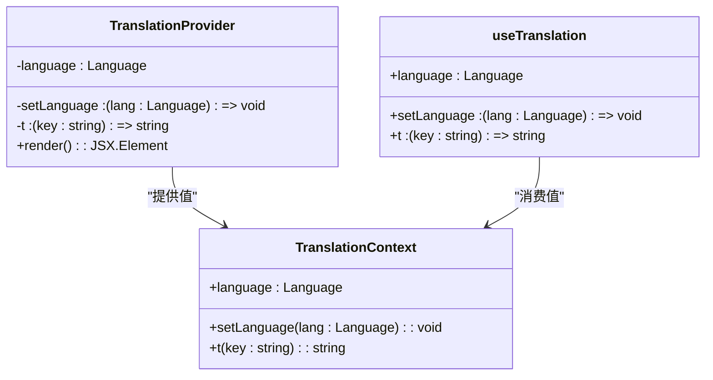
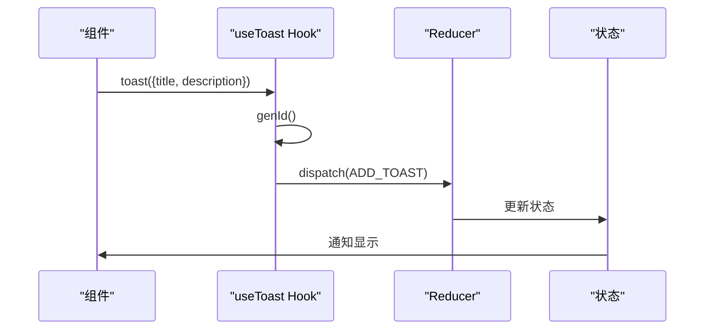
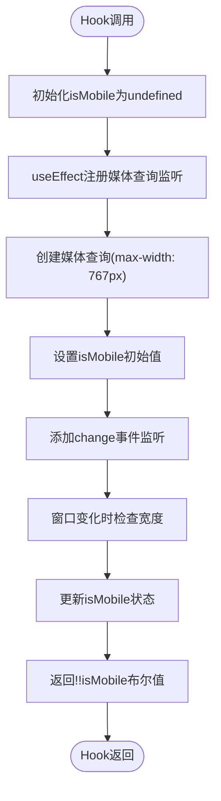
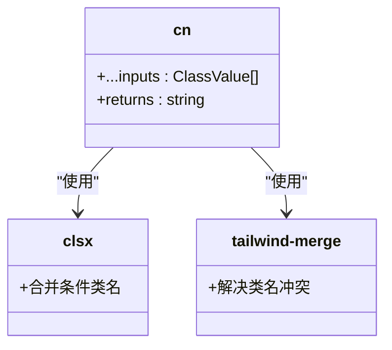
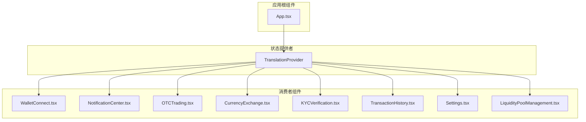
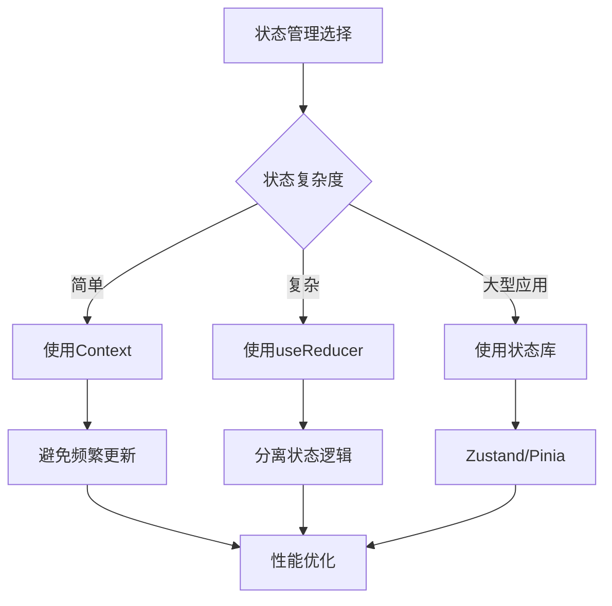
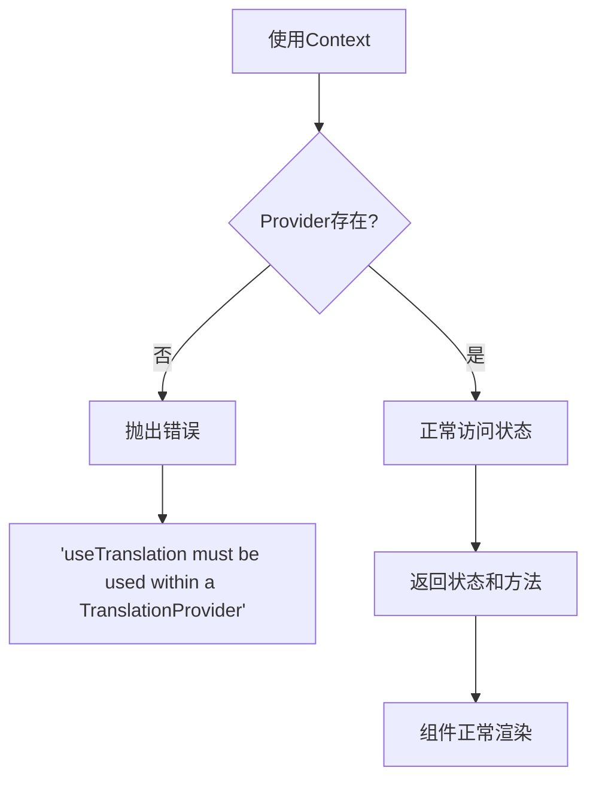

# 状态管理

<cite>
**本文档引用的文件**   
- [TranslationContext.tsx](file://src/contexts/TranslationContext.tsx)
- [use-toast.ts](file://src/hooks/use-toast.ts)
- [use-mobile.tsx](file://src/hooks/use-mobile.tsx)
- [utils.ts](file://src/lib/utils.ts)
- [App.tsx](file://src/App.tsx)
- [WalletConnect.tsx](file://src/components/Wallet/WalletConnect.tsx)
- [NotificationCenter.tsx](file://src/components/Notifications/NotificationCenter.tsx)
- [OTCTrading.tsx](file://src/components/OTC/OTCTrading.tsx)
- [CurrencyExchange.tsx](file://src/components/Exchange/CurrencyExchange.tsx)
- [KYCVerification.tsx](file://src/components/Compliance/KYCVerification.tsx)
- [TransactionHistory.tsx](file://src/components/Transactions/TransactionHistory.tsx)
- [Settings.tsx](file://src/pages/Settings.tsx)
- [LiquidityPoolManagement.tsx](file://src/components/LiquidityPool/LiquidityPoolManagement.tsx)
- [sidebar.tsx](file://src/components/ui/sidebar.tsx)
</cite>

## 目录
1. [多语言状态管理](#多语言状态管理)
2. [自定义Hook设计原理](#自定义hook设计原理)
3. [工具函数辅助作用](#工具函数辅助作用)
4. [状态跨组件传递实践](#状态跨组件传递实践)
5. [Context使用边界与性能优化](#context使用边界与性能优化)
6. [常见陷阱与预防措施](#常见陷阱与预防措施)

## 多语言状态管理

基于React Context的多语言状态管理通过`TranslationContext.tsx`实现，核心机制包括Provider封装、消费者使用模式及状态更新策略。`TranslationProvider`组件封装了语言状态和翻译函数，通过Context API将状态提供给整个应用树。消费者组件通过`useTranslation` Hook访问当前语言和翻译函数，实现动态多语言支持。

**图源**
- [TranslationContext.tsx](file://src/contexts/TranslationContext.tsx#L1-L146)

**节源**
- [TranslationContext.tsx](file://src/contexts/TranslationContext.tsx#L124-L146)
- [App.tsx](file://src/App.tsx#L36-L70)

## 自定义Hook设计原理

### use-toast设计原理

`use-toast.ts`中的`useToast` Hook与ShadCN的sonner库集成，实现全局通知功能。通过自定义reducer管理通知状态，支持添加、更新、关闭和移除通知。`toast`函数生成唯一ID并分发ADD_TOAST动作，通知组件通过监听状态变化实现动态显示。

**图源**
- [use-toast.ts](file://src/hooks/use-toast.ts#L136-L183)

**节源**
- [use-toast.ts](file://src/hooks/use-toast.ts#L165-L183)
- [WalletConnect.tsx](file://src/components/Wallet/WalletConnect.tsx#L33-L46)
- [NotificationCenter.tsx](file://src/components/Notifications/NotificationCenter.tsx#L53-L537)
- [OTCTrading.tsx](file://src/components/OTC/OTCTrading.tsx#L57-L434)
- [CurrencyExchange.tsx](file://src/components/Exchange/CurrencyExchange.tsx#L15-L621)
- [KYCVerification.tsx](file://src/components/Compliance/KYCVerification.tsx#L21-L517)
- [TransactionHistory.tsx](file://src/components/Transactions/TransactionHistory.tsx#L39-L495)
- [Settings.tsx](file://src/pages/Settings.tsx#L49-L533)
- [LiquidityPoolManagement.tsx](file://src/components/LiquidityPool/LiquidityPoolManagement.tsx#L52-L426)

### use-mobile设计原理

`use-mobile.tsx`中的`useIsMobile` Hook基于窗口尺寸动态响应设备变化。通过`window.matchMedia`监听媒体查询变化，在`useEffect`中注册事件监听器，当窗口宽度小于移动断点（768px）时返回true，实现响应式布局控制。

**图源**
- [use-mobile.tsx](file://src/hooks/use-mobile.tsx#L4-L18)

**节源**
- [use-mobile.tsx](file://src/hooks/use-mobile.tsx#L4-L18)
- [sidebar.tsx](file://src/components/ui/sidebar.tsx#L50-L50)

## 工具函数辅助作用

`lib/utils.ts`中的`cn`函数在状态计算和数据格式化中发挥重要作用。该函数结合`clsx`和`tailwind-merge`，智能合并CSS类名，自动处理条件类名，并解决Tailwind CSS类名冲突问题，提高UI组件的可维护性和灵活性。

**图源**
- [utils.ts](file://src/lib/utils.ts#L3-L5)

**节源**
- [utils.ts](file://src/lib/utils.ts#L3-L5)
- [resizable.tsx](file://src/components/ui/resizable.tsx#L5-L10)
- [breadcrumb.tsx](file://src/components/ui/breadcrumb.tsx#L61-L65)
- [drawer.tsx](file://src/components/ui/drawer.tsx#L50-L52)
- [pagination.tsx](file://src/components/ui/pagination.tsx#L6-L13)
- [resizable.tsx](file://src/components/ui/resizable.tsx#L14-L34)
- [dialog.tsx](file://src/components/ui/dialog.tsx#L58-L60)
- [alert-dialog.tsx](file://src/components/ui/alert-dialog.tsx#L50-L52)
- [calendar.tsx](file://src/components/ui/calendar.tsx#L9-L50)
- [context-menu.tsx](file://src/components/ui/context-menu.tsx#L156-L158)
- [menubar.tsx](file://src/components/ui/menubar.tsx#L184-L186)
- [pagination.tsx](file://src/components/ui/pagination.tsx#L48-L53)
- [sheet.tsx](file://src/components/ui/sheet.tsx#L74-L76)
- [calendar.tsx](file://src/components/ui/calendar.tsx#L20-L23)
- [calendar.tsx](file://src/components/ui/calendar.tsx#L31-L31)
- [pagination.tsx](file://src/components/ui/pagination.tsx#L33-L45)
- [drawer.tsx](file://src/components/ui/drawer.tsx#L45-L47)
- [dropdown-menu.tsx](file://src/components/ui/dropdown-menu.tsx#L157-L159)
- [sheet.tsx](file://src/components/ui/sheet.tsx#L69-L71)
- [dialog.tsx](file://src/components/ui/dialog.tsx#L53-L55)
- [alert-dialog.tsx](file://src/components/ui/alert-dialog.tsx#L45-L47)
- [breadcrumb.tsx](file://src/components/ui/breadcrumb.tsx#L68-L78)
- [command.tsx](file://src/components/ui/command.tsx#L116-L118)

## 状态跨组件传递实践

状态跨组件传递的最佳实践通过Context API实现，避免不必要的重渲染。`TranslationProvider`在应用根组件中封装，确保所有子组件都能访问翻译状态。消费者组件使用`useTranslation` Hook获取状态，React的Context机制确保只有依赖状态变化的组件才会重新渲染。

**图源**
- [App.tsx](file://src/App.tsx#L36-L70)
- [TranslationContext.tsx](file://src/contexts/TranslationContext.tsx#L124-L136)

**节源**
- [App.tsx](file://src/App.tsx#L36-L70)
- [TranslationContext.tsx](file://src/contexts/TranslationContext.tsx#L124-L136)

## Context使用边界与性能优化

Context的使用边界在于避免将频繁变化的状态放入Context，以减少不必要的重渲染。对于大型状态管理，建议结合`useReducer`或考虑轻量级状态库。`useToast`已采用reducer模式管理通知状态，有效分离状态逻辑，提高性能。

性能优化路径包括：
1. 将Context拆分为多个专用Context
2. 使用`useMemo`缓存Context值
3. 结合`useReducer`管理复杂状态
4. 考虑使用Zustand等轻量级状态库替代复杂Context

**节源**
- [use-toast.ts](file://src/hooks/use-toast.ts#L1-L183)
- [TranslationContext.tsx](file://src/contexts/TranslationContext.tsx#L1-L146)

## 常见陷阱与预防措施

Context未定义错误的预防措施包括：
1. 在`useTranslation`中检查Context是否为undefined
2. 确保Provider在组件树中正确封装
3. 使用TypeScript定义Context类型，提供编译时检查
4. 在开发环境添加运行时错误提示

**节源**
- [TranslationContext.tsx](file://src/contexts/TranslationContext.tsx#L138-L144)