# 页面架构

<cite>
**本文档中引用的文件**  
- [App.tsx](file://src/App.tsx)
- [main.tsx](file://src/main.tsx)
- [Index.tsx](file://src/pages/Index.tsx)
- [OTC.tsx](file://src/pages/OTC.tsx)
- [LiquidityPool.tsx](file://src/pages/LiquidityPool.tsx)
- [NotFound.tsx](file://src/pages/NotFound.tsx)
- [OTCTrading.tsx](file://src/components/OTC/OTCTrading.tsx)
- [LiquidityPoolManagement.tsx](file://src/components/LiquidityPool/LiquidityPoolManagement.tsx)
- [Header.tsx](file://src/components/Layout/Header.tsx)
</cite>

## 目录
1. [项目结构](#项目结构)
2. [页面路由与文件映射](#页面路由与文件映射)
3. [核心页面组件分析](#核心页面组件分析)
4. [全局布局与应用初始化](#全局布局与应用初始化)
5. [页面导航与路由守卫](#页面导航与路由守卫)
6. [首页模块化集成](#首页模块化集成)
7. [页面性能优化策略](#页面性能优化策略)
8. [错误边界处理机制](#错误边界处理机制)

## 项目结构

项目采用基于Pages Router的路由组织结构，物理文件路径与路由路径直接对应。前端核心代码位于`src`目录下，`pages`目录包含所有页面组件，`components`目录存放可复用的UI组件。

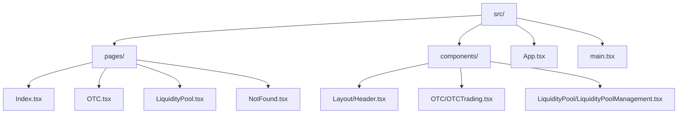

**图示来源**
- [src/pages](file://src/pages)
- [src/components](file://src/components)

**本节来源**
- [src](file://src)

## 页面路由与文件映射

系统采用基于文件的路由机制，页面组件文件位于`src/pages`目录下，文件名直接对应路由路径。例如，`OTC.tsx`对应`/otc`路由，`LiquidityPool.tsx`对应`/pools`路由。

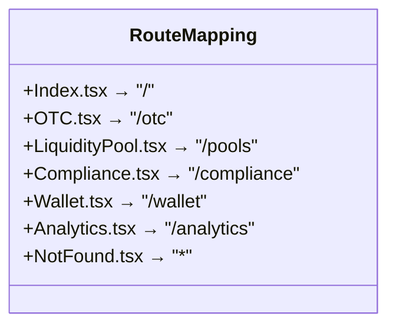

**图示来源**
- [App.tsx](file://src/App.tsx#L36-L70)

**本节来源**
- [App.tsx](file://src/App.tsx#L36-L70)

## 核心页面组件分析

### OTC页面组件

OTC页面组件`OTC.tsx`负责集成OTC交易功能，通过嵌入`OTCTrading`组件实现完整的场外交易流程。页面管理交易状态，包括订单簿展示、交易创建和聊天沟通。

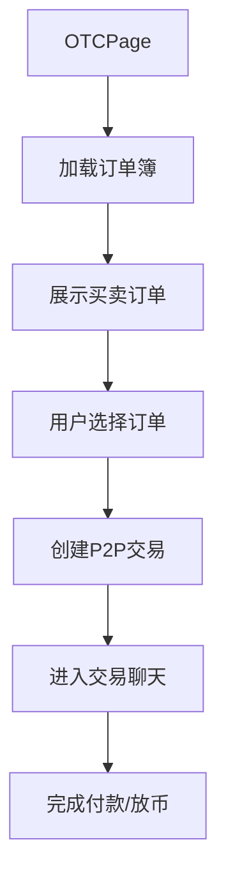

**图示来源**
- [OTC.tsx](file://src/pages/OTC.tsx#L1-L20)
- [OTCTrading.tsx](file://src/components/OTC/OTCTrading.tsx#L1-L670)

**本节来源**
- [OTC.tsx](file://src/pages/OTC.tsx#L1-L20)
- [OTCTrading.tsx](file://src/components/OTC/OTCTrading.tsx#L1-L670)

### 资金池页面组件

资金池页面组件`LiquidityPool.tsx`集成资金池管理功能，通过`LiquidityPoolManagement`组件提供投资组合概览、资金池列表和投资操作界面。

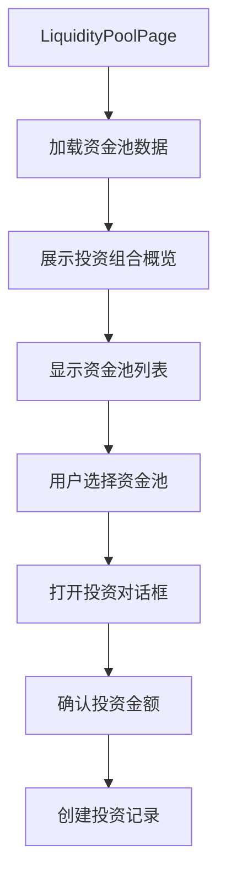

**图示来源**
- [LiquidityPool.tsx](file://src/pages/LiquidityPool.tsx#L1-L20)
- [LiquidityPoolManagement.tsx](file://src/components/LiquidityPool/LiquidityPoolManagement.tsx#L1-L428)

**本节来源**
- [LiquidityPool.tsx](file://src/pages/LiquidityPool.tsx#L1-L20)
- [LiquidityPoolManagement.tsx](file://src/components/LiquidityPool/LiquidityPoolManagement.tsx#L1-L428)

## 全局布局与应用初始化

### App.tsx全局布局结构

`App.tsx`文件定义了应用的全局布局结构，包含Header、Sidebar等共享组件，并通过React Router实现路由管理。

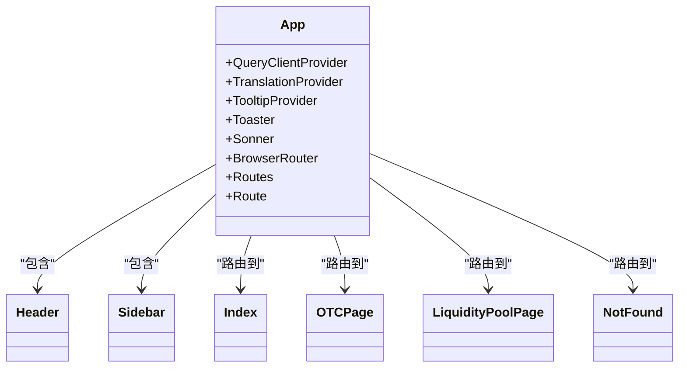

**图示来源**
- [App.tsx](file://src/App.tsx#L36-L70)

**本节来源**
- [App.tsx](file://src/App.tsx#L36-L70)

### main.tsx应用初始化流程

`main.tsx`文件负责应用的初始化，包括Wagmi配置注入、Context Provider注册和根组件渲染。

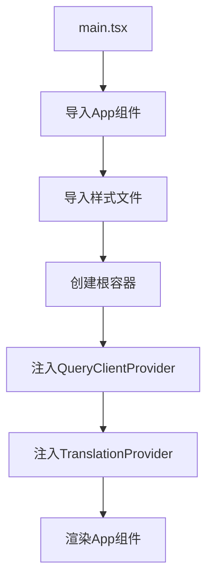

**图示来源**
- [main.tsx](file://src/main.tsx#L1-L5)

**本节来源**
- [main.tsx](file://src/main.tsx#L1-L5)

## 页面导航与路由守卫

### 页面间导航逻辑

系统通过React Router实现页面间导航，用户可以通过点击链接或编程方式在不同页面间跳转。

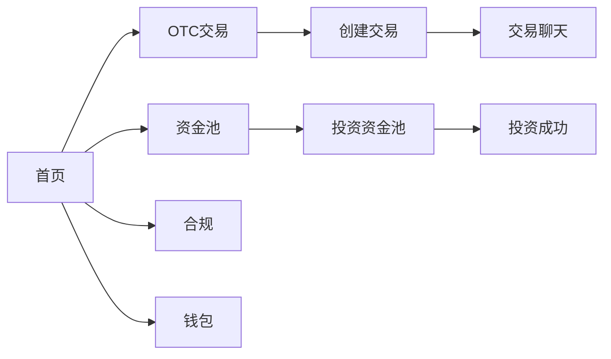

**图示来源**
- [App.tsx](file://src/App.tsx#L36-L70)

**本节来源**
- [App.tsx](file://src/App.tsx#L36-L70)

### 路由守卫实现可能性

虽然当前实现中未包含路由守卫，但系统架构支持通过高阶组件或路由包装器实现身份验证和权限控制。

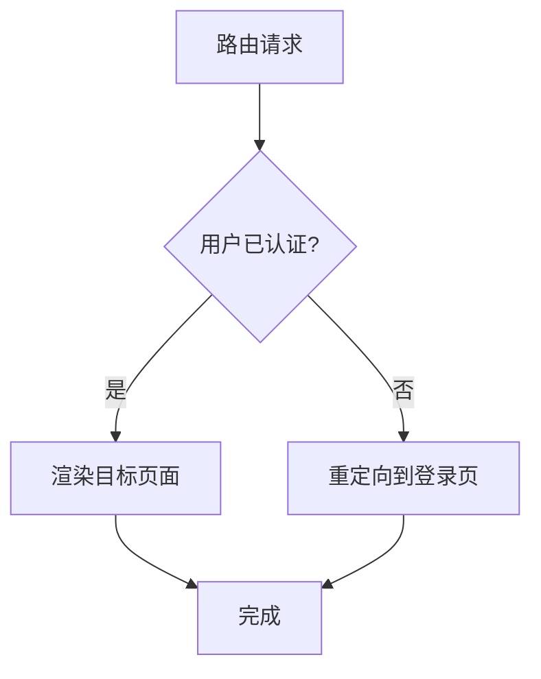

**本节来源**
- [App.tsx](file://src/App.tsx#L36-L70)

## 首页模块化集成

### Index.tsx首页集成

`Index.tsx`文件通过模块化方式集成多个功能组件，构建首页内容布局。

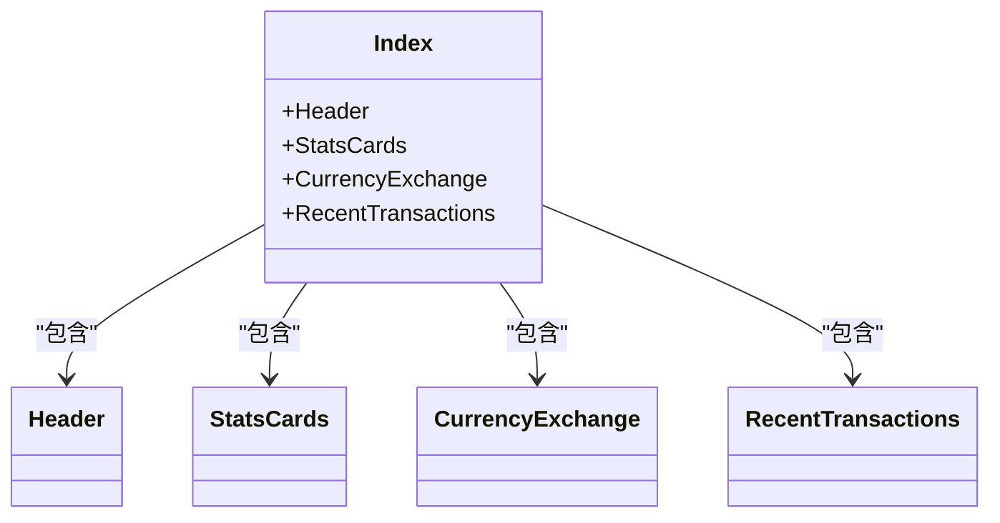

**图示来源**
- [Index.tsx](file://src/pages/Index.tsx#L5-L37)

**本节来源**
- [Index.tsx](file://src/pages/Index.tsx#L5-L37)

## 页面性能优化策略

### 代码分割与懒加载

系统可通过动态导入实现路由级别的代码分割和懒加载，优化初始加载性能。

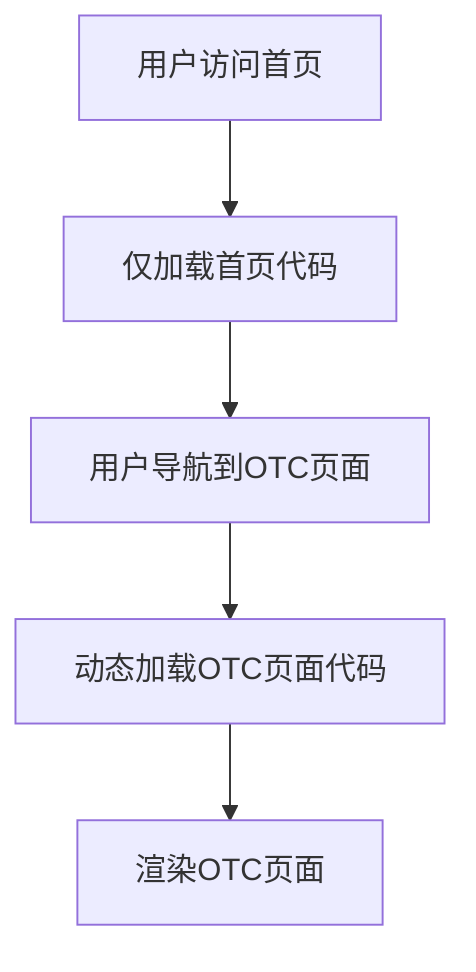

**本节来源**
- [App.tsx](file://src/App.tsx#L36-L70)

### 预加载关键资源

系统可配置预加载关键资源，如稳定币合约地址和区块链配置，提升用户体验。

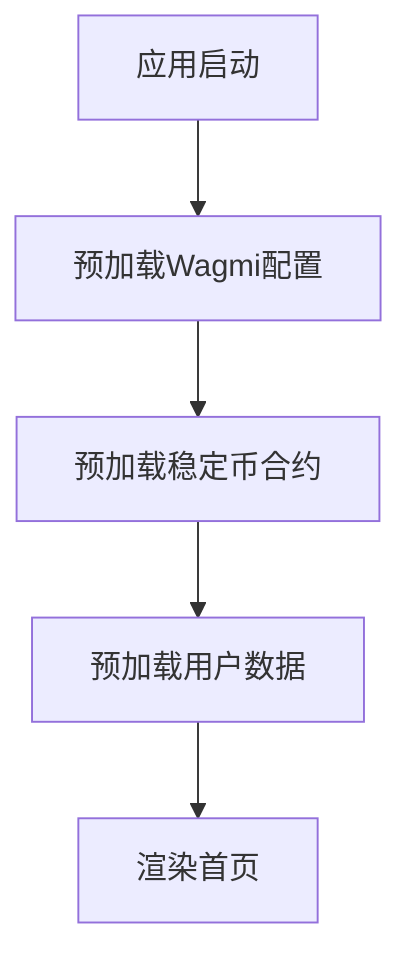

**本节来源**
- [main.tsx](file://src/main.tsx#L1-L5)
- [config/wagmi.tsx](file://src/config/wagmi.tsx)

## 错误边界处理机制

### NotFound.tsx错误处理

`NotFound.tsx`组件实现404错误边界处理，捕获未匹配的路由请求并提供友好的用户体验。

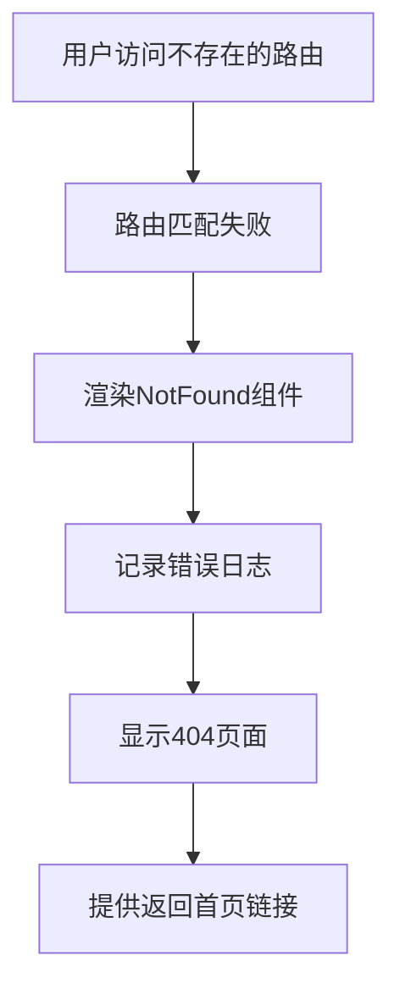

**图示来源**
- [NotFound.tsx](file://src/pages/NotFound.tsx#L3-L21)

**本节来源**
- [NotFound.tsx](file://src/pages/NotFound.tsx#L3-L21)