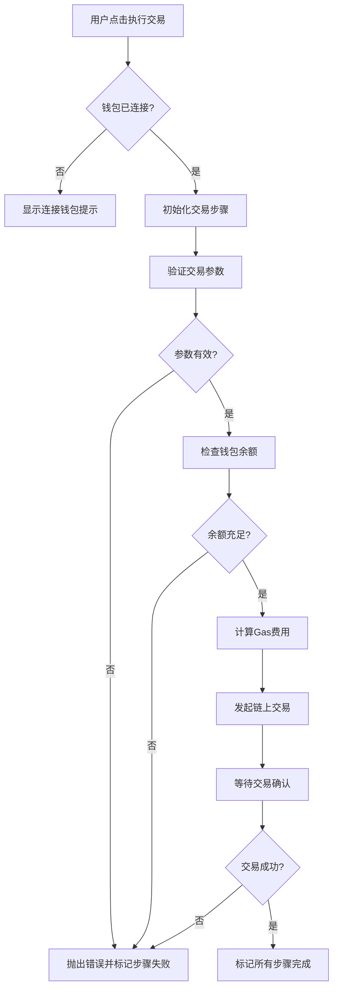

# 交易失败处理

<cite>
**Referenced Files in This Document**  
- [TransactionExecutor.tsx](file://src/components/Blockchain/TransactionExecutor.tsx)
- [walletService.ts](file://src/services/walletService.ts)
- [multiChainService.ts](file://backend/src/services/multiChainService.ts)
- [errorHandler.ts](file://backend/src/middleware/errorHandler.ts)
</cite>

## 目录
1. [引言](#引言)
2. [前端交易执行器错误处理](#前端交易执行器错误处理)
3. [钱包服务异常抛出机制](#钱包服务异常抛出机制)
4. [多链服务交易状态识别](#多链服务交易状态识别)
5. [错误代码映射表](#错误代码映射表)
6. [重试机制与用户引导](#重试机制与用户引导)
7. [结论](#结论)

## 引言
本文档系统化地阐述了TriBridge Crossroads系统中交易失败的分类处理策略。重点分析了前端`TransactionExecutor`组件如何捕获和处理各类错误，`WalletService`中`transferStablecoin`方法的异常抛出逻辑，以及`multiChainService`对链上交易失败状态的识别方式。通过详细的错误代码映射和重试机制建议，为用户提供清晰、友好的交易体验。

## 前端交易执行器错误处理

`TransactionExecutor`组件采用分步执行模式，将交易过程分解为六个明确的步骤：验证交易参数、检查余额、计算Gas费用、发起交易、等待确认和交易完成。每个步骤都有独立的状态管理，允许系统在任何阶段捕获和处理错误。

当交易执行过程中发生错误时，组件会捕获异常，并通过`updateStep`方法将当前正在处理的步骤状态更新为`failed`。同时，错误信息会被记录到控制台，以便于调试。用户界面会通过红色的警告图标直观地显示失败的步骤，并在交易进度条下方提供“发起新交易”的按钮，允许用户在修正问题后重新开始。



**Diagram sources**
- [TransactionExecutor.tsx](file://src/components/Blockchain/TransactionExecutor.tsx)

**Section sources**
- [TransactionExecutor.tsx](file://src/components/Blockchain/TransactionExecutor.tsx)

## 钱包服务异常抛出机制

`WalletService`类中的`transferStablecoin`方法是前端发起交易的核心。该方法在执行前会进行一系列的前置检查，如果检查失败，则会抛出带有明确信息的`Error`对象。

首先，方法会检查`provider`和`signer`是否已初始化，如果钱包未连接，会抛出`"Wallet not connected"`错误。接着，它会根据请求中的`network`参数在`STABLECOIN_CONTRACTS`配置中查找对应的链，如果该网络不受支持，则抛出`"Network X not supported"`错误。最后，它会查找指定代币（如DAI或USDC）的合约地址，如果该代币在目标网络上不支持，则抛出`"Token X not supported on network Y"`错误。

如果所有前置检查都通过，方法会尝试构建并发送交易。如果交易执行失败（例如，由于网络问题或合约拒绝），底层的`ethers.js`库会抛出异常。`transferStablecoin`方法会捕获这个异常，并将其包装成一个更通用的错误信息`"Transfer failed: <底层错误信息>"`后重新抛出，确保前端能够接收到一致的错误格式。

```mermaid
flowchart TD
A[调用transferStablecoin] --> B{Provider和Signer存在?}
B --> |否| C[抛出"Wallet not connected"]
B --> |是| D{网络受支持?}
D --> |否| E[抛出"Network X not supported"]
D --> |是| F{代币受支持?}
F --> |否| G[抛出"Token X not supported on network Y"]
F --> |是| H[构建并发送交易]
H --> I{交易成功?}
I --> |是| J[返回交易哈希]
I --> |否| K[捕获底层错误]
K --> L[抛出"Transfer failed: <错误信息>"]
```

**Diagram sources**
- [walletService.ts](file://src/services/walletService.ts#L117-L149)

**Section sources**
- [walletService.ts](file://src/services/walletService.ts#L117-L149)

## 多链服务交易状态识别

`multiChainService`是后端处理跨链交易的核心服务，它负责与以太坊、TRON和BSC等多条区块链进行交互。其`getTransactionStatus`方法是识别链上交易失败状态的关键。

该方法首先根据`chainName`参数获取对应的区块链提供者（Provider）和链配置。如果链不支持，会抛出错误。然后，它会根据链的类型（EVM兼容链或TRON）调用不同的底层方法。

对于EVM兼容链（如以太坊、BSC），服务会调用`getEVMTransactionStatus`方法。该方法通过`provider.getTransactionReceipt(txHash)`获取交易收据。如果收据不存在，说明交易仍在`pending`状态。如果收据存在，则检查`receipt.status`字段：值为`1`表示交易`confirmed`（成功），值为`0`则表示交易`failed`（失败）。

对于TRON链，服务会调用`getTronTransactionStatus`方法。该方法通过`tronWeb.trx.getTransactionInfo(txHash)`获取交易信息。如果调用成功，它会检查`tx.receipt.result`字段：值为`"SUCCESS"`表示交易`confirmed`，其他值（如`"FAILED"`）则表示交易`failed`。如果API调用失败，交易状态将被标记为`pending`。

```mermaid
flowchart TD
A[调用getTransactionStatus] --> B{链和提供者存在?}
B --> |否| C[抛出链不支持错误]
B --> |是| D{链类型?}
D --> |EVM链| E[调用getEVMTransactionStatus]
D --> |TRON链| F[调用getTronTransactionStatus]
E --> G{获取到交易收据?}
G --> |否| H[返回pending状态]
G --> |是| I{receipt.status == 1?}
I --> |是| J[返回confirmed状态]
I --> |否| K[返回failed状态]
F --> L{API调用成功?}
L --> |否| H
L --> |是| M{receipt.result == "SUCCESS"?}
M --> |是| J
M --> |否| K
```

**Diagram sources**
- [multiChainService.ts](file://backend/src/services/multiChainService.ts#L363-L381)

**Section sources**
- [multiChainService.ts](file://backend/src/services/multiChainService.ts#L363-L381)

## 错误代码映射表

为了将底层复杂的区块链错误转换为用户友好的提示信息，系统需要一个错误代码映射表。虽然当前代码库中未直接实现一个集中的映射表，但可以通过分析`errorHandler.ts`中的错误处理逻辑和各服务抛出的错误信息来构建。

| 底层错误/异常 | 用户友好提示 | 触发场景 |
| :--- | :--- | :--- |
| `Invalid transaction parameters` | 交易参数无效，请检查接收地址和转账金额。 | 用户未填写接收地址或转账金额。 |
| `Insufficient balance` | 余额不足，无法完成转账。 | 钱包中指定代币的余额小于转账金额。 |
| `Wallet not connected` | 钱包未连接，请先连接您的钱包。 | 用户尝试交易时未连接钱包。 |
| `Network X not supported` | 当前网络不受支持。 | 请求的区块链网络未在系统配置中定义。 |
| `Token X not supported on network Y` | 该代币在目标网络上不支持。 | 请求的代币（如DAI）在目标链（如TRON）上无对应合约。 |
| `Transfer failed: insufficient funds` | 余额不足，无法支付Gas费用。 | 钱包中ETH/BTC等原生代币不足以支付交易手续费。 |
| `Transfer failed: nonce too low` | 交易序号过低，请稍后重试。 | 尝试发送的交易序号（nonce）低于网络期望的值。 |
| `Transfer failed: transaction underpriced` | Gas价格过低，交易被拒绝。 | 用户设置的Gas费用低于网络最低要求。 |
| `Transaction not found` | 交易哈希无效或交易尚未广播到网络。 | 提供的交易哈希在区块链上不存在。 |
| `Chain X not supported` | 所选链暂不支持，请选择其他网络。 | 后端`multiChainService`中未配置该链。 |

**Section sources**
- [TransactionExecutor.tsx](file://src/components/Blockchain/TransactionExecutor.tsx)
- [walletService.ts](file://src/services/walletService.ts)
- [multiChainService.ts](file://backend/src/services/multiChainService.ts)
- [errorHandler.ts](file://backend/src/middleware/errorHandler.ts)

## 重试机制与用户引导

当前系统在交易失败后，主要依赖用户手动点击“发起新交易”按钮来重试。为了提升用户体验，可以实现更智能的重试机制。

**退避算法建议**：对于可重试的临时性错误（如网络超时、节点暂时不可用），可以实现指数退避算法。例如，第一次失败后等待1秒，第二次等待2秒，第三次等待4秒，以此类推，最多重试3-5次。这可以避免在问题未解决时对系统造成过多压力。

**用户操作引导**：
1.  **余额不足**：在错误提示中明确指出缺少的代币类型（稳定币或Gas费），并提供一个“充值”按钮，直接跳转到充值页面。
2.  **网络问题**：提示用户检查网络连接，并建议切换到更稳定的网络或RPC节点。
3.  **交易被拒绝**：解释可能的原因（如Gas价格过低），并提供一个“使用推荐Gas价格”的选项，自动填充最优的Gas设置。
4.  **Nonce冲突**：告知用户有其他交易正在处理，建议等待或手动调整Nonce值。

通过结合自动重试和清晰的用户引导，可以显著降低交易失败对用户体验的影响。

**Section sources**
- [TransactionExecutor.tsx](file://src/components/Blockchain/TransactionExecutor.tsx)
- [walletService.ts](file://src/services/walletService.ts)

## 结论
TriBridge Crossroads系统通过`TransactionExecutor`、`WalletService`和`multiChainService`三个核心组件，构建了一个分层的交易失败处理体系。前端组件负责捕获错误并提供用户界面反馈，前端服务负责验证和发起交易，后端服务负责跨链状态监控。通过建立一个清晰的错误代码映射表，并实施智能的重试机制和用户引导，可以将复杂的区块链交易失败转化为用户可理解、可操作的友好提示，从而提升整个系统的健壮性和可用性。