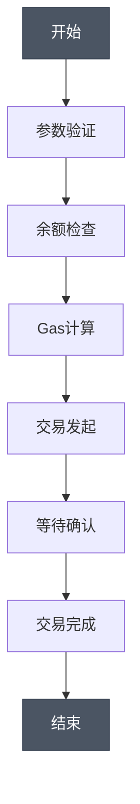
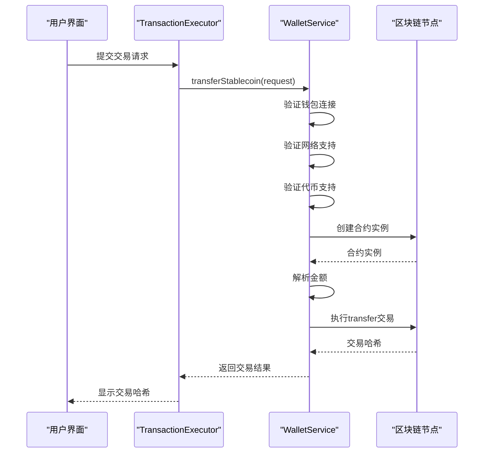
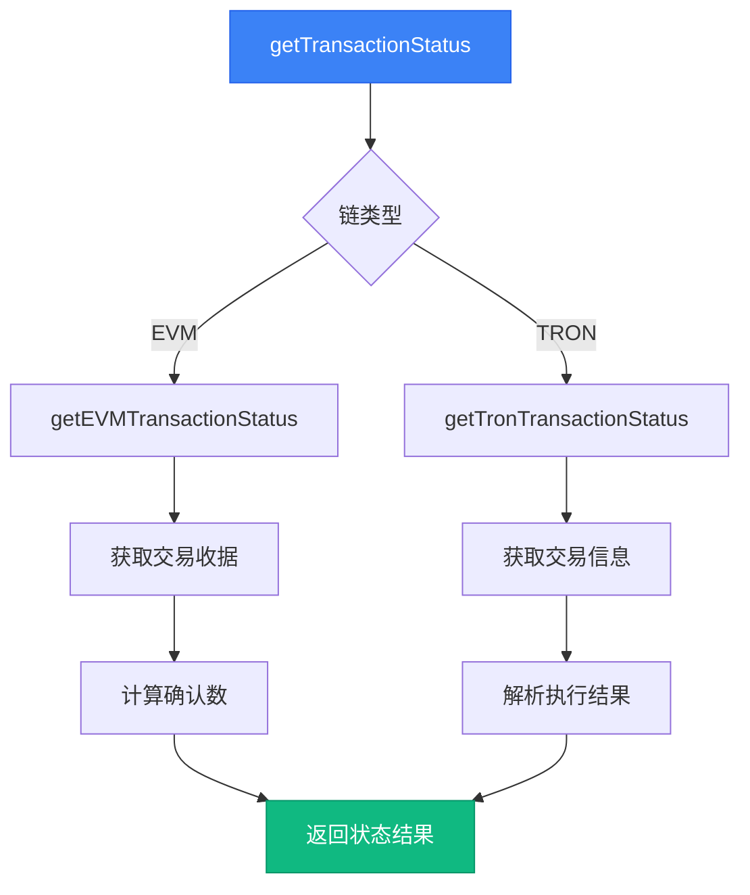
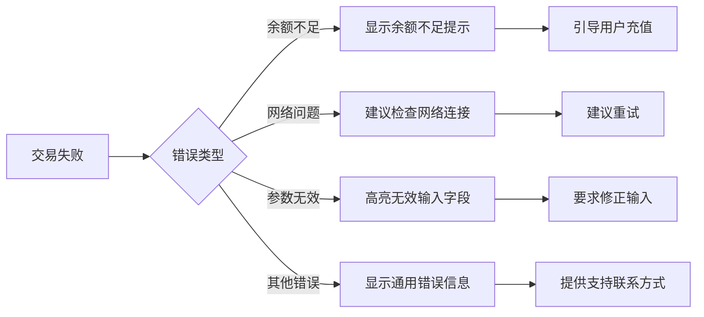
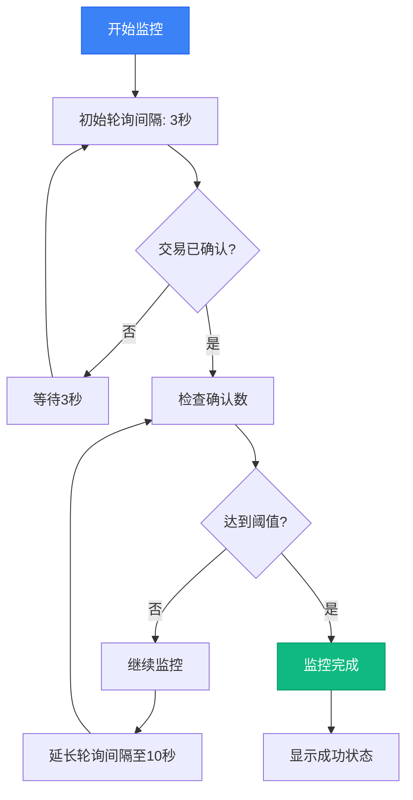

# 交易生命周期管理

<cite>
**本文档引用文件**  
- [TransactionExecutor.tsx](file://src/components/Blockchain/TransactionExecutor.tsx)
- [walletService.ts](file://src/services/walletService.ts)
- [multiChainService.ts](file://backend/src/services/multiChainService.ts)
- [transaction.ts](file://backend/src/routes/transaction.ts)
- [route.ts](file://src/app/api/wallet/transaction/route.ts)
</cite>

## 目录
1. [简介](#简介)
2. [交易执行流程](#交易执行流程)
3. [前端交易引导](#前端交易引导)
4. [钱包服务交互](#钱包服务交互)
5. [跨链状态查询](#跨链状态查询)
6. [交易失败处理](#交易失败处理)
7. [交易监控最佳实践](#交易监控最佳实践)
8. [结论](#结论)

## 简介
本文档全面阐述了交易从发起、执行到状态确认的完整生命周期管理流程。系统通过前端TransactionExecutor组件引导用户完成六步交易流程，利用WalletService与区块链节点交互执行转账，并通过MultiChainService实现跨链交易状态查询。文档详细说明了交易失败处理策略和监控最佳实践，为用户提供完整的交易管理解决方案。

## 交易执行流程
交易生命周期包含六个关键步骤：参数验证、余额检查、Gas计算、交易发起、等待确认和完成。该流程确保交易的安全性和可靠性，为用户提供清晰的进度反馈。



**图示来源**  
- [TransactionExecutor.tsx](file://src/components/Blockchain/TransactionExecutor.tsx#L22-L388)

## 前端交易引导
TransactionExecutor组件作为用户与区块链交互的核心界面，通过六步流程引导用户完成交易。组件提供直观的进度指示和实时反馈，确保用户能够清晰了解交易状态。

### 六步交易流程
TransactionExecutor实现了完整的交易引导流程，每个步骤都有明确的状态指示和描述。

```mermaid
classDiagram
class TransactionExecutor {
+isExecuting : boolean
+transaction : TransactionResult | null
+steps : TransactionStep[]
+currentStep : number
+formData : {to : string, amount : string, token : 'DAI'|'USDC'}
+walletService : WalletService
+executeTransaction() : Promise<void>
+resetTransaction() : void
+initializeSteps() : void
+updateStep(stepId : number, status : string, txHash? : string) : void
}
class TransactionStep {
+id : number
+title : string
+status : 'pending'|'processing'|'completed'|'failed'
+description : string
+txHash? : string
}
TransactionExecutor --> TransactionStep : "包含多个"
TransactionExecutor --> WalletService : "使用"
```

**图示来源**  
- [TransactionExecutor.tsx](file://src/components/Blockchain/TransactionExecutor.tsx#L22-L388)

**本节来源**  
- [TransactionExecutor.tsx](file://src/components/Blockchain/TransactionExecutor.tsx#L22-L388)

## 钱包服务交互
WalletService负责与区块链节点进行底层交互，执行转账操作并返回交易哈希。服务通过ethers.js库与EVM兼容链通信，确保交易的安全执行。

### 转账执行流程
WalletService的transferStablecoin方法处理交易发起的核心逻辑，包括参数验证、合约调用和结果返回。



**图示来源**  
- [walletService.ts](file://src/services/walletService.ts#L117-L149)
- [TransactionExecutor.tsx](file://src/components/Blockchain/TransactionExecutor.tsx#L22-L388)

**本节来源**  
- [walletService.ts](file://src/services/walletService.ts#L117-L149)

## 跨链状态查询
MultiChainService提供跨链交易状态查询功能，支持EVM和TRON网络。服务根据链类型调用相应的状态查询方法，为用户提供统一的状态查询接口。

### 跨链状态查询机制
getTransactionStatus方法根据链名称路由到相应的状态查询实现，确保不同链的交易状态能够被正确解析。



**图示来源**  
- [multiChainService.ts](file://backend/src/services/multiChainService.ts#L363-L381)
- [multiChainService.ts](file://backend/src/services/multiChainService.ts#L384-L440)

**本节来源**  
- [multiChainService.ts](file://backend/src/services/multiChainService.ts#L363-L381)

## 交易失败处理
系统实现了完善的交易失败处理策略，包括错误分类、用户提示和重试机制。通过清晰的错误信息和状态反馈，帮助用户理解和解决交易问题。

### 错误分类与处理
系统将交易错误分为余额不足、网络问题和参数无效等类别，并提供相应的用户提示。



**本节来源**  
- [TransactionExecutor.tsx](file://src/components/Blockchain/TransactionExecutor.tsx#L22-L388)
- [walletService.ts](file://src/services/walletService.ts#L117-L149)

## 交易监控最佳实践
为确保交易状态的准确监控，系统采用轮询机制结合确认数阈值，同时集成区块浏览器提供详细交易信息。

### 监控策略
合理的监控策略平衡了用户体验和系统性能，避免过度轮询造成的资源浪费。



**图示来源**  
- [TransactionExecutor.tsx](file://src/components/Blockchain/TransactionExecutor.tsx#L22-L388)
- [walletService.ts](file://src/services/walletService.ts#L152-L187)

**本节来源**  
- [TransactionExecutor.tsx](file://src/components/Blockchain/TransactionExecutor.tsx#L22-L388)

## 结论
本文档全面介绍了交易生命周期管理的各个关键环节。通过TransactionExecutor的六步引导流程、WalletService的区块链交互和MultiChainService的跨链状态查询，系统为用户提供了一套完整、可靠的交易管理解决方案。完善的错误处理和监控最佳实践进一步提升了用户体验和系统稳定性。